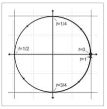

#4.1 图元表示法

任何图元都有一种或多种表示方式。根据不同的上下文，应使用不同的方法。

##4.1.1 隐式方程

对于如下方程，

可以表示3d空间中的球体。

方程可以看作是布尔表达式。通过将点的座标代入后，判断表达式为真，可以很方便的检测出点是否属于这个图元。

##4.1.2 参数方程

图元也能以参数方程表示：

x(t)=cos2πt

y(t)=sin2πt

上面的方程组，表示2d平面内的圆。t称为参数。当t从0取值到1时，就可以描述圆上的所有点。

注意，参数方程可能不只有一个变量。只有一个变量的参数方程，称为单变量参数方程。有两个的称为，双变量。以此类推。

##4.1.3 直观形式

这是最接近人类认知和便于使用的形式（很多数学库的函数接口都以这种形式提供）。

直观形式表述随着图元的类型而变化，而且经常能直接体现图元的最本质和最明显的信息。

例如：
用两个端点表示一条线段。
用球心和半径表示一个球。

##4.1.4 自由度

每个几何图元都有一个固定属性：自由度。

自由度是无歧义描述该几何图元所需要的最小的信息数量。

注意，对于同一图元，不同表示方法所需要的自由度是不同的。多余的自由度，可以通过一些假设和变换来消除。

======================
 本作品采用<a rel="license" href="http://creativecommons.org/licenses/by-nc-sa/3.0/cn/">知识共享署名-非商业性使用-相同方式共享 3.0 中国大陆许可协议</a>进行许可。
