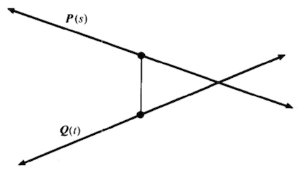
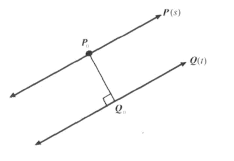

#4.2 3d空间中的直线

##4.2.1 直线的参数方程

已知两个3d点和。

则，过两点直线可由参数方程表示：

###4.2.1.1 推论：线段的参数方程

有上面方程可推导出，已知两个3d点和之间的线段，可做如下表示：

###4.2.1.2 射线的参数方程

一条射线，可看作是从一个端点沿方向向量V无线延伸的线。通常可表示为：

若设，这个方程也可以表示直线。

设，即可推导出对应的直线方程表达式。

##4.2.4 点到直线的距离

已知：点Q，由和方向向量V决定的直线。

求：点Q到直线的距离d

解：

根据勾股定理：

整理：

##4.2.5 两直线的距离

已知：两条直线的参数方程为：

求：两直线距离

解：

设两直线距离的平方为：

展开：

根据偏导数理论，对f(s,t)分别求s和t的偏导数

当这两个偏导数同时等于零时，f(s,t)有极值。

削去系数2，转换为矩阵形式：

整理：

把s和t，代回函数f，然后对函数f结果开平方，即可得到两直线间的距离。

若和是单位向量。则上式可简化为：

当时，两条直线平行。可以使用点到直线的距离公式，直接计算两直线距离。

======================
 本作品采用<a rel="license" href="http://creativecommons.org/licenses/by-nc-sa/3.0/cn/">知识共享署名-非商业性使用-相同方式共享 3.0 中国大陆许可协议</a>进行许可。
