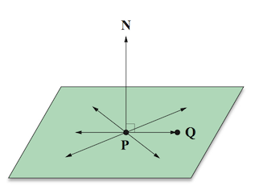
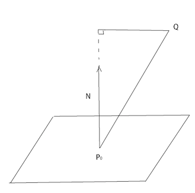
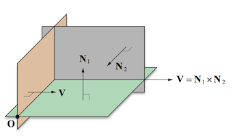

#4.3 3d空间中的平面

##4.3.1 平面的表示法

###4.3.1.1 平面的向量表示

对于给定的3D点和法向量N，那么过且与N垂直的平面上所有过点的向量都垂直于法向量N，所以可以该平面可以定义为满足方程的点的集合。

###4.3.1.2 平面的隐式方程

通过对平面向量表示的展开变形可以得到，平面的隐式方程为：Ax+By+Cz+D=0。

其中，A，B，C为法向量N的x，y，z分量。。|D|/|N|的几何意义是该平面和原点的垂直距离。

##4.3.2 点到平面距离

###4.3.2.1 推导

对于4.3.1.2中D的几何意义，我们需要进行一下简单推导。

已知：平面上一点，平面法向量N。平面外任意一点Q。
求：Q到平面距离d

解：

只需求向量在法向量N上的投影即可。由投影定理可知：

代入。并且因为N经常为单位向量，那么有：

那么，根据上述公式，当Q为原点(0,0)时，上式为：d=D

此推导中N为单位向量。若不为单位向量，则需除以N的模。

###4.3.2.2 判别式d

当d=0时，点Q在平面上。
当d>0时，称点Q在平面的正侧（因为Q在法向量N指向的同一侧）。
当d<0时，Q在平面的负侧。

###4.3.2.3 齐次写法

用四维向量\<N,D\>可以表示满足方程N·Q+D=0的点Q组成的平面。

如果使用四维点座标，那么之前点到距离公式可改写为：d=L·Q，L=\<x,y,z,D\>。此时，若L·Q=0，则Q在平面上。

##4.3.3 直线与平面相交

*G注：计算直线与平面交点是3d引擎中大量用到的计算，特别是在多边形裁剪中*

公式推导如下：

已知：直线P(t)=Q+tV。	平面：N·Q'+D=0。

求：平面与直线的交点

解：将直线参数方程的表达式P(t)=Q+tV，代入平面方程N·Q'+D=0，得：

将t代回直线方程即可求出交点。

注意，若N·V=0，则直线与平面平行。此时，若N·Q+D=0，则直线在平面上，否则，直线与平面平行。

###4.3.3.1 齐次写法

设平面L=\<N,D\>，则可得到

注意，上式中Q为点向量(w=1)，V为方向向量(w=0)。

##4.3.4 三个平面相交

###4.3.4.1 求三个平面交点

已知：平面

求：三个平面交点Q。

联立方程。

转换为矩阵形式：

那么设：

那么如果矩阵M是可逆的，就可以求解Q。
###4.3.4.2 三平面的交线（无交点时）

当M为奇异矩阵时（即|M|=0,M不可逆），三个平面不相交于一点，此时三个平面的法线是共面的。
若两个平面不平行，则求他们的交线的直线方程。

这分为两步，求方向向量和求交线上任意点Q。
∵交线V垂直于
∴

我们假设Q点为过原点且法向量为V的平面。则解如下矩阵即可求出Q：

注，第三行是因为向量Q和V是垂直关系。
所求直线方程为：

##4.3.5 平面的变换

在三维空间中，我们使用3阶矩阵M和平移向量T进行变换。

求L=\<N,D\>变换后的平面L'。

通过法线矩阵变换N即可得到N',而D'可用如下公式计算：

我们尝试用齐次方程来改写：

设F为M和T合成的齐次4阶矩阵，则根据齐次4阶矩阵的逆矩阵公式有：

可以看到恰好是F的逆转置矩阵的第四行和4维向量\<N,D\>的点积。

所以，平面L的变换可以直接表示为齐次形式：

======================
 本作品采用<a rel="license" href="http://creativecommons.org/licenses/by-nc-sa/3.0/cn/">知识共享署名-非商业性使用-相同方式共享 3.0 中国大陆许可协议</a>进行许可。
