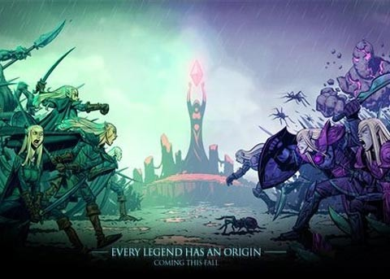

**本文转载自游戏邦**

  

2013年1月，在Rovio芬兰总部一个紧闭的房间内有3个等待着的乌拉圭人。这是他们第一次来到欧洲，他们认为《愤怒的小鸟》的开发商会有兴趣与拉丁美洲的游戏工
作室合作创造游戏，或者他们会想要一起发行他们的下一款游戏。但事实并非如此。

  

几分钟后，Rovio的一名执行官进入了房间，乌拉圭人也发现了这次会议的真正目的：Rovio想要收购他们的工作室。

  

Ironhide Game Studio是由Alvaro Azofra，Pablo Realini和Gonzalo Sande于2010年在乌拉圭首都蒙得维
的亚所创建的工作室。虽然他们之前都是自由职业者，但是他们还是想要一起做事。后来Azofra发现Kongregate等门户网站上的优秀游戏能够通过赞助赚钱，所
以他们便组建了一支团队想要做同样的事。

  

在利用休闲时间创造了一些较小的Flash游戏后，他们决定尝试一些更大的内容。结果呢？结果便是《王国保卫战》的诞生。该团队花了半年时间创造了这款游戏，并且它也
取得了成功。游戏最初作为Flash游戏发行了，之后也走向了手机平台。在组建团队后不到两年时间里，这三个人便创造了世界上最受欢迎的塔防游戏之一。而在他们前往芬
兰的时候，他们刚好在准备着游戏的续集。

  

现在，坐在Rovio办公室的三个人面带怀疑的表情看着彼此。他们需要花些时间去做决定，所以他们先回到了乌拉圭。

  

他们思考了自己给工作室制定的计划以及工作室的未来。并最终给Rovio发送了回绝邮件。他们不想将工作室卖给别人。显然Ironhide是他们生活的重要组成部分，
他们不想再次做回雇员。更重要的是，他们有自信自己的下一款游戏能够超越人们所有的期待。

  

**游戏**

**  
**

与布宜诺斯艾利斯，利马或圣地亚哥等其它拉美城市不同的是，蒙得维的亚拥有较慢的生活节奏。这座城市中充满许多古老的建筑，并且街上还陈列了许多关于PlayStat
ion 2游戏的广告。我们很难想象在离城镇中心几个街区外，即在城市最繁华的的一条大街上的一栋楼的第二层会有一家游戏工作室存在。该工作室拥有非常舒适的氛围，1
5名团队成员都待在同一间办公室里：程序员，美术师和游戏设计师都聚集在一个带有几张大桌子的房间，房间后面还有一个小厨房。但情况并不总是如此。

  

  

当工作室还只有3名成员时，他们是在Azofra的住所办公。那是一个只有一台计算机和几把椅子的小房间，只有他们现在的会议室一半的空间。如果你在今天前往那个房间
的话，应该还能看到椅子留在地板上的印记。那时候，塔防游戏非常受欢迎，但却只有一些简单的图像和机制。该团队喜欢拔河比赛这一类的游戏策略，并决定结合他们在儿时玩
过并且喜欢的所有游戏中的元素去创造属于自己的游戏。Sande说道：“我们想要让玩家觉得自己真正处于一场战斗中。”因为看到书籍，漫画和电影中许多关于骑士和巫师
的内容，并且他们都是资深的《龙与地下城》玩家，所以该团队成员选择了一个中世纪主题。

  

在《王国保卫战》中，玩家必须保护自己的基地免受成群的小妖精，饿狼，雪人以及无数其它生物的进攻。与其它塔防游戏不同的是，玩家需要在每次战斗中保持活跃，使用他们
的能量并努力升级他们的塔。

  

Sande负责美术，他提议创造带有许多动画和战斗效果等细节的卡通形象。结果便是塔将使用紫色射线消灭你的敌人，石人将从空中冒出来。Azofra同样也谈到了游戏
中的一些幽默元素，如参考流行文化和复活节等等。《王国保卫战》拥有一切受欢迎所需要的元素。

  

尽管如此，该团队却没有自信这款游戏能够吸引广大玩家的注意—-在创造游戏的时候他们未能收到任何反馈。他们三个人用光了所有钱，已经没有任何储蓄了，也没有赞助人的
支持，所以他们没有面对失败的任何动力。他们的朋友和亲人都不能理解他们所做的事，更加不理解他们为何要投入那么多时间于同一个项目中。他们也意识到了如果这款游戏失
败了，他们的工作室也就走到了尽头。

  

但幸亏结果是好的。玩家很喜欢这款游戏，并且在游戏发行的第一天便登上了Kongregate的排行榜前列。这是他们从未预料到的情况。从那时以来，玩家玩这款游戏的
次数已经超过了1500万次，并且游戏也始终停留在门户网站上最佳游戏的位置上。所以这个团队能够安全存活下来了。

  

在《王国保卫战》Flash版本获得成功后几个月，像Warner Bros，LucasArts等公司便向Ironhide发来了承揽合同。团队中的三个人都是看着
《星球大战》长大的，并且都很喜欢《指环王》，而突然间他们就获得了为这些标志性授权内容创造游戏的机会了！

  

对于许多工作室来说，这是实现梦想的机会，但是Ironhide却拒绝了这些合作机会，并选择继续致力于《王国保卫战》。这三个人意识到许多工作室这么做是为了获得金
钱和经验去创造自己的游戏，但Ironhide已经在创造自己的游戏了。所以对于他们来说，如果答应这样的合作便等于往回走一步。

  

他们的下一个目标是手机平台。Azofra说道：“我们总是想着将游戏移植到手机设备上。”在游戏发行后，负责编程的Realini购买了一台iPad进行试验，并发
现这是这类型游戏的一个完美平台，因为玩家可以直接与地图元素进行互动。该团队选择终止与之前发行商Armor Games的新交易，并立刻开始制作游戏的手机版本。
Realini学会了如何为手机平台进行编程，在4个月后他们完成了游戏的手机版本。最终iOS版本的《王国保卫战》发行于2011年末，而它的成功（游戏邦注：在多
个国家，包括美国的App Store排行榜上排名第一，在世界范围内获得了超过1亿的下载量）也让该工作室能够进行下一阶段的工作。

  

**续集**

**  
**

自从2012年以来，游戏开发者大会举办的那一周对于Ironhide来说都是很特别的时间。他们整个团队会前往旧金山，住在同一家酒店，并一起参加会议。GDC成为
了他们公司文化的一部分。这就像是与Azofra，Sande和Realini这三个大哥哥一起进行的家庭之旅一样。

  

该团队第一次参加GDC是在2012年，他们凭借《王国保卫战》在乌拉圭获得游戏大赛后。那时候，他们是为了更了解游戏产业并与一些粉丝见面而前往旧金山。

  

Azofra回忆道：“最让我惊讶的是，有个人在苹果商店中认出了我夹克上的logo并问我是不是制作了《王国保卫战》的人。”

  

因为游戏中并没有任何应用内部购买机制，所以玩家在购买后将不能再花更多钱。一些参加会议的人建议他们在游戏中添加一些货币和付费道具。一开始他们有点犹豫，但最终他
们还是决定在更新的时候添加这些内容。他们敢肯定这不会破坏游戏平衡。

  

2013年，他们带着另一个目标参加了GDC：宣传他们的下一款游戏，即《王国守卫战：前线》，即进一步扩展了之前的IP并引进了一些新机制的续集。这同样也是帮助他
们从一开始便确定盈利设计的一次机会。

  

该团队甚至推出了漫画书去延伸游戏故事，并通过提供给每个塔更加个性化的选择而调整难度。他们拥有明确的指令去坚持最初的方法，但同时他们也添加了新方法让玩家能够与
单位和环境进行互动，如提供给英雄特别的塔和技能树没让玩家能够在一个塔的不同升级间做出选择。

  

在2013年的GDC上，他们见到了其他开发者，媒体和更多发行商（如R
ovio），但他们很坚定要自己发行游戏。他们只是希望所有人能够知道他们正在创造一款新游戏。

  

最终证明独立发行对于《王国守卫战：前线》来说是个艰难的决定。对于第一款游戏，他们拥有Armor Games去帮忙制定市场营销和商务策略，即包括向媒体宣传游戏
，处理与苹果和谷歌商店间的交易以及负责所有的文书工作。那时候的Ironhide是全身心投入于游戏开发中，并且根本不清楚如何与媒体或像苹果，谷歌和Steam等
大型利益相关者交流。所以对于他们来说要想肩负起这些工作的确不是件易事。

  

但因为《王国守卫战》创造了很棒的成绩，所以该团队非常自信。这也是他们拒绝了Rovio以及其它发行商的原因。最终他们的自信取得了成效。其续集一经发行便占据了大
多数国家的排行榜首位，粉丝们都非常喜欢这款新游戏。

  

**准则**

**  
**

一支总部位于乌拉圭且几乎没有任何游戏制作经验的小型团队到底是如何获得世界性的成功？在蒙得维的亚的Pomelo
Games的办公室中，一群独立游戏制作人尝试着找出答案。他们认为秘诀就在于这三个创始人的态度。来自Pomelo Games中的一个团队的Moximo Mar
tinez说道：“他们是三个完美主义者。”当Azofra和Realini还是青少年的时候他就认识他们了。“在大学的时候我曾与Pablo一起学习。”另一个Po
melo雇员也表示蒙得维的亚游戏社区中的所有人在早前都是相互认识的。这就像一群一起游戏一起长大的孩子们现在开始制作游戏一样。

  

拉美游戏开发圈中最知名的人物之一的Gonzalo
Frasca已经在乌拉圭创造了好几年的游戏，他认为Ironhide的成功是源于团队从第一天起便投入于游戏制作中的努力。他说道：“他们的品味很好。”

  

多年来Frasca一直是乌拉圭游戏产业的代言人，而现在他将这一责任交付给了Ironhide。尽管他的工作室并未开发一款初创IP，但是他始终专注于为Carto
on Network和Warner Bros等公司创造游戏。同时他也在学术界发展了自己的职业。他的工作室在几年前就关闭了，但大多数当时的员工都还是致力于当地
的游戏工作室，其中也包括Ironhide。

  

从中我们可以看出乌拉圭的游戏产业到底有多小。在整个国家大概只有60家开发商，并且这里也没有官方的游戏协会。Frasca说道：“有时候我会收到Ironhide
的邀请去发表演说或参加在其它国家举办的活动。我总是说，‘如果发生了什么大事，那么几乎一半的乌拉圭游戏产业便会坍塌。”

  

Azofra，Sande和Realini是团队的基础。对于工作室的未来，他们没有任何疑虑。这三个人总是与雇员们一起工作，尽管工作室不断发展着，但他们仍坚持做
着公司的所有文书工作。他们三个人的性格似乎都一样：都是不爱说话，保守但却总是专注于把事情做好的类型。他们不爱交谈，因为这会让他们分心，但是他们却很乐于指导新
人如何准备发行会议，如何处理商店以及如何与政府交涉。

  

《王国保卫战》的成功推动了乌拉圭产业的发展，并带动了一些有前途的工作室的出现。政府成立了一个董事会去处理工作室的种种问题并创建了种种项目去帮助他们。在蒙得维
的亚商会的办公室中（离Ironhide刚好2个街区的距离），国际商务负责人Javier Pena表示，他们是与生产部以及其它来自政府的项目合作去阻止比赛和研
讨会，并吸引来自世界各地的专家去帮助一部分工作室的发展。自从去年颁布了允许同性恋结婚，允许流产以及使用大麻的法律外，乌拉圭被当成拉美最自由的国家之一。乌拉圭
总统Jose Mujica并不是一位传统的国家元首—-实际情况恰恰相反。他并不会购买各种奢侈品，甚至会乘坐公共交通上下班。

  

**态度**

  

在2014年的开发者大会上，他们举办了第一次的拉美开发者聚会。在旧金山的一家酒吧里，几十位开发者聚集在一起分享他们各自的经历。还有一些人是来自大公司，学术界
以及小型独立游戏工作室，并且有些人只是想要更多地了解这个区域的游戏。与其它游戏领域（如美国或北欧）不同的是，拉美并未拥有什么大型活动能够将当地的开发者聚集在
一起，所以GDC便是最合适的选择。

  

随着拉美经济以及数字内容的发展，各种规模的游戏公司开始注意到这里。

  

Ironhide Game Studio团队虽然参加了拉美开发者聚会，但却只待了一会。他们主要是与阿根廷的工作室交流，但却未见到其它工作的更多开发商。他们尝
试着保持低调，并且热心地帮助那些请求帮助的工作室，但其范围却未超越拉美区域。他们更喜欢待在自己的工作室，致力于游戏的新理念。然而在GDC的展会上，人们总是能
够通过他们穿的衣服快速认出他们：就像《愤怒的小鸟》的开发者穿着红色夹克，Ironhide便决定穿上背面带有其工作室logo的黑色卫衣。与前几年不同的是，这一
次他们主动参与了研讨会和各种会议。与设计团队参加了游戏设计研讨会的Azofra说道：“只是待在家里的话你是不可能获得在这里所学到的种种知识。”

  

在游戏产业开始拥有自己的态度的拉美，Ironhide以及像智利的Ace Team，巴西的Behold Studios和墨西哥的Squad等独立工作室都尝试着
创造带有拉美影响力的原创知识产权，并且不是专注于在游戏中使用文化元素。这个区域中有超过50家工作室在尝试着发行自己的第一款游戏的同时也致力于为其它公司制作游
戏，以此赚取生活费并获取经验。他们中的许多人都专注于创造能够吸引自己的故事，使用文化参考作为吸引外国玩家的方式。但矛盾的是，在市场上取得成功的工作室都是那些
致力于创造未引用任何拉丁文化的游戏。

  

让我们再次回到UIronhide蒙得维的亚办公室，这里离赫尔辛基非常远，尽管Rovio在诱惑着他们改变方向，但是这支团队始终专注于面向其它平台创造全新的《王
国保卫战：前线》的其它版本，并不断发展他们的知识产权。但不可否认的是在过去4年里情况的确发生了改变。一开始，Ironhide Game Studio是作为一
支没有任何游戏制作经验的小型团队，逐渐朝着发行自己的第一款游戏前进。而现在他们已经是一家强大的工作室，并且始终充满自信。他们知道，尽管自己来自一个游戏制作业
并不发达的地方，但是他们拥有设计优秀理念的才能，以及能够执行这些理念的人才。他们与其它开发商们进行着正面的竞争。也许在一开始他们还不清楚自己在做什么，但现在
他们绝对清楚自己在做什么。

  

阅读原文

阅读

__ 举报

[阅读原文](http://mp.weixin.qq.com/s?__biz=MjM5OTc2ODUxMw==&mid=201484592&idx=3&sn
=3ab7422542d431d8517798aec99047ec&scene=1#rd)

