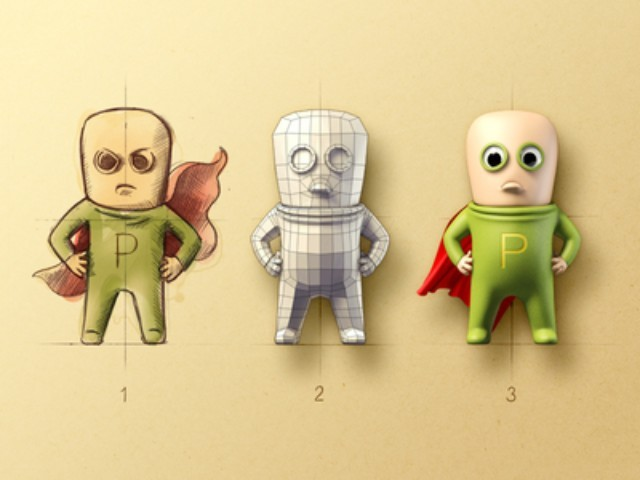

  

本文作者刘嘉俊是一名从业不久的游戏策划，他在14周的时间里，从技术小白到能写600行代码。他的方法是，在日常工作之余，每周制作一个小游戏，通过这种方式来锻炼
自己对游戏系统设计和开发过程的理解。

**本文由刘嘉俊向游戏葡萄独家供稿，未经授权请勿转载。**

  

我没有计算机背景或美术基础，但乘中国游戏行业大发展，却也幸运入行成为一名游戏策划。我希望在日常工作之余，用一个办法来锻炼自己对游戏系统设计和开发过程的理解。
因此，我参加了 Coursera 上的几个课程，并且用课程提供的方便工具来实现设想中的功能。  

  

这个方法我称之为「每周一游」，即每个星期快速开发一个游戏，连续进行数个星期。这是许多开发者们磨练自己想法和技巧的方式。

  

一开始的成果非常基本、非常简单，但到后面挑战等级逐渐上升，到最后已经能独立完成 600 行左右的程序。

  

接下来我就给各位看看我在这近四个月中的成果，以及我从中学习和体会到的内容。我尽量省略比较枯燥的实现细节，一来可以避免无聊，二来需要下功夫的东西还是亲手实践比
较有帮助。如有兴趣可来我的微博交流。

  

**第一周：包剪锤蜥史波克（Rock-paper-scissors-lizard-Spock）**

  

Sheldon 喜欢的游戏。

  

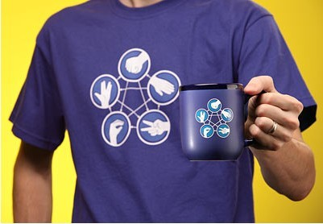

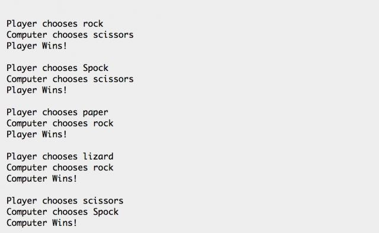

  

谢耳朵爱玩的游戏，石头剪子布的升级版。内容最最基本，只要在控制台里输入命令，命令通过 if-elif-else 转化成数字（0-4，分别代表出的5个东西）。

  

电脑则会随机生成一个数字，转换成字符串。再根据双方数字，用 if-else 判断胜负即可。

  

对我来说这是自己亲手编写的第一个游戏。它虽然简单，但包含了一个游戏必须的全部要素：它有着固定的开始和结束，以及胜负的规则。

  

**第二周：猜数字**

  

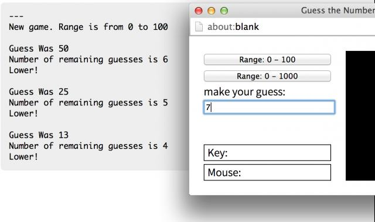

  

猜数字游戏就是由电脑随机生成指定范围内的一个数字，由你来猜，电脑告诉你是高还是低，一定次数后未猜中则输掉的游戏。

  

在这个游戏中第一次引入全局变量的概念。初始化时，上下限以及允许你猜测的次数都是读取全局变量。这样一来，我们可以在游戏核心的方法之外，使用别的方法来修改全局变
量，让玩家可以自己选择数字范围和猜测次数。游戏本身则依然是 if-elif-else 这样写成的。

  

这是我亲手编写的第一个可以由玩家调整游戏设置的游戏。

  

**第三周：秒表游戏**

  

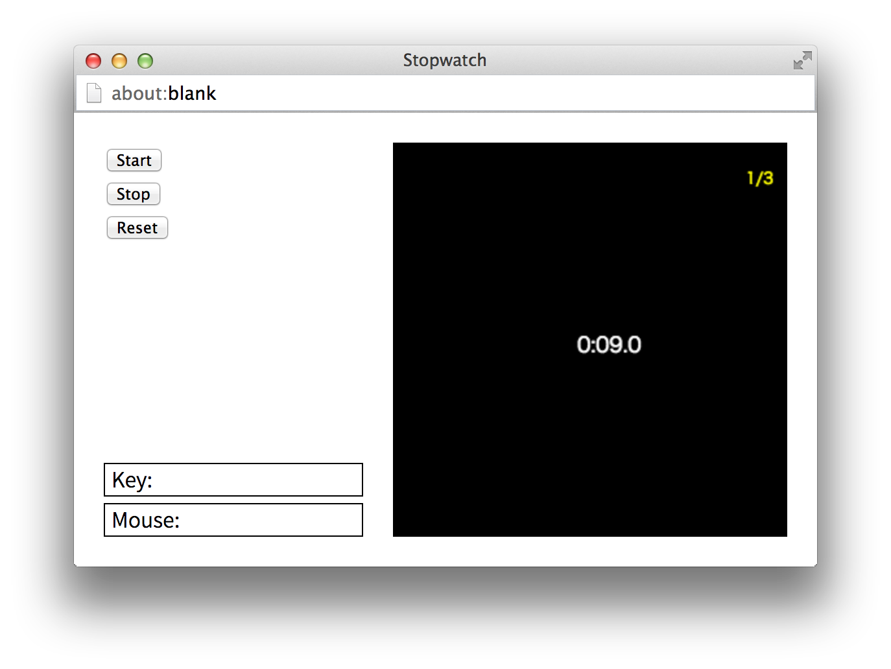

  

秒表游戏是个考反应的游戏。点击开始后秒表开始向前走，若你按停秒表时，秒表的时间恰巧停在整数（小数点后为0），则你得1分。游戏会记录你按停的总次数和得分数。

  

这个游戏中涉及到为每个功能编写单独的方法。如玩家控制的按钮start()、stop()、reset()；游戏本身时间前进的tick()等。同时，为了让时间正
确地显示在屏幕上，还有一个将时间转化为「A:BC:D」这种形式的方法。

  

我们计时的方法是定义一个叫 time 的变量。由于这个游戏中最小的计时单位是 0.1 秒，所以每经过 100 毫秒我们就让这个数字 +1。与此同时，编写一个
format() 方法经过一系列计算将这个数字转化为分、秒和0.1秒，显示在屏幕上即可。判断玩家是否得分仍然使用 if-else 结构。

  

这是第一次涉及到玩家进行的复杂操作，也是第一次认识到，在游戏画面的表象之下究竟应该有些什么机制在运行。

  

**第四周：乒乓（Pong）**

  

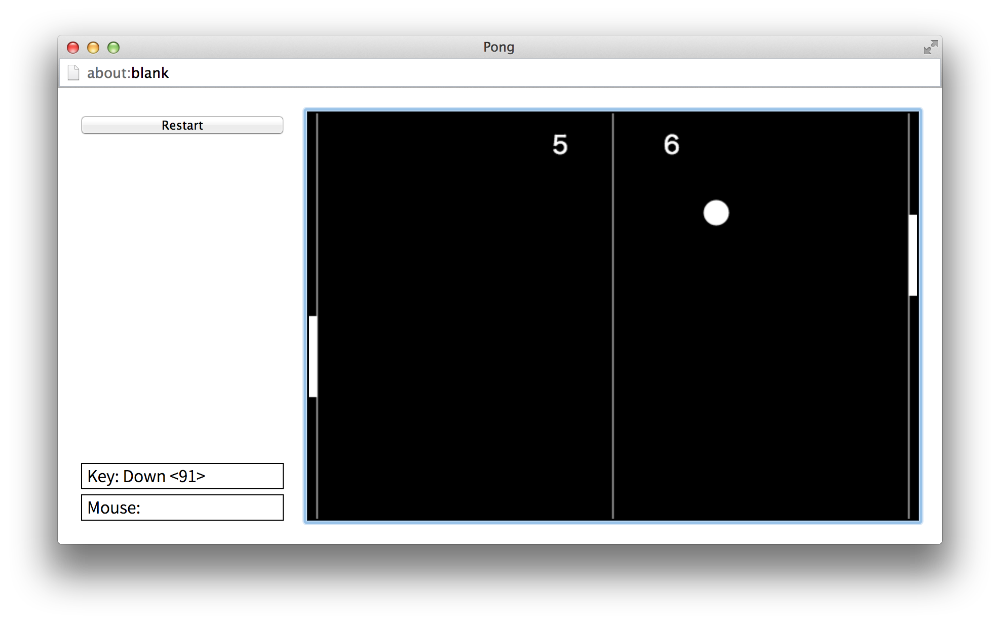

  

终于我们从小朋友玩的游戏进入了街机时代！

  

传说 Pong 是世界上第一个电子游戏。在那个游戏机只有滚轴操作的年代，这个有着极简单画面的游戏启发了无限后来者。看着它在手下形成还有些小感动呢。

  

这个游戏也是我制作的第一个不模拟现实中的「逻辑」，而是模拟「物理」的游戏。它的核心部分是球的速度变化、板子的速度变化，以及球与边界和板子的碰撞。

  

为了让这个游戏不至于无限地进行下去，我让球的速度随着每一次板子碰撞上升。但上升的公式写成了指数函数，于是这球就啪啪啪越打越快每一回合很快就结束了。若改为对数
函数，则会缓慢地趋近一个上限，令每一回合后期的双人对局非常紧张、充满变数。

  

这是我第一次体会到游戏的「手感」到底是怎么回事。每一次对参数的细微调整对手感带来的变化，可以让设计者与游戏本身有着更深刻的接触。这是在目前分工充分的网游公司
的日常工作中体会不到的感觉。

  

除此之外，很快地你就能从一个简单原型中看出未来变化的可能。是否可以加入：

  

  * 「球击打在板子的不同部位，会弹向不同方向」？

  * 「当板子击球时，板子本身的速度会令球曲线飞出」？

  * 或者「连续击中球数次后玩家可以发出大招」？

  

等等诸如此类。想到这里，这个游戏能成为数十年游戏业的起点，也是有其道理的。

  

**第五周：记忆游戏**

  

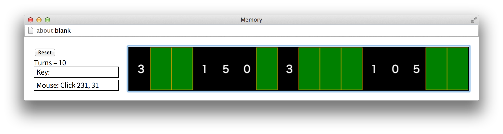

  

记忆游戏就是将多对牌打乱顺序朝下放置，玩家一次翻开两张，若相同则原样留着，若不同则翻回去。所有牌都翻开后玩家胜利。

  

在这个游戏中，暂且用数字来代替扑克牌。我们用了一个 list （我有点搞不太清 list, array, tuple, set
几个词的中文翻译，不乱讲了……）来以 Boolean 值（True 和
False）记录每张牌是否翻开的状态。当设为翻开时，露出数字，否则在相应位置绘制一张牌背。

  

这个游戏的逻辑方面比较 tricky 的地方就是整个游戏实际上有三种状态，需要分别处理：

  

  * 新游戏，一张牌都没翻开

  * 翻开了（本回合内）第一张牌，等待翻开第二张

  * 翻开了（本回合内）第二张牌，等待判断是否相同

  

于是我使用一个叫做 state 的变量，分别以 0, 1, 2 代表三种状态。在核心方法中利用 state 的值来决定接下来要做什么。

  

**第六周：21点（Blackjack）**

  

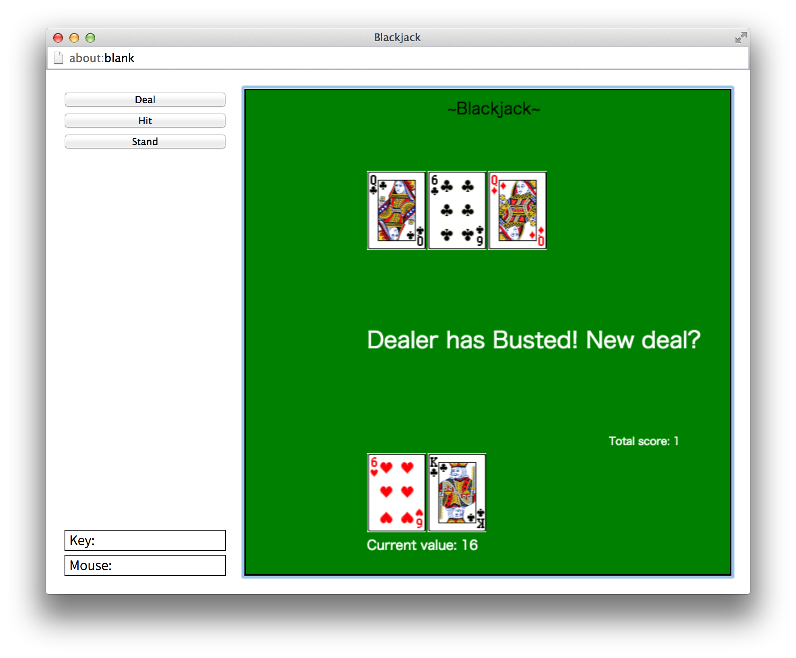

  

啊，21 点。我人生中接触的第一个扑克游戏。是的，在我会打「拖拉机」之前，7岁的我就在DOS下的初代大航海时代的酒馆里学会了 21
点。这是年幼的我在那个游戏里玩懂的唯一一个系统……

  

这是个赌博游戏。简单来说规则是：庄家给自己和玩家各发(deal)一张暗牌、一张明牌，玩家决定是否继续加牌(hit)；玩家加牌结束(stand)后庄家自行加牌
，接着双方摊牌。拥有最高点数的玩家获胜，其点数必须等于或低于21点。

  

在编写这个游戏的过程中第一次引入了类(class)概念。因为在游戏中许多物件都会重复出现，使用类可以很方便地重复制造它们：

  

  * 每一张牌是 Class Card；

  

  * 方法 get_suit() 可以获取它的花色；

  * 方法 get_rank() 可以获取它的数字；

  * 还有一个方法来把它绘制出来。

  

  * 手牌是 Class Hand；

  

  * 方法 add_card() 可以在手牌中增加一张牌；

  * 方法 get_value() 可以算出手牌的分数。

  

  * 牌库则是 Class Deck。

  

  * 方法 shuffle() 可以洗牌库；

  * 方法 deal_card() 用来发牌。

  

规定好这些基础方法以后，重发牌、加牌、摊牌都可以通过这些功能的组合来实现。例如开局就是洗牌库，向双方发牌；双方手牌加上两张发出来的牌。等等。

  

此外这个游戏还第一次涉及到怎样在画面上绘制固定的图形。整张牌表是一张大图，怎么样根据牌的值定位到对应的牌面也是要好好算一下。

  

**第七周：小行星（Asteroid）**

  

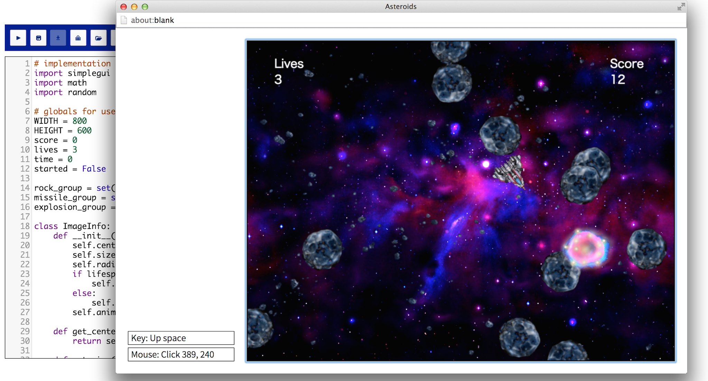

  

经典街机游戏的复刻版！大制作来临了！

  

这回的游戏涉及的内容比以前多，除了控制小飞船打来打去之外，动画、音效、UI 等也都引入了游戏中。但每一部分的实现都可以通过之前尝试的小功能叠加实现。简单地了
解游戏图像和声音到底怎么运作后，并无特别的困难。只是这一次我学着一个模块一个模块渐次开发和测试，一个功能调通无误，再进行下一个。

  

反而是在游戏设计方面，制作这个游戏的过程给我带来很多思考。在这个游戏中可供调整的变量太多了：飞船需要推进和旋转；但推进是给飞船一个向前的加速度，而飞船本身还
会有向着其他方向的速度。宇宙空间中微小的摩擦力、和陨石撞击后受到的力，都要考虑并且编入游戏中。

  

这时你会发现，同样的一些参数，经过调整会让整个游戏变得彻底不同。这艘飞船到底是笨重、转向慢、射速慢、射程远的战列舰，还是轻盈、转向快、射速快、射程近的战斗机
？你要躲闪的是从一个方向袭来的流星群（陨石都从一边来，而且向一个方向阻力特别大），还是四面八方出现的乱石？每一种选择，好像都挺好玩的……

  

到这时我才了解到一个游戏设计者脑中「指挥意图」清晰的重要性。你到底要做一个什么样的游戏，给玩家带来什么样的情感？只有一个大概的「我要爽」是不够的：究竟是控制
巨大战舰缓慢机动将将擦过一块流星的那种屏气凝神的爽，还是控制战斗机高速穿梭在流星群中那种险象环生的爽？有时候自己也会犹豫。只有记住一开始你要提供的是怎么样的
情感，并且在全程中反复回看，才不会偏离目标。

  

一个人制作尚且如此，当需要团队合作的时候，若不把一个确定的思路贯彻到底，怎么行呢？

  

**第八周：2048**

  

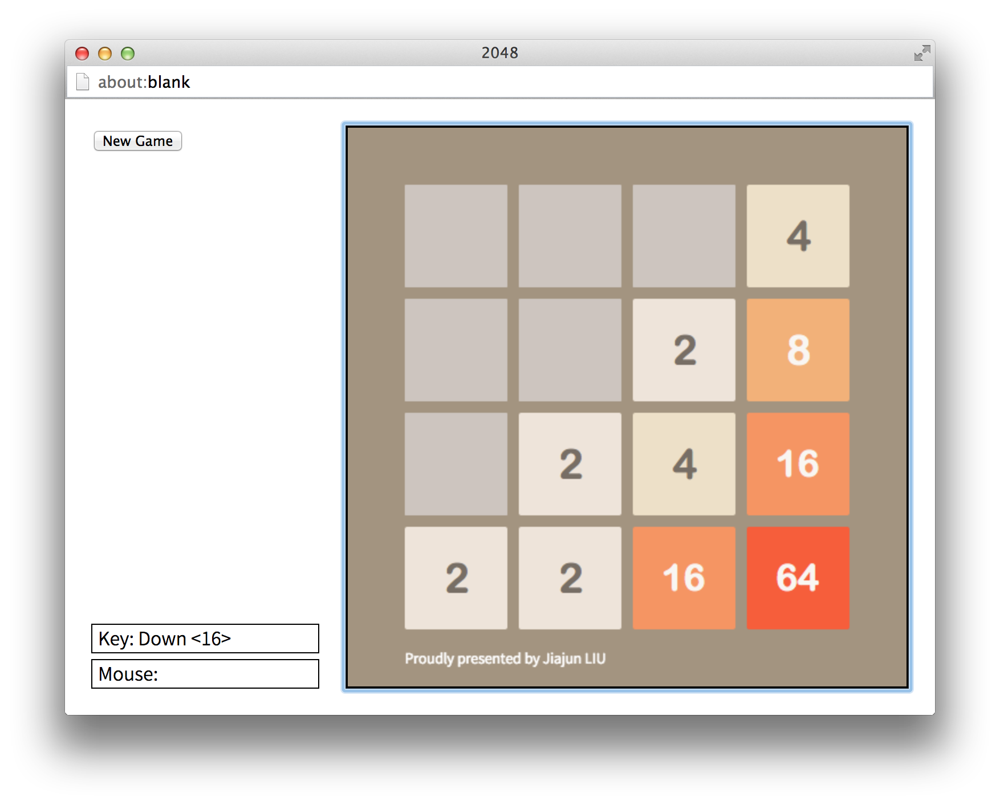

  

啊，HTML 小游戏。在这个星期，2048 游戏突然流行了起来。于是我也跟风复刻了一个。看似简单的游戏，真的要做出来，对于新手来说还是挺费脑筋的。

  

第一个问题就是，这个网格怎么做呢？我采用的转化方法是使用一个二维的list。看起来就是：

  

[[0, 1, 2, 3]

[0, 1, 2, 3]

[0, 1, 2, 3]

[0, 1, 2, 3]]

  

这样一来，如果我要定位到第三(2)行第一(0)个格子，我就读取这个 list 中的 List[2][0] 即可。这样一来看起来颇为直观，又能解决问题。

  

接下来又有好几个问题需要一一解决。首先，当你按下一个方向键以后，所有行（列）的数字都会向着那个方向合并。这件事怎么办呢？

  

首先我单独写了一个 merge() 方法。只要传来一个 list，就逐个 iterate 并将合并后的值返回去。然后在主要 Class 中间的移动方法
move() 中规定，向哪个方向移动，就以那个方向的四个格子为排头建立四个 list，传去 merge() 那边再替换回来。这样一来这个游戏的核心规则就实现
完成，剩下的边边角角多测试修缮即可。当测试成功的那一刻真是有一种爆棚的成就感——很少有解谜游戏的谜题能这样让你研究琢磨几个小时。

  

当你把游戏的每个部分分入不同的 Class 和方法中后，可以感觉到效率提升不少。例如你在制作模块 B ，此时要用到模块 A 中的功能，你可以完全不管模块 A
怎么实现的，只要把指定的数据传进去，等着它传出结果来就好了。

  

**第九周：Cookie Clicker（点击-放置游戏）**

  

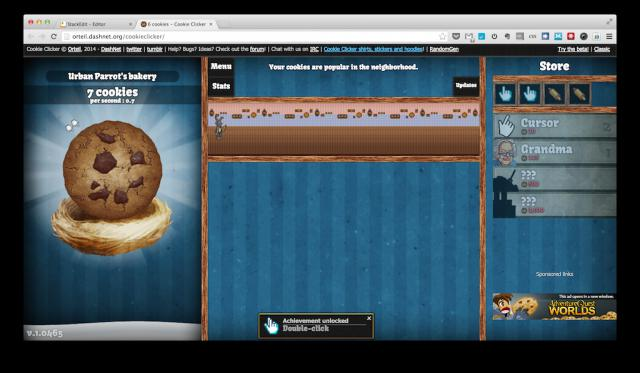

  

这是个挺有病（误）的游戏。你只要点这块饼干就可以加饼干数，饼干可以买帮你加饼干的道具，越高级的道具加饼干越快，子子孙孙无穷匮也。听说最近这种放置类游戏在一些
小圈子里挺流行的……

  

游戏本身的设计相对简单。加饼干数，加加饼干速度，获取各种升级和冷却的时间，购买道具等等，并不复杂。

  

但我们不想自己玩，我们想要电脑自动玩，算出最快速的策略，看看到底能获得多少饼干。

  

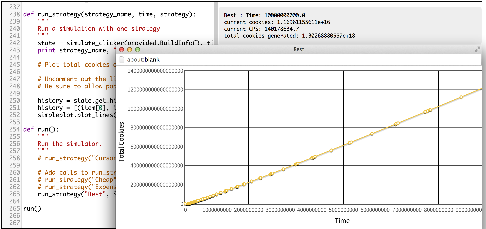

  

为了这样，我们专门做了一个叫 simulator_clicker()
的方法，它会根据输入的策略，在合适的时间购买固定道具；而每个策略都可以另外定义。这样一来，这个方法里引用的方法又引用了别的方法，复杂性上了一个台阶。

  

至于「策略」，就进入了 AI 的范畴。此时我们虽然只能使用最基本的条件判断，但反复计算应该让 AI 怎样动作，还是挺有挑战性的。只不过，发现让 AI
采用「纯随机策略」乱买道具出来的结果比你辛苦计算的结果还好，就有点蛋疼……

  

**第十周：Yahtzee**

  

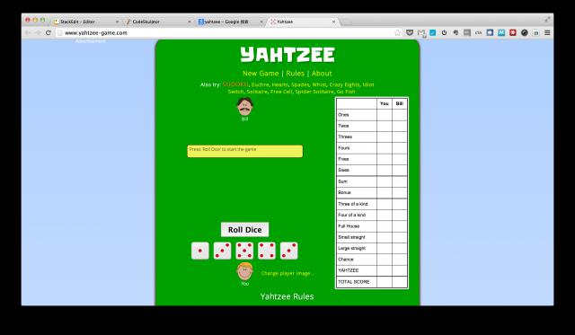

  

这是个投骰的游戏，同样涉及自己的「手」概念。大家自己玩一玩这个就明白了。 这一次制作的只涉及分数表上半区的部分。

  

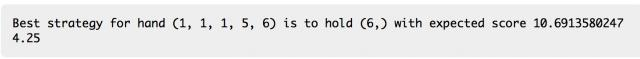

**Yahtzee游戏打印出的策略**

  

为这个游戏编写 AI 最有趣的地方是涉及到了概率和期望。我手上还有这么些骰子，那么接下来可能出现的所有手我都要算一遍，列成一个树，然后找到概率最大的一种。我
把列出所有可能手、为一手计算期望值、为一手计算分数和 AI 策略分别写在 4 个方法里。

  

**第十一周：僵尸末日**

  

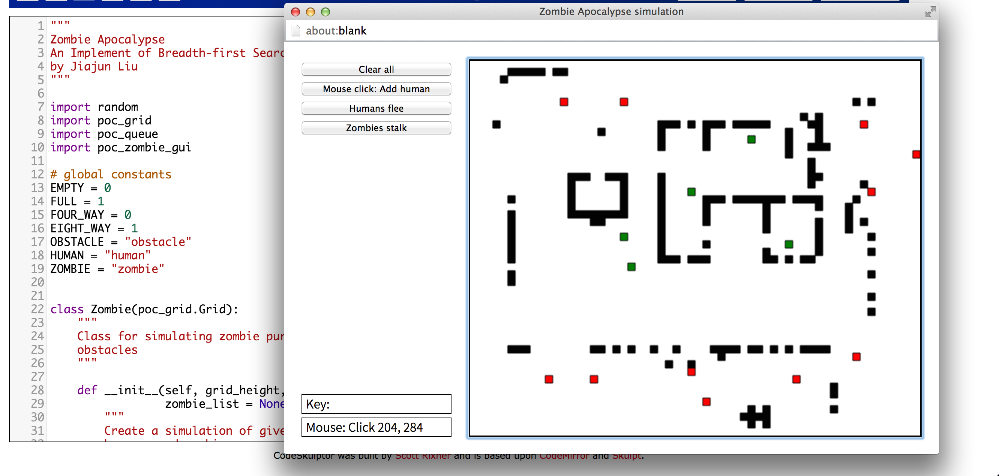

**一群人类（绿点）被僵尸（红点）包围在破败废墟中的场景。请自行脑补。**

  

啊，僵尸。也不知道谁规定的，僵尸及其变种的怪物成了无数影视游戏中人类可以毫无道德顾虑地击杀的游戏怪物。

  

这个游戏的画面如上图所示：

  

  * 黑色是障碍物。可以理解为房子、篱笆、烂掉的车什么的；任何单位不能通过。

  * 红色是僵尸。它们可以向上下左右四个方向移动，会自动前往最近的人类。

  * 绿色是人类。他们可以向8个方向移动，会自动远离僵尸。请不要吐槽为什么颜色好像应该反过来。

  * 紫色是感染者。被僵尸抓到的人类就会这样，不会动。可以理解为啃翻在地上，过一会儿就要变成僵尸起来。

  

所有的格子都是可以由玩家自行布置的。因此这是个乐趣在于 YY 的沙盒游戏。

  

点击 "humans flee" 按钮则人类移动一回合，点击 "zombies stalk" 按钮则僵尸移动一回合。它们采取的寻路策略都是广度优先搜索。游戏
不会结束，你可以在这个沙盒中给自己安排胜利条件。布置各种各样的场面看着它们行动，也还能支撑个半小时的乐趣，是到目前为止制作的可玩性最强的游戏……

  

同样的，这个游戏也是一个具有充分扩展性的游戏。感染者会不会转化成僵尸？人类能不能拿到武器反击僵尸？僵尸中间会不会有特殊感染者，能够范围攻击、远程拉住人类、能
跳来跳去或者会爆炸？玩家这个上帝的力量有多大？跳出「玩家扮演游戏中的某个角色」的框框，会发现沙盒类游戏的乐趣所在。

  

**第十二周：猜词游戏**

  

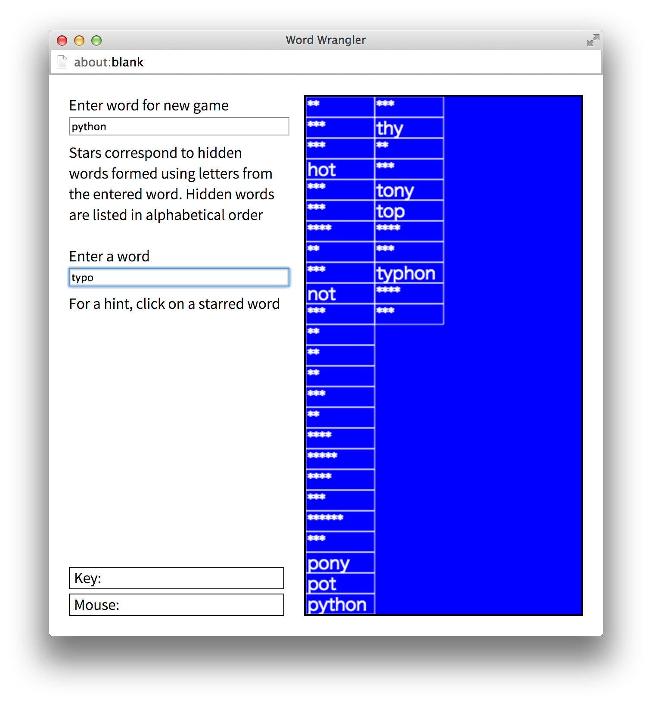

  

猜词游戏就是这样：你指定一个词，电脑会搜索词库，将这个词的字母能组成的所有词以星号遮住，你逐个尝试将他们列出来的游戏。

  

这个游戏中第一次涉及到读取文件。

  

为了成功的读取到输入的词汇并且匹配所有可能组成的词，我们需要使用一个 **merge_sort()
**方法来将一个打乱的列表变成有序的。这时我第一次接触到「递归(recursion)」。

  

要理解递归，首先要理解递归（误）。也就是说这个方法自己不断引用自己。看起来就像

  

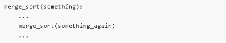

  

这样。

  

设计一个递归方法前，首先要明确停止递归的条件(base case)。在这个基础上推算每一步应该怎么办。可以拿一个简单的例子在纸上演示，无误后写出来看看效果。

  

我的设想中，当给出一个 list 后，首先应当将其分成两半，当字母的个数小于等于 1 就应该停止递归。

  

最后写成的方法看起来像这样：

  

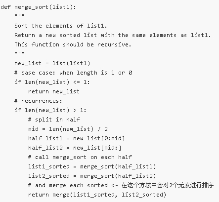

  

对我来说递归还是挺复杂的。一个简单的递归就要想很久，不过想清楚了之后的效果还是不错的。不少复杂的游戏设计中都会出现类似的规则。

  

当然，你也可以不使用递归，而是设定一些条件重复地调用一个方法。但那样的话代码量就变得很大，执行效率可能也会变慢。你是要牺牲易理解性换取效率，还是牺牲效率换取
易理解性呢？很多时候玩家也会试图来理解你游戏的内在逻辑，能不能让他们轻松办到呢？

  

**第十三周：九宫格（tic-tac-toe）**

  

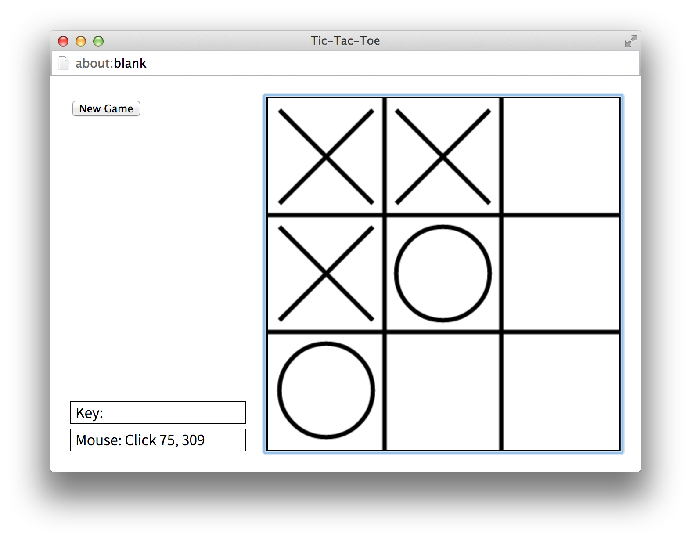

  

九宫格，世界各地的小朋友可能都玩过的经典游戏。放大到5连就是五子棋。

  

为这个游戏编写电脑对手采用的是所谓的「蒙特卡罗方法」。也就是从目前这一步开始，推算出每一个可能的游戏结果。胜则加分，负则扣分，和则不加不减；最后选定分数最高
的一步落子。这种算法在棋盘复杂的的情况下很难实用，但应付九宫格是绰绰有余。

  

然后，为了测试这个对手到底强不强，我把游戏规则反了一下变成「逆九宫格」。也就是谁先连到 3
个就算输。这种模式下，没有下中间那个位置的不败手，更能看出电脑的实力。第一盘我还没反应过来，结果输掉了。

  

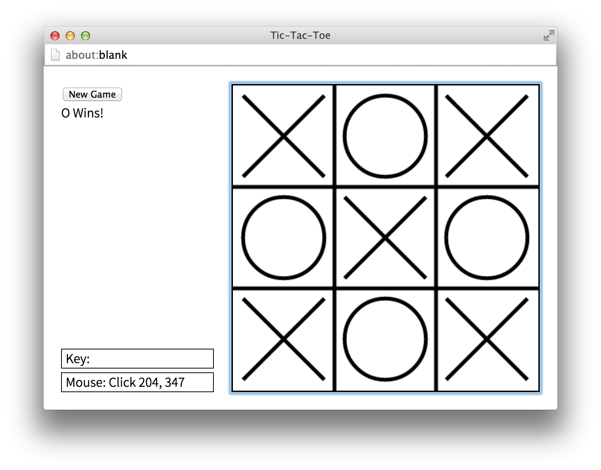** 逆九宫格：先达成三个一线者负**

  

到这里，我编写的 AI 就摆脱了特别直觉的 if-else
或者广度优先搜索规则，进入了一个发挥其强大计算力的时代。假如把棋盘扩大几倍，胜利条件相应放大，人类就很难战胜电脑了。

  

**第十四周：数字推盘游戏（n-Puzzle）**

  

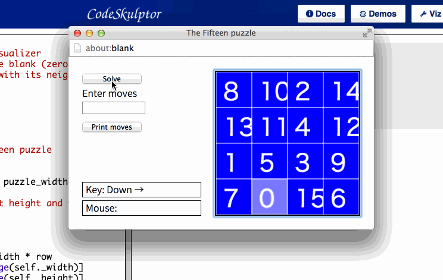

  

一开始的游戏是15个方格，数字错乱了，需要你来把它们移动回正确的位置。有一种改进型就是拼图，首先你要找出图片的正确顺序，然后还要推回正确位置。

  

游戏本身的规则不难，但要做一个自动解 Puzzle 的 AI 就有点意思了，根据反复试玩观察，一个盘面可以分为几个区域，各自有固定解法：

  

  * 第二行以下第一列右侧的的

  * 第二行以下最左边一列的

  * 第一行的

  * 第二行的

  * 最末阶段左上角的4个

  

大家可以观察动画里面解开的过程，研究一下在这些区域我让电脑怎么动作的……

  

一个个模块分别编写和测试，在内部再分情况讨论，真是件体力活！但只要测试无误，无论这个 puzzle
扩展到多大，解开它也就是时间问题。以后谁再拿这种东西为难你，只要把题目输入进去，就能看着电脑瞬间自动解开并且给你一个操作顺序了。

  

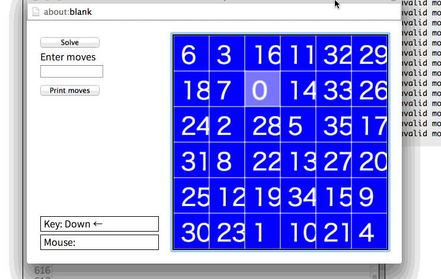

**  
**

**结语**

  

在整个的 14 周过程中间，我从能写简单的几十行程序，逐渐进步到能完成较复杂的600行程序（不含UI部分）。在此过程中，我逐步学到和应用的知识有：

  

  * python 基础语法

  * 变量

  * list

  * 方法(function)

  * 类(class)

  * 各种算法

  * 递归

  * 编程的 style 要求

  

等等，族繁不及备载。这些知识以及应用的方法有可能忘却，但在此过程中有着更多东西是令我体会深刻，很难忘记的：

  

  * 将「手感好」、「手感不好」等感觉分析成多个具体部分，进行调整。

  * 评估各种实现某个功能的手段，依据其复杂程度或者实现效率。

  * 分步计划并实现你期望的功能，最后组合成完整的游戏。

  

这些是在布鲁姆教育目标分类法被列为比较高级的认知类型。知识可以被忘记，理解和应用的过程会让你有一些印象，而分析、评估、合成的过程则可以逐步内化成你自己的能力
。你从别人那里听来的经验是知识，也许你在自己行事的过程中能够理解一些、应用一些，但更高级的认知，则非亲手实践不能取得。

  

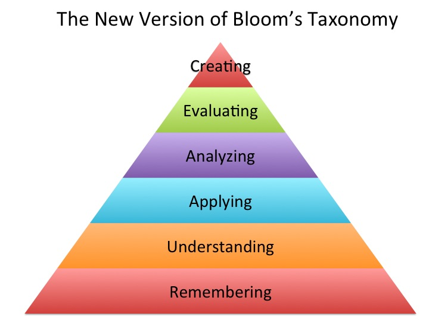

  

如果你在游戏或者互联网行业，但你并不知道程序同学们怎么工作、想些什么；或者总觉得自己的设想与实现之间有着一道障壁。也许自己亲手实现(implement)自己
设想的过程会带给你启发。

  

至少我在这 14 周每周做一个游戏的过程中，确实有这样的体会。除此之外，亲手实现设计的快感，掌握自己作品的快感，也是无可比拟的。

  

  

阅读原文 举报

[阅读原文](http://mp.weixin.qq.com/s?__biz=MjM5OTc2ODUxMw==&mid=200497122&idx=1&sn
=b826d6545b370d90a61c80877055c800&scene=0#rd)

