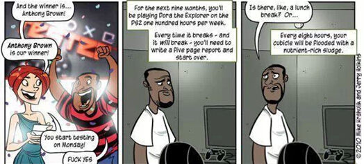

作为一名独立游戏开发者，The Sword of Ahkranox 的开发者 Alex Norton 在 reddit
上分享了他成为一个独立开发者想对后来人说的话：

  

与大多数人一样，上大学的时候，他梦想着毕业之后去知名游戏公司开发游戏，但现实太残酷，往往现在做的不是自己喜欢的，总是受制于公司所安排的
工作或者老板的旨意，所以最后决定去做独立开发。虽然做了自己最喜欢的东西，但网友不断对他进行人身攻击，对作品谩骂，他说了，没有人对这些辱骂无动于
衷，但要学会的就是脸皮厚，最重要的是要为自己的作品感到骄傲，这会支撑你一直走下去，对于独立开发者来说，难免都会遇到这些问题，看看他是如何应对的?
又从中学到了什么。

  

以下是全文翻译：

  

Malevolence
虽然不是我的创作第一款游戏，但却是我发行的第一款游戏。真的好幸运，第一款游戏还在创作早期就能获得特别高的关注度(当然，这里是和独立开发者开发的游
戏相比)。通常来讲，一个开发者不几经挣扎，不开发几个游戏之后是不会迎来春天的。或者，不是知名公司开发游戏，他的游戏很难火起来。

  

首次尝试游戏开发的我，由于游戏大获成功，就没有犯其他独立开发者易犯的通病——悲观，因此想到要分享自己的一些想法，告诉大家一些事实，作为独立游戏开发者，别人都
不会告诉你的事实。

  

**梦想很美好，现实很残酷**

  

和许多人一样，整个大学都在做这样的梦，毕业之后拿到资格证书，写几行代码，拿到 AAA 游戏公司的
offer，然后要不了多久，荣誉、财富接踵而至，从此以后过着幸福的生活，做自己喜欢的游戏，一切都顺风顺水。

  

但毕业之后才发现，我所有的努力，换来的不过是一个初级 QA 的工作，而且还是在“考虑”名单中。QA 这样的工作，每周都会在一个小房间 70
小时以上，做一些重复的、杀脑细胞的工作。确实，这样的工作能让我踏入展示真实技能的大门，但现实情况是，许多游戏公司在每个项目收尾的时候，都会认真审 查 QA
团队，最后抛弃他们，所以这个工作本身就是地雷。

QA 的苦逼生活

**如果，我不做 QA，做其它**

**  
**

**程序员**：我可能会坐下来，然后每周照样工作 70 个小时以上，用别人的引擎写脚本。因为要用到第三方的产品加速开发进度，那么我就必须明白一个道理，需要适当牺牲游戏品质来保证速度。这样一来，我感觉自 己作为程序员的正直感没了，对新功能的开发热情也会逐渐褪去，我业余时间所做的一切也都归我的老板所有，对创新的激情也会逐渐丧失。

  

**设计师**：也许我正好够幸运，得到了一份自己感兴趣的工作，有大把的时间设计射击游戏，可以看着自己的作品成模，最后成为一个栩栩如生的游戏整 体。但有一天，那个制作人、电脑白痴、游戏经验仅限于 Bejewelled 的二货过来告诉你“我 10 岁的小侄儿现在特喜欢矮种马，快把游戏改了吧，改成关于矮种马的”，你有什么办法?他是老板，只能听之任之，改游戏，放弃之前的创作，一切只因我受雇于人。

  

**那些年，太年轻太幼稚**

**  
**

意识到这一点之后，我将我的注意力转到独立游戏开发，这比受雇于人有吸引力多了，因为不受制于任何人，我可以用任何方法做自己感兴趣的东西，但没有人告诉我，这当中也
恶魔四伏。

  

决定之后，就找了一份工作负责日常生活开支，业余时间则全心投入到自己的游戏开发中，这款游戏就是前面说到的 Malevolence： The Sword of
Ahkranox。它是我理想的游戏，我所有想在游戏中见到的东西都在这款游戏里了，新的技术、新的游戏机制，我以为世界将会永远改变。但那时候我太年
轻，太幼稚，没有人警告过我接下来会发生什么。

  

我开始的时候用一种新的过程生成方式进行创作，因为最喜欢的游戏类型是
RPG，所以就想为什么不做一个呢?于是就开始动手，发现居然凑效了，然后就开了一个博客，主要是为了自己，事情进展很顺利。

  

**网友太恐怖了，所以要保持脸皮厚+自豪**

**  
**

后来开始见一些游戏开发者，他们把我介绍更给多人，我也开始逐渐把我的开发过程公开，并加大对 Malevolence
的推广力度。让我惊喜的是，这款游戏得到了许多的关注，所以，我继续做 PR，但伴随着正面回应的还有负面言论，那时候就明白了两件事：

  

1\. 互联网观众群的庞大及其匿名性真的很恐怖

  

2\. 你得到了 1000 条好评，但如果其中有一条差评，就可能毁掉你的一整天。

  

事实上，我当时确实在尝试做一些对许多人来说非常恐怖的新东西，因此也得到许多很恐怖的评论。有人恶意贬低，还有人身攻击。如果当面那么说我，
我肯定会告他们，就算一两个这样的评论都是一种威胁。那些没有勇气追梦的人总喜欢让别人也放弃他们的梦想，太伤心了。要说忽略所有评论不是件容易的事情，
但也不是不可能的。一些不同意游戏概念的人会给出自己的观点，写得也很好，值得一读，但这种人毕竟少之又少。

  

无论怎样，我一开始就采取了公开开发过程的方式，与公众进行极端亲密的沟通。我还推出了一种荣誉奖励，给那些问我问题的人。许多人都喜欢这种方
式。而另一群人则继续趁机进行谩骂，刚开始我只是以为都是因为我的新 idea 或者理念在作祟，见了别的开发者之后才知道，原来这在游戏社区是家常便饭。

  

充满愤怒与憎恨的粗鲁玩家到处都是，他们觉得自己有权利对开发者说任何话，但幸好更多人对我的游戏表示支持。整个过程中他们与你沟通，鼓励你。但你也需要拽住哪些骂你
的人，我的一个朋友也告诉我说，哪些骂得最凶的人到最后也有可能买你的游戏。

  

所以你要做的就是专注于你的产品，人们是否喜欢你的游戏并不重要，重要的是你自己要喜欢你的作品。如果你自己喜欢，别人也会跟着喜欢，看看 MineCraft
以前的遭遇就知道。被喷了那么多年，但 Mojang
照样售出几百上千万份游戏?可以说，他们对自己的作品超级自豪。为自己所作的事情而自豪非常重要。如果你对自己所做的事情自豪，那么不管发生什么，你都会
紧紧抓住它，不会让它跑掉。

  

我曾被“Guild Wars 2”(激战2) 团队称作“有远见的人”，也被 RockPaperShotgun
评为值得一看的作品，这些事情都让我倍感自豪，不论什么时候受到无知谩骂者的指责，我都会记得这些事情，帮助自己跨过心理这道坎。

  

**想成为独立游戏开发者，要明白这些**

  

1\. 所有的一切都异常困难

2\. 很大一部分人会公开批判你的游戏，不论你做过何种努力，所以要学会承受

3\. 没有人比你对自己的作品更上心，更了解

4\. 每个人都觉得他们比你更了解你的项目

5\. 从中赚钱的几率少得可怜

6\. 脸皮一定要特别的厚

7\. 对公众开放不一定要总是笑脸相迎

8\. 你会遇到许多所谓的“游戏开发者”，但实际上，几乎没人真正开发游戏

9\. 你需要去倾听所有的建议，但记住，听取建议并不意味着你必须接受这些建议，不过“听建议”不会伤害到什么，所以要学会倾听，你永远不知道你会从中学到什么。

  

**独立开发者，要记得要这些**

**  
**

1\. 不要开发一个 RPG 游戏作为你首个发行的游戏，也不要做其它任何大型的项目。开始的时候简单点，学点经验，一旦积累了经验，你就可以做大项目了

2\. 在你 150% 的确定发行日期以前，千万不要公布发行日期

3\. 不要让自己的生活完全被你的项目所占据

4\. 不要回应你的批评者

5\. 组建一个测试团队，遵守严格的测试程序

6\. 在想要全力以赴做一件事情之前，做一个周密的计划

7\. 仔细考虑公开开发过程这件事，依靠目标用户及项目本身，效果可能比你闷头独自开发更好

8\. 不要让任何人赶走你对自己工作的自豪感，你对之不再自豪的时候，就是人们停止尊重它的时候，如果你做游戏，哪怕最后钱没挣到，你还有自豪。

你，有过这样的经历吗?

  

喜欢我们的内容，可以点击右上角**「分享到朋友圈」**，或**「查看官方账号」**并关注我们。

阅读原文

阅读

__ 举报

[阅读原文](http://mp.weixin.qq.com/s?__biz=MjM5OTM0MzIwMQ==&mid=201614918&idx=1&sn
=25ac9f34c3ba8240a21fe2e1ed5129c8&scene=0#rd)

