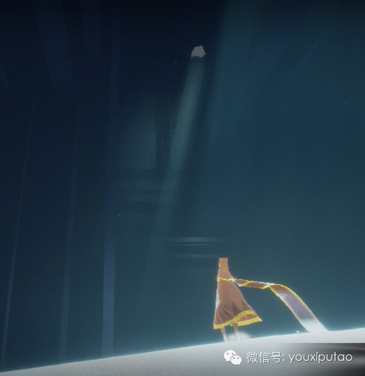
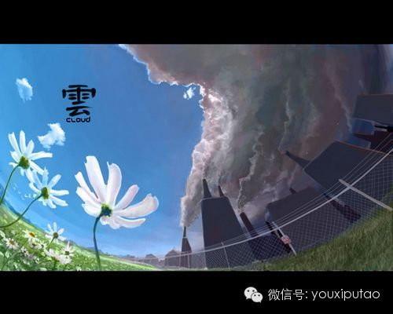
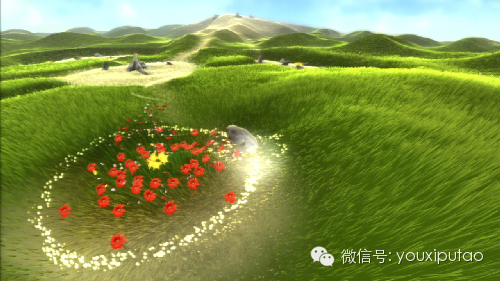
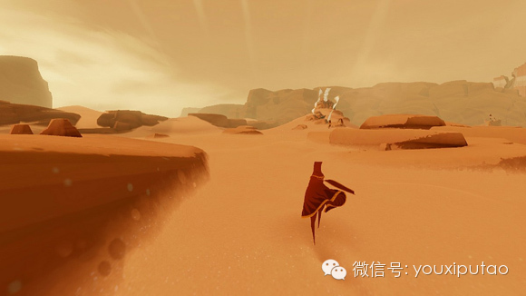
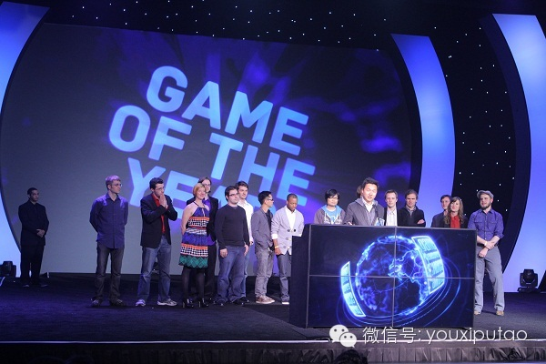
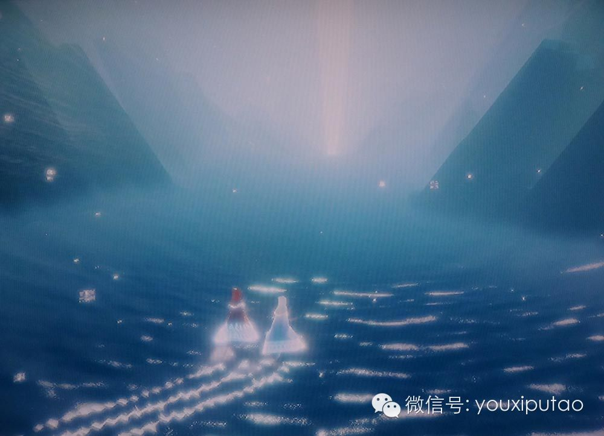
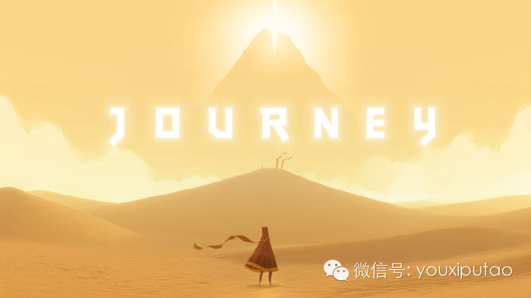

  

很多时候大家做游戏是为了好玩，可是游戏是一个媒体，媒体可以传达不同的情感，可以是非常快乐的情感，也可以是非常悲哀的情感，也可以是非常复杂的情感。有时候挑战带
来的乐趣反而有可能是我们的敌人。

  

**“游戏是我生命中非常重要的部分。”**

**  
**

我从1990年开始打游戏，一直打到06年研究生毕业。我小时候的朋友都是通过打游戏认识的，游戏陪伴我一起长大，是我生命中非常重要的部分。游戏这个行业从1990
年到现在变化非常大，早期它还是非常小众的行业，但是现在因为移动平台的出现，很多人都在打游戏，可以说游戏行业是蒸蒸日上的。但与此同时，和我一起打游戏的人已经长
大了。我问他们，现在你还会不会长时间地玩游戏？他们说几乎不可能，因为都没时间玩。当时我觉得我人生中很重要的一部分东西好象被成年人遗弃在了背后。我非常爱游戏，
我很希望游戏是一个能被成年人接受的东西。

  

小的时候会有人给我读一些童话故事，这种故事对小孩来说有意思，但是对成年人来说就是很无趣的故事。其实童话故事也可以让成年人和小孩一起有兴趣的内容，不管是电影、
动画，比如美国的很多动画片都是成年和孩子一起有兴趣的，为什么游戏就只能给小孩子玩呢？到后来游戏蒸蒸日上，很多朋友都开始玩《愤怒的小鸟》，但是这样的未来不是我
想看到的未来，这样的游戏也不是成年人真正会重视的游戏，我觉得游戏行业需要更上一层楼，才能真正成为成熟伟大的行业。现在一说到连续玩四个小时的游戏，大家基本上都
会说没有时间；但是他们会有时间读四小时书，或者看一部电影。之所以我的朋友还在读书、看电影，是因为那些书籍和电影给他们生活带来一些真正意义上的光彩。早期的时候
一说起游戏，都觉得是毒害青少年；现在人们说起游戏行业，都会说这行很赚钱。但是人们从心底里尊重你吗？我觉得不是这样，我是希望在退休之前，如果你跟别人说你是游戏
设计师，就像今天说你是建筑师、电影导演、作曲家或者说你是医生一样，会得到全社会尊重的职业。这是我最大的梦想。

  

**“那时候我经常想象自己在天上飞翔，想象天上的云是各种各样的形状。”**

  

**陈星汉的《云》奠定了他的设计理念。**

  

一开始，其实我也不知道将来要做游戏，直到读研究生的时候才确定。我那时候在南加州大学的电影学院读一个三年制的研究生项目，在读书期间我开发了一个游戏《云》。这个
游戏很有意思，是一个学校的奖学金基金项目。当时《GTA3》上市了，里面有很多暴力的情节和行为；又正好发生了好几起枪击案，就有舆论说游戏毒害青少年，让他们变得
暴力。因为老师都非常鼓励我们去推动游戏的边界，我们就想能不能开发一个游戏，跟《GTA》相反的、没有暴力的游戏，玩了以后没有焦躁的感觉。最后的灵感来自于小时候
，那时候我经常想象自己在天上飞翔，想象天上的云是各种各样的形状，因此就做了一个游戏：一个小孩在医院里不能出去和别人玩，他只能朝窗外看，看到了蓝天白云，想象自
己在蓝天上飞行，飞过白云的时候可以拖拽白云，可以用它做各种形状，也可以使云产生降雨。

  

当时的游戏是非常粗糙的，还没有Unity，我们只能自己写引擎。但是很让我们吃惊的是，游戏上线三个月，就有全世界超过40万的下载量。游戏后来出现被很多媒体报道
，我们开始收到各种各样的信件。让我印象很深刻的是，有一个玩家说参与制作的人都是美丽的人。我从小到达没有人跟我说我长得漂亮（笑），所以这对我的震撼非常大。

  

其实在开发这款游戏之前，还开发了另外两款得过很多奖的独立游戏，但是从来没有这么强烈的用户反馈。我苦思冥想：这个游戏到底好在什么地方？我意识到从情感角度来说，
这个游戏和传统主机游戏完全不一样，它给人是一种治愈的感觉。人饿了要吃饭，渴了要喝水，但是如果人在情感上有饥渴怎么办？古代的时候，那些原始人会绕着篝火跳舞，这
就是为了获得情感上的安全感。到后来古罗马把自然都征服了，自然界的生物都成了牲畜，也没有战争，这时候人们反而缺乏了自然界带来的危机感，他们就造出了斗兽场。

  

所以情感需求是可以通过不同的媒体来得到满足的。比如我跟谁分手了以后很沮丧，我可以看一本帮助你励志、治愈的书，我也可以看一场非常浪漫的电影，可以和部分一起出去
打球，都可以帮助我治愈我情感上的需求。比如电影是各种媒体中间最年轻的媒体，也是最像游戏的媒体。通过一百多年的发展，电影媒体的市场已经被细分到非常精确，你可以
看一下电影市场细分，他们都是按照情感来分的，比如喜剧，你一看就知道它给你带来什么情感。比如恐怖片，一听就知道是什么样的类型，所以看电影之前，你就已经想好你要
看什么样的感觉。

  

电影市场的细分，不仅是按照类型发展，还是按照时间来分，美国是按照月。比如在五六月是学生放暑假，动作冒险片就特别火，因为年轻人就很喜欢很刺激的感觉，所以到夏天
大家都有时间看电影，这个市场就开始增长。到十月份恐怖片市场开始增长，因为美国有万圣节，那时候大家都喜欢被吓一下。到了圣诞节，戏剧就开始增长了，这主要是针对成
年人，圣诞节一家人坐在一起看电影。但是如果你看一下游戏的类别细分，根本就是和情感没有什么直接关系的，最早期所有游戏都叫街机游戏；慢慢他们开使用科技分析，比如
第一人称、第三人称、多人射击游戏、大型多人射击游戏，这些射击游戏并没有体现多少情感。其实同样一个射击游戏是可以用不同情感的，我觉得游戏市场类型的分配是有问题
的。如果我用情感来分所有游戏的话，可以看到绝大多数游戏，战略游戏也好，或者早期街机游戏，还是现在的手游，其实主要是以动作、冒险为情感。

  

我在06年的时候，就感觉没有成年人喜欢的情感类型的游戏，所以我参考了一下电影工业，一开始的时候他们的电影类型也是跟游戏行业一样。刚开始的时候他们拍什么呢？两
个人打拳击，或者很漂亮的酒庄，或者一列火车冲进火车站。到后来电影越来越发展，这时候他们才开始尝试更加复杂的情感。

  

慢慢地，电影行业就发展成不管你是什么性别，什么年龄，从什么国家来的，你现在是什么心情状态，你总有一部电影是可以看的。电影行业变得老少皆宜，而且它的情感深度和
广度是覆盖整个社会年龄层的，所以我们可能会问你是不是玩家，但是我们从来不会问你是不是听音乐的，或者是读书的，因为大家多多少少都要听一些音乐或者读一些书，游戏
行业开始从这几年有这个征兆，也许以后可能不会再有人问你是不是一个玩家。所以我们为了让别人尊重，我们必须要尊重历史，我当时就希望能够让游戏行业有更多新的内容，
它是老少皆宜的，是可以加深已知情感深度的游戏，然后我创办了That Game
Company。我希望游戏要老少皆宜，能加深已知情感的深度和广度。创办公司当然是希望赚钱，但我更希望能对行业有帮助。

  

**“当时我加州坐火车，看到农田里面绿野一望无际，就特别想捕捉一种被自然环绕的感觉。”**

  

下面我给大家讲一下《Flower》这个游戏。因为我从电影学院学了很多剧本写作的东西，当时老师跟我说人是很复杂的。我相信大家也都听过乔布斯说过他从来不听用户反
馈，因为用户说的是他们要什么，但不代表这个市场真的缺少什么。比如我去采访一些玩主机游戏的玩家，我说你想玩什么游戏，他说我喜欢这种类型的游戏，你下一个游戏能不
能枪做得更大一点，跳得能不能更高一点，跑得能不能更快一点，基本上都是现存内容的延续。比如福特汽车的创始人，他说如果我去问用户的话，他们只会要一匹跑得更快的马
，绝对不会要一辆汽车。因为越来越多的人玩主机游戏，我想他们也许需要一些放松和平静，所以我就在寻找灵感。

  

我从小在上海长大，当我加州看到农田里面绿野一望无际，就特别想捕捉一种被自然环绕的感觉。但人可以看得很广，照相机只能捕捉很小的一部分，所以我就想怎么捕捉当时的
情感，我就回家画画。

  

**《花》的概念设定完全是由陈星汉一手打造。绘画是游戏设计师最强有力的表达工具。**

  

我当时想我多画点花，把世界变得更加抽象一点，但是我画了以后有觉得少了一些什么，觉得有一种孤独感，我就画了很多画，后来我发现我越画，城市背景就越出现一些人文的
东西，或者才意识到也许我从小是因为在城市长大，你真的把我扔到一片花海当中，我会非常没有安全感。所以我当时就想能不能做一种游戏，给玩家带来很自由的、被自然拥抱
的感觉，但是又有一种在家中的安全感。当时我花了两年时间开发这款游戏，我们开发游戏和普通游戏制作是不一样的，为了找到一个玩起来觉得非常平静和谐的游戏，我们设计
了很多原型。

  

一般普通人做游戏的时候，总会说游戏要好玩儿，好玩儿就会有挑战，有一些加分，打得不好还会死掉。我们一开始设计的有点像类似《块魂》一样的游戏，加入了一些时间限制
。但是这时候我们发现很多玩家开始骂人了，他们经常会差一秒成功，这种失败给大家产生的一种郁闷的感觉，这和我们当初想设计的和谐的感觉是相悖的。后来我们也试着用了
其它游戏的方式，比如加入操作技巧，比如连击等等，但测试以后觉得玩得特别紧张，会很有挫败感。我们从头到尾试过十二种不同的玩法，花了将近我们75%的开发时间。整
整一年半的时间，我们都在不停地试。这如果是一个公司里的大项目，肯定早就死掉了，但是因为我们的团队很小，可以一直搞下去，最终研发出了让大家不再焦躁的游戏。

  

这个游戏给我的启发是，很多时候大家做游戏是为了好玩，可是游戏是一个媒体，媒体可以传达不同的情感，可以是非常快乐的情感，也可以是非常悲哀的情感，也可以是非常复
杂的情感。有时候挑战带来的乐趣反而有可能是我们的敌人。

  

《花》是有剧情的，从头到尾有不同情感在里面，也有一个情感起伏的曲线。我和美术、音乐合作的时候，我们会讨论这个部分有转折点，应该在高潮之前有一个低谷。美术很容
易就能给出低落的配色，作曲家很容易就可以给出悲哀的情感，但和游戏设计师说关卡不能好玩，一定要让人很挫败但不放弃，在游戏设计上就完全没有任何参考的对象。因为绝
大多数游戏设计的理论是基于做非常好玩的游戏，但是如果我要做一个非常感性的游戏，就只能花很多时间去测试行不行，会不会成功。这就是游戏为什么让人兴奋，因为你可以
去开拓这片疆土。

  

**在《花》中，玩家扮演一阵风，吹过茫茫的草原，给钢筋水泥的城市带去自然的花朵。**

  

当时在洛杉矶的当代艺术馆，他们拍一个以游戏为主题的纪录片。他们找了一些人，在他们玩我的游戏的时候，把摄像机装在显示器下面拍他们，你可以看到他们的面部表情。他
们玩《花》的情感，和玩《穿越火线》玩家的脸是完全不一样的。对于我们来说，能够超近距离看到你的玩家的表现，那也是一种别样的奖励。所以这个带给我们的启示就是只要
你花很多时间去尝试，你是可以达到你的目的的。《花》这个游戏也是历史上第一款被收藏的游戏艺术品，我亲眼看到过小孩和老人在玩我们的游戏，我觉得他们是绝对不可能玩
什么《穿越火线》的。

  

**“这是我们想带来的体验，让你在保护别人的同时依赖别人。”**

  

这时候我们胆子就更加大了，在09年的时候我就做了《Journey》。因为之前我玩了三年的魔兽，为什么玩那么久呢？因为刚开始到美国语言也不通，整天在家里就是放
松打魔兽，我一个屌丝男在国外打拼，大多数时间是挺孤独的，情感上我需要有人跟我交流，让我觉得不是一个人。但是魔兽里大家基本上是专注于玩本身，没有让我有可能在游
戏中和任何一个人有深交，所以06年的时候我就特别向往一款可以超越魔兽的游戏，可以让我和另外一个人有情感上交流的游戏。我就想可不可以有一个网游，在游戏里你不管
是男女老少，都是一视同仁的。比如在吊桥上有一个玩家盯着瀑布发呆，这时候我也在他的边上盯着瀑布发呆，此时此刻，这两个人有相同的情感，他和我的心意是相通的，我特
别希望有这样的游戏邂逅会发生。因为也是网游，我希望与其一群人在那儿打怪，不如一群人要穿越一座雪山，雪山上有一个巨人，巨人在上面行走，但是因为大雾根本看不见这
个巨人，这个巨人有可能会把你踩死，所以就需要你牵着前面人的手告诉你怎么走是安全的，同时你也可以牵着后面的人的手告诉他们怎么走是安全的。这是我们想带来的体验，
让你在保护别人的同时依赖别人。

  

**《旅途（Journey）》非常强调玩家之间的情感互动。**

  

所以当时我们为了开发这个游戏，我们做了很多原型开发，当时一开始我们音乐是很早就做了，开发四个月就有这个主题音乐；美术也只花了两周就做出了概念视频。虽然最后的
角色和世界都和这个概念视频里不太一样，但是那种大漠孤独的感觉从那时候就开始成型。我们做原型做了大概四到十个月，早期的原型后来被发现都不适合这个游戏。我觉得原
型最好的方法就是让你尽快犯错。

  

我们原来设计游戏的时候是不同角色的游戏，比如胖子和腿长的人，腿长的人跳得远，胖子可以有力气打碎石头，但是这样的游戏就出现一个问题，万一没有人在线玩，你怎么打
这个游戏呢？而且早期2D的原型，对3D适用度很差的。有一个原型的画面很小，很难找到其他玩家，所以我们就设计了脚印的系统，你可以通过脚印很快找到另外一个玩家。

  

结果后来到3D原型的时候，发现找到一个人完全不是问题，因为你可以一眼看到地平线。包括一开始我们想的另一个概念，那个时候两个玩家如果分开来走，一个人喊一声，隔
着的石头变成蓝色的，另一个人喊一声石头就变成黄色的，就像打乒乓一样，我们觉得这是非常好的互动方式。但是在三维空间里，你是很难做到这样合作的，所以这一系列原型
都有很多的问题。当时我们最后做3D游戏的时候，我们发现认为是很好的概念，在2D的原型都是很失败的，所以大家要做3D游戏还是从3D原型开始做起。

  

另外游戏画面就是游戏的反馈，我们现在很多手游的反馈是来自数字。我们当时想能不能通过游戏地形设计，给游戏加更多的变化，比如你走路的时候留下一条脚印，这样你就可
以在沙地上画画，如果沙地不是平的，有很多的小山坡，在你走的时候，有很多像素是随着你前进而变化的。所以我们当时实地考察的时候，我们找了一个沙滩，想办法让游戏做
得感觉像在沙漠里。最后游戏的感觉是，每个沙坡爬上去很累，但是滑下来非常舒畅，这就让在沙漠里的行走变得非常有趣。

  

**陈星汉带领整个团队去沙漠实地考察，做出了完美的沙漠环境。**

  

我们很多时候会被各种各样的东西引诱，比如说很多传统游戏，有名字、等级槽，或者登录的时候选服务器、房间。我就想游戏如果真的是给全民做的，要让不同的人享受这个游
戏，就不应该有登录界面，你开游戏的时候就直接开始跟别人玩游戏了。还有，我特别不喜欢网络里面的ID，很多人名字非常的容易把我从游戏中带出来，比如我叫“奥巴马”
，我到游戏里面，人家一看到我就说这个人肯定不正经，这个人是搞笑的，他马上就从《Journey》角色变成现实生活中的一个人，这实际上对情感传达是有伤害的。

  

另外传统游戏会有在线语音，比如你打魔兽的时候，你需要很多合作，这时候你会觉得一直以为某个人是女人，原来是男的，这个时候就会因为让玩家知道你的真实身份，而很快
从游戏中脱离出来。为了避免语音系统，我们连加好友的系统都没有。唯一加好友的方法是到游戏的最后，所有字幕滚完了，你才可以看到玩家的名字。

  

**“为了让玩家可以随时加入和离开，每一关的设计工作量大了三倍。”**

  

我们的游戏一开始是四个人的游戏，当时发生了什么事情呢？玩家会分帮派了，测试的时候，有玩家就说，我太不喜欢这个游戏了，因为其他三个人总是强迫我，一定要很早有离
开这个地方，我还想做探索呢，我总是觉得被别人拽着，一点都不开心。到最后游戏的参与者变成了两个人，主要是因为我们当时没有办法解决群体压迫感的问题。同时从心理学
角度来说，一个真正的合作，它是需要平衡的，比如你参加一个篮球队，队里面有一个人是超级大明星，所有拉分的活都是他做，他太拉风以后，团队就不喜欢他这个人，就把他
孤立了。还有你不拉风，你搞自己的特色，你就做团队里让你做的事，但是团队会觉得你是一个螺丝钉，也不行，真正的好游戏是需要一个平衡，你在团队里有自己的特色，但同
时也是属于这个组织的。当时我们的想法是这样的，如果我强迫一个玩家和另外一个玩家从头到尾都是组队的，有可能他玩到一半就反感，他最后会想挣脱设计师强迫给他们组队
的方式。我们在游戏设计中，希望玩家他对对方不满意，就直接走人，继续一个人干，直到你碰到一个另外一个跟你步调、喜好上都相同的人，你才愿意和他在一起，在这种情况
下他们的合作是真心的合作。所以为了让游戏能够让人和人之间真心选择在一起。我们必须让这个游戏可以随时让玩家离开和加入，这个听上去很简单，但是为了做这样的设计，
我们做游戏每一关设计工作量大了三倍。我不知道大家有没有想过这样的问题，比如我和这个人一起合作打开一个门，我走进了这个门，这个人就走了，这时候我和另外一个玩家
合作，那这个门是开着还是关着？有时候可能开着很好，但是也会造成很多麻烦。为了保证自由组队的游戏质量，我们花了大量时间打磨各种各样的东西。

  

**《Journey》获得了GDC评选的2013年年度游戏，陈星汉在颁奖典礼上致辞。**

  

玩过《Journey》的人都知道游戏中有布料这种资源。当玩家得到资源的时候，他可以做短距离的飞翔，每次玩家看到布料都很开心。可是早期做测试的时候，当同时两个
玩家发现布料的时候，只有一个玩家得到布料，当时就有玩家说我不喜欢和某人一起玩，因为他老是抢我的布料。如果用布料的人可以再拿来使用呢？后来我们增加了一个设定，
飞翔以后布料是拉出来的，第二个人可以跟在后面飞，觉得可以解决这个问题。但测试以后玩家还是讨厌其他人，他们觉得我好不容易跑这么远捡到布料，结果被人利用了劳动力
。屁股后面总有人跟着，就像小偷一样。最后干脆这样，资源是无限的，找得到布料，两个人都可以拿到满。这样大家没什么可以争斗的，就都开心了。

  

另外是碰撞的问题，就像魔兽世界，两个人互相走过，就好象你可以从他身体里穿过一样，当时我就想为什么两个人没有碰撞，如果有碰撞，一个人可以踩在一个人身上，或者两
个人可以连在一起拿一个可能一个人够不到的东西，所以我们就加入了碰撞，希望两个人可以互相一起推石头。意外的是，玩家不喜欢推石头，而是推危险性的东西，比如把另一
个玩家推下悬崖。后来我碰到一个心理学家，说你这个问题根本不是人性的问题，玩家是不会把我们现代的价值观带到虚拟世界中的，所以虚拟世界中的价值观是要重塑的。所以
我们后来就想如果我不希望玩家互相杀死对方，我们就根本不给他机会有杀死对方的可能，同时我们把碰撞取消掉了，两个人碰到一起的时候不会碰撞，但是两个人可以互相给对
方充能量，这时候两个人就变成了提款机，这时候玩家就不会不喜欢互相碰撞对方了，你不会觉得对方是小偷，而是觉得对方可以给你帮助。所以其实在我们游戏社交当中，我们
的知觉都是非常差的。

  

**“我就想通过讲故事，让玩过游戏的人觉得自己人生会变得更好。”**

  

另外是我们把所有负面情感避开之后，想把真的想要的情感做到一定高度，就必须提一下宣泄。这个词讲的是一个人被很强烈的情感冲击过以后，你会有一种空虚感。如果你看过
一部很棒的电影，往往你从电影院出来是不爱说话的，回家第二天早上醒过来还在想这个电影，这是为什么呢？当很强大的东西冲击过之后，你有一种焕然一新，或者被治愈的感
觉。

  

我自己小的时候玩过《仙剑奇侠传》，当时林月如死的时候我也哭，我就想为什么她就死了呢，作为一个十三四岁的小孩，玩了那个游戏，人生第一次经历这么惨重的失去一样东
西的感觉，这让我想了很长时间，我觉得思考这个游戏中发生的事情，我自己得到的一些新的领会，这本身对我人生的帮助是非常大的，这也是我后来为什么想做游戏和动画，我
觉得游戏里讲的故事会让我人生更加美好。这也是为什么我觉得自己是一个做艺术的人，我就想通过讲故事，不管是游戏还是动画，能够让玩过游戏的人觉得自己人生会变得更好
。当然要做到这样的强烈情感冲击是需要一些技巧的，在好莱坞关于这种叙事架构叫做三段式。

  

所以当时我们做《Journey》的时候，我们用了一种叫“统一神话”的故事架构，这个故事架构经常被好莱坞使用，比如《星球大战》、《骇客帝国》等等。我们当时用这
个架构做出一个情感曲线，讲的一个人的一生，从青年人到中年危机，到最后老了跟死亡抗争，直到最后重生。我们把不同年龄阶段的情感具体化到不同的关卡，通过颜色设计、
互动设计，表达人在不同年龄段的感觉。

  

最后做游戏的时候其实是做情感曲线， Y轴线代表的是游戏中的自由感，比如《Journey》在最后高潮的时候，你可以向任何方向飞行，你在中间滑沙的时候有非常强的
自由感，包括移动速度也非常快。而在游戏中的低谷，你的移动速度是非常非常慢的，比如雪山是整个故事的低谷，你走路是一步一蹒跚。

  

我们研发第一年的时候，游戏非常的荒诞，整个游戏就显得没有什么情感曲线。第二年的时候，我们花了很多时间打磨前半部分的情感，做得很不错，但游戏的结尾部分有点让人
失望。我们做测试的时候，有一个人在雪山死掉之后，屏幕就卡掉了，但是我们不知道，他就里面看着蓝色屏幕十分钟，他后来跑出来说这个游戏很有深度。

  

后来我们又让他玩最后一关，但是玩了之后他说他不喜欢这个游戏。为什么？因为最后的情感巅峰不如之前。如果最后一关不要，其实可以造成很强烈情感宣泄，但是游戏就从喜
剧变成了悲剧，我们觉得还是希望结局能够给人一些希望和力量，而不是沮丧的情绪。

  

所以我们经过设计以后，雪山那一关玩家的衣服会发生变化，他越接近死亡，衣服就越硬，最后变得不会飘动。所有动画在雪山关卡我们重新做了一下，把动画放到两倍大。我们
加了一整段石龙攻击玩家的部分，包括玩家躲避的避难的地方，是可以被石龙击破的，让玩家更加感觉到无力感。我们提高了这部分的难度，普通关卡10—15分钟就打完了，
雪山关要30分钟才能打完。包括最后玩家迈向雪山山顶，走向死亡的时候，雪山顶的光会消失，玩家的围巾也消失，他想发声音也发不出来，如果这些细节我们没有做的话，玩
家是不会觉得自己在死去。一开始雪山最后的部分是全自动的，但是玩家光是看飞入白光，一点没有高潮感。后来我们就把它变成了手动的，玩家要一步一步走进这个光线，这样
才有更强烈的情感曲线，因为你是自己把自己生命结束的。

  

**雪山一关给玩家带来了剧烈的情感冲击。**

  

后来我们找了25个人测试这个游戏，有三个人玩哭了，我们才觉得这个游戏已经Ready了，我们才觉得《Journey》是一个成功的产品。我们在2012年3月份发
行的时候，当天就有玩家到我们论坛上去写道歉信，说不好意思，游戏中间我必须得走，我也不知道你是谁，希望你能看到我的道歉。

  

当时很多玩家画了很多同人画，他们记住了游戏里面很美好的画面和过程，他们记得大家一起向前进，也记住了在雪山顶上有人跟他们说拜拜等等。最后《Journey》得了
很多奖，但是到最后我最感动的不是业界的奖，而是有很多很多的粉丝信。一直到现在，每个礼拜都有人写感谢信，我现在收集的感谢信已经超过1100多封了。

  

有个人说他年轻的时候，因为一次打猎有一个事故，他进入了一个濒死状态，50多分钟都是被医学证明死亡的，后来他奇迹般活过来了，很多朋友问他濒死是什么感觉，他说玩
《Journey》的时候就让他想到了自己当年濒死的状态。我看了之后，我真没有想到能做出这样的感觉。还有一个美国大兵说，他是从阿富汗回来，膝盖残废了，背上、头
上都有伤，还得了肾结石，生活非常痛苦，他就对生活没有希望了，可是他写信的时候是圣诞节前夜，前天晚上他玩了《Journey》，第二天醒过来，他突然间觉得人生有
了希望，他说他最近还有一个很好的女朋友，而且他女朋友怀孕了，将来会有孩子出生，他会专注于人生正面的东西。当我看到玩家写这样的信的时候，我有非常大的满足感。

  

**《Journey》是游戏史上的一座里程碑。**

  

  

**“游戏葡萄”的微信订阅号已开通关键词查询功能。******回复关键词可查看相关文章，**回复【帮助】则开启关键词引导**。****

  

[阅读原文](http://mp.weixin.qq.com/s?__biz=MjM5OTc2ODUxMw==&mid=200223552&idx=2&sn
=973914cdb829443ae151302fead92e22&scene=0#rd)

