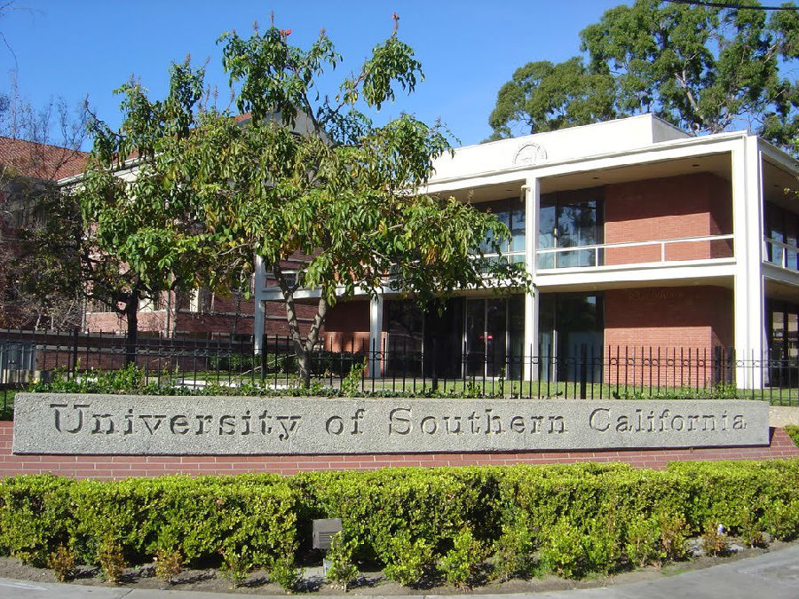
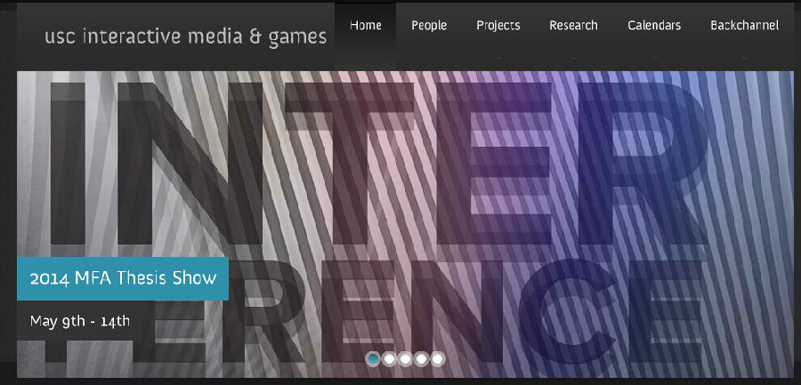
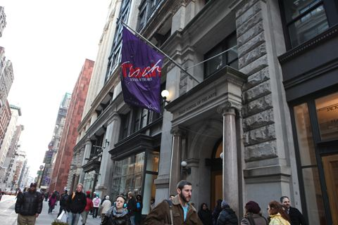
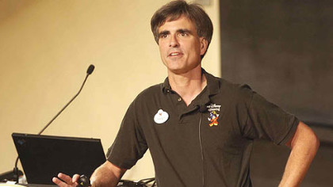
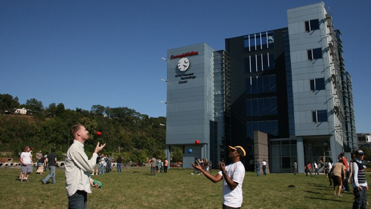

  

在各国的游戏产业中，美国毫无疑问是个庞然大物，越来越多的专业游戏人在这里找到了自己的理想学校，找到了自己的创业伙伴。如果你是一个对游戏行业有着强烈兴趣和学习
欲望的人，下面这篇文章想必能为你的梦想之路提供不少帮助。  

  
  
游戏产业的蓬勃发展也催生了游戏教育行业。和国内的GA、万岁游戏这样的培训机构不同的是，北美的游戏教育在十多年前就已经开始进入一流大学，成为向游戏产业输送人才
的重要源头。在这些游戏专业中，学生不但可以学习系统的游戏理论、专业技能，还可以自己寻找搭档、组成团队，参与到或商业化、或独立的项目中，并最终获得对应的学位。  
  
今天就向大家介绍一下北美的大学中开设游戏设计方向的学校和专业。由于相关专业很多，因此只选择最优秀的一些专业和学校进行介绍。排名不分先后。  
  
**1.南加州大学，互动媒体及游戏(University of Southern California, Interactive Media & Games)**  
  
  
南加州大学。  
  
虽然说排名不分先后，但这个培养了陈星汉、Ian Dallas（代表作为The Unfinished Swan）等一干优秀的设计师的专业毫无疑问是最好的选择。
南加州大学电影学院是全美国最负盛名的电影学院，为好莱坞、迪士尼等洛杉矶的娱乐产业输送了大量的人才。互动媒体及游戏专业是电影学院开设的七大专业之一，虽然顶着“
互动媒体”这一高大上的称谓，但其实专业的主要目的是培养以创意总监（Creative
Director，在大部分公司中是主管游戏研发的最高职位）为职业生涯目标的游戏设计师。该专业在USnews最佳游戏设计专业排行榜上高居榜首。  
  
  
互动媒体专业每年的毕业设计展都吸引了很多业界的公司前来挖人。  
  
这个专业和电影学院其它专业一样为三年制。课程要求完成50学分，包括36学分必修课和14学分选修课。主要的课程包括游戏设计的进阶理论、游戏制作的商业实践、创新
性的游戏系统设计等等，同时还可以选修电影学院其它专业的课程，例如电影的制片、剧本创作、音效制作等等。三年课程修完之后，学生会被授予艺术硕士学位（MFA，Ma
ster of Fine Arts）。  
  
互动媒体及游戏专业的经费充足，有自己独立的大楼用于授课和研发。互动传媒大厦除囊括了一些像交互式媒体与游戏区域、开设学士学位和博士学位的媒体艺术+实践课程、以
及多媒体研究所这样的基本设施之外，也会设有一些高端的研发实验室：例如游戏创新、混合现实和环境的媒体实验室。大厦中的设备涵盖最先进的数字技术，包括4K数字投影
机、游戏测试间、动作捕捉设备、虚拟现实头盔等等。  
  
  
前顽皮狗《神秘海域》系列首席设计师Richard Lemarchand  
  
由于地处洛杉矶这一全美最大的游戏城市，互动媒体及游戏专业的学生有很多机会和行业内的专业人士直接接触，甚至进入诸如暴雪和Riot这样的顶尖游戏公司实习的机会。
每个学生在研二的时候可以通过教授寻找行业内的导师，而有的教授就来自行业内——例如《神秘海域》的首席设计师Richard
Lemarchand在离开顽皮狗后成为该专业的教授，葡萄君会深入该专业内部，为读者们带来这位传奇游戏设计师的专访。  
  
**2.纽约大学，游戏中心（New York University, Game Center）**  
  
作为新开设不过三年的游戏设计专业，纽约大学的游戏中心的游戏设计专业如火箭般杀入USnews最佳游戏设计专业排行榜的Top10。游戏中心位于纽约市的布鲁克林区
，和刚刚并入纽约大学的Poly学院在同一栋建筑中。由于Poly学院的计算机专业非常出色，游戏中心和Poly学院的学生之间可以很轻松地组成游戏开发小组，而不需
要去苦苦寻觅搭档。  

  

  

位于纽约市中心的帝势艺术学院（Tisch School of the Arts）。  
  
游戏中心隶属于纽约大学的帝势艺术学院（Tisch School of the Arts），这是纽约大学的王牌学院，曾经诞生过19名奥斯卡金像奖得主，其中就包
括著名导演李安。学院中开设了各种类别的艺术专业，包括电影、动画、舞蹈、设计、音乐等等。游戏中心的学生作品也充满了艺术气息，这得益于他们可以选修艺术学院的课程
，也可以和大量不同艺术方向的同学进行交流和合作。  
  
游戏中心开设的课程完全是游戏向的，同时很注重游戏的艺术表现。专业的主任常常挂在嘴边的话是“Game as an art form（游戏是一种艺术形式）”。必
选课程有游戏设计，主要以实体游戏为主，在减少技术限制的情况下，发挥自己的创造思维，通过纸上原型或者物理游戏等方式来探索不同的游戏设计方法，学期项目也包括各种
桌游，桌面角色扮演，真人游戏等等。  
  
还有一门课叫Game Studio，主要做的是电子游戏会介绍Game Maker和Unity 3D两款工具，并给出不同的主题，让学生自由组队设计游戏，其中也
有个人项目——一学期一般要做三四款游戏！这门课的进度也常常和游戏设计课程配合，这样可以及时将设计课程学到的东西应用实践。  
  
  
在独立游戏界大名鼎鼎的Eric Zimmerman教授。  
  
该专业最著名的教授是《游戏规则（Rules Of Play》的Eric
Zimmerman教授，这位游戏行业的老兵会亲自教授游戏设计课程。两年制的学习结束以后，学生会被授予艺术硕士学位（MFA，Master of Fine
Arts）。  
  
**3.卡内基梅隆大学，娱乐技术中心（Carnegie Mellon University, Entertainment Technology Center）**  
  
卡内基梅隆大学位于美国中部的城市匹兹堡。作为计算机神校，其游戏设计专业也有很浓厚的技术背景。娱乐技术中心由卡内基梅隆大学的计算机学院（全美排名前三）和设计学
院（全美排名前五）联合开设，创始人是著名的兰迪**鲍什(Randy Pausch，)教授，他的“最后一课”演讲在互联网上流传甚广，浏览量超过了1000万次。  
  
  
已故的兰迪**鲍什(Randy Pausch)教授曾入选时代周刊评选的 “影响世界的100人”。图为兰迪在“最后一课”中的演讲  
  
娱乐技术中心是一个完全基于项目的专业，课程非常少，这显然是对卡内基梅隆大学“做中学（learning by
doing）”的理念最好的诠释。就读的学生从进入该专业的第一周期就要投入紧张的游戏制作周期当中。第一学期的“建设虚拟世界（Build Visual
World）”项目知名度很高，学期结束时的展映会会有大量其他专业的校友前来参观，场面很是壮观。  
  
  
娱乐技术中心有自己的一栋大楼。  
  
在两年的学习中，就读的学生需要经历各种各样不同的项目。在小组项目中，他们以两个星期为周期快速制作游戏原型，两周后打散小组，所有人重新组队，进入下一个两周的开
发周期。这样高强度的组队开发训练使他们练就了扎实的基本功，毕业后的学生大都进入了美国的游戏产业，业内的口碑也一直不错。  
  
**4.犹他大学，娱乐艺术及工程（The University of Utah, Entertainment Arts & Engineering）**  
  
  
风景如画的盐湖城  
  
位于美国犹他州盐湖城的犹他大学综合排名并不高，但游戏相关的EAE专业在USnews游戏设计专业排行榜上高居第二。该专业下分四个方向，分别为游戏制作、游戏程序
、游戏艺术和游戏技术艺术（Game Technical Arts）。  
  
EAE专业为两年制，大部分课程是固定的，不会出现别的学校热门选修课一课难求的现象。课程主要是游戏设计、游戏工程、游戏制作（培养制作人的课程）等游戏强相关的课
程。和南加大、纽约大学不同的地方在于EAE专业中的四个方向就包含了游戏开发团队的主要角色，学生们组队做游戏简直不要太轻松。最后的毕业设计大课叫做游戏项目（G
ame Project）——首先，EAE全班人都会参与其中。会分成几个小组，小组有制作人、 美术师和工程师。第一个学期会先做一些原型让所有人适应一下游戏开发
。第二个学期开始就会正式从头脑风暴开始做毕设游戏，做三个学期一直到毕业。老师教授偶尔会占用一些时间讲课或者宣布一些事情，但主要还是学生自己开会讨论然后干活。
整个过程是模拟一个游戏公司的运营以及游戏开发到发布的过程。  
  
  

犹他茶壶  

  
由于犹他大学在图形学领域享有盛名——著名的“犹他茶壶”就来自此校——因此EAE的毕业生也很受大公司的青睐，迪士尼和该专业也有合作关系。另外每年的GDC（Ga
me Developer Conference），教授都会组织学生们一起赴会，学校会报销每人500美金的费用。  
  
**5.迪吉彭理工学院（DigiPen Institue of Technology）**  
  
位于西雅图的迪吉彭理工学院这不是一所典型的高等学府——这是一所为游戏专门开办的学院。在以往的普林斯顿游戏设计专业院校排名里，迪吉彭一直处于前位；在2013年
的排名里，其专业排名第三，仅次于南加州大学和犹他大学。  
  
  

迪吉彭

  

迪吉彭的宗旨是训练年轻人才，设计新一代的像《马里奥兄弟》这样游戏性出色的的电子游戏。学校职员说，他们希望造就新一批合格学员，以满足电子游戏业越来越多的需求。
大学的主要靠山是电子游戏公司美国任天堂，并租用它在美国的总部所在地。美国任天堂为大学提供技术援助、实验室空间和课程援助。微软、康帕和Digital等电脑大公
司的总部也近在咫尺。  
  
迪吉彭的本科教育更为著名，开设了计算机工程，计算机科学及实时模拟，工程及音效设计，计算机科学及游戏设计、游戏设计，音乐及声效设计、媒体艺术及动画等十个专业。
这所学校的教学质量在游戏业界声誉很好，由于侧重训练学生的实际工作能力和应变能力，使得该校毕业生在就业方面极具竞争力。  
  
北美开设游戏设计专业的学校远不止这五所，还有诸如萨凡纳艺术与设计学院这样的艺术学校、罗彻斯特理工学院这样的理工科学校，甚至还有麻省理工这样超一流的大学开设游
戏研究实验室。  

  

  

  

[阅读原文](http://mp.weixin.qq.com/s?__biz=MjM5OTc2ODUxMw==&mid=200316652&idx=1&sn
=6a8caccd041a57d4b51f5d8c0ba7dde9&scene=0#rd)

