**广义心流论：游戏成功的必然因素**

****

作者：张翰荣

  

  

回想起我上一次写一些游戏开发的经验和论调，距现在已经时隔半年有余。可能是因为这段时间太忙，准确地说是经历了太多，短时间内受到的冲击，思维转变有些太频，根本没
有时间缓冲下来想清楚一些事情，记录下来。

在这半年里面，我们的游戏Bumpy Legend经历了冲刺、上线测试、效果不理想、重复修改、不断打磨。我曾经对我们团队里面的人员说过，像Supercell这
种世界顶尖的公司，最赚钱的游戏公司，他们都愿意为他们的Boom Beach（海岛奇兵）修改打磨8个月时间；像我们这种新手，凭什么，又有什么资本不去打磨我们的
游戏？在这段时间里，我经历过失落、后悔、情绪低谷、试图放弃，但看到游戏表现出的种种起色却不断给我更大的力量坚持下去。我深知人的一生都是在不断经历低谷与起伏的
过程，这像是一条情感曲线，它那么的完美无瑕和让人震撼。

  

我一直相信有一种无形的东西，它决定着一款游戏的成与败。我一直在寻找它，试图找出规律，却发现它是虚无飘渺的，却冥冥中决定着一切。直到今年我又再一次在GDC期间
来到了美国，与不同的人进行交流，华人、外国人。当然这期间我经历了情感的波折，这有幸让我更加专注于我的游戏事业。我发现我与其他游戏人交流的时候，每逢谈到一些伟
大的游戏，如《魔兽世界》，《塞尔达传说》以及《Journey》等，更多提及的是一些情感因素，是一些曾经让我们或感动流泪或为之震撼的细节之堆积，和一些高低起伏
的情感历程。这让我意识到，每一款好的游戏，它都会让你产生情感波折，而这种波折最后积累达到了情感宣泄，就像缺了堤的潮水一般，你需要并且急迫去与人分享。这就像人
生的曲线一样，经历艰辛与挫折，最后到达高潮的过程是最美丽的。

  

然后我联想到了之前的一个概念：心流（Mind Flow）。

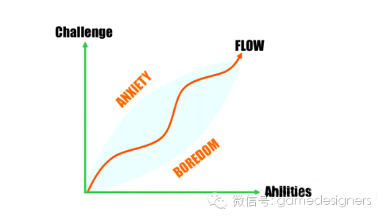

  

传统的心流理论解释了如何通过难度和玩家水平之间的差距控制来产生沉浸感（Engagement）而达到心流。这可以简单地通过数值难度的设计来达到。但我发现有许多
能够良好把握难度的游戏却没有办法成功，因此我一直在思考，这其中是不是还有另外一些因素决定着。最后我发现，一些游戏中过度强调难度、挑战、成就感和欲望，而其他情
感因素往往被人们所忽略。

  

  

**广义的心流**

  

我开始回想我以往看过的一些电影，让我哭过、震撼过的那些电影；一些感动到让我揪心的歌曲；还有落泪的一些游戏。我开始分析它们，到底是什么样的东西让我们感动至落泪
？而另外一些看似剧情相似的电影或游戏，却无法让我落泪。后来我发现一个好莱坞电影剧本编写的法则。这是一个关于如何创造情感宣泄点的三段结构。

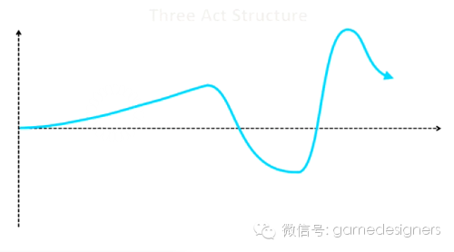

  

  

我发现为什么在一些美国的英雄电影，甚至日本动漫剧情里，主角在成功之前一般都会被虐得很惨。其实这些都是为了营造最后的情感宣泄点所做的铺垫——在达到高潮之前必先
经历低谷。然后我把这个法则放到一些曾经让我痛哭流涕的游戏中。如最初的《仙剑奇侠传》李逍遥在锁妖塔救出赵灵儿之前所经历的各种迷宫和各种难度的挫败，在成功救出后
那种感动流泪的情感宣泄；再如《Bastion》中不断营造的世界崩坏和解谜过程，在最后表现出人性的一面的那一刻的心灵震撼。我发现是如此的适用。

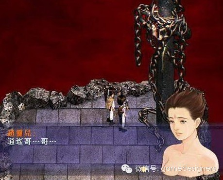

（仙剑）

  

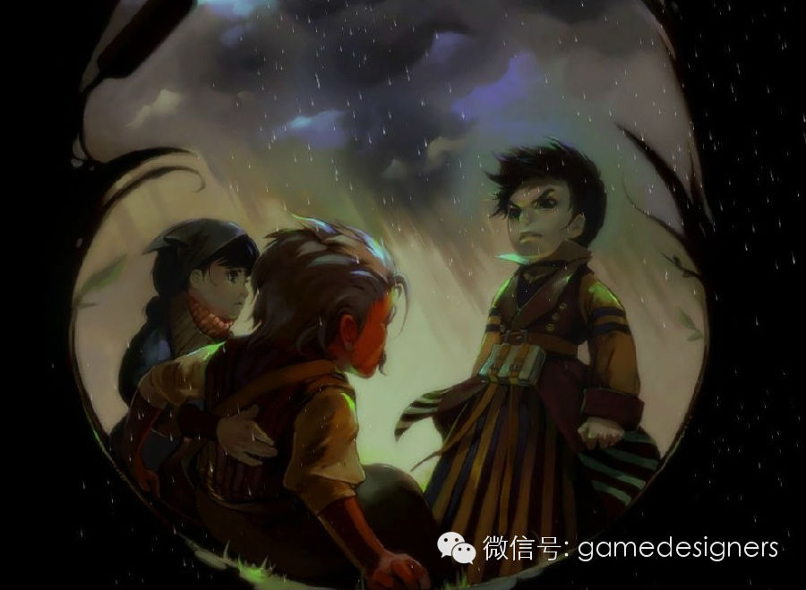

（Bastion）

  

因此我认为心流里面的情感因素不单只有一味追求成就感和欲望，还包含着感动、惊喜、心灵震撼等情绪，他们互相促进，互相弥补。我把这个状态定义为广义的心流。

  

传统心流理论只强调了难度挑战与玩家水平之间的关系，这就像既定的一条规律曲线。然而，玩家越来越意识到，他们为什么要进行这些挑战？他们为什么一定要通过这个关卡？
他们为什么一定要满足游戏既定的一些规则而进行游戏？即便是欲望的趋使而使一个玩家为了通过某一个关卡去付出大量的精力甚至金钱，但这些最后带来的往往是这个玩家的后
悔与不屑。进而久之，玩家们就会越来越提早意识到一个游戏是否故意在坑他们的钱。

玩家们所需要的只是一个理由，一个能让他们持续游戏下去的正面的情感理由。

  

著名游戏《Journey》的制作人陈星汉Jenova在他分享游戏制作过程时提及到，他们的目标很明确，是做一款单纯具有情感高度的游戏。他们想通过多人的体验来促
进情感发展，从而造成心流状态。因此他们修改出了一个多人体验版的心流图。

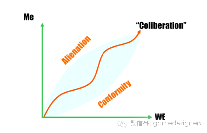

我一位朋友在玩《Journey》的时候给出这样的一个评价：“整个游戏是在一个崩坏后的世界里孤独地进行的，但有一天，当你偶遇了另外一个人，他和你在做同样的事情
。你发现这个旅程中还有其他人跟你一并同行，你默默地走上去看着那个人，心中有一种莫名的亲切，原来你并不孤独。那种惊喜所带来心灵的震撼只可意会不能言传。”这就是
通过长时间的基调铺垫后突然给你一个惊喜所造成的情感宣泄。

  

还有一种是来自于探索未知事物给人带来的敬畏感。人们在看到自己从所未见的新事物的时候会本能性地产生一种敬畏心理，这种情感会让我们的心灵震撼。在我2005年第一
次玩《魔兽世界》的时候，当我第一次骑着蝙蝠骑士飞行跨越银松森林之时，我的心灵震撼了。我从来没有见过这么美丽的游戏，这么美丽的景色。我想我一辈子也无法忘记那时
候的感受。同样，许多人在第一次接触iPhone，那种对美好新事物的尊敬和向往，又何尝不是一样呢？

  

这些种种的元素，无论是欲望追求，感动流泪，还是心灵震撼，还是惊喜若狂，都是产生广义的心流所必须具有的。而今天我发现，这种广义的心流，才是一款游戏成功与否的决
定性因素。并且这种成功没有时间相对性，即便这款游戏成为了历史，也一样受人尊敬。

  

  

  

**基于广义心流论的游戏设计方法**

  

我在国内做移动游戏开发，我听到许多国内其他制作人最经常提及的东西是：游戏类型是什么，关卡有多少个，玩法系统有哪些。我多数时候听听就算了，有的时候我忍不住要问
他们：你们有没有想过你们这些设计的目的是什么？或许他们会回答：“是坑钱！”没错，就是坑钱。玩法系统越多，越能坑钱。游戏做出来，仅仅就是为了坑钱，我觉得这是一
种悲哀。然后我还会问：说了这么多，你们游戏的核心循环是什么？我发现国内许多所谓的制作人，连游戏的核心循环是什么都还没有一个概念，那么这些众多的玩法系统设计也
不知道意义何在。

关于沉浸感的来源，我不知道他们有没有想过玩家凭什么玩他们的游戏，如果玩家不玩，怎么去坑钱。我想这也是国内市场现在盲目强调IP的重要性的原因。他们没有办法自己
给出一个让玩家玩的理由，就只能依赖大家所熟悉的IP去给出这样的理由。比如说三国、火影，这些大家所熟悉的故事，有了这些故事，就有了玩的理由，他们可以轻而易举地
营造沉浸感。

然而，我很清晰的知道，我以前也与他们一样，只知道玩法系统，不懂得核心循环，更别谈什么心流了。今天，我把游戏设计方法分为三种阶段。

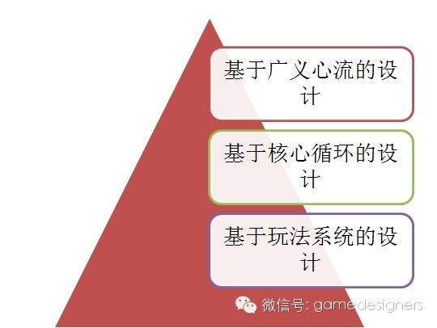

这就像编程语言一样，有低级语言，也有高级语言；从面向过程到面向对象。虽说这些东西各自都有各自的方法论，基于系统的设计方法照样能做出很多很赚钱的“成功”游戏，
无所谓高低之分。但在我目前认为，基于广义心流的设计方法是最优秀的。

  

首先我需要引用一些理论来支撑，并进化至广义心流的设计方法。著名游戏心理学大师Nicole
Lazzaro在多年前曾经有过关于如何产生沉浸感（Engagement）的理论，她认为Deep Engagement=Mind Flow。她总结出产生Dee
pEngagement的4个方面：Novelty（新奇）、Challenge（挑战）、Friendship（玩家互动）、Meaning（意义）。

（Nicole Lazzaro）

  

她认为这4个方面是最容易让人产生情感沉浸的，并且总结出成功游戏都基本具有3个或以上的要素。

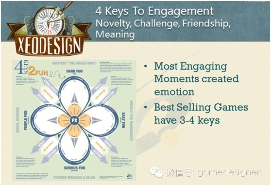

  

然后，她通过与循环设计的方法的结合，给出了一张非常全面的图。图中表示，每一个方面都可以通过循环设计所产生。让玩家在游戏中投入到不同的循环当中，享受4个方面带
来的乐趣。

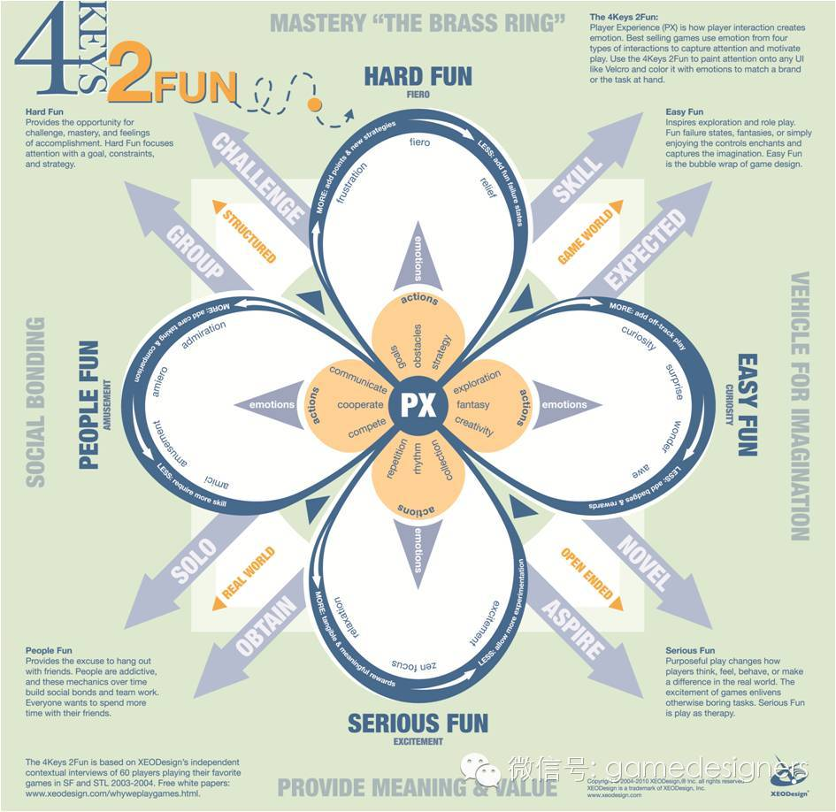

  

这是基于循环设计方法与心理学的结合所得出的理论。但是我认为，Deep Engagement并不意味着能够达到广义层面上的心流状态。如果要让玩家上升到心灵震撼
的层面，这种方法还不够。因此我希望进一步结合营造情感宣泄点的方法来达到所想的效果。

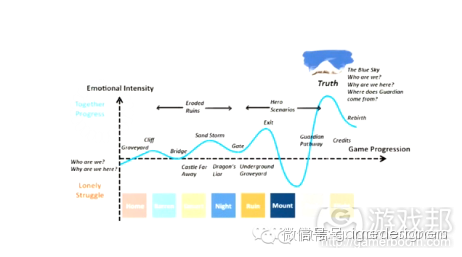

（Journey的情感宣泄图）

  

无数个循环需要遵循着一条情感曲线在进行着。在游戏中你不停地接触世界观、故事发展，你不停地顺着剧情进行游戏，情绪高低起伏。当积累到达一种程度时，达到情感宣泄点
，循环崩溃，心灵震撼。

  

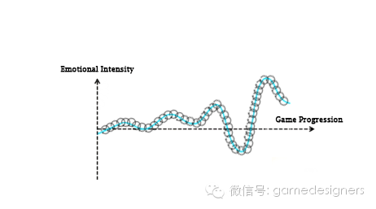

（达到情感宣泄过程中的循环）

  

游戏中一般都会有各种循环，有主线故事的循环，有玩家互动的循环，有探索世界的循环。这些循环互相紧扣，共同营造出一个世界观。然后我们需要以游戏类型的区分，以某一
个循环作为核心循环（RPG游戏通常会是故事），带领引导情感曲线的进行，造成情感宣泄。一个游戏可以有多个情感宣泄点。此外，还需要在各种情感细节点上尽可能营造心
灵震撼，每一个心灵震撼的营造，都应尽可能迎合主要的情感曲线。

  

你会发现，目前国际上公认的成功的游戏，都会具有1个主要的情感宣泄点和多个细节层面的心灵震撼点。《Bastion》，《Journey》，《The Last
of Us》，《The Second Son》等等。这种以多种细节心灵震撼烘托出一个主要情感宣泄的设计方法，我称之为基于广义心流的设计方法。

  

  

**方法的执行**

****

或许很多人会觉得这太虚无飘渺，真正开发起来难以执行。我觉得这其实是一种思维方式的转变。过去人们的游戏设计方法，或基于系统，、或基于循环，都能做出不错的游戏，
但这是一种思维定式，反过来限制着一个制作团队的发展。我这里斗胆提出一种新的思维方式和开发顺序模式，希望以后自己，或者其他人能够尝试执行。

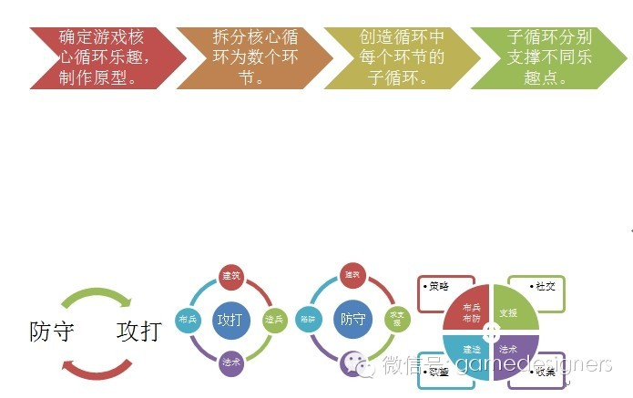

（以往的循环设计方法，以及Clash of Clans的循环设计）

  

在过去的开发过程中，人们一般会先确定一个世界观和Prototype（原型），确定游戏的一个核心循环（Core
Loop），然后测试它是否可行和具有乐趣。这是最初由Mark Cerny前辈提出原型开发理论。他认为，确定一个具有乐趣的核心循环，然后再将其扩展，添加其他细
节乐趣点，或其他子循环，最终形成一个庞大的游戏体系。如果核心循环都不足以有乐趣，则放弃这个原型重新设计。

  

这个方法以循环为核心，开发游戏就是创造出不同的乐趣循环。然而，这显然没法满足广义心流和情感宣泄的形成。所以我尝试以营造心流和情感宣泄为核心指导，来创造一款可
以震撼人心的游戏。

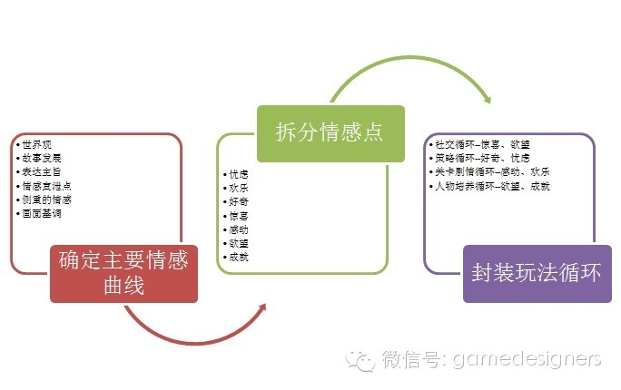

  

（广义心流设计流程以及循环在游戏过程中充当的地位）

  

我们会发现，以这种方式创造的游戏，一切玩法的形式设计都是多么的次要（不代表不重要），它们只是一些为了达到心流状态的一些手段，而更重要的是对整个情感曲线的把握
和情感宣泄点的定位，并且按照曲线在对应的游戏进程给予适当的玩法侧重和难度控制。这当中的循环设计，只是连成这条曲线的无数个点。当然，此外还有不同其他心灵震撼的
共同烘托。

  

  

  

**我们到底想要什么？**

  

当北京正在开着GMGC行业大会，宣扬各种大公司高大形象和行业发展的同时，我在美国洛杉矶与不同的游戏人交流着。有人曾经说过，国内的游戏公司就像穿着“皇帝的新衣
”，以各种高收入来掩盖自己游戏在与国际平均水平的差距有多大。其实我早已不关注关内的这种大会。实际情况是，每次到美国我都会发现他们行业以往积累的东西实在是太多
，各种开发技巧书籍、心理学理论、市场经验等；而在国内，你基本不可能找到这些东西。国内的所谓的“优秀”游戏走出国门后，至今仍没有在国际上得到大幅度认可的任何一
款产品。

  

通过这段时间的积累后，我得出了这样的一套理论。然而，我反过来在问自己，我到底想要什么？我们到底想要什么？

看着国内目前这样的市场环境，再看看美国那些出色的游戏，这样的鲜明对比，我不由得不停地反问内心深处的自己：“你到底为了什么而做游戏？”

每个人做游戏的初衷都不一样。大部分人因为觉得赚钱，这是商业；一部分人想要自己的设计得到国际的承认；一些人为了让其他人从游戏中获得乐趣、感动、反思；极少数人为
了改变世界。而我，到底是哪一部分人？

已经有好几个朋友曾经问我：“为什么你不选择在美国做游戏。”其实面对这个问题，我真的无言以对。虽说在美国做游戏也不见得一定比国内好很多，但我的确后悔了。我后悔
过去自己没沉下心来，而是冲动地做出了选择。但是既然做出了选择，就要为选择负责到底。我曾经立志要做出与他人不一样的游戏，以其他的形式去给予玩家乐趣和收获。在我
们的作品Bumpy Legend中也正努力尝试实现以故事剧情打动玩家心灵，创造心流的模式。我知道这条路还有很长的时间需要走，但这种想法在国内却一直面对着那些
诸如“为什么你们做的跟别人的不一样”的质疑，对创新的质疑，而不是支持。

其实我很清楚我自己想要的是什么，只是在国内这种环境，我没有勇气说出那样的话；即便说出来也不会有人相信，那还不如不说罢了。

我想每个热爱游戏的人，不论是国内人还是外国人都一样，都曾经有一颗那样的心。只是绝大多数人放弃了，少数人坚持着，个别人成功了。无论如何，我们都必须坚持一种理念
，只要这种理念不死，我们还有希望。

最后，送上一张我们的作品Bumpy Legend的截图。

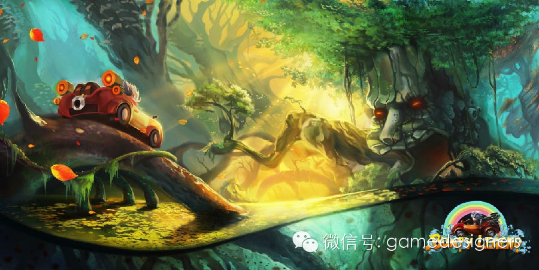

  

By 独立游戏制作人，Gamewings Studio 创始人

张翰荣

（转载请联系E-mail:vision@gamewings-studio.com）

  

  

**关注《游戏开发者日志》微信公众帐号，获取由开发者分享的游戏设计、开发、市场方面经验。（转载请注明：转自《游戏开发者日志》，作者信息。）**

**关注方法：**

**1.点击右上按钮—> 查看公众帐号—> 点击关注。**

**2.添加朋友—> 搜号码—> 微信号：gamedesigners**

  
  

[阅读原文](http://mp.weixin.qq.com/s?__biz=MjM5MDg3MjA2NA==&mid=200138614&idx=1&sn
=1c2b52848128730bebc5d7e237c30446&scene=1#rd)

