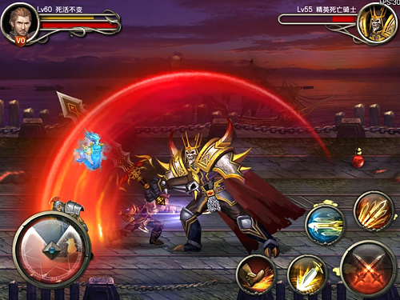
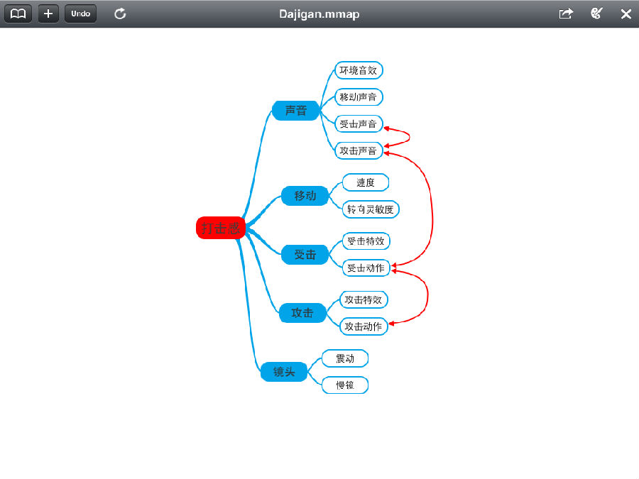

**浅析动作游戏的打击感设计**

****

作者：张翰荣（Gamewings Studio创始人）

  

  

我想许多人对动作游戏并不陌生。动作类作为一个大的游戏分类，最早源生于日本。我想80后们都非常熟悉，当我们年幼的时候在游戏机房，那些街机上的格斗游戏、横版过关
游戏，均可以归为动作游戏。经过多年的演变，游戏行业的日益成熟，人们把动作类跟许多其他类型的游戏结合到一起造成复合式创新。最经典的则是暴雪公司的《暗黑破坏神》
系列，被称作ARPG（动作角色扮演）的开山之作。今日，许多游戏已经无法脱离动作游戏的基本元素，即操控与打击。

现在的动作类游戏一般可以细分为以下3个大类：

1.格斗类（代表作：拳皇系列、街霸系列等）

2.横版通关类（代表作：街机三国、DNF等）

3.角色扮演类（代表作：暗黑破坏神系列、怪物猎人等）

  

动作游戏之所以是“动作”游戏，是因为它们以逼真的角色动画、华丽的战斗效果而组成，其永恒不变的主题，就是打击感。

  

**何为打击感？**

****

狭义的打击感，是特指角色攻击命中敌人时候系统所作出的一系列反应；广义的打击感，则包含角色移动、攻击动作、受击动作、特效等的全套设计。

在游戏过程中会高频率性地重复攻击与被攻击的逻辑，因此，打击感是动作游戏的生命，是直接区分游戏好坏的指标。

  

**如何制作打击感？**

****

正式介绍如何制作打击感之前，笔者想先引一个例子。因为本人现在是做移动游戏的，就拿蓝港在线的《王者之剑》来分析一下吧。《王者之剑》作为王峰宣布蓝港转型移动游戏
的头号产品，是一款2D横版通关类的动作游戏。

  

不知道各位如果玩过该款游戏，感觉如何呢？笔者当初玩了30分钟后，就直接删除游戏了，因为该游戏给本人的总体感觉是：在打击感上总感觉缺了点什么。不知道大家是否有
与我同感，又或许本人对动作游戏的要求太高。

到底缺了些什么？首先，笔者先把打击感分解为各个元素，然后再把各个元素拆解成几个内容，好让大家清晰了解打击感的详细组成。

  

从图片中可以看出，打击感主要以声音、移动、受击、攻击、镜头等5大元素组成，每个元素均可细分为2到4个内容。这几个元素中，攻击、受击是重点。红色线条代表攻击受
击中个元素的协调关系。

华丽的攻击动作与特效，各种爽快的受击效果，现在大多数动作游戏都有。但是大家都做到了，为什么有些游戏总让人感觉缺少点什么呢？笔者在这里给大家重点介绍一个图片中
无法表达的，却是重中之重的概念——关键帧与定帧。

**关键帧**

关键帧是指在动作设计的过程中，人为制作的那一部分帧。除了关键帧以外的其他帧的动画，都是可以通过软件直接生成的。因此，关键帧的密集程度，决定着动作的逼真度。

_“动作游戏为了表现良好的手感，一般关键帧会做的相当密集，不会像普通游戏，一个动作就做几个关键帧，中间帧都是自动补间。动作游戏每个关键帧极限不超过6__帧，
就是0.1__秒。我们一般都在3__帧左右。而且大部分动作特别是攻击动作没有中间补帧，是直接跳帧的。从动画曲线来说，一般都是曲线型骨骼动画，而动作游戏很多是
矩形曲线。”——腾讯琳琅天上工作室《炫斗之王》制作人赵睿。_

**定帧**

定帧是指，在一方攻击动作期间，判定对方受击逻辑后，短时间内采取动画帧锁定的技术。定帧的时间非常短，通常不会超过0.1秒，以60FPS为例，则不会超过6帧，所
以人的肉眼无法分辨，但却带有手感。不知道大家在玩一些经典的日本格斗游戏时，如拳皇，是否有感觉到，某些技能打上去后，画面的顿挫感？这就是定帧。这种顿挫感会让玩
家感觉到，每一招一式打上去的时候的那种爽快。所以，一个动作游戏的好坏，要看他们的定帧是否做到了位。《王者之剑》缺少之处正在此。

  

**如何运用定帧**

****

光了解定帧还不够，要做到运用恰当，需要进行反复的调试。在什么时候采取定帧？定多少个帧？这是一个难题。

笔者再举个例子——拳皇游戏中八神的“鬼烧”技能。在这个技能当中，设定了3个攻击阶段：

第一阶段为蹲下至起身；

第二阶段为起身至起跳，出现火焰；

第三阶段为起跳至跳到天上，整体特效出现。

  

在这三个阶段中，每个阶段都作攻击判定，3下全打中为3Hit。因为格斗游戏的情况复杂，所以会出现只中1下或者2下的情况，那么这个时候就需要给不同的阶段分配不同
的定帧数。一般来说这种情况，会分配2,2,3或者3,3,5。所以，单单这一个不到1秒钟的技能释放过程，却需要做3个阶段的攻击判定，并且分别调试每一次的定帧。
而且，实际上，拳皇除了定帧还采取了整体慢镜与之相配合，当“鬼烧”三下全中的时候，将会进入慢镜效果，给玩家一种重击感的感受。

在3D游戏当中，可以对整个骨骼动画的帧进行检测，在判定在不同帧击中时给予不同的定帧效果。

  

**镜头特效**

****

镜头特效，也称摄像机特效。在动作游戏中，镜头震动、慢镜被运用得很多。

镜头震动一般会被运用在某些类似重击或者暴击的情况下，让玩家在视觉上有更丰富的体验；而慢镜则会用在Boss击杀，大招施放等情况下。但这些都只是视觉上的体验，不
能改变实体手感。所以镜头特效在动作游戏中只是辅助角色，是锦上添花的东西。

然而，有一种镜头特效目前国内游戏运用仍较少，笔者却认为比起震动和慢镜要重要得多。这就是附在摄像机上的贴图。

在著名游戏Guild Wars 2（中文名：激战2）中，当玩家角色生命值过低的时候，屏幕周围会加上半透明的暗红色血迹纹理的贴图。这种贴图有什么用呢？从视觉效
果上看，他让玩家的视觉呈“漏斗状”；从神经学层面上分析，这种“漏斗状”的视觉会造成神经绷紧，精神紧张的结果。GW2非常巧妙地运用了这个手法，提醒玩家，你将面
临死亡。这个时候将玩家的神经紧张度推到了一个极大值，如果玩家最终死亡，将会获得挫败感；若玩家成功逃过一劫，则有明显的成就感。挫败感与成就感，是游戏设计中的重
点话题，本文不予讨论。

  

  

**后话**

****

文章到了这里，我想大家已经对如何做好打击感有了较为粗浅的了解。打击感是一个看似很简单，但要做好却难过登天的很玄的概念。好的打击感，能让玩家感觉即使只是一直不
停地砍怪，也会很爽；一般或者不好的打击感，会让人很快玩腻。

当今国产游戏上打击感做得比较好的，除了腾讯的《炫斗之王》和蜗牛的《九阴真经》外，还数北京灵游坊的《雨血》系列。而在国外，在不远的韩国，DNF，龙之谷，剑灵等
等游戏的打击感已是大多游戏设计师学习的对象；日本则更不用说，格斗游戏的鼻祖国家。

  

本人是做移动游戏的，虽然移动游戏是一个新兴的细分行业，但不得不说，许多做移动游戏的公司连最基本的常识都不懂，就想着大赚一笔。去年《雨血前传》上市后，许多核心
玩家大为赞好，而梁其伟说：“我们只是做了一款比较有常识的游戏罢了。”

虽然说《王者之剑》在商业模式上做得比较到位，赚了不少钱，但是单从游戏设计的角度出发的话，还完全不够班。

本人希望，在不久的将来，国产游戏真正能具备国际水准，能够走出到国外，真正能让后人所记载。

  

**关注《游戏开发者日志》微信公众帐号，获取由开发者分享的游戏设计、开发、市场方面经验。（转载请注明：转自《游戏开发者日志》，作者信息。）**

**关注方法：**

**1.点击右上按钮—> 查看公众帐号—> 点击关注。**

**2.添加朋友—> 搜号码—> 微信号：gamedesigners**

  

[阅读原文](http://mp.weixin.qq.com/mp/appmsg/show?__biz=MjM5MDg3MjA2NA==&appmsgid=
10000008&itemidx=1&sign=7de435d9dae239fc5e2b0dd4465aafac&scene=0#wechat_redire
ct)

