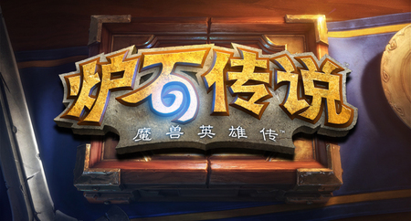
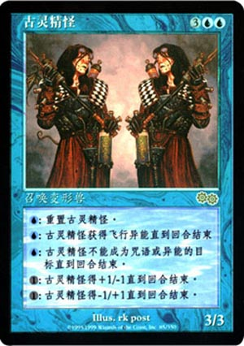
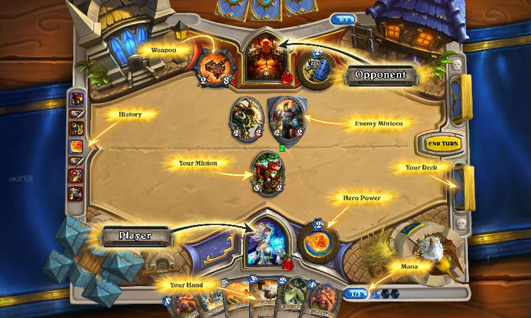

**浅析真正的卡牌游戏设计策略**

  

作者：张翰荣（Gamewings Studio创始人）

  

  

什么是卡牌游戏？《我叫MT》、《名将无双》、《刀塔英雄》——目前国内移动游戏媒体清一色把这三者的类型定义为卡牌游戏。这些移动游戏媒体毕竟“太年轻”而“缺乏常
识”，以为以卡牌形式体现的游戏就是卡牌游戏，笔者以为不然。目前国内这些都是披着卡牌游戏的外皮数值游戏。姑且称它们为“伪卡牌”游戏。

  

真正的卡牌游戏是桌面游戏的一种，是一种古老的游戏类型。而随着游戏的发展，这些桌面游戏逐渐向家用主机和PC市场移植，而被归纳为SLG（Simulation
Games 模拟游戏，又称策略游戏）的一种。真正的卡牌游戏通常以TCG（Trading Card Games
集换式卡牌游戏）的形式出现，最早开拓者是1993年美国公司Wizards of the Coast的Magic the Gathering，即《万智牌》。后
来又出现了许多学习万智牌的TCG，例如著名的《游戏王》，《魔兽世界》，《Pokemon》等。后来，《万智牌》相继推出了Xbox版和PC网络对战版，近年又推出
了iOS版。而《魔兽世界》目前正在CBT阶段的是《炉石传说》。

  

近日，由于颇具影响力的暴雪游戏公司宣布的《炉石传说》正式开启北美CBT，引起了移动游戏界的轰动。各种人都在各种讨论着这种真正意义上的卡牌游戏，相比国内市场上
的“伪卡牌”有着什么样的不同。

  

这些真正的卡牌游戏设计有着各种特点，这些特点都是SLG类游戏中的经典。笔者本文中着重给各位介绍这些真正的卡牌游戏的设计。

  

  

**策略性设计**

  

卡牌游戏的第一大设计特点就是其策略性。策略性在卡牌游戏中体现得淋漓尽致，它不但要求玩家在游戏对战的过程中富有策略性，还要求在游戏以外的时间同样富有策略性。从
游戏设计的角度上看，可以说是“既严谨又开放”。著名游戏Clash of Clans就是运用了这种特点而获得了成功。策略性设计主要可以由以下3方面入手。

  

**1\. ****游戏规则**

  

卡牌游戏都有一套非常严谨的规则设定，它会告诉你，游戏的目标是什么，可以有哪些途径实现，实现过程中需要遵循哪一些游戏规则。

  

拿TCG开山之作《万智牌》为例。《万智牌》的目标很明确，就是要“赢得比赛”。而根据游戏形式，赢的途径有多种，比如说将对手的生命值打至0点，或者将对手身上的侵
染指示物堆叠至10个等等。无论是二人游戏还是多人游戏，它都给玩家设立了一个非常明确的目标。

  

而在游戏规则上，它要求游戏以回合制的形式进行。卡牌的类型分为生物、法术、瞬间、结界、地、神器、旅法师等等，每一种类型的卡牌均有自己的独特作用。每个回合的游戏
过程又分为维持、摸牌、行动一、战斗、行动二、回合结束等阶段，战斗阶段中又细分为宣布攻击、宣布阻挡、结算三个阶段。规则上明确规定，哪些卡牌在什么时候可以使用，
比如说，瞬间牌可以在任何时刻使用，而其他卡牌只能在行动阶段召唤。在场上的卡牌，又具有不同的异能，异能又分为常驻异能、触发式异能和启动式异能。另外，还有很经典
的结算堆叠顺序的规则说明。总之，笔者玩《万智牌》15年有余，看着这款TCG的不断发展与丰富，今天的规则估计可以写成一本十几页的小手册了。所以在这里就不详细介
绍了。

  

游戏规则的设计是卡牌游戏中的重中之重，一定要严谨。就好比如建大楼打地基，地基不稳后患无穷。

  

  

**2\. ****牌组构建与卡牌组合**

  

卡牌游戏都具有一种让玩家在非游戏时间也能尽情享受其策略性的部分，这部分就是牌组的构建。牌组即是玩家进行游戏时用到的对战牌组，可以由玩家自由搭配组合来产生不同
的效果。在《万智牌》中，不同卡牌之间通常有着非常紧密的联系，某些卡牌组合起来可以形成非常强大的效应。所以，玩家在构建牌组的时候，通常会考虑的事情就是卡牌之间
的互相配合问题。这也是卡牌游戏策略性设计中的关键所在。

  

游戏设计师在设计卡牌的过程中必须要谨慎地考虑平衡性问题，因为稍有差池，就会出现某些卡牌组合过于强大的局面。《万智牌》中曾经出现过，只要通过2-3张卡牌的组合
使用，就能直接让游戏胜利。这种情况导致所有玩家都会去追求这种卡牌组合，而游戏过程变得赌博运气的过程，变得毫无意思。所以，《万智牌》的设计师们同时设定了“禁牌
表”的规则，禁止某些卡牌在比赛上的使用，来弥补一旦出现的这种情况。

  

牌组构建对玩家来说是一大策略性玩法，但对设计师来说也是很大的挑战。这让卡牌游戏的设计师们在规则严谨的前提下，认真地考虑每一张卡牌的功能设定，不能随心所欲地发
挥。《万智牌》每年只会更新2到3个卡牌库，每个卡牌库的卡牌数量由120张到330张不等，其在卡牌组合方面的设计是行业的标杆，而《游戏王》和《魔兽世界》则相对
较弱。

  

  

**3\. ****随机性设计**

**  **

随机性是许多种类的游戏设计中都会用到的技巧，也就是通过对游戏中出现不同情况的概率把控，让玩家游戏过程中更富有乐趣。而多数卡牌游戏中的随机性是在有限范围内的“
非重置性随机”。玩家通过自己组合的牌组进行游戏，每摸一张牌，剩余的牌数量就减少一张，摸到某张特定的牌的概率就会增大。

这种随机性规则的设计让游戏每一次进行的情况都不相同，在最大化技巧的情况下又讲究运气。大师级的《万智牌》玩家，在牌组构建时会仔细考虑每一张关键牌的出现概率，而
确定这些牌的数量。

作为游戏设计师，这种随机性设计很关键。如果随机性过强，则游戏的运气成分过高，反之则技巧成分过高，都会让一部分玩家失去游戏的乐趣。《万智牌》中规定，根据不同赛
制中卡组最低数量不能低于40张和60张，而同一张卡牌最多只能加入4张。这绝对不是设计师们随意设定的，而是经过反复的概率运算的。

  

这三大因素整体构成了一款卡牌游戏的策略性。策略性设计是是所有SLG设计中的重点，相比其他游戏类型来说，它们更要求设计师们在“智商”上更胜一筹。

卡牌游戏通过定下一套基础的规则来体现严谨性，然后提供一个大数量级的牌库来提供玩家自由组合自己的卡组来体现开放性，是“严谨又开放”的设计精髓。再外加合理的随机
性设计，一款经典的卡牌游戏就此诞生了。

  

  

  

**集换式设计**

**  **

真正的卡牌游戏中设计的另外一大特点，就是其集换式设计。所谓集换式，是指“收集”与“交换”。玩家可以在游戏以外的过程中，与其他玩家交换卡牌。一般来说，一位玩家
确定了自己的牌组的偏向后，就会开始用自己不需要的卡牌，去跟其他玩家兑换成自己需要的卡牌。因此，每张牌都会有自己的“身价”，某些卡牌非常稀有，而游戏中的作用又
是巨大的，这些卡牌的“身价”就会特别高。这也是《万智牌》，《游戏王》等卡牌游戏的一大特色。

  

笔者主要介绍《万智牌》中是如何利用集换式的概念来设计的。

《万智牌》游戏中，卡牌的稀有度分为4个等级，即普通、银卡、金卡、秘稀卡。官方在市场上售卖的补充包中，每包具有15张卡，其中只有1张金卡，3张银卡，其余为普通
卡。而秘稀卡则是特殊的金卡，只有1/10的金卡会是秘稀卡。另外，还有百分之一的几率会出现闪卡。补充包中15张卡是纯随机的，每包售价约为25元人民币。每张牌都
有来自不同国家画家的绘画，都具有收藏价值。

如此一来，每张卡都会有自己在流通货币中的价格，特别是金卡。所谓“物以稀为贵”，一些好的金卡，价格会去到几百元人民币，甚至一些历史悠久的金卡，会具有五位数的身
价。

  

玩家在游戏中的两大永恒不变的需求就是“收集爱好”和“交易爱好”。而集换式设计恰恰满足了玩家这方面的需求。在《万智牌》游戏中，除了一般牌手之外还会有两类玩家，
一种是“收集者”，喜欢收集各式各样画风各异的卡牌；另外一种就是“商人”，他们通过“倒买倒卖”的方式来赚取差价，一些卡牌具有升值潜力的，他们都会以低价购买，然
后待一定高价后倾囊出售。

  

这种集换式设计的目的，就是增加玩家的粘性与活跃度。所有玩集换式卡牌的玩家，都无法避免多多少少地爱上了收集与交换的过程，这样整个游戏就如一个“生态圈”，而不是
单纯的一款对战游戏。

  

**循环设计**

**  **

循环设计是游戏中的一大学问，简单地说，即玩家每天都在做什么？

跟《我叫MT》那种重复刷副本的“伪卡牌”游戏不同，真正的卡牌游戏的循环设计就是“对战”。重复的对战不会很无聊吗？即使是随机性、策略性再强的游戏也会有尽头。那
么这些经典的卡牌游戏到底是如何能坚持这么长的生命周期呢？

  

**1\. ****挖掘多种游戏形式**

  

在《万智牌》游戏中，除了一般卡组对战的形式，官方还举办了不同形式的比赛，向玩家介绍不同的游戏形式。比如“轮抽模式”：玩家通过每人购买3包补充包，坐成一圈，每
人先从自己打开的每一包中选一张卡供自己使用，然后传给下一位玩家选取，直到每人的3包均被选完。然后玩家通过自己选取的卡牌中组成一套40张卡的卡组来进行对战。这
种模式区别于一般对战模式，更讲究每位玩家在完全随机的情况下的应对能力。一些高手，通过每一次选卡，能够逻辑紧密地组成一套较有偏向性的牌组，而菜鸟则会组得乱七八
糟。

另外，还有最近很热门的“裁判模式”，以及跟三国杀结合的“身份模式”等等，每一种游戏形式都会带来无穷无尽的新乐趣。

  

**2\. ****出版新的牌库**

  

官方通过每年更新牌库的形式，让玩家有新的追求。新的牌库能同时会带来新的规则和游戏模式，这对玩家来说无疑是一种新的挑战。

《万智牌》中官方每年会更新2-3个牌库，其中有些新的规则的牌如“侵染”、“循环”等等都会让游戏玩法增添更多的色彩。

  

**3\. ****赛制制定**

**  **

所有游戏的循环机制都会面临的一个巨大的问题，就是新手玩家的加入难以发展。卡牌游戏也是一样，具有非常强的积累机制。卡牌游戏的积累体现在对战经验的积累和每位玩家
卡牌数量的积累。以《万智牌》为例，该卡牌游戏已经有20年历史，出版的卡牌种类数量已经在6位数量级。作为一些老玩家，他们积累了非常多的卡牌，而这些卡牌在后续年
份已经没有发行，即绝版。新玩家无法获得这些老卡牌，而偏偏很多老卡牌非常强大。

  

因此，官方通过设立不同的赛制来解决新老玩家的问题：

T2赛制，也称为Standard赛制，只用最近2年内发行的卡牌库作为对战卡牌。随着时间的推移，T2赛制的牌库也在不断更新换代，令新手玩家能有足够的发挥空间。

T1赛制，也称为Legacy赛制，比起T2赛制来说年份范围更广，更新换代较慢，提供一些有丰富积累的老玩家对战。

T0赛制，也称为无限制赛制，即所有年份的卡牌都能够使用（禁牌除外）。

  

  

**总结**

  

近期来由于暴雪公司《炉石传说》的CBT开启，引起了许多玩家的关注。暴雪娱乐作为全球数一数二的品牌游戏公司，制作的游戏遵循着自有的原则和理念，被广大玩家所热爱
。比起目前国内市场上清一色的“伪卡牌”游戏，这款《炉石传说》可以说得上是一款真正的卡牌类网游，但比起传统的《万智牌》来说还是稍逊一筹。

值得注意的是，独立游戏Minecraft开发商Mojang早一段时间已经推出了一款《Scrolls》的战棋与卡牌复合式创新游戏，在业界内反馈也非常不错。商业
游戏代表暴雪公司与独立游戏代表的Mojang再次展开了一次角逐。

然而，《万智牌》开发商Wizards of the Coast经过20年的积累，近两年也开始试水iOS市场。《万智牌》在全世界拥有超过600万的线下游戏玩家
和200万的PC网游玩家，并且，这些玩家都是“高富帅”（因为万智牌玩家的消费远远高于一般网游）。《魔兽世界TGC》曾经的首席设计师正是来自万智牌的团队。

究竟在移动游戏领域，谁才会是真正的卡牌游戏的王者？国内清一色的“伪卡牌”游戏，品质上可以说完全无法跟国外公司的产品比美，到底还有多少生存空间？中国开发者这种
借题发挥急功近利的做法，到底还能持续多久？值得深思。

  

[阅读原文](http://mp.weixin.qq.com/mp/appmsg/show?__biz=MjM5MDg3MjA2NA==&appmsgid=
10000014&itemidx=1&sign=d85436e50b286c28d0fcd3b77e32d449&scene=0#wechat_redire
ct)

