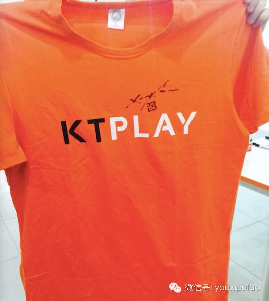

  

“我觉得很多我们过来的人，人生中会有一个转折，但凡从转折中坚持过来的人，往往都是走过最黑暗的部分，也只有走过最黑暗部分的人，最后才可以看到最光明的部分”。

  

在5月25日星期日，游戏葡萄和友盟、KTplay、动点科技联合举办了KTplay游戏坊，有幸邀请到了著名的华人游戏设计师陈星汉进行了了主题为《陈星汉的游戏旅
途》的游戏开发历程、心得分享讲座。

  

今天的第二篇文章将为你讲述陈星汉制作《journey》、《花》的历程。以下是葡萄君对现场提问的记录。

  

**提问：我就想问一下，您做这个游戏（《journey》）的时候，应该有特别痛苦和黑暗的时候，比如一开始有一个想法，但是可能随着时间流逝，觉得这个想法没有以前那么有意思了，你可能会觉得特别痛苦，想放弃，但是是什么支持你把游戏做完的?**  

  

陈星汉：比如那个爬山的关卡，我半夜一点钟调关卡，一步一蹒跚，爬几步你倒下了，我调了三四十遍，就是调你走多远倒下。那时候我自己一边玩一边哭，为什么？我就觉得这
个游戏跟我开发游戏的过程是很相似的，因为游戏开发一开始都是可能的，觉得一切都美好，直到中途某个阶段你发现，好象时间来不及了，不可能做出这样的游戏，或者发现一
开始相信正确的东西其实不行了，就是有一个转折。转折以后，有各种各样的问题你要克服，真的是很惨，我觉得每个游戏到最后开始发行之前，都特别辛苦，有各种各样的问题
。因为开发时间长，你也失去一种自我感觉，你也不知道到底好还是不好，你只是在做这件事。

  

为什么觉得这个游戏能够打动人呢？因为我觉得很多我们过来的人，人生中会有一个转折，这个转折它其实有可能是一个人和一个人的关系情感的转折，可能是女朋友，也可能是
你工作事业的转折。但凡从转折中坚持过来的人，往往都是走过最黑暗的部分，也只有走过最黑暗部分的人，最后才可以看到最光明的部分。所以我觉得你如果现在有挣扎，这是
件好事，因为当你把游戏做出来的时候，这个故事非常值得告诉别人，如果一切都太顺利了，我不相信这个游戏是好游戏，所以当出现这样的问题的时候，你只有相信自己继续往
前进。

  

因为我们开发游戏都是想做一些从来没有人做过的游戏，其实很多时候都不知道这个游戏能不能行，或者不知道将来怎么走，但是最关键的是你要记住你当初做这个游戏是为了什
么，如果你当初的决定不是很明确，可能一开始做一个冒险游戏，后来变成策略游戏，后来又变成什么游戏，这时候如果你忘记初衷的话，你是在黑暗里面的，你只要记住它了，
再困难的东西都不会难住你的。

  

**提问：我想问一下刚才情感曲线是怎么设定出来的，还有测试人员测试的时候，你们是怎么测试的？**

  

陈星汉：情感曲线是按照好莱坞三段式设计的，如果你从网络上找一下好莱坞三段式，会有很多东西可以参考。我们基本上是一开始高潮，第二段必须要有低谷。至于如何测试情
感，我们一般是靠自己玩；如果自己玩太多，已经失去感觉的时候，靠请一些专门来做测试的人。你通过摄像机或者远处观察他的表情和投入程度。比如一个人如果很放松的玩，
这和很紧张的玩的时候状态是明显不同的。他如果真的被游戏打动了，眼睛会湿润，这些都可以通过观察看出来。

  

**提问：我们知道传统的游戏主要是主机游戏，现在的游戏主要是一些手机游戏，手机游戏玩家的集中力、注意力都弱很多，玩的时间也少很多，而且游戏是触摸为主的，通过玩这些手机游戏长大的设计师，在未来会不会和我们这一代打主机游戏设计师做出来的产品是不一样的？**

**  
**

陈星汉：的确会不一样。因为手机游戏更容易上手，手机平台上将来的游戏其实会更加全民一些，而且可能内容会更加丰富。虽然很多玩家在bus和厕所里玩移动游戏，但周末
我也会躺在床上玩。我觉得将来的手机市场是更加多元化的市场。

  

**提问：我玩了您的《Journey》游戏，就从服务器程序员转向游戏程序员了。您说到在玩游戏的时候，游戏需要带动情感，而情感需要兼顾游戏，你是怎么做的？**

  

陈星汉：因为我之前讲过，我觉得游戏是一个娱乐媒体，娱乐媒体最终它的目标是给观众一个很强烈的情感冲击，我个人认为，如果能够用越是短的时间，越是高的效率，传达这
种情感的话，同样一个游戏，如果三十分钟就可以感觉到这个情感，我是不愿意花两个小时玩的，我也是觉得为什么主机游戏现在失去了市场，因为成年人没那么多时间了。年轻
人玩游戏的时候会觉得我希望打发时间，游戏越长越有好，而成年人却不同。所以我在游戏设计的时候，会优先情感，同时游戏性也要完美。游戏性的话在过去观念里面是一定要
好玩，一定要上瘾，我觉得在未来不是这样。

  

**提问：因为我自己也做手机游戏，现在也挺无奈的。我想从手机游戏回到核心项目游戏，因为觉得现在的手机游戏就不是游戏。你也会觉得无奈吗？**

  

陈星汉：我是做主机游戏，看到那些手机游戏公司赚了很多钱，好象国内哪家公司很赚钱，居然有人给我写信说要买我的公司，我当时觉得特别丢脸。我也是挺愤怒的，有段时间
我有觉得世界怎么那么不公平，但是其实我还是会自我安慰的。为什么突然间这些做得很垃圾的手游公司突然赚那么多钱呢，最主要的原因是因为突然间全世界出现的二十亿台移
动设备，那都是游戏机，可是这二十亿台游戏设备的观众只有三亿可能是玩家，那其他多出来90%的观众，他们可能会成为玩家，但是他们根本没办法玩传统游戏，只能玩这些
非常简单的游戏。

  

手机游戏其实是服务了比我们传统游戏更大的市场，因为他们服务的群体非常大，所以他们赚的钱也很多。短期内这对我的价值观冲击是很大的，但是长期来看这是好事，他们为
我们做了很大的贡献，为什么？很多不玩游戏的人现在愿意打游戏了，所以我们只要把游戏做好，将来我们的市场也会很大，这只是是早点见到钱还是晚点见到钱的问题。

  

**提问：我是一个导演，其实我更明白你刚才说的情感，同时我也是做游戏的，曾经做过门外汉，参加过微软的游戏大赛，也拿了一个比较小的奖。我想问的问题是，因为刚才你有提到做《花》的时候，想象到在花中徜徉的感觉，而现在可以用VR来做这种游戏了，您对VR这种技术有什么看法呢？**

  

陈星汉：如果不缺钱的话，我建议你尝试VR，因为这个东西在将来三五年会成为很流行的东西，如果你短期内希望通过游戏谋生，VR市场会非常小，它的市场不足以你养活一
家公司。Oculus有找我谈能不能让我们的公司给他们开发VR游戏，我算了一下时间，我们公司如果给他们开发，是没办法收回成本的。

  

**提问：您觉得facebook会不会做一个虚拟世界里的社交交流？**

  

陈星汉：现在最大的挑战是，第一，他们还没有解决很多技术上的问题。第二，他们开发的游戏在VR里看上去很真实的感觉，需要两个屏幕以60帧/秒或者120帧/秒去渲
染，如果真正做到非常虚拟现实的环境，普通人的电脑是没法运行这样游戏的，需要很强大的PC。当然，虽然VR的观众虽然是小众的，但是三到五年之后会有很大的转变。

  

**提问：您有没有想过跟现实互动做尝试呢，一个游戏不局限在虚拟世界里，而是更多跟现实世界互动？**

**  
**

陈星汉：跟现实互动的游戏，其实运用到数字的部分非常少，我觉得在将来，现在有一些设备是透明的，所以你可以看到事实，在现实上再加一层虚拟，我觉得这样的设备可能在
未来五到十年会很成熟，包括谷歌眼镜就是这样的设备，我觉得这样的游戏在未来会更有意思。

  

**提问：我是在国内自己做一家手游公司，我们也很认同老师关于情感方面的设计理念，但是我们做的时候发现一些问题，比如第一个问题是反馈的问题，现在不管是手游包括好莱坞电影，节奏是非常快的，就要求这个游戏给玩家反馈要更加快，玩家可能都懒得看对话，因为没有给他反馈。在反馈要求非常快的情况下怎么做情感，比如你需要让一个九岁男孩感觉到在海边的感觉，这可能需要很长的铺垫才可以实现。第二，不管是电影也好还是游戏也好，都是基于副本，因为开发商一定要想办法让玩家付钱，通常的办法就是让你不好受，我一定让你没体力或者要很长时间加速，这样的体验一定会破坏游戏的情感表达，当然因为大家现在设计得都够好，这方面您有什么看法呢？**

**  
**

陈星汉：关于反馈的问题，我觉得不管是拍电影或者是做游戏，需要反馈越来越快是社会大势趋向，据你所说玩家看游戏动画的时候都不愿意看，而是跳过，这实际上是你设计的
问题，不是游戏的问题。所以在游戏中，你可以看一下《Journey》，它的动画长时间玩家无法控制的反馈，我们基本上控制在一关只有一次，因为绝大多数情况下，玩家
都是希望继续对游戏有掌控的，所以很多《Journey》动画过程中，你是可以继续玩的，不用停下来，我们经常在测试当中经常发现，一旦开始放动画，玩家就拿起手机开
始发短信。所以在过场动画之中你可以让玩家继续保持互动。

  

关于第二个问题，像国外的游戏收费是和游戏分开的，它更像一种体育的市场，比如我们现在看篮球、足球，你不需要出钱，你可以直接在电视上看，但是如果你特别喜欢这个队
，你要买湖人队的球衣，你就要付钱了。所以很多公司都是把游戏和衍生产品分开，通过游戏让你来买它衍生的东西，当然我想还会有更加好的商业模式，其实你看社会上各种各
样的商业模式，都是可以作为游戏商业模式设计的基础，比如现在游戏最多的就是他们会搞活动，比如这周末如果你买什么东西是大减价，还有一些游戏，比如你成为会员，有一
些特殊会员的福利，其实我们社会上有各种各样免费的商业模式，我觉得你要选择一个适合你游戏的商业模式，这样就不会有问题了。

  

**提问：我也是来自一家做创业公司的负责人，我以前在学校的时候也做了一些独立游戏，也参加过一些国内比赛，我觉得我和你是同类人，我们都倾向通过游戏表达一些自己的想法，就好象绘画家会通过绘画来表达自己。所以我这样做的时候就会碰到一个问题，可能我们这样的人会倾向把游戏做得更加艺术化，就会有人说这个游戏太高大上，或者太不接地气，或者太艺术，就是不够商业。这时候我就很纠结，我必须要做出一些权衡的选择，必须要加入一些商业的选择，因为它破坏了我以前的选择。不知道你有没有碰到过这样的问题，比如你的投资人说你的游戏太艺术了，可能对卖钱方面会有疑问，不知道你怎么处理这个问题？**

  

陈星汉：当时我进索尼的时候，索尼的老总跟我说，你这个年轻人太自我了，太多的艺术性自我，你先做几款游戏，把你艺术性的自我都发泄出来了，在这种情况下，你可以以更
加平和的心态面对游戏设计，那时候你就赚钱了，那时候我觉得他对我是最大的诋毁，以后我觉得我是做艺术的人，怎么能因为做了两款艺术产品就赚钱了呢，后来我经历了这一
切，我开始意识到他说的话是对的，因为一开始我就一门心思想把自己的游戏做进博物馆了，后来真做进了博物馆以后，就开始想到底做什么样的游戏才是有益的游戏。

  

我现在是这样想的，我觉得做一款艺术性的游戏并不难，像我这样死做的可以做出来，就是缺时间，但是最难的是你怎么样在艺术性和商业性上找到一个平衡点，因为我觉得有人
可能不相信商业性的东西很有艺术感，但是我像好莱坞的动画片每部都打动我，而且每部都很赚钱，我觉得其实有一个平衡点，当然你一定会牺牲一部分艺术性，就是它不能够更
纯粹，但是关键的是我们最后怎么看待自己在社会上的责任，我觉得我现在最重要的一件事，就是做一款有高度质量和艺术性的游戏，并且让它形成非常巨大的商业成功，当这样
的产品出现之后，可以证明一个市场，现代人是需要艺术性高大上的游戏，在这种情况下，就会有人类投资这个市场，也会有公司因为得到投资开始布这些愿意做艺术性的人，就
是因为到现在为止没有一款艺术性的游戏赚到钱，所以我现在想做一个既是艺术性的游戏，又可以赚钱的游戏，这样才可以改变这个行业。

  

**提问：我的问题比较简单，我毕业三年了然后做开发，我发现在工作当中，我现在有朋友我们希望像你一样做《Journey》一样的产品，但是投资问题是比较难解决的，尤其在中国更难解决，所以我希望你能给一下我们这种想做艺术性游戏的一些建议，我想知道你是怎么拿到投资的，如果在中国开发的话，因为我们团队并不想一直在网游公司做，但是为了生计，还是在工作，但是业余时间我们还是希望做《Journey》这样的游戏，有没有什么建议让我们找到投资方？**

  

陈星汉：如果你的概念真的很好，你可以去国外公司找一下，国内好象还没有这个平台。这是一个方法，第二个方法，如果你业余做得话，毕竟不能全身心投入，真的要做一款游
戏，你需要很长时间才能做出来。我不知道你今年几岁，因为有的时候为了做一个艺术品是需要很大牺牲的，在中国难就难在这一点，所以很难找到志同道合的人一块做一件事。
但是我还是觉得像我最近做的公司，我是融到了风险投资。按理来说，我这么痛恨金钱的人，怎么会和风投走一块呢？我后来想，你跟投资的人谈的时候，你跟他谈艺术追求，打
动人这些东西，对他们来说是不会有感触的，他们看到的东西不全是钱，他们看到的是你做了这个游戏，能够给社会带来多大价值，服务多大人群。

  

我讲一个简单的例子，比如你看到一个游戏服务人群很大的话，你是可以融到钱的，比如国内之前有一个游戏《劲舞团》，这不是普通人开发的，但是如果你分析一下它给社会带
来的价值是什么，中国有很多屌丝没有钱去歌厅、舞厅奔的，但是他们还是希望和年轻男女勾搭，这就成了一个勾搭平台。通过这样的游戏，虚拟一个舞厅环境，让那么多屌丝可
以用很低的成本实现他们在生活中无法实现的事，这就是很大的社会服务。比如陌陌，也是一种服务的内容，如果你可以分析出你的用户群和真正游戏带来的盈利，我觉得是可以
获得投资的，关键是要用投资人的角度去理解这样一个项目。

  

**提问：我本身也开发过一些游戏，包括运营，只不过是在日本那边开发的，有一件事情我特别困扰，因为我回到中国做事情以后，我特别赞同你那些设计的理念，但我发现这些事情在国内做起来很难，因为跟他们说的时候，他们都觉得这个东西很好，但是一旦做的话，他们就觉得这个东西太麻烦。在我们国内的环境下，怎么给我们时间来更好的做好设计呢？**

  

陈星汉：其实商业挺简单的，大家要么快，要么就是赌投入，花最大的投入和团队做一个谁也比不上的产品。国外来说，其实主机市场是红海市场，那怎样才能成功呢？我是最好
的团队、最好的设计师、最大的投入可能会成功，这是红海市场。那怎么做蓝海市场呢，比如大家都针对青少年做游戏，而我们却针对成年人做游戏，可能我们也有机会成功。现
在市场上给手机做游戏的公司很多，当然也有蓝海的，我相信国内成功的手游里面，比如说《劲舞团》刚出来的时候没有跳舞游戏的，它一下独占整个市场赚了很多钱，魔兽世界
也是一出来以后就独占了很多市场。当然其实手游的开发周期要比主机游戏开发很短，像你有主机开发经验的人，很难在国内找到一个很你步调相似的公司，你可能需要到端游才
能找到。

  

**＃葡萄福利＃**

**添加葡萄君的助理微信号gamegrapes，我们将挑选出两名读者获得2件陈星汉签名版KTplay的T恤。**

  

  

**今日推荐：**

  

移动游戏社交引擎KTplay是首款面向移动游戏开发者的社交引擎，帮助开发者快速搭建游戏内社交系统，提升游戏玩家活跃度和忠诚度。开发者还可以通过KTplay深
入了解玩家需求，进行实时在线游戏运营。

  

它为游戏开发者提供：自定义游戏内玩家社区，好友互动交流系统，支持第三方账号(微博，
QQ等社交网络)登陆和分享，发布公告，游戏活动在线运营工具，7*24小时游戏内客服工具。

  

  

**点击“阅读原文”，听陈星汉讲述他的游戏旅途。**

**  
**

  

[阅读原文](http://mp.weixin.qq.com/s?__biz=MjM5OTc2ODUxMw==&mid=200223552&idx=1&sn
=2978b355b7ca494457b0d2f7f1024c39&scene=0#rd)

