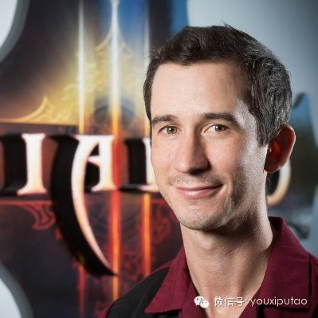
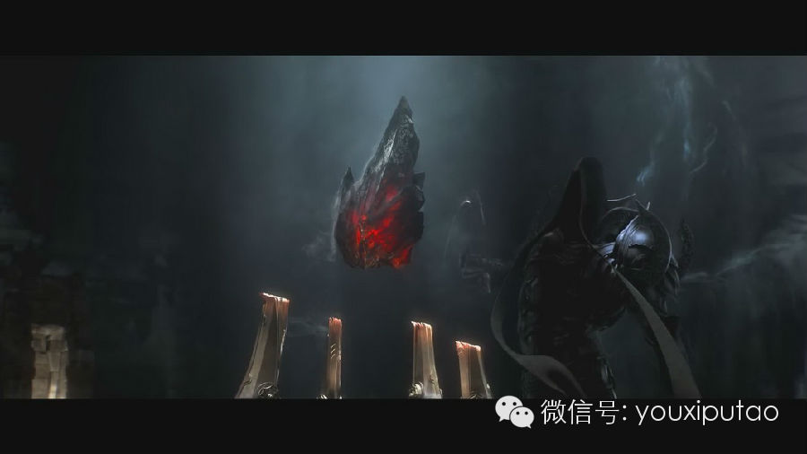
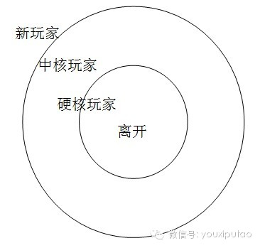

葡萄君与前《暗黑破坏神3》高级游戏设计师、现Funplus创意总监Andrew Chambers面对面，讨论了关于暗黑3、手机游戏和游戏设计的一些问题。

作为世界上最顶尖的PC游戏开发商，暴雪娱乐的一举一动都备受瞩目。近日，前《暗黑破坏神3》高级游戏设计师Andrew
Chambers离开了暴雪，加入了Funplus担任创意总监。Andrew Chambers在《暗黑破坏神3》开发组中主要负责工匠系统和新职业圣教军的设计及
实施。游戏葡萄非常有幸能够和Andrew面对面，讨论了关于暗黑3、手机游戏和游戏设计的一些问题。以下是专访全部内容。

_图注：前《暗黑破坏神3》高级游戏设计师Andrew Chambers，现Funplus创意总监。_

  

**Q：在刚刚大卖的《暗黑破坏神3：死神之镰》中，您设计的新职业圣教军大获成功。这个职业最初的设计理念是什么呢？**

**  
**

A：我们刚开始设计圣教军的时候就确定了这个职业的三个特点：他的角色是坦克，使用神圣的火焰来攻击，这个职业代表着秩序。然后我们开始讨论怎样的玩法才能更好的体现
职业的特点。最终我们确定了他的战斗方式主要是中距离和近战，这样能更好地展现他的力量。

  

当我们把这些都设定下来以后，花了很多时间去实现这些理念。很可惜并非所有的理念都能被实现，在开发的过程中我们会不断地修改、完善。这样的理念其实和Funplus
做游戏的方式一样，从很棒的理念开始，然后去尝试不同的执行方法。

  

**Q：您说到有一些理念并未被实现，那么之前有什么设计理念和方案是没有用到的呢？**

  

A：有一些预先构想的技能并没有被做进游戏。很多时候一些技能听起来非常棒，但放到游戏里效果并不好，所以我们会抛弃掉这些技能或是进行修改。我们曾经构思过一个技能
叫“天堂之矛”，一开始的想法是用鼠标在屏幕上划动，天上掉下来的矛跟随着鼠标的轨迹攻击怪物。但后来发现怪物移动太快了，完全打不到它们（笑）。所以我们对这个技能
进行了修改，改成触发之后会自动攻击怪物，这就是你们现在看到的“天堂之怒”。

**Q：刚刚提到有的技能可能会被完全抛弃掉，那么被抛弃掉的技能完成度一般都有多高呢？**

  

A：有一些只是想法就被放弃了，有一些可能完成度很高，已经投入了很多程序或者美术资源，但到最后我们还是觉得不合适。不合适的原因有很多，可能是感受不好，可能是玩
起来不流畅，也有可能是因为和别的技能过于类似或者作用重复。当然它们不会被删除掉，我们会保留以防某一天需要把它们加回来。

**  
**

**必须说，圣教军的成功的关键在于迭代。我们尝试了很多次，也失败了很多次，但是从中我们会不断取得收获。**这也是我想加入Funplus的原因之一，这里的开发方式也非常重视快速高效的迭代。

  

**Q：在您设计工匠系统的过程中遇到的最大挑战是什么？这个系统的意义是什么？**

  

A：最大的挑战就是找到这个系统的意义（笑）。设计这个系统是为了满足玩家打造装备的幻想。问题出来了：打怪是暗黑3最有趣、最核心的部分，但如果你为了满足玩家的幻
想，让铁匠什么都能做，玩家会失去杀怪的兴趣，那就伤害到了核心玩法。所以工匠系统在设计的时候就设定为玩家只能制作一部分物品；其它的物品玩家必须去打怪才能够得到
。整个设计的过程中，保持二者平衡是最有挑战的。

  

**Q：作为一个游戏设计师，会怎么向团队传达自己的想法呢？是通过文档、制作原型，还是草图加上口头表达？**

  

A：全都用（笑）。最初的想法一般会画一些草图。要注意的是，我们制作的是游戏，而不是文档。无论用什么办法，都要尽快做出来放到游戏里测试，这样才能对你做的东西有
直观的理解，去判断它行不行。

之前我所在的一个团队曾经写过500页的设计文档，但是从来没人去看它（笑），这么做游戏是不行的。在暴雪，我直接和工程师一起工作。设计圣教军的小组有8个人，我们
每天都泡在一起，不停地玩圣教军，然后讨论决定如何改进。

  

**Q：暗黑3是个伟大的游戏，但也常常能听到一些不同的声音，玩家们觉得剧情太短，不如暗黑2来的丰富，这是为什么呢？**

  

A：我的观点恰恰相反。简化就等于更差吗？我不同意。事实上，我们只是在传达方式上做出了改变。在暗黑2中，当你和凯恩聊天的时候，他会说一大堆一大堆的文字。这放在
今天是不能想象的，因为玩家不喜欢坐在那里阅读大段的文字。

在暗黑3中，我们想改变这种叙事理念，把故事分散到不同的人物和场景中，比如我们会通过人物和随从的对话来推进故事线。有时候，我们更愿意把故事做成事件。比如怪物来
进攻，那就真的做几个怪物来进攻，把故事展现给玩家，而不是直接告诉他。

  

**Q：暗黑3的装备掉落做出了很大的修改，现在会掉更多适合玩家职业的装备。这样的修改会不会导致游戏生命周期缩短呢？**

A：事实还是相反的（笑）。在暗黑3刚刚发售的版本中，玩家很难找到适合自己的装备，背包里常常是一堆垃圾。玩家会不停地刷怪再刷怪，然后厌烦不已，退出游戏。其实我
们并不排斥玩家离开，但他们必须开心的离开，这样他们还会回来。所以我们改进了拾取系统，玩家可以更简单地找到适合自己职业的装备。

现在玩家可能只会在游戏里面待3-6个月，然后离开去玩一些别的游戏，比如使命召唤或者Funplus的游戏。这很好，没问题。游戏会不断地发布新内容，开心的玩家会
记住快乐的体验，进而继续买后续的内容；而抓狂的玩家则不会理会这个公司后来做的任何事情。

_图注：甜甜圈原则_

  

**这个问题在暴雪内有一个设计原则来解释，这个原则叫做甜甜圈原则。**一大群人进入游戏，从外往里慢慢吃这个甜甜圈；他们从新玩家，变成中核玩家，最后变成硬核玩家。在暴雪，硬核玩家的意思是花很多很多时间来玩这个游戏的玩家。到甜甜圈的中心，你会发现一个洞，这是一个让玩家离开的出口。

不要担心玩家离开，这没关系，他们还会回来的。本来只有一个月的内容，你可能会想要玩家玩更长的时间，但其实没必要。不要让一个有趣的游戏带给玩家太大的压力。我们必
须做出取舍，不能为了留存率让游戏变得很无聊。我们的方式是先让游戏很好玩，然后再考虑留存。

  

**Q：这个原则是进入暴雪之前学会的，还是在暴雪学会的？**

A：这是在暴雪的原则。事实上之前我也了解这一点，但我设计游戏已经有15年了，实在记不清什么时候学会的了（笑）。

  

**Q：炉石传说的研发团队只有15个人，这和暴雪传统的大团队的开发方式完全不同，对此你有何看法？**

A：暴雪从过去的教训中发现，其实并不需要夸张的大团队也能做出非常非常有趣的游戏，堆积人力是一种效率不高的方式。所以将来暴雪可能也会做出更多类似的改变。

  

**Q：很好奇Andrew为什么会选择离开暴雪加入Funplus？毕竟这两个公司完全不同。**

A：这纯粹只是个人喜好，和暴雪本身无关。现在我更喜欢在小团队中开发一些规模更小的游戏。有一个原因是我有了两个孩子，每天在屋子里跑来跑去，让我没有办法每天在电
脑前玩八个小时的游戏。我开始越来越多地玩手游，也慢慢发现我对手游充满了热情。

来之前我和Andy（Funplus的CEO）聊天，聊的内容主要是关于游戏开发的过程和玩法，以及什么样的游戏才能让玩家更快乐，更享受；然后我们发现彼此很合拍。
一个好的游戏设计者应该在自己最喜欢的环境中工作。过去在暗黑3，我非常热爱暗黑3；现在加入funplus也是因为自己对手机游戏的热爱。

  

**Q：对于你个人来说，开发的平台从PC转移到了手机上，这样的转变意味着什么呢？**

A：我有非常深厚的PC游戏知识的积累，因为过去十五年我都在干这个。但现在有这么多的手机游戏，其中有一些还非常好玩，以至于我没有足够的时间玩个遍。玩的手机游戏
不够多是我最大的缺点。不过很幸运的是只要不停地玩游戏就可以了，所以还是很爽（笑）。

在Funplus有很多的人才，我不需要知道所有的事情，只要专注自己的事情就可以了。让别人做他们擅长的部分，通过合作来弥补我的缺点。

  

**Q：对比在暴雪和在Funplus，和团队的合作上最大的不同是什么呢？**

A：语言不同（笑）。这确实是最大的挑战，不过到目前为止感觉还不错。之前在暴雪，我们都说英语，都在同一个地方，完全没有障碍，而现在某些和本地团队的沟通不得不找
翻译来协助沟通，还要进行远程合作。这也是另一个要尽快让设计实现到游戏中的原因，这样才能暴露出沟通中存在的问题。

  

**Q：未来的手机游戏会有怎样的发展趋势，除了核心乐趣要保证以外，类型上可能会有突破吗？**

A：我觉得手机平台很奇妙，因为我们既有硬核玩家，也有我的母亲这样的轻度玩家。他们都用同一种设备，硬核玩家们和新玩家们混在了一起。这是一个整合两类玩家的机会，
我们可以同时向两类人展示游戏的乐趣。

同时，我想在手机平台上看到更多的硬核游戏，比如暗黑3。硬核玩家也会从主机和PC上转移到手机上，我自己就是最好的代表。我的两个孩子让我没办法静下心来坐在电脑前
玩游戏，因此我玩手游越来越多。

  

**Q：在Funplus未来的游戏中，你想侧重哪类玩家呢，是轻度还是硬核？**

A：我认为有办法同时满足两类玩家，我称这个办法为“易于上手，难于精通”。我会设计非常好上手的系统，让我的母亲也能轻松掌握；然后随着游戏进程的推移，逐渐加入复
杂的内容，去鼓励玩家挖掘更多的乐趣。

就好像你玩《魔兽世界》一样，一开始很简单，当你到5级的时候就学会了基础的操作；然后慢慢发现随着自己和其它玩家等级在增长，你所掌握的技能也越来越丰富，你需要花
费很长的时间来掌握。我希望能够吸引休闲玩家，把他们中的一部分转化为硬核玩家。

  

**Q：之前陈琦(Funplus的COO)提到过Funplus正在制作手机上的策略游戏。作为创意总监，可以讨论一下关于这个游戏的细节吗？**

A：这个游戏很酷。更多的细节以后再说（笑）。

  

**Q：目前，全球的游戏市场是割裂的，中国、日本、北美市场上流行的游戏类型完全不同。作为创意总监，您觉得是否有可能做一个适应所有市场的、真正的全球化的游戏？**

A：短期内我不会考虑。这里面有很多文化、语言方面的问题，本地化上也会有很多工作要做，比如把中国的文字转换成英文的文本可能会超出界面的范围，翻译德语和俄语可能
会更长。

**想要做全球化的游戏，最先要做的事情还是专注于核心游戏玩法**，确保它非常有趣；然后在各个地区测试，如果大家都觉得很好玩，至少你有了一个很好的基础。但即便这样，你还是要面对语言文化上整合的问题。

  

**Q：暴雪很擅长塑造品牌，这样的相关的经验会应用在Funplus吗？**

A：建立品牌是一把双刃剑。创造IP很有价值，但非常非常难。真的是太难了，你需要花费数年甚至数十年年来建立IP。而且如果想创造新的IP，就可能要去对抗魔兽这样
的老牌IP。在Funplus，一开始我不会太看重这个，因为Funplus的重点还是家庭娱乐。用IP会很受限制，如果你一直使用农场的IP，那就做不了策略游戏。

即使在暴雪，魔兽系列一开始其实也并没有奔着一个大IP去做，但经历了这么多之后，IP才被慢慢建立起来。IP应该是跟着公司的成长慢慢行成的，而不是一朝一夕能建立
的。

  

**Q：中国有很多想进入游戏行业、从事游戏设计的人，对他们您有什么建议吗？**

A：下载一个Unity，开始做游戏。游戏必须原创，还要展现出思考的过程。举一个例子，我想做一个《超级玛丽》和《暗黑破坏神》结合的游戏，那么去建立你的设计目标
，然后试着去证明它行还是不行。这会让你去思考所有我们在工作中需要思考的问题。带着你的游戏，去美国或者中国的游戏公司，坐下来，展示给他们看，让他们承认你是一个
游戏设计师。游戏有趣或者无聊并不重要，制作和思考过程才重要。

作为一个游戏设计师，做出一些有趣的东西很重要，但并不是最重要的。记住最重要的事情是展现出思考的过程。如果你觉得自己的idea很有趣，很好，但不要写很多文档，
一页就够了。写下“我相信《超级玛丽》和《暗黑破坏神》结合在一起很有趣”，然后写为什么，再写下你的设计目标，然后就去试着做出来吧。这就是我的思考过程。

你的idea正确还是错误，游戏有趣还是无聊，这都不是最重要的，思考过程才是重中之重。设计是一种很难培养的本能，对我来说是一种天赋，一种本能的直觉。坐下来开个
会聊一聊，我就知道这个人能不能像一个游戏设计师一样思考透彻（think through as a
designer），能不能作为一个玩家来剖析自己，能不能玩游戏的时候边玩边解构游戏、进行分析，能不能看到未来的潜在机会。

我看中的是一个人思考以及做决定的能力。让你做游戏并不是让你去展现一个产品，而是在做的过程中不断思考，并把思考的过程记录下来。当你把游戏拿去给别人看的时候，游
戏做的烂也没关系，只要你能说出来为什么，以后会怎么改正。从这里就能看出一个人有没有成为设计师的潜力。

  

PS: 想来FunPlus和Andrew Chamber (暗黑3主设计师), Samuel Bass(‘命令与征服’主设计师)这样的牛人一起工作么，
发信给 hr@funplus.com, 注明游戏葡萄有特别关注。

………………………………………………  

今日推荐：

  

周日相聚深圳，现场体验游戏硬件的超快感！

游戏葡萄联合网易手机频道于本月20日在深圳起点咖啡举行游戏硬件的现状及机遇活动，现场有嘉宾分享与硬件体验。

  

搜索公众号“游戏葡萄”关注我们~  

  

活动详情和报名链接点击左下角阅读原文进入。

[阅读原文](http://mp.weixin.qq.com/s?__biz=MjM5OTc2ODUxMw==&mid=200132778&idx=1&sn
=56a72320678e19685a05cf2fb4912356&scene=1#rd)

