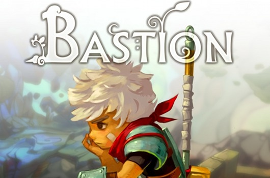
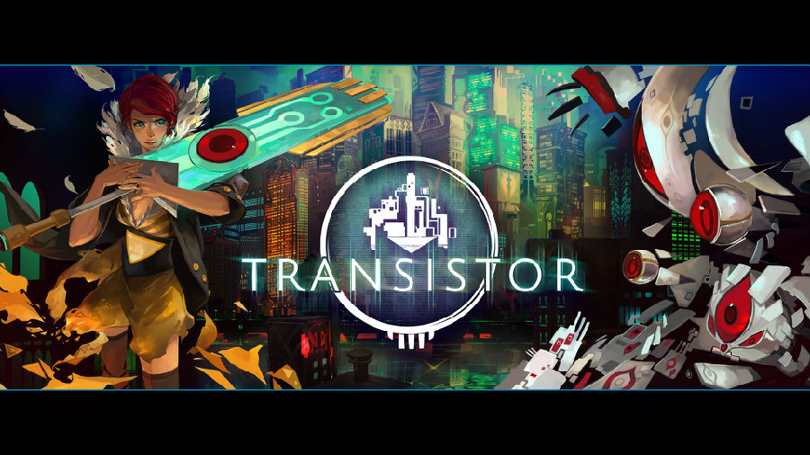

**移动游戏设计中货币统一的重要性**

**  
**

（作者：张翰荣）  

  

  

货币是什么？货币在现实中就是一般等价物，它被用于表示事物的价值。货币在游戏中以各种的形式存在。从狭义的角度来说，游戏中的货币单指那些可以用于购买道具的金钱，
如金币、元宝等；而从广义角度来看，荣誉、勋章、战利品等其他这种可通过收集获得的东西都可以称为货币。由于设计的必要，以把控虚拟经济学平衡上的问题，游戏中的货币
都不一定具有流通性，例如移动游戏中的所有货币几乎都是不可交易的。这点上要因游戏而异。

  

就目前的许多国产游戏来看，都没有做到货币的统一性。各种荣誉、勋章、声望、绑定金币、流通金币、元宝、钻石，有些游戏甚至付费获取的货币就分为两三种。这些游戏都会
设计许多看似很有意思的复杂玩法，让玩家去收集不同的这种货币，每套玩法系统对应自己的一套货币。表面上看似狂屌酷霸拽非常拉风，但从设计角度上说，这些设计师是在炫
耀自己的数值设计能力非常烂。因为他们没有能力把这些货币进行统一，就算统一了也难以从数值角度去做到平衡。

  

个人认为，一款成熟的移动游戏至多不能超过3种货币，其中付费货币不能超过1种。若超过3种，则会开始影响玩家体验。

  

为什么要做货币统一？这么有什么好处？本篇文章将从广义的角度去分析，游戏设计中货币统一的重要性。

  

  

**易于玩家入门**

  

在现今移动游戏繁多的年代，易于玩家入门成为许多游戏留住玩家的必备要素之一。假如一款游戏里面要你收集金币、荣誉、声望、勋章，外加付费获得钻石、还有系统赠送的宝
石，你需要在游戏过程中记录下来，这些货币分别有什么用途，能换取什么道具，获取途径是什么，如何尽可能更快地获取这些货币等等，玩家会加倍感到游戏的复杂性。换句话
说，这样的设计相当于是开发者明确地告诉了玩家提升实力的途径，而“我们就设计好这么多个坑了，你们往里跳就行了”。这样会让许多入门玩家一开始就感觉难以精通，望而
却步。

  

**难以精通**

**  **

统一的货币让玩家入门变得容易，但想要精通却非常难。在游戏Clash of Clans中，因为单位时间的金币产出是相对恒定的，玩家对于如何最有效地使用金币来升
级防御塔，让自己在不同的积分段被攻打时更难以被击败，进行了非常多的研究和讨论；而在升级兵种时，高级兵种升级消耗大量圣水，却只提升少量攻击力，为何不用这些资源
去升级一个还处于低级的兵种获得更大的提升呢？

统一的货币设计在看似简单的表面上，设计师可以通过各种数值微调来让玩家热衷于研究如何合理地进行资源的消耗。这就是所谓的“精通难”。这样能有效地激发玩家自主研究
，和主动分享成就感。

  

**选择带来的乐趣**

**  **

选择是游戏中的一大乐趣之一。所有优秀的游戏都会让玩家做各种各样的选择，然后带来不同的平衡效果。例如选择剧情发展，属性偏重选择，装备外观选择等等。许多游戏设计
师以为，设计繁多的游戏玩法系统，每套系统对应一套货币，自然就让玩家形成了选择。然而，他们忽略了玩家始终会朝着每个系统都玩精通的目标前进，这就偏离了设计选择的
初衷。

比如说《魔兽世界》自从出现了DPS和装备等级的计算法，玩家就不再追求不同的武器选择，而一直最求更高的DPS和装备等级，让游戏过程失去了乐趣。

游戏货币的统一有利于对选择乐趣的把控。假设一款游戏中，只有一种通用货币，如金币。玩家可以通过使用金币去各种游戏玩法系统中进行消耗，提升实力。然而，单位时间内
玩家能够获取的金币是一个定值，这样玩家自然就会去研究如何巧妙地游戏利用金币来进行实力的提升。Clash of Clans的乐趣也正在于此。

  

**有利于付费挖掘**

**  **

笔者之前的文章提到过，付费挖掘是游戏设计的重头戏，而贯穿于整个游戏设计过程中，并非单独考虑。付费挖掘中的许多技巧是基于心理学原理的。

在作者为Andrzej Marczewski的《阐述时间因素对人们制定决策的影响》一文中，以心理学的角度有效地分析到，人会基于自己在短期内接触到的讯息，在需
要快速地作出决策时，会做出基于这些讯息的“非理性”决策；然而，顺着时间推移，他们的思维会逐渐变回“理性”可能会作出完全不同的决策。这里所谓的“非理性”和“理
性”与决策的正确与否无关，只代表人考虑事情的周全度。

统一的货币设计会增加玩家对货币的“非理性”消耗。原因在于，玩家在短时间内做决策的时候所接触到的讯息非常少，只有一种货币，而这种货币是可以通过一般途径正常获取
的。如果换做多种货币，那么玩家就会开始迟疑，去考虑这种货币的用途多少，获取途径等等的信息才会做出决策。

  

  

**如何合理做到货币统一**

**  **

货币的统一带来了不少的好处，但是，不合理的货币统一会令游戏失去平衡，导致体验流程崩溃。要合理做到货币统一非常有技巧，这也是为什么有些策划能力薄弱的游戏开发团
队避而远之的缘故。

要做到合理的货币统一，必须基于自己的游戏设计，和设计师所想达到的最终目的来设计合理的换算机制，主要掌握以下几点：

  

1.列举游戏系统的拆分，合并同类关联玩法系统

  

国产游戏的玩法系统喜欢设计得繁多复杂，但许多系统的本质是一样的。比方说，装备的强化、打孔、镶嵌、符文等等，这些都是装备玩法拆解出来的东西，同属于一家。

  

2.给拆分出来的系统配备数值权重

  

一些年轻水平较浅的设计师，往往会先从别的游戏中参照一大堆玩法，然后挑选其中觉得不错的几个组成一个游戏的玩法系统。其实这种思路是错误的。合理的方法应该反过来，
先定下大的系统，确定这个系统需要达到的具体目的，然后再进行拆解。在拆解时必须合理配备数值权重。也就是说，玩家将在某个玩法上得到多少的实力提升。如装备系统往往
会配备50%以上，再一步步拆解，强化占30%，镶嵌占10%，符文10%。

  

3.给对应权重大致对应的货币消耗量，或通过专属货币与一般货币进行转化

  

如果玩家在一个系统中得到的实力提升是20%，那么他在这个系统中所消耗的货币量也应该占总消耗量的20%左右，可以稍有偏离。一些游戏的通常做法，是将一般货币通过
某种公式兑换为这个系统的专属货币；更复杂的话，在如何消耗一般货币获取专属货币上也会设计出几种玩法，每种产生的收益不同。例如，一些游戏中会通过消耗金币参与活动
的形式，来产出对应的专属货币，产出通过活动成绩的不同在区间内浮动。

  

4.把控部分无法以一般货币获得的收益

  

如果游戏中出现一些玩法系统需要被单独对待，就应该与一般货币区分开来，使用独立的专属货币，并不提供转换机制。个人认为，这些系统是不应该对玩家的数值实力产生任何
影响（或忽略不计）的。比如说，一些时装道具，一些像小喇叭的消耗型道具。抑或，在大型游戏中互不关联的游戏的两部分，如魔兽世界中的PVE和PVP之间。

  

5.最后，控制一般货币总产出量和总消耗量之间的比例，完成闭环。

  

这一步将会设计到付费设计。一般来说，总产出量肯定会在某种程度上远小于总消耗量，这个比例越小，玩家所要获得最大程度提升时所需付费购买的货币量就越多。

  

  

**总结**

**  **

货币机制的设计在MMO中会以“影响游戏虚拟经济”的重要角色而被重点对待，而在移动游戏设计中，同时时刻影响着玩家的体验乐趣。因此，笔者认为，移动游戏中合理的货
币统一是非常必要的。它虽然不会直接影响游戏的根本体验，但无时无刻在间接影响着玩家所获得的乐趣。移动游戏与MMO不同，需要基于简单而有深度的设计理念。MMO中
玩家会花大量的时间去研究里面繁琐的系统，而移动游戏的玩家却不会。

有的人说，移动游戏设计起来会比MMO容易得多。但笔者认为，只能从某些方面这么说，比如内容的多少和故事的长短等。从其他方面来说，移动游戏的设计是全新的思路；从
设计学上说，有些方面甚至比MMO更加复杂而考验技巧。

  

**关注《游戏开发者日志》微信公众帐号，获取由开发者分享的游戏设计、开发、市场方面经验。（转载请注明：转自《游戏开发者日志》，作者信息。）**

**关注方法：**

**1.点击右上按钮—> 查看公众帐号—> 点击关注。**

**2.添加朋友—> 搜号码—> 微信号：gamedesigners**

  

[阅读原文](http://mp.weixin.qq.com/mp/appmsg/show?__biz=MjM5MDg3MjA2NA==&appmsgid=
10000025&itemidx=1&sign=6e4ce51fd7617c00cec713fe33025ba1&scene=0#wechat_redire
ct)

