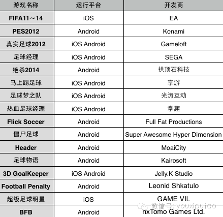

足球游戏经历了怎样的发展？玩家喜爱哪些类型？足球手游有哪两大分支？未来又会如何进化？

  

还有不到两个月，2014年世界杯就要在足球王国巴西举行了。在各国玩家翘首期盼的同时，多家游戏厂商也推出了自己的足球游戏，目前已有二十余款足球手游（文末附上列
表），预计还会有更多。

  

作为世界第一大运动的衍生品，足球游戏经历了怎样的发展？玩家喜爱哪些类型？未来又会如何进化？

  

**端游时代，EA与KCEO二十年纷争**

  

自上世纪90年代开始人们对于足球游戏的争论，便停留在了“实况”还是“FIFA”上面。

  

首款FIFA于1993年圣诞节，在PC平台发布，由加拿大人制作，基于电脑开发的FIFA很快的抢占了美洲的PC市场。次年，一款名为：《实况世界足球完美十一人》
开始在SFC平台发售，这款游戏由KCEO小组制作的游戏，也就是后来的WE和PES的前身，它的发售也正式吹响了两款游戏近20年纷争号角。

  

两款游戏的特点对比十分明显，FIFA在游戏节奏上更注重快与流畅，联赛内容上更真实，AI相对与实况更加简单，拥有国际足联的完美授权。实况足球节奏比较慢，设计上
更侧重于战术的拿捏，注重对球员个体的设计。

  

FIFA与实况的斗争也是此消彼长。2006年发售的实况足球PES6在设计上，修正了射门感觉，防守设定也变得合理，犯规不再频繁，只要你肯琢磨，Tiki-tak
a都不再是问题。节奏感方面，除了刻意的战术犯规外，比赛几乎可以做到不中断，这一代版本在欧洲上市仅8天就卖出了300万份。而FIFA2013更是仅在短短四周就
卖出了740万份。

  

在2004年到2008年，虽然实况足球稳步前进，在PS2等主机平台上表现出色，但是从PES2009后，实况足球全平台全方位的一落千丈。反观FIFA，FIFA
在主机方面完全压制实况足球，并且从2011开始全平台统一引擎，加上FIFA的商业能力，次世代引擎爆发的威力，各种细节全方位针对实况足球的学习，逐渐融合了两家
的优点。

  

总结来看，自实况足球PES6之后，EA已经远远将K社甩在了身后。

  

**另一种活跃方式**

  

实况足球与FIFA只能代表足球游戏中的体育竞技类，关于其他类型，比如说模拟经营类的足球经理，也被玩家津津乐道。

  

足球经理是完全不同于实况足球和FIFA的游戏，它表现的不是足球比赛时的竞技与对抗，更多的乐趣来源于模拟。模拟现代足球在比赛背后的庞大产业，这来源于足球这一世
界地运动所涉及的国家文化，风土人情、历史发展，玩家要对这一切有足够的了解，才会精通于此类游戏。

  

另一方面，还有一部分世界观完全架空的足球游戏也受到一部分玩家的喜爱。比如说《热血足球》，《雷门十一人》，《街头足球》等游戏，这些游戏大多以卡通动漫的画风，通
过现实中难以做的到足球招式来满足玩家对足球更高动作表现的幻想与追求。

  

**手游时代，足球游戏的两大分支**

  

最初，功能机时代的足球游戏大多是模仿与移植主机平台的游戏玩法。随着智能机的兴起，移动终端上的足球游戏逐渐演化成两个分支。

  

第一类是重度操作类，其特点是真实性强，基本上将PC上和大型家用游戏机上的游戏场景，还原到了手机和移动终端设备上，渴望还原给球迷玩家主机平台上足球游戏真实的代
入感。《FIFA2013》，《PES2012》都是这种类型的代表作品，这两款游戏都强调将主机平台上，足球游戏的节奏感展现在手机上，从画面，音效，操作上给玩家
身临其境的感觉。当然，这类型游戏的缺点也很明显，由于终端的限制，目前还不能通过单纯的点击、滑动等操作完成足球游戏的重度复杂的动作，没有键盘或者手柄的支持，习
惯主机平台的玩家始终会觉得操作感不好。另外，过于强调球赛时的还原度必定增大游戏包的容量，追求更好的游戏画质还是选择更轻量级的安装包，如何优化，也是值得开发商
商榷的问题。

  

第二类是养成类足球手游，此类游戏摒弃了足球的操作元素，强调对于球队和球员的养成，让玩家容易上手，也较容易在游戏中获得的成就感。这类游戏的代表就是Gamelo
ft的世界足球系列。这类游戏的另一个变种就是将足球与卡牌融合，目前国内市场中此种卡牌类足球游戏居多，虽然将RPG与体育游戏结合算是一种创新，但是现状是此类游
戏在设计时过于强调模拟经营元素、缺乏玩家与玩家之间的社交化联系，对于真实足球世界的还原明显缺失，代入感较差，而游戏的核心玩法，大多数也只是数值的堆砌。

  

**对创新题材足球游戏的展望**

  

去年下半年到今年，市场上出现了许多新兴的足球游戏。比如游族的《马上踢足球》、热酷的《决战2014》、中手游代理的日本游戏BFB和光涛的《足球梦之队》等等。这
里以3D战斗卡牌《足球梦之队》为例，谈谈足球游戏在手游上的新变化。

  

首先在玩法上，这款游戏并没有让玩家扮演一个球员或是一个经理，而是在足球游戏中扮演一个教练。这其实是融合了传统手机游戏的两家之长，在游戏中玩家不仅要考虑足球比
赛时如何操作能够赢得比赛，又要注意球队的养成与管理。这款游戏在球赛时的玩法表现更像是即时战略类游戏，玩家的操作点不再聚焦到每个球员，而是整个球队，这种更注重
整体战术规划的体育类游戏目前还是比较少见的。而在球队管理模式上，则依然沿袭了卡牌RPG的模式。

  

另一大方面，是这款游戏的语音操控，策划希望完全模拟教练在球场上的身份，让玩家以喊的方式告诉你的“球员”该如何踢球。

语音操控更好地结合了手机设备的特征，但也是一个十分有争议的设计，排除识别准确性等不安定因素外，如何能更好的设计好语音操控的体验，而不是让玩家只是抱有新鲜感才
去使用，这也是开发商将要面对的一个问题。

  

**总结**

  

足球游戏是一个十分细化的市场，不论是传统的足球游戏还是创新题材的足球游戏，要给予玩家更真实的足球体验，仍是开发商需要一直关注的问题。借助2014年足球世界杯
，手游圈已经刮起了一阵“足球风”，这阵风潮将会持续还是只是过客，玩家更喜欢传统的两大类足球游戏中的哪一类，或者是对两类特点加以融合的游戏，一切都要等到世界杯
结束才能见分晓。

………………………………………………   

  

搜索公众号“游戏葡萄”关注我们~  

  

游戏葡萄DemoWall线下直签会活动（深圳站）将于4月19日举行，产品资料PPT投递邮箱：game@youxiputao.com

活动详情和报名链接点击左下角阅读原文进入。

  

[阅读原文](http://mp.weixin.qq.com/s?__biz=MjM5OTc2ODUxMw==&mid=200128661&idx=1&sn
=36530407c2ed38eaf1734df843910068&scene=1#rd)

