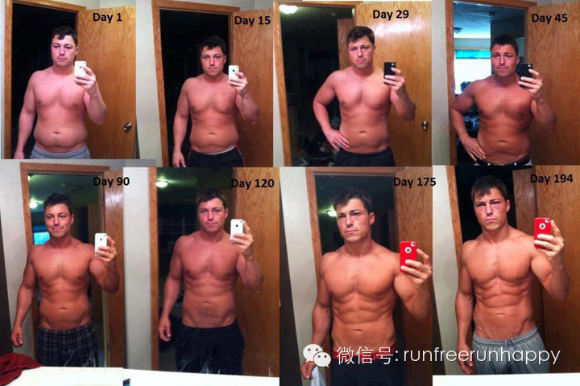

  

**减还是不减？你想秀肌肉还是白花花的肥肉？减肥不仅需要靠有氧运动，更重要的是要靠健康科学的饮食，我曾经就亲眼看到很多很棒的身材，被各种美食慢慢谋杀。如果你对减肥很茫然，不知道从哪里开始，下面是100条减肥建议：**

**  
**

** **

**  
**

**1-20条**

1\. 每天进餐6次，每次摄取量相对较少。每隔3〜4个小时进餐一次，能让人体新陈代谢的速度达到最大化。

2\. 每天进行10次短距离疾速跑，每次距离约为90米，这样会燃烧500千卡的热量。

3\. 每次跑步之间休息20分钟，然后再进行下一次。

4\. 锻炼之前穿上一件连帽上衣，当肌肉慢慢预热后，身体在锻炼时会燃烧更多的热量。

5\. 吃饭时用一个小号的餐盘，这样每次盛的食物也就相对减少了。

6\. 用一个蓝色的餐盘，这种颜色比红色和黄色能更好地控制食欲。

7\. 喝脱脂酸奶，而不要再吃酸奶酪和蛋黄酱了，这样摄入的热量就能分别减少100千卡和700千卡（每半杯的份量）。

8.吃带壳的花生，而不是脱壳的花生，坐在沙发上剥花生能让进食量减少50%。

9\. 餐后咀嚼无糖薄荷口香糖。研究表明，薄荷的味道能向大脑发出“我已经吃饱了”的信号。

10\. 选择开心果，而不是奥利奥饼干作为零食，前者所含的热量更少。

11\. 在身体条件允许的情况下，进行热瑜伽练习，每堂课能燃烧344千卡热量。

12\. 每周进行一次速度较快的健身锻炼，它能增加肾上腺素分泌，降低血糖。

13\. 采用间歇式的锻炼方法，短距离疾速跑和慢跑交替进行。

14.早餐用一碗燕麦粥和两个煮鸡蛋白代替以往的面包圈和果汁。

15.和伴侣一起锻炼。夫妻同时进行锻炼会让双方坚持锻炼的可能性增加34%。

16.在餐桌上吃饭，而不要坐在沙发上边看电视边吃饭，这样你就不会随着剧情的跌宕起伏吃得没完没了。

17.多喝水，脱水会让身体产生饥饿的错觉。

18.鸡蛋、鸡肉和鱼肉尽量采用水煮的方式进行烹饪，这样摄入的热量就少多了。

19.在游泳池里进行往返游泳。如果泳池的水比较浅，还可以在水中进行快走，水中的阻力可比空气大多了。

20\. 在镜子前摆Pose，多角度地观察自己，可促使你下决心控制饮食。

**21-40条**

21\. 早餐喝一杯脱脂牛奶，不再喝放了奶油和糖的咖啡，摄入的热量就能减少100千卡。

22\. 有车族可以每周找一天改为骑车上班，骑自行车每小时能燃烧500千卡的热量。

23\. 选择有把手的椭圆机作为健身器械，这样臂部肌肉也同时得到了锻炼，增加了燃烧的总热量。

24\. 从App Store上下载一个健身程序到iPhone 4s手机里，如计算摄入快餐热量的程序或是数码训练视频指导短片。

25\. 炸鸡排或是脱皮无骨鸡胸肉时选用面包屑粘裹表面，而不是面粉和鸡蛋，因为前者的热量更低。

26.在奶昔中放入草莓，这种富含膳食纤维的超级水果能让你产生饱腹感。

27\. 多吃鳄梨，这种水果富含一种对人体健康有益的脂肪，可防止腰腹脂肪堆积。

28\. 控制对土豆和面食的摄入量，每餐中淀粉的摄入量不要超过一个棒球的大小。

29\. 注意餐馆中餐单上的关键字眼：烧烤、烘焙、爆炒、油炸、烤制、清蒸、凉拌、白灼，当然是用后三种方法烹饪的食物所含的热量相对较少。

30\. 喝绿茶，它含有能帮助脂肪燃烧的抗氧化剂。

31\. 估计每餐摄入的蛋白质量，相当于一部智能手机的大小就可以了。

32\. 把一条毛巾盖在跑步机的显示屏上，这样能让你更关注锻炼，强度也得到了提高。

33\. 多做深蹲运动，深蹲是减脂的最佳锻炼形式。这是因为深蹲运用到了人体较大的肌肉群，包括臀大肌、股四头肌、月国绳肌和竖脊肌。只要姿势正确、负重量适中、组
次合理，就能见效。

34.多做腹部肌肉练习，仰卧起坐和卷腹都可以。如果在几组锻炼中还能负重进行，效果就更好了。

35\. 少吃糖，每天不要超过72克。

36\. 看电影时吃点零食不碍事，但选择100克的爆米花而不是炸玉米片就能少摄入60千卡的热量。

37\. 即便在室内体育馆进行攀岩，每小时也能燃烧700多千卡的热量。

38\. 遭遇逆境要及时调整情绪，让自己振作起来。过于沮丧也会使人不爱运动。

39.养个宠物，每天带狗散步20分钟，一年下来体重就能减轻约7斤。

40\. 多吃豆类食品，这种富含膳食纤维和蛋白质的主食能够帮助身体燃烧脂肪。把豆子煮成浓汤，或是煮熟后放入橄榄油和醋作为小菜吃也不错。

**41-60条**

41\. 将有氧锻炼和力量训练结合起来进行，如在每组力量训练之间跳绳。

42\. 别老坐在沙发上看电视，当开始播放广告时，站起身来做俯卧撑、仰卧起坐或是开合跳。

43\. 经常打扫厨房，不仅能健身，还能处理掉垃圾食品，一箭双雕。

44\. 如果你在一周内能严格地控制饮食中脂肪、糖类和淀粉的摄入量，每周放纵饮食一次并不会有太大的影响，餐后多运动就行了。

45\. 适量地吃些鸡爪子而不是鸡翅膀，前者含有更多的蛋白质，而脂肪、盐分和热量更低。

46.10分钟跳绳所燃烧的热量等同于15分钟慢跑，而且不受场地限制。

47\. 火鸡肉永远是一道瘦身肉食，它不仅营养价值高，而且热量低。

48\. 一旦在健身或饮食方面取得了小小的进步，就及时记录在日记本上，这些小成就积累起来会提升减脂的自信心。

49\. 做饭的时候，用茶匙的背面（国人不妨用筷子尖点一下就行了）来品尝味道，这样摄入的热量能减少些。

50\. 多摄入膳食纤维，扁豆、大豆、毛豆、豌豆和梨都是很好的来源。

51\. 用黑巧克力代替奶油巧克力，前者糖分更低，而含有更多的能提高体力的抗氧化剂。

52\. 在强度比较大的健身锻炼之后，吃一片抹了花生酱的全麦面包，能够迅速补充体力。

53\. 进行“波比式”锻炼。它是一种增强式锻炼，全身每一个重要肌肉群都被调动起来，还能提高肌肉力量和耐力。做法：站立，双臂放在身体两侧，双膝弯曲，双手放在
双脚前面的地面上（呈深蹲姿势），双腿向后用力蹬出，做出俯卧撑的支架姿势，让肩膀到脚后跟呈一直线；然后回到深蹲姿势，再回到初始的站立姿势。

54\. 定期体检。常规的血生化测试能够提前预知你是否患有肥胖症或与之相关的代谢综合征（如高血脂、高胆固醇和脂肪肝）。

55\. 住在楼房高层的朋友别坐电梯了，每爬楼梯10分钟就能燃烧100千卡的热量。

56\. 每天早晨起来做几个俯卧撑，这种上肢肌肉训练能让你一整天感到动力十足，热量持续燃烧。

57\. 做色拉时用香醋代替奶油沙拉酱，能减少摄入200千卡的热量。

58\. 避免吃炸薯条，吃汉堡时去掉奶酪，又可减少300千卡的热量摄入。

59.记录每天吃的食物，这样每天摄入的热量就会减少250千卡，每月体重就能减轻2磅（1磅≈0.45公斤）。

60\. 短跑时在腰间、大臂系上负重沙袋，这样能燃烧掉更多的脂肪。

**61-80条**

61\. 早餐一定不要漏掉。在起床后一个小时内吃一顿热量为400〜600千卡的营养早餐，能够提升身体的新陈代谢水平，从而促进脂肪燃烧。

62\. 在外就餐减量，让服务员只上菜单上一半的菜，另一半打包回家。

63\. 将原来每周在外就餐两次的习惯改为每月在外就餐两次。

64\. 把甜食放在拿着费劲的地方，如食品柜的最高层或更隐蔽的地方。

65\. 不妨办个聚餐会，将从餐馆中打包的食物（当然是没有动过筷子的）带到办公室与同事们一起分享，不要积存在冰箱里。

66\. 聚餐的时候先把蔬菜和水果吃完，炸薯条先放在一边。

67\. 和朋友一起转转呼啦圈。呼啦圈是上个世纪50年代开始流行的一项健身运动，最近它的热潮重返。一项新研究发现，它对于减肥功效明显。美国运动医学会证实，这
项运动所消耗的热量等同于每小时步行4〜4.5英里（1英里≈1.6公里），足以让人的身材坚实苗条，而且可以作为一项团体舞蹈运动来进行。研究者选取了16名年龄在
16〜59岁之间的女性，她们都经常参加经过精心编排的呼啦圈锻炼课程，测量了她们的氧气消耗量、心跳速度和完成30分钟呼啦圈课程后的体力消耗程度。结果显示，这些
参加呼啦圈运动的女性在30分钟锻炼结束后的平均心跳次数为每分钟151次，平均热量消耗为210千卡，体力上的总消耗足以让她们保持正常的体重。

68\. 特别想吃甜食的时候，吃一块软糖或传统的关东糖（麦芽，小米制成），而不是巧克力冰激凌或甜点，这样就会少摄入200千卡的热量。

69\. 家里别保留外卖菜单了，自己动手烹饪食物能更好地控制热量摄入。

70.走路500英里后换一双新的运动鞋，新鞋能让你走起路来更带劲。

71\. 散步时带一个计步器，每天至少行走1万步。

72\. 每天至少保持7个小时的睡眠。睡眠不充足会严重影响人体新陈代谢的速度，导致发胖。

73\. 选择一个喷雾油壶，而不是尖嘴油瓶，这样炒菜用油就能大大减少。

74\. 户外有单杠时，做做引体向上，能比背阔肌下拉锻炼到更多的肌肉群。

75\. 外出游玩时，如果想买零食，选择份量最轻的小包装。

76\. 学会调节情绪，摆脱压力。压力会增加氢化可的松的分泌量，促进食欲。

77\. 美国印第安纳普渡大学的研究者发现，想减轻体重的人如果每天饮食中都摄入少量剁碎的红辣椒，就能帮助他们控制食欲。红辣椒中特有的辣椒素（或称辣椒苦）让人
们吃后体内发热，从而有助于减轻饥饿感，减缓吃饭速度，增加能量消耗。辣椒素对于那些想控制食欲而又很少吃辣椒的人来说特别有效，它能让身体肥胖的人消耗更多的热量。
相对于锻炼和其他健康的饮食习惯来说，每天吃点红辣椒，不仅方便易行，而且容易长期坚持。

78\. 细嚼慢咽40口，有助于减肥。一项新研究发现，每口食物咀嚼40次，会显著地降低进餐时摄入的热量，从而有助于减肥。与那些每口食物咀嚼15次的人相比，咀
嚼次数为40次的人所吃的食物份量会减少12%。这是因为，咀嚼时间稍长会让大脑花费更多的时间来接收来自胃部已经装满的信号。此外，细嚼慢咽还能降低体内分泌的饥饿
激素（胃内产生的一种肽，能够调节食欲、进食和身体构成），从而减少对食物的摄取欲望。

79.除了可以和伴侣一起锻炼外，和一位身体比自己强壮的同性伙伴一起锻炼也能激发锻炼的欲望。

80\. 身体条件许可的情况下，采用超级组的方式进行锻炼。超级组是指：选择两个或多个训练动作，连续完成，中间无间歇（或间歇时间短）。这两个动作可以是针对一个
肌肉群，也可以是针对两个不同的肌肉群的。这种方法的核心就是，完成一个动作后不休息，接着完成下一个动作，如此交替，直到完成预定的组数。

**81-100条**

81\. 采用增强式锻炼的方法。这是一种使用爆发性动作发展肌肉爆发力的训练方法，广泛地应用于很多不同的运动项目中，包括冲刺中提高跑步速度和纵跳的高度，棒球投
手快速投掷能力和拳击手出拳的效率等。

82.避免吃精加工食品，它含有的反式脂肪很难被人体分解。

83\. 海藻奶昔可以让身材苗条。喜欢喝牛奶巧克力奶昔的朋友不必再担心身材发胖了，只要在奶昔中加入海藻提取物，就能大大减少饥饿感。尽管加入了海藻的奶昔不能完
全断绝人们对食物的欲望，但它的确有帮助体重减轻的作用。研究者们选取了一群男性和女性，分别让他们在早晨时喝加入了海藻提取物（藻酸盐）的奶昔和普通奶昔，前者相对
于后者到午餐时间的饥饿感降低了1/3。研究者认为，有很多种饮食和饮食方案能够减轻体重，但还是有很多减肥尝试者失败了，其关键原因是减肥者无法控制节食后对食物更
强的欲望，而海藻能够在较长的时间里让人饱腹，减轻饥饿感，为减肥者们控制饮食提供了强有力的帮助。

84\. 周末带孩子去小区的健身器械区，一起做做引体向上、仰卧起坐，既增进亲情，又消耗了热量。

85\. 关心身体数据，如摄入食物的热量和体脂含量。

86.最新的研究显示，石榴汁这种超级健康食品还能预防中年人发胖，减少中年男性和女性在胃部和腹部堆积过多的脂肪。24名男女受试者每天喝1瓶石榴汁（500毫升）
，连续喝1个月以后，研究者发现，他们腹部周围的脂肪细胞就不再继续生长了，同时，他们中有90%的人的血压水平还得到了下降，从而减少了患上心脏病、中风和肾脏疾病
的可能性。英国爱丁堡大学健康科学院的研究者认为，石榴汁可以降低血液中脂肪酸的含量，即所谓的游离脂肪酸（或称非酯化脂肪酸，NEFA）。之前的一些研究显示，如果
人体或动物体内游离脂肪酸的含量过高，会导致腹部周围堆积过多的脂肪，从而增加患上心脏病和II型糖尿病的可能性。研究者发现，石榴汁可以减少人体腹部周围脂肪的堆积
，让身高体重指数（BMI）处于更理想的范围。他们推测，石榴汁中富含的抗氧化剂可以中和自由基对人体的损害，从而起到预防心脏病，癌症和延缓人体衰老，提高性生活愉
悦感的作用。

87\. 以尽可能快的速度跑步，第二天跑步的时间再多出1分钟，一周后就能看到明显的进步。

88\. 做家务活。如割草每小时能消耗346千卡热量，扫落叶每小时能消耗230千卡热量，洗车每小时消耗346千卡热量。

89\. 在健身房中如果排队等候跑步机的人太多，别闲着，做几次跳箱子或高抬腿，还能起到热身的作用。

90\. 吃饭时尽量多吃1份低热量的蔬菜（如清炒西兰花），少吃1碗米饭，热量摄入就会减少250千卡。

91.在做一些抬举重物的练习时，把休息停顿的时间减少一半，这样能更好地刺激肌肉和心血管系统，燃烧更多的脂肪。

92\. 在吃一些必须抹调味汁的食物时，只在一面抹上就可以了。这样不仅吃得少，热量摄入也降低了。

93.不要过分迷信那些在食品包装上标明“零热量”的夸大宣传，只有每份食物所含的热量不超过5千卡，才能称为“零热量”。

94\. 睡觉前刷牙时，在洗漱间袒露身体，这样能在镜子中清晰地看到自己的身形，第二天锻炼就更有动力和目标了。

95\. 每天早晨为自己设定一个简单的目标：下班后不要再和同事饮酒作乐或是去品尝美食了，腾出时间锻炼半个小时；第二天为自己再设定一个稍微高点的目标。

96\. 要吃奶酪也只选择低脂类别的，如松软干酪（白软干酪），它富含钙质，而且每杯的热量只有163千卡。

97\. 如果你非要边看电视边吃饭，手中可以进行纵横填字游戏。手指头忙活起来，吃得就相对少了。

98\. 在跑步机上锻炼时，不要抓住器械扶手不放，这样容易使身材走形。

99\. 如果某一天太忙了没时间去健身房锻炼，用一条弹力带或是拉力器做做扩胸运动也行。

100.饮酒有节制，不要把几种酒精饮料混在一起喝，要么喝杯淡啤酒，要么喝杯葡萄酒。

  

**如果你只是大致的浏览了以上100条减肥建议，那么你绝对不会瘦的。只有踏踏实实的按照建议去做了，而且长期坚持了，那么好身材才会是你的哦。所以，“读虽容易，去做很难，且看且实践。”**

  

_转自 豆瓣_

_  
_

  

**分享跑步知识，传播运动精神**

**有温度、有态度**

**靠谱又好玩的运动健康自媒体**

**新浪微博：@跑步心情 **

**微信公众号：runfreerunhappy**

  

**点击右上角【******】**

**发送给朋友 或分享到朋友圈**

  

**跑步运动减体重，健康饮食知识。**

**分享正能量。**

  

**【阅读原文】↓往期全部精彩内容↓**

[阅读原文](http://mp.weixin.qq.com/s?__biz=MjM5MzI0NTk2MA==&mid=200645352&idx=1&sn
=eca40bf808978234630a732f8a168dcb&scene=0#rd)

