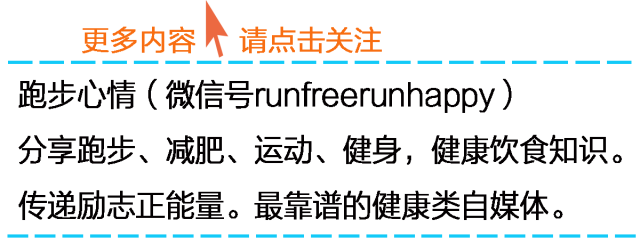

** **

在人们越来越注重健康的时代也让越来越多的人走进了健身房，有强壮的身材和健康的活力能大大增加一个人成功的机会，也能更有魅力，所以健身运动才成为现代人的时尚，可
是健身像所有运动一样都有着严格的要求，如果盲目健身效果也许会适得其反。今天总结十个有关健身运动的禁忌，戒掉这十个不良健身习惯让你的训练更科学有效！

**1）不做热身和伸展活动**

对肌腱、肌肉和关节来说，举重是一项十分激烈的运动，所以在进行举重锻炼前一定要做一些适当的热身运动，让身体充分活动开，这样就不会使身体受到伤害。在举重前先用较
轻的重量热热身，或者做做伸展运动，否则会对你的身体造成非常严重的伤害，轻者拉伤肌肉，重者损伤关节。不做准备活动对你整个的锻炼也会有影响，那就是降低效率。在锻
炼前热身就像开车前给车预热一样，是获得最理想效果的重要一步。

  

**2）不写健身日记**

有人对健身运动很上心，训练也十分刻苦，可是训练完后累得什么都不想干了，更不用说记训练日记了。常有人问我：写不写训练日记？说实话，我每天都训练，从来不写下来，
但我心里记着呢。可是你要记住，最差的笔记本比最聪明的脑子记忆力更强。根据经验，有的人可能会中断锻炼日记，但最好还是保持连贯性，尽量多做一些训练记录，把每一次
锻炼的时间、使用器械的类型和重量以及锻炼强度等记下来，这种习惯可以让你对自己的进步心中有数，最终你会达到最佳效果。

  

**3）从不改变健身安排**

健身要有常性，不能今天练这个，明天心血来潮去练那个，应该制定一个训练计划，一旦定下来就要遵守这个计划去进行锻炼，可是，这并不是说一旦制定了计划就一成不变了。
有些人一年下来执行同一个计划而不改变，这是不对的。如果你想有一个长久的效果，那么就应该每过两个月的样子就换一下训练计划，否则，没有训练的多样性就不可能达到令
人满意的效果。改变你的训练并不是说要改变每一个身体部位的每一次锻炼，如果一项锻炼效果很好，也适合你，你不妨就用它，只是简单地改变一下角度、强度或者时间长度，
这可能会让你觉得更有趣，效果也会更好。

  

**4）过度使用肩带和腰带**

当提重物时，肩带和腰带是不错的工具，但不能经常使用，否则会有相反的效果，有使你的肌肉不能平衡发展的危险，另外，过度使用也会造成严重伤害，所以要有节制地使用。

  

**5）饮食错误**

饮食错误包括没有规律、挑食偏食、营养不均衡等，饮食方面的错误是一个人不能达到自己追求的锻炼效果的主要原因。蛋白质是增加肌肉的主要营养成分，另外，如果要想拥有
并保持一个健康的体格，还要补充碳水化合物以及其它必须的营养。还要考虑其它的营养问题，比如每天要摄入足够的热量，喝大量的水。因为这个话题对健身来说十分重要，所
以要多看一看有关常犯的营养错误方面的文章。

  

**6）忽视身体部位**

要想通过锻炼来塑造一个匀称而又健康的身体，那么进行全身锻炼就至关重要。不要只注意某一部位的锻炼而忽视另一部位的锻炼，如果那样的话你就很难有一个理想的身材。比
如说腿吧，腿上的肌肉占全身肌肉的40％，可是人们往往忽视对腿部的锻炼，这就是为什么有些人有健美的上半身而两条腿却像双筷子一样支撑着身体的原因。

**7）盲目练举重**

每一个健身房里都能至少找出这样一个傻瓜来，他嗨哟嗨哟地努力举起超过自己能力的重量，他这样做不仅会有得疝气、椎间盘突出、关节脱臼以及撕裂肌肉的危险，他还会牺牲
自己的外形。良好的外形是塑造健美身材的关键，所以一定记住，不要因为举过重的重物而牺牲了你的外形。

**8）缺乏休息**

如果缺少休息，那么你就会发现自己的体力下降了，效果也不会太理想。保证每天晚上有8小时高质量的睡眠，这对于保证你的身体能够自我恢复是十分重要的。另外，要均衡地
锻炼身体的每一个部位，不要让任何一个部位过度疲劳。避免在24至48小时内锻炼同一身体部位。

**9）不增加强度**

健身是一个循序渐进的过程，不能老是用同样的强度进行长期的锻炼，应该过一段时间就增加一点强度，把每一组锻炼都百分之百地做完，否则就没有意义。人们通常犯的一个错
误是，每当做最后一组时，往往要节省一下体力，这真是一个大大的错误。

  

**10）锻炼过度**

比需要的时间更长、为一特殊身体部位做过多的锻炼或者过勤地去锻炼，这些都是锻炼过度的征兆。不管你相信还是不相信，过多地锻炼与根本不锻炼一样对健身来说都是无效的
。为了达到最佳的效果，要有规律地进行锻炼，而且保证你的锻炼非常平等地锻炼了身体的每一个部位。记住，你无需过量锻炼，适当锻炼效果最好。

  

来自健美网

  

> 任何建议、想法、供稿

>

> 都可添加个人微信号：fanfanrunner

>

> \- - - - - - - - - - - - - - - - - - - - - - - - - - -  

>

> 欢迎关注更多健康联盟微信自媒体

>

>  

>

> 微信公众号runfreerunhappy

>

> 跑步心情：跑步减肥健身，励志正能量

>

>  

>

> 微信公众号keep-fit001

>

> 镁女罩我去战斗：女性健身，励志

  

**↓↓点击阅读原文 查看更多内容**

阅读原文

阅读

__ 举报

[阅读原文](http://mp.weixin.qq.com/s?__biz=MjM5MzI0NTk2MA==&mid=201733196&idx=1&sn
=60221be3e30121b2b89ad4335c1fa458&scene=1#rd)

