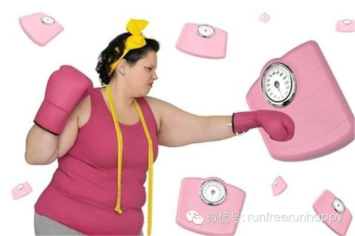

_  
_

_来自 豆瓣 lisana_娜娜_

_  
_

  

  

首先不提倡节食，节食以后就算半个月会瘦下来十多斤，但是瘦完之后的你会发现自己突然变的特别爱吃淀粉类，特别想吃甜食，就算拼命克制住自己又能克制得了多久呢***
*  
  
一旦你的饮食恢复一点点，反弹相当大，而且节食瘦下来的胸部会严重缩水******  
  
这就是我以前曾经经历过的痛苦节食，我只是不吃晚饭，但是大半年过去了，一年过去了************过午不食法坚持了一年多，只能保证维持不怎么变的104斤
，什么过午不食坚持下来以后就会形成尼玛易瘦体质，楼主那段时间里每隔一两个礼拜就忍不住跑去吃面食，因为期间我几乎都是拒绝淀粉的，导致我极想吃面包，甜点什么的，
就这样，晚上饿的时候硬忍住不吃，一大早起来就会好饿好饿，要吃最起码两个包子一个烧卖，天天想吃淀粉，想吃甜点，拼命遏制住，结果导致心情也变的很差，看到别人一到
晚饭时间都跑去吃东西，真的好羡慕，又不敢轻易放弃维持了好久的一百零几斤，因为我每次放纵自己吃甜食的时候都会反弹好几斤，姑娘们，如果你们说过午不食可以瘦下来，
但是你们可以一辈子都不吃晚饭吗？？？不要再被蒙在过午不食的诱惑里，过午不食害死人啊……  
  
所以，一年前的我决定用健康的方法减肥****首先就改掉了过午不食的坏习惯，改成少吃多餐，每天的饭分四五次或者五六次进食，每次量少一些。以前蛮爱吃零食的我凭着
控制力戒掉了所有零食，我注册了薄荷网，天天在上面记录每天吃了什么，吃多少，有多少热量，每天泡在上面看众多减肥中的姐妹分享减肥中的成果与经验********到
现在我还会每隔几天去看一下曾经与我共同奋斗在减肥战线上的姐妹们努力的怎么样了******  
  
决定健康减肥起，我买来燕麦片，全麦面包，酸奶机，早餐泡着燕麦片吃面包，上午加餐一个水果，午餐先喝半碗汤，然后大半碗米饭，各种菜******吃到八分饱****  
  
下午一个苹果一杯酸奶，晚饭少量米饭加一些蔬菜********睡前45分钟玉珠铉瑜伽******瑜珈之后拉腿筋，空中脚踏车，仰卧起坐************加
上瑜珈，过程一个小时左右  
  
一个暑假过去了****我的体重华丽丽的到了94斤，我觉得差不多了，就不再拿食物称天天称出午饭晚饭了，午餐吃到七八分饱，晚餐五六分饱******十二月份，天气
冷了，瑜伽不能再家练了，于是也就停了瑜伽。  
  
但是这期间，一直到现在，我的体重不仅一斤没增，反而保持在了92,93斤左右，偶尔食欲好，吃多了也就是94斤****  
  
瘦小腿的话，建议姑娘们多爬楼梯，上楼梯的时候把脚尖点起来，膝盖挺直，我就是初三那一年上楼梯的时候点脚尖，小腿才变瘦了的**********平时多用精油按摩下
小腿～  
  
关于细腿：试一下睡前蹬几分钟空中脚踏车吧，刚开始坚持100个起，以后主次递增，蹬完之后把腿竖在墙上20分钟左右，你会觉得双腿麻麻的，把腿放下来，轻轻捶小腿肚
********还有，平时没事的时候多用拳头敲敲大腿外侧，那里有一条胆脉经，经常敲会细腿的~每次坚持两三百个******真的会看到腿型一点一点的变好看！！！  
  
平台期神马的最讨人厌了，多促进新陈代谢也是有效燃烧脂肪的一个好方法********平常最好多喝点水，多泡泡热水澡，洗洗桑拿也会加速新陈代谢的，吃辣椒和喝姜汤
都能促使身体发热，帮助消耗热量。多吃粗粮，多喝些低脂牛奶都可以的********蛋白质不足会使新陈代谢速度下降，维生素B能促进新陈代谢，多吃点含维生素B的食
物******还有不要经常赖在床上哦~容易阻碍新陈代谢的，每天7-8小时睡眠就够了****新陈代谢加快了，就会很容易变成易瘦体质的！！！  
  
而且我的消化能力变好了，现在的我一天四顿饭，早上还是燕麦片，两片全麦面包，中午蛮多的米饭，应该说是一中碗，满的，好多蔬菜，一些鱼肉，什么的，晚上我会少吃点米
饭，多吃些蔬菜。  
  
另外，我每天保证可以吃到两个苹果，上午十点多一个，下午四点多一个，因为中午不管吃多少，下午四点多我总会感觉到饥肠辘辘，我以前肚子上好几层肉，不敢穿比基尼，不
敢穿吊带背心，现在想穿什么都可以，朋友都很羡慕的说，你吃那么多还不长肉，真是妒忌死人****  
  
我妈说我现在太瘦了，我165，要我再吃胖点，可是不管我吃再多的饭耶还是九十几斤哪****  
  
所以，减肥是要有一定的过程的，不是说你在短短21天能瘦下一二十斤就是很了不起了****其实瘦下来的肥肉又有多少呢，百分之九十是身体中的水分，恢复了饮食又会反
弹的毫不留情，如果你养成了良好的饮食习惯，健康的减肥，那么你的身体就会慢慢记住你的习性，慢慢行程吃不胖的体质。  
  
另外，很重要的一点，我之前是最令人头疼的易瘦易胖体质，冬天到了，我可以一度飙到110斤，但是去年冬天，我还是94斤，穿着厚厚的羽绒服，雪地靴也不过刚过一百斤
。  
  
现在的我****瘦到了90斤  
  
楼主总结一下哈~~~  
  
很多减肥的姑娘每天以蔬菜水果为主食，不吃肉和主食，体重急速下降，结果是身体苗条了，但头晕目眩、脱发、皮肤干燥等************长时间的纯素食一定会使
得人体缺乏维生素B12、钙、铁、锌等微量元素，以至于对人体产生许多不利的影响。肉蛋白质往往摄入不足，会发生抵抗力下降、浑身无力等情况。所以，千万不要拒绝主食
跟肉类~合理膳食，荤素搭配才会瘦的健康**********  
  
燕麦片，全麦、杂粮一定要坚持吃  
早起空腹一杯温的淡盐水  
早饭要吃饱，燕麦片，牛奶，全麦面包就可以  
上午加餐一个水果  
午饭八成饱，饭前一晚汤，先青菜再鱼肉再瘦肉  
下午加餐一杯酸奶或者一个水果或者一片全麦土司  
晚饭一定要吃少，最好六七成饱 米饭小半碗就足够  
午饭晚饭后坚持站立半个小时最重要  
能站少坐，能走少打车  
多动多喝水  
零食千万不要碰********  
楼主就是遵循这样的生活习惯变成易瘦体质的********  
  
重要的就是千万表让自己吃撑到，每顿都给肚子留点空，饿了的时候就加餐，楼主一天要吃五六次东西，但每次都不会吃饱～特别是晚餐，吃到六七分饱就好了，也不要纠结晚上
吃不吃米饭，在这里，楼主强调下，放心吃，吃小半碗加蔬菜加瘦肉加鱼肉之类的没事的～好多姑娘在减肥期间怕影响进度而选择不吃淀粉和肉类，这样真的不会形成易瘦体质的
，因为如果你不摄入身体需要的营养，身体会觉得体内在闹饥荒，会拼命贮存脂肪和热量，所以你每次一吃进去的东西就会被身体拼命的贮存热量，这样下来代谢会慢慢变得很缓
慢，这也是姑娘们最大的疑问之一，说我吃的那么少，怎么还瘦不下来呢？原因很简单，新陈代谢变得慢了怎么会瘦的可以保持呢？  
  
楼主在形成易瘦体质以后就变得很能吃，男人都管我叫猪老婆，跟楼主帖子的姑娘们可能会了解楼主每天都吃了好多饭菜水果什么的，每天早上吃牛奶泡的35克燕麦片加两片全
麦土司，上午十点多加餐吃一份或者两份水果，中午吃饭前先喝一碗汤，然后吃好多菜，蔬菜，瘦肉，鱼肉，豆制品，排骨，猪脚什么的，有什么吃什么，除了油大的东西几乎不
吃，然后会吃一碗满的米饭，碗的直径是十二三厘米吧～吃到八分饱……下午加餐一份或两份水果，晚餐小半碗米饭，各种菜……吃到六七分饱～就这样楼主在减肥成功大半年后
发现自己饿的好快，吃的也不少但体重不仅没长一斤有时候还会瘦个一两斤……以至于楼主都怀疑自己是不是得了糖尿病，七月份的时候楼主去医院检查，验了血糖，5.6，完
全标准有木有～楼主跟医生讲了情况后医生说楼主的生活方式很健康，是因为少吃多餐提高了新陈代谢的关系……所以不必担心～  
  
减肥期间嘴馋的时候想吃什么就吃一点点，但一定要遵循不要吃多，适量就好**********  
也不是说为了减肥什么高热量的东西碰都不能碰的，如果拼命克制怕会一下控制不住食欲爆发一次吃个够的暴食现象************那样更会适得其反******  
想吃的东西可以吃一点******但记住，一定是只吃一点，不要照饱的吃，那样可不行********吃一点满足嘴馋的食欲就好~~~  
  
  
还是希望姑娘们健康减肥的同时能够跟楼主一样把心爱的零食慢慢戒掉********爱上吃水果酸奶哦~~~  
  
楼主在这期间一直坚持  
田中宥久子的素颜按摩~~~  
从减到94斤的时候开始按摩，因为虽然体重下来了，脸还是有些babyfat~~~一直把田中宥久子的按摩法坚持到现在，真的是有很大成效的，楼主的家人还有朋友都看
得出来楼主的脸比之前小了一整圈有木有~~~  
每天按摩两次，早晚洗完脸以后做****楼主米有用按摩乳，在涂完精华或者乳液的时候按摩～  
  
还有，我以前超爱吃零食的，现在可以说对零食毫无一点兴趣，看到别人吃的津津有味我一点都不想吃，因为我知道大部分的零食里都是反式脂肪，都是食品添加剂，不是太甜就
是太油，我情愿多吃点水果也不要吃这些添加剂。  
  
再补充下，楼主是坐办公室。所以天天那个一坐啊就是一整天，也怕屁股会坐大啊，腹部会长肉肉啊****所以楼主会准备两个茶杯，一个用来泡绿茶，一个用来灌白开水，是
为了在等绿茶冷凉的过程中口渴****所以就先喝白开水咯****水真的是好东西****多喝水既排毒又瘦身，还可以防止长肚肚，因为喝多了水老要跑厕所嘛****楼
主一天几乎要上个十几二十次厕所****当然上厕所的途中，就伸个懒腰，扭扭屁股，，捶捶腰嘛****就当咱运动了一下呢~~  
  
另外，我是一直不吃烧烤跟油炸的，所以我的皮肤好应该归功于这一良好的习惯，也从未受过痘痘的侵犯，所以，劝那些急于求成的姐妹们要么你别减，要么你就用健康的减肥方
法，不要虐待自己的身体去追求自己想要的美，那样你的身体会吃不消的，会抗议的，皮肤暗黄，脱发，营养不良通通都会找上门的！！！记住吧，各位正在减肥中还有想要减肥
的姐妹们******  
  
哈哈，加油哦姐妹们~

  

  

分享跑步知识，传播运动精神

有温度、有态度

靠谱又好玩的运动健康自媒体

新浪微博：@跑步心情

微信公众号：runfreerunhappy

  

点击右上角【******】

发送给朋友 或分享到朋友圈

  

跑步运动减体重，健康饮食知识。

分享正能量。

  

【阅读原文】↓往期全部精彩内容↓

[阅读原文](http://mp.weixin.qq.com/s?__biz=MjM5MzI0NTk2MA==&mid=200613042&idx=1&sn
=f2a3dbe0baf00991e7a43f83a242083a&scene=0#rd)

