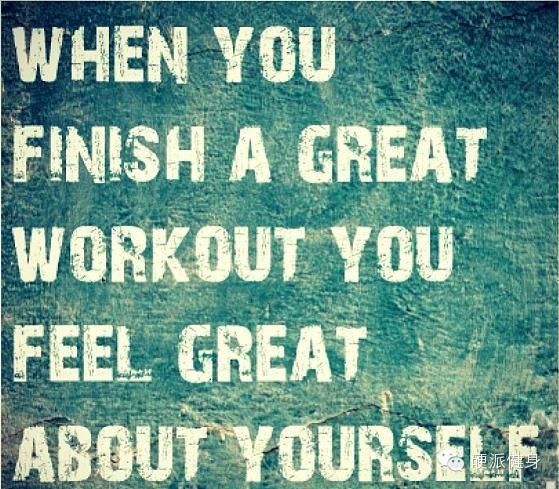
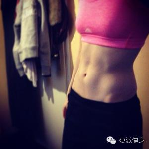

_点击上方蓝色的硬派健身，或者右上角三个点可以关注我_

  

前（fei）言（hua），最近有一点点忙，耽误了昨天更新，抱歉，而且最近给大家微信内回复的比较少。很多新老朋友给我的留言和问题，我也没有及时的回复。

等忙过这一段就会好的。到时也会努力回复大家微信内给我的留言。谢谢大家的体谅呀……

_  
_

以前我们曾经说到过，大家常常讹传的四十分钟以上有氧才能减肥是错误的（回复：长时间有氧 了解更多）。  

  

从减脂效果和减脂效率来看，HIIT（高强度间歇训练）才是减脂瘦身的最佳选择（简单HIIT训练，回复：HIIT 了解更多）。

  

HIIT运动也是近几年最流行的，大家谈论最多的减脂运动。最火热的insanity等操课也都是基于这个理论设计的。

我们今天来稍微谈一谈，HIIT训练更减脂的原因是什么？（浅谈哦~）

  

首先从字面意义上来讲，高强度间歇训练包含了两个重点，一个是**高强度**，一个是**间歇。**  

  

那位客官说了，你这不是废话嘛！你以为看客都跟你一样，语文是数学老师教的，数学是体育老师教的。

  

且慢动手，其实这两个字就是重点咯。

  

  * **变换的高强度——持久的减脂，刺激生长激素**

  

研究人员发现，对比强度一成不变的运动。穿插进高强度的变换强度运动（68-92%最大摄氧量）。虽然运动的总热量消耗没有明显的提高。但是运动后恢复期的静止的摄氧
量明显的提高了。

  

这也就是说，变换的高强度训练可以让减脂和消耗热量的效果持续很久，研究证明在72小时内，训练的减脂效果都仍然有效①。

另外，如果强度一直比较低，血乳酸水平也很低。高强度运动是可以刺激乳酸分泌的（初中生物课内容……）。  

  

而乳酸水平的提高，可以刺激生长激素的分泌。生长激素就是越痛苦时候，分泌越多。越高的训练强度，越能刺激生长激素的释放。生长激素一般被认为与乳酸阈强度有关系②。

  

生长激素的作用大致是促进蛋白质合成，减少葡萄糖的消耗，加速脂肪的分解，使机体的能量来源由糖代谢向脂肪代谢转移，有利于生长发育和组织修复③。（回复：增肌减脂
了解更多）

  

所以**变换的高强度不仅可以刺激增肌减脂的生长激素分泌，而且可以让运动的减脂效果持续非常久。**  

  

  * **间歇运动——强效减脂，促进脂****肪代谢**  

HIIT的另一个重要的减脂原因，就是间歇性。研究比较了有间歇与间歇的运动。（持续60分钟骑车和30*2分钟）。研究者发现在有间歇的运动中，脂肪参与供能的比例
较大，燃烧的脂肪也较多④。

  

这与平时大家想像的（或者说网上讹传的）正相反。很多运动媒体或教练总是强调，有氧运动不能中断，否则减脂效果会差很多。

  

实际上，在有间歇的训练中，人体交感—肾上腺系统的反应较大，分泌的肾上腺素等也较多。肾上腺系统分泌的激素都有比较强的刺激机体分解脂肪，让脂肪燃烧供能身体运动（
翻生理书吧……懒得找论文了）。

  

在上述的同一项研究中就发现，对比长时间持续有氧运动（ACT），间歇运动的肾上腺系统反应较强烈，肾上腺系统激素分泌较多。所以间歇训练的燃脂效果更好。

  

所以从今天起，抛弃传统的40分钟以上持续有氧训练，选择更高效率的减脂运动HIIT吧~

  

（为什么长时间有氧并非最好的减脂运动，点击最下面原文链接可以看我原来写的一个旧文。就不贴了。别忘点赞哦~）

  

  

****~请把我的文章分享到自己的朋友或朋友圈~****

**啊啊……觉得本文有用的朋友可以给我点个赞（最底下）。**

**  
**

①Knab AM，Shanely RA，Corbin KD，Jin F，Sha W，Nieman DC．A 45-minutevigorous
exercise bout increases metabolic rate for 1 4 hours．Med SciSportsExerc．2001

②有氧运动和力量训练不同顺序组合对超重大学生体适能的影响王明献，李玉周  

③运动对生长激素的影响 张颖 李涛

④Goto K， Ishii N， Mizuno A， et al. Enhancement of fat

metabolism by repeated bouts of moderate endurance ex-

ercise. J Appl Physiol， 2007

  

阅读原文 举报

[阅读原文](http://mp.weixin.qq.com/s?__biz=MzA5NjQwMTQxOA==&mid=201247515&idx=1&sn
=6543913d1eb7092403f2cd3e872f9f19&scene=0#rd)

