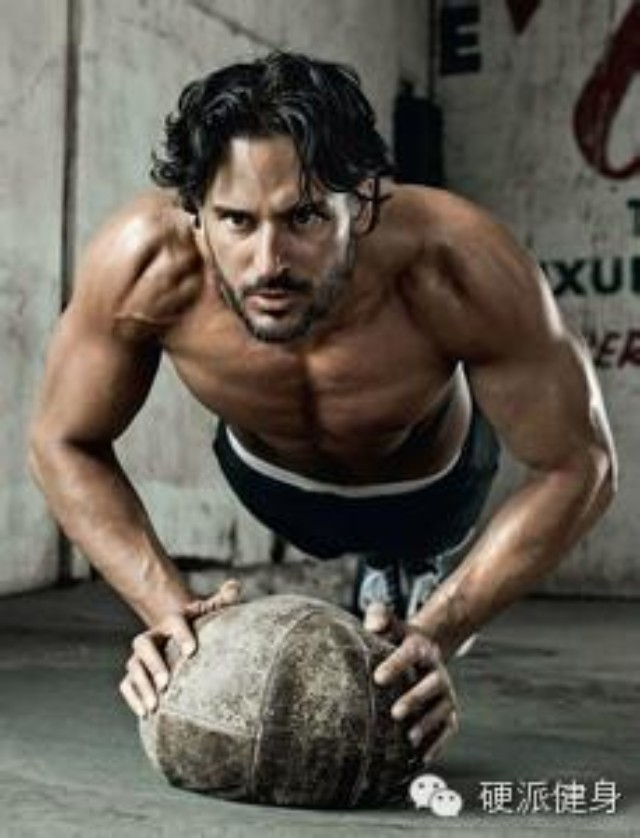
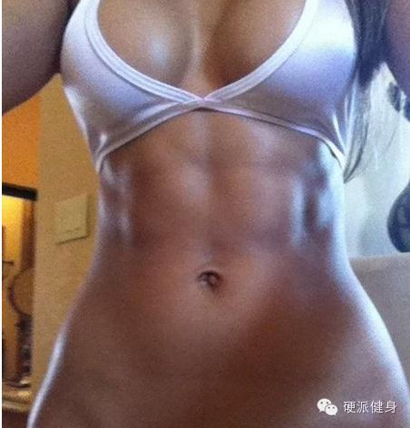
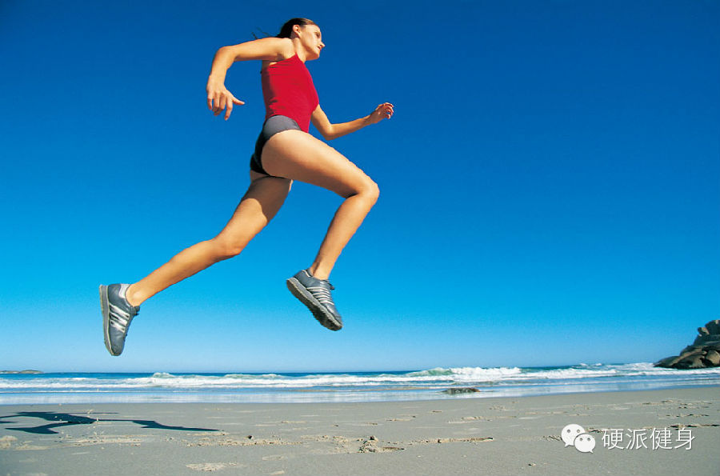
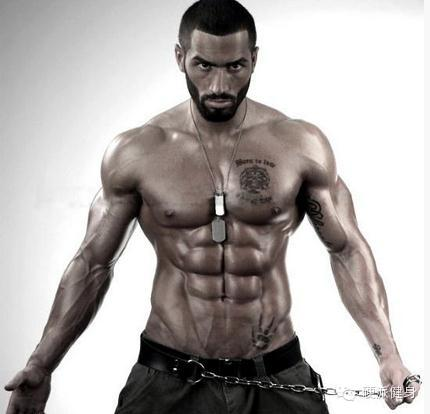

_点击上方蓝色的硬派健身，或者右上角三个点可以关注我_

  

一直以来，我们都在强调一个观念。如果想减脂，不光需要消耗热量与脂肪。更重要的是，缔造一个脂肪与热量消耗能力强大的身体。而FFM（去脂体重，粗略可看做肌肉）的
含量，是增加日常代谢重要因素。也就是说，肌肉是消耗脂肪和热量的大杀器~！（回复：无氧训练重要性 了解更多）

  

上次在那篇《空腹训练更减脂？对身体有害？》的文章中，我曾经提到过，运动尤其是耐力运动后会对肌肉蛋白的丢失①。尤其是在空腹运动或大强度训练后，肌肉更是会被消耗
。（回复：空腹训练 了解更多）

  

辛辛苦苦练得肌肉，我还指着它帮我减脂塑身、提拉身形、增加日常代谢呢！谁想到他出师未捷身先死！

  

那么在运动中，有没什么方法能帮助我们保护肌肉，只减脂不减肌呢？恩……运动补剂支链氨基酸可以帮助到你。（之前的运动补剂文章，可以回复：运动补剂 或者 左旋肉碱
或者 蛋白粉 了解更多）

  

**支链氨基酸是什么？安全吗？**

  

支链氨基酸（以下简称BCAA，包含有亮氨酸、异亮氨酸和结氨酸），虽然听起来名字灰常生化，距离生活非常遥远。但其实呢……只是人类日常摄取的必需氨基酸而已。也就
是日常生活中，你每天都在摄入这些氨基酸。作为运动补剂的BCAA只是把它提纯让你在运动前后能更迅速摄入而已。

  

**目前学界普遍认为日常小剂量的摄入BCAA是比较安全的**，运动员实验中，日3.3克补充六周无任何副作用②。而另一项运动员实验实验中，急性摄入10-30克BCAA也未产生不良影响③。

  

最极端的动物实验中，动物摄入BCAA每日2.5g\kg，补充3个月也没有中毒迹象。人类按这个剂量摄入，就可以把BCAA当饭吃了（Okazaki,S
1989）。

  

**BCAA最主要的作用是什么？**

  

BCAA最重要的作用有：**运动中保护肌肉不降解、不受损（包括骨骼肌和心肌）；促进肌肉损伤的修复与肌纤维生长；增加耐力；减低运动性中枢疲劳。**

**  
**

**BCAA适合什么样的人？**

**  
**

****首先最适合的人群，是**常常做有氧运动减脂的健身者**。刚才我们说到了，有氧运动会导致肌肉蛋白降解。虽然消耗脂肪，但是却降低了身体日常代谢。如果能在运动中保护肌肉不流失，也能在很大程度上，保护身体消耗脂肪的能力。而且BCAA还可以增进耐力，降低运动疲劳。同理，还很适合**短期内需要大量减脂减重的人群和空腹训练者。**

另外，BCAA也很适合需求增肌的人们。BCAA可以促进肌肉损伤修复，而且可以增进肌纤维生长。BCAA也可以保护心肌和线粒体健康，也可以保护身体。

****

******BCAA是如何作用的？**

**  
**

****恩……不想看太麻烦的东西直接跳过。这里阐述一些比较原理性的东西。我尽量深入浅出一点。

  

支链氨基酸是不需要通过肝脏，直接可以被肌肉直接吸收利用④。并且，BCAA在肌肉中的代谢产物，可以促进胰岛素分泌，抑制胰高血糖素分泌，进而减缓肌肉蛋白分解，被
认为是肌蛋白合成分解的调节信号⑤。同时，BCAA可以通过促进鸡蛋白多肽链合成来促进肌肉合成⑥。（防止肌肉分解、促进肌纤维合成）

  

另外，服用BCAA可以刺激胰岛素和生长激素的分泌，促进肌细胞摄取葡萄糖，促进骨骼肌回复[7]。

**BCAA何时服用？摄入量？**  

  

一般我们摄入BCAA的最大目的是防止运动中肌肉分解。所以最好放在运动前摄入。

  

摄入量目前学界没有定论，不过一般3克左右的用量对于一般人是比较有效且安全的。高阶训练者或大体重人士可以酌情增加。

  

**买什么牌子？**

  

这是上次发过左旋肉碱和蛋白粉后，大家问的最多的问题。

  

我要是有自己品牌或者广告赞助者，我一定告诉你买XXX。可惜我没有……所以只要有质检的基本没有问题。如果比较担心质量问题，可以买些大品牌的基本款。

  

一个标准是，不要买说的特别高端和神乎其神……

****  
****

（哎呀……写这种最累了……看了两天论文，话说我写的杂七杂八的大家看不看。有的跟健身没什么关系，但不会耽误正常更新。如果大家特别抗议……就发我个“抗议”好了…
…）

****  
****

****请把我的文章分享到自己的朋友或朋友圈~****  

**啊啊……觉得本文有用的朋友可以给我点个赞（最底下）。**

  

①Michelle J，Rennie，protein and amino acid metabois during  

and after exercise and effect of mutrinon 2000

②Crowe M J, Weatherson JN, Bowden BF. Effects of dietary le-

ucine supplementation on exercise performance . Eur J Appl

Physiol. 2005

③Gleeson M Interrelationship between physical activity and

branched - chain amino acids . J Nutr . 2005

④wagenmakers A J M & Van Hall branehed-chain amino acids：mitrion and
metabolisn in exercise。1996

⑤Griinari J M等 The role of insulin in 他和 regulation of milk protein synthesis
in dairy 1997

⑥Blomstrand E.Eliasson J.Karlsson H K Branched-chain amino acids activate key
enzymes in protein synthesis after physical exercise 2006

[7]Takeshi Nikawa Effects of soy protein diet on exercise induced muscle
protein catabolism in rats 2002

  

举报

[阅读原文](http://mp.weixin.qq.com/s?__biz=MzA5NjQwMTQxOA==&mid=201617486&idx=1&sn
=d207e6f2a7a0f74e7fd1f07ad243996c&scene=0#rd)

