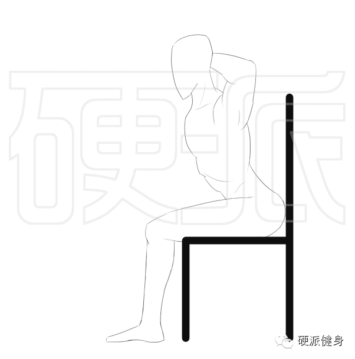
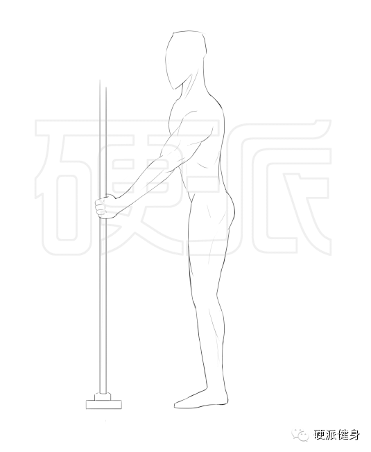
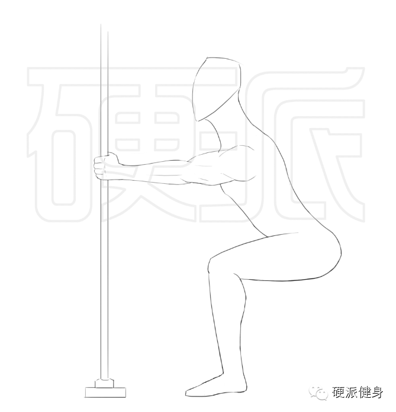
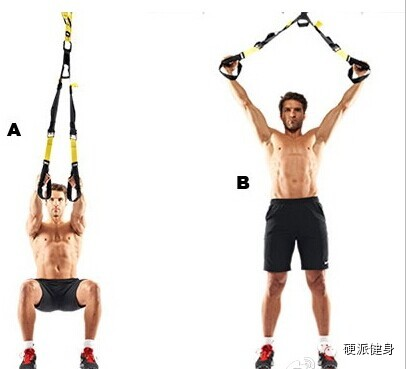
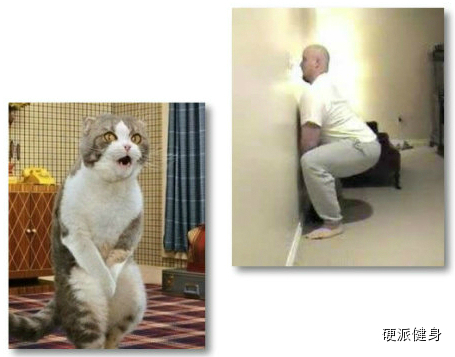
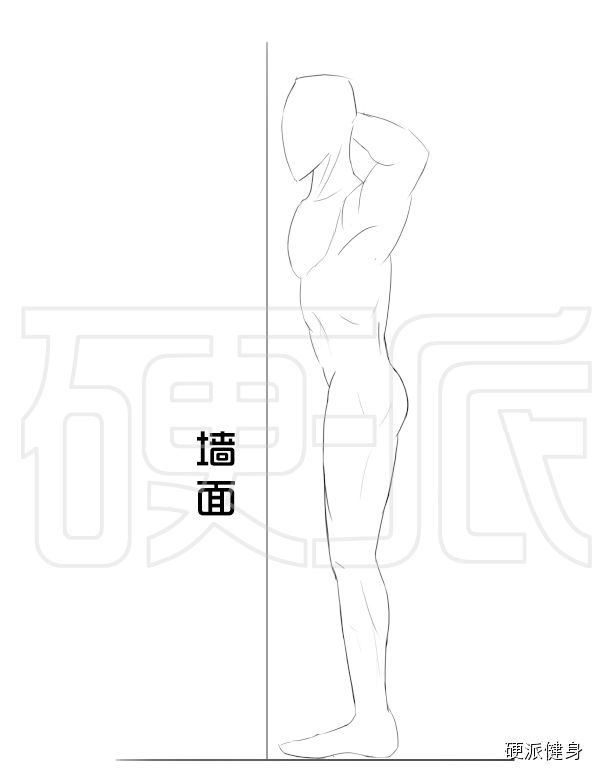
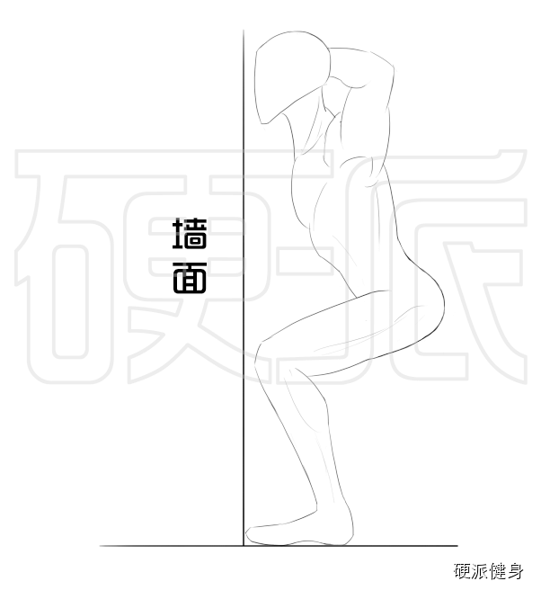
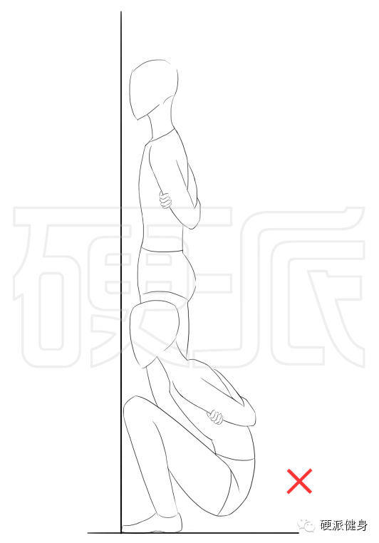
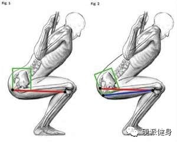
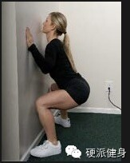

点击上方蓝色的硬派健身，或者右上角三个点可以关注我呦~~~

  

上次给大家开了个坑，说了说在日常的家庭空手深蹲中。大家最容易出现的问题（回复：深蹲01 了解更多）。

_膝关节_

  

_髋关节_

练深蹲时，最大的问题就是重心和躯干位置调整不对。一般来说，就是所谓的没有向后蹲，而是向下蹲。

  

臀大肌的作用，就是使髋关节伸直。所以如果你太过于注重向下蹲而非向后蹲，只改变了膝关节的角度，而没有着重改变髋关节角度。不仅对整体的训练效果无益，而且，这种错
误的姿势，会导致你大腿更粗，膝盖更容易受伤！

  

大多数人在做深蹲的时候，总觉得哪里不对，但好像又没什么不对。在这种时候，你很可能已经做的不标准了！

  

一直以来，各种健身大V和媒体都告诉我们。做深蹲时，膝盖不能超过脚尖。我相信他们的初衷是好的。但实际上，如果你的腘绳肌群（主要是股二）不够有力。你很难在不摔倒
的情况下做出标准的徒手深蹲……

  

今天我就来给大家介绍两个徒手深蹲的动作，能让大家更有效掌握正确的深蹲姿势！

****徒手深蹲初阶版：沙发深蹲——安全与高效可以兼得**

“害怕深蹲第二天会很疼，怎么破？害怕膝盖受伤，怎么破？身体很弱或者中老年人想深蹲，怎么破？”

“唯有沙发深蹲可破之~~~”

  

**沙发深蹲动作要点 

  

1.从站立姿势慢慢坐在沙发上，双手置于脑后。

2.背部挺直微反弓（重要）**，把臀部往沙发深处挪移！就是往深处坐，坐得非常靠里。**

  

3.头正直看前方，背部挺直微反弓，用臀部的力量发力到脚后跟，蹬地起身~！

  

沙发深蹲是我最推荐初学者的深蹲秘籍。由专业力量举几十年最大发现的箱式深蹲变形而来。若说沙发深蹲的优点呢~~首先是安全，由于沙发深蹲的起坐都是在软软的沙发上，
几乎不会让身体受伤或劳损，中老年人。

  

其次是无痛（……），很多人在初次接触深蹲时，兴致勃勃的做了几十个。不料第二天大腿和大腿后部酸疼难忍，所以就没有坚持下去，放弃了深蹲……沙发深蹲由于在离心阶段
有沙发承接，所以少了很多离心阶段对肌肉的拉力。我们以前说过，离心收缩是导致运动后肌肉酸疼的主要原因①（回复：离心00
了解更多）。所以沙发深蹲，可以让你能坚持训练！

  

最后，沙发深蹲可以矫正你的深蹲姿势**。为什么要往沙发深处坐一下？这就是让你调整自己的重心更靠后，让臀大肌处于更能发力的状态！**在沙发上，你可以不依靠股二
头肌的力量就能轻松的调整身体平衡。让自己做出一个标准的深蹲！

  

****徒手中阶版：拉力深蹲——让初学者都蹲的完美~**

“为什么你不能向后坐？”

“因为腘绳肌力量不够，怕摔倒……”

“怕摔倒，你拽着点儿什么，稳定身体不就好了~~~”

  

拉力深蹲就因为是这样的想法诞生的~“如果我向后坐会摔倒，那我拽着点儿什么不就完了？”

  

**拉力深蹲动作要点：

1.双手置于胸部以下，跟肚脐差不多高度。握住一个固定的支点（一定要结实啊！别拉断你家什么管道柜门儿。寄给我账单我也不认。）。

2.向后坐，上半身挺直（微微反弓，就是挺胸挺肚子的感觉），头部正视前方。双手拉住固定点防止自己向后摔。**虽然叫拉力深蹲，但其实双臂不要使太多劲儿！只有自己
要摔倒的时候才稍微拽一下。**

**** 

3.心里想象、默念：臀部发力~ （回复：念动一致 了解更多），让臀大肌主动发力。站起来。

  

比较有训练经验的人，可能会发现，这很像TRX训练里面的深蹲。没错，原理其实都是一样。因为腘绳肌力量不足，不敢往后坐，就用手提供一些稳定的力量。

  

在拉力深蹲的时候，不要让双手承担过多的重量。拉力深蹲只是你在深蹲之战中的第一步，可以说是个新手村任务。**在这个动作中，我们是要训练更标准的深蹲姿势。在动作
的最低点，我们可以稍微弹震一下（上下晃晃），此时头部正直、保证自己的下背部是挺直反弓的，髋角折叠比较大（小腹贴近大腿）。你会感觉自己的臀大肌有被拉伸的感觉。
恭喜你~你已经走在胜利的路上啦~！**

**  
**

拉力深蹲可以采用相对多的训练次数和组数。一般人可以在掌握动作后可以多做些，例如30个 *
5组。这样更有利于掌握姿势。也可以使用爆发力训练，比如到最低点时，以最快的速度弹起。这样可以让臀大肌更好的得到训练~。

  

****徒手进阶版：面壁深蹲——检验你的姿势！**

“你的深蹲姿势标准嘛？来个面壁深蹲！”

当你已经熟练的掌握拉力深蹲，或者感觉自己的训练水平不错了。你可以用这个姿势来验证。

  

同时，面壁深蹲也可以时时刻刻的让你做的姿势更加符合标准。让你能每次深蹲都更有效果。

_有什么能比脸前的一面墙更能让自己想到该规规矩矩的呢？_

_至少华山派的人是这么想的……_

  

**  
**

**正确的面壁深蹲动作要点：

1.面对墙壁站立，手抱头、趴着墙或者双手自然下垂都可以。（我图内是抱头了）  

2.慢慢向后坐~就像标准深蹲一样~上身反弓、挺直）。我们上回说到，标准深蹲姿势是膝盖不过脚尖的（虽然这话可以深入探讨，不过一般人能照做就可以了）。

3.在大腿与地面接近平行时（臀部也感觉被拉伸了），臀大肌发力，快速起身，回复直立。

  

**请不要相信网上的一些面壁深蹲的教程和图片！我看到的有很多教程都是错的。根据他们的教法练出来的深蹲。等上了负重就是一个死！**

** **

_上图就是错误的面壁深蹲，也是我看到最多的网上教程所教导的面壁深蹲！_

  

这种姿势为什么是错误的呢？当你蹲到最底下的时候，你的腰部整个都塌了。如同下图一样，这种姿势会让骨盆和脊椎处于不正确的位置。如果你是按照这种方式负重深蹲，你很
容易就嘎嘣儿脆了……就算是徒手深蹲，这样也会让你的臀大肌发不上力。

_ _

_上图中，左图为正确姿势，右图是错误的，因为骨盆出现反向卷动，臀部肌肉就发不上力了。_

_  
_

面壁深蹲一定要着重注意背部反弓、挺直的。因为面壁深蹲时，肯定能提醒你脸、膝盖和脚尖的角度是正确的了。如果你再能保证你的背部反弓和挺直（回复：背反弓
了解更多），你的深蹲姿势就一定是正确哒~_  
_

如果你的动作感觉不太舒服，可以试试双手扶墙或者自然下垂。都是不会损失太多动作标准度的。

  

\------------------------------------------------

这回真算是吐血大拍卖了……本来想是三个动作写三天的，后来想想，还是一咬牙努力写出来吧……

  

这三个动作基本上是我浏览总结出来最好的徒手深蹲入门动作了（第一个沙发深蹲，还是我从力量举中自己总结出来的，不知道有没跟别人创意雷同过）。按着这三个动作训练，
可以在最短时间内掌握最标准的深蹲。

  

下次更新，我会给大家做一个小的训练计划表~请大家今天开始训练熟悉这三个动作哦！

  

**~~~****喜欢的话，请分享到自己的朋友或朋友圈，谢谢大家****~~~**

**  
**

**恩恩****……****求多分享啊**

**  
**

**觉得本文有用的朋友可以给我点个赞（最底下）**

**  
**

  

①Cheung K;Hume P;Maxwell L Delayed onset muscle soreness:treatment strategies
and performance factors 2003

阅读

__ 举报

[阅读原文](http://mp.weixin.qq.com/s?__biz=MzA5NjQwMTQxOA==&mid=203622320&idx=1&sn
=27ff5aadd1a44253216d1ebbd0e88c6d&scene=1#rd)

