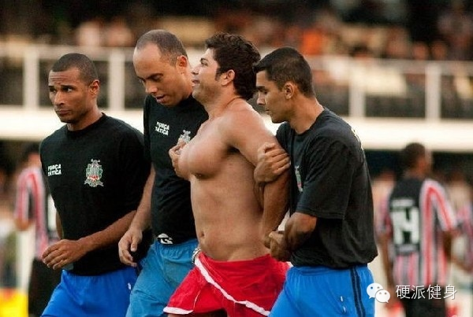
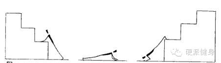
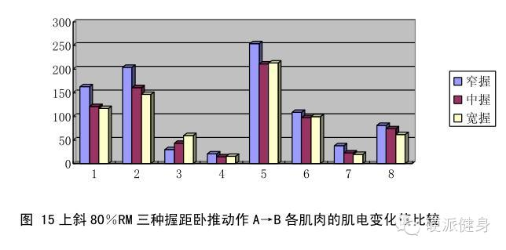
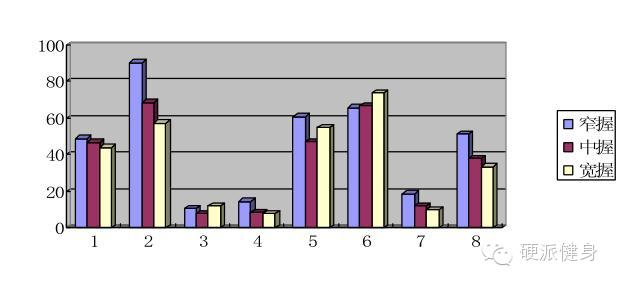
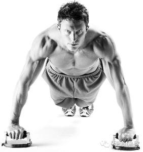
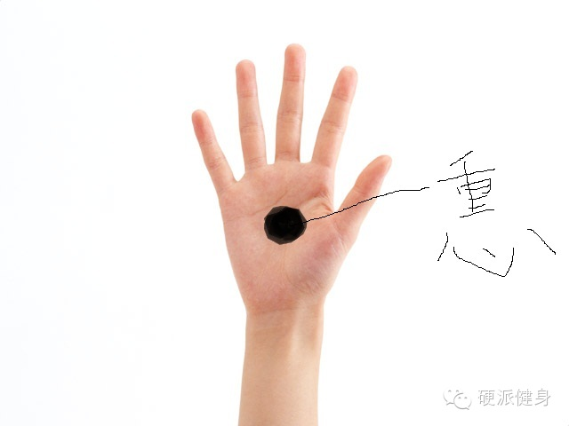
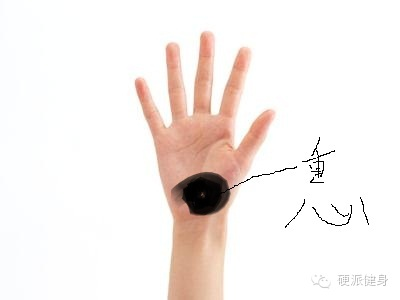

_点击上方蓝色的硬派健身，或者右上角三个点可以关注我_  

_  
_

**严正声明一下，内容都是我一个懒癌末期的人用绳命写下的。各种不说明就转载的人，盗内容的人，你们留点良心吧……**

_  
_

_**依旧找小伙伴一起玩！硬派健身招聘：安卓IOS开发攻城狮、媒体运营、**行政**，工作地点北京，具体可以回复：**_找伙伴_**
了解更多。简历可发到：ohhard@163.com。**_

_实习的同学，也可以发简历给我啦~~~_

_  
_

童鞋们，上回写的俯卧撑大家练了吗？感觉如何呢？

_你以为你练俯卧撑的样子。_  

_实际上你练俯卧撑的样子。_

_  
_

咳咳，不开群嘲了，省得你们打我……

  

俯卧撑是非常好的一个训练动作，除了能主要塑形的胸肌、三角肌前束、肱三头肌以外，对核心肌群也有很好的训练效果。不用器械，居家练习也很方便。

  

然而仅仅普通的标准俯卧撑，还是有很多局限性的。跟大多数无器械动作一样（回复：无器械局限 了解更多），俯卧撑于发力角度和训练重量上都不好调整。这两期俯卧撑专题
，我们就着重说说这两点（也只能是相对完善的计划，若真想练的好或你真的做不起俯卧撑，请去健身房吧……各种器械满足你）。

  

我们知道，胸肌光靠普通的平板俯卧撑、卧推等绝不会好看。胸部是分上、中、下三大部分，只有三个部分都得到应有的训练，胸部才会有型。（如果为了塑形，其实还有中缝）

_以前就写过的，只练平板卧推、俯卧撑等容易形成的**卧推胸**（在健身房浴室里也很常见）。只是圆球，没有锐利的线条和方正的胸型，不具美感。穿衣服也不好看。恩
……女生也别想练成这样，对防下垂不利，胸型也不好看。而且练成这样卧推也得100+kg了吧……_  

_  
_

__那么如何调整自己的俯卧撑计划，不仅能训练胸，而且能让胸部上中下都训练的有型呢？

_  
_

__

**训练下胸可以采用上斜俯卧撑、训练下胸可以采用上斜俯卧撑（别弄反了……）**

上斜俯卧撑，将手撑在支撑物上，整个身子向上倾斜，所以叫上斜俯卧撑。主要练下胸。

  

下斜俯卧撑，将脚放在支撑物上，整个身子下斜，所以叫下斜俯卧撑，主要练上胸。

恩，这个可能有不少人已经知道了。我来说点大家可能不知道的。训练上胸最好采用下斜**窄距**俯卧撑，训练下胸最好采用上斜**宽握**俯卧撑①。

上斜卧推（基本俯卧撑是相似）的肌电水平，1为胸大肌上部，可以看到窄握时，对胸大肌上部的训练效果最好。

****下斜卧推的肌电水平，6为胸肌下部，可以看到，宽握对于胸肌下部的训练效果最好（实际上该研究情况比较复杂，我是阅读后考虑大家的训练方式将其简化了，只作为参考）。

****另外，如果你有俯卧撑架或者有哑铃（能稳定的做啊，别受伤），你可以采用下斜**反手**俯卧撑，这样训练上胸效果更好。（在05年的一项研究中，研究者发现反手卧推比传统正手更能刺激胸肌上部，这是由于胸肌上部是连着锁骨的。要训练到胸肌上部，最好要运动到胸锁关节）

  

**  
**

**俯卧撑架有用嘛？**  

俯卧撑架还是有用的。首先讲，传统的俯卧撑，重心是在掌心附近（鼠绘勿怪……）。

普通俯卧撑的重心在掌心附近。

使用俯卧撑架的话，重心会转移到掌根附近。  

  

别小看这重心的转移，这可以让你的胸肌更好发力，改变胸锁关节的发力角度，从而让你更好的训练到胸。并且减少肘部受到的剪切力。

另外，俯卧撑架子可以让你初始胸肌拉伸幅度变长，胸肌的发力会更多，胸肌负荷会变大。比如上图的情况，实际上你做普通俯卧撑时候，你胸肌是不会被拉伸到这个地步的（身
子就贴地了）。而你用俯卧撑架的时候，胸肌的拉伸程度是会更大的。

  

恩……这回的专题说明了，如何用各种俯卧撑训练胸型。下一回，我们说说如何用俯卧撑解决训练负荷和爆发力的问题~~~请期待哦~！

  

****~~~喜欢的话，请分享到自己的朋友或朋友圈，谢谢大家~~~****  

**啊啊……觉得本文有用的朋友可以给我点个赞（最底下）**

  

①不同姿势与不同负荷的卧推肌电特征分析 张素杭

举报

[阅读原文](http://mp.weixin.qq.com/s?__biz=MzA5NjQwMTQxOA==&mid=201793349&idx=1&sn
=618883fa5d7502d9ae55869a7ed99e0e&scene=0#rd)

