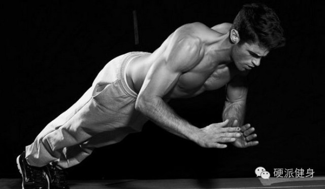
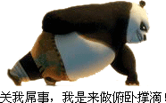
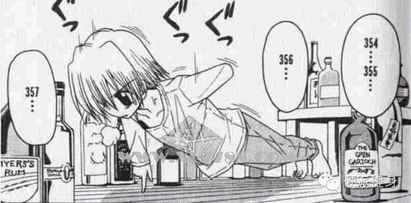
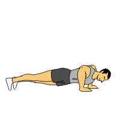
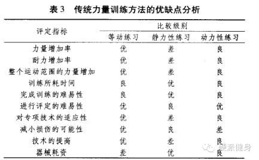

_点击上方蓝色的硬派健身，或者右上角三个点可以关注我_  

_  
_

**严正声明一下，内容都是我一个懒癌末期的人用绳命写下的。各种不说明就转载的人，盗内容的人，你们留点良心吧……**

_  
_

_**依旧找小伙伴一起玩！硬派健身招聘：安卓IOS开发攻城狮、媒体运营、****行政、平面设计****，工作地点北京，具体可以回复：**_找伙伴_**
了解更多。简历可发到：ohhard@163.com。**_

_实习的同学，也可以发简历给我啦~~~_

  

这几期，我连续介绍了俯卧撑这一动作的各种细节（回复：俯卧撑
了解更多）。比如究竟是宽据还是窄距能更练胸？如何在家用俯卧撑修正胸型？上胸与下胸对握距有何不同要求？

  

虽然依据浏览量来看，大家对于这个专题还是比较认可的。但还是有不少人对我提出了一些疑问。有一些人身材比较苗条，他们对俯卧撑的疑问是“由于体重较轻，比较轻松就可
以完成几十个俯卧撑，几乎不会对肌肉产生酸胀感和泵感。这已经不是抗阻训练，几乎变成有氧训练了。”另一些人训练时间较长，表示“以往都是卧推100+kg的杠铃，在
家做俯卧撑总觉得负荷不够，”

  

如何增加训练负荷和训练效果呢？单手俯卧撑吗？一指禅俯卧撑吗？

  

  

错，虽然单手俯卧撑从负重上确实增加了。但是单手的运动形式与双手截然不同，主要依靠肱三头肌伸肘的力量推动身体，而非我们想练习的胸肌和三角肌(屈肩)。所以且不说
单手俯卧撑和一指禅大家能不能做。就算做得出来，也达不到你想练的训练效果。

  

今天我介绍的这个心目中最强**俯卧撑，一次满足你们所有问题。不仅还是像俯卧撑一样，无器械，随时随地方便训练，针对胸肌等大肌群。而且还可以更强效的增加力量、耐
力与整体塑形！

  

恩，话不多讲，很多人从标题图已经看出来了，今天介绍的就是**击掌俯卧撑**。

做法如上图啦~~~虽然叫做击掌俯卧撑，但是不击掌也是完全没问题的。动作与传统俯卧撑完全一样，只是在发力阶段尽量把自己推起就可以了。

  

别看只有这一点点变化，肌肉的发力形式就完全不一样了。以往的传统俯卧撑，推起时是肌肉在做**等张收缩，**下落时，则是肌肉在做**离****心收缩。**而击掌
俯卧撑，推起时肌肉是在做**等动收缩**，下落时肌肉在做**超等长收缩**。（实际上肌肉的收缩形式很复杂，相互交织，这里简化些说，不做太学术的判别了。）

  

_**推起阶段的等动收缩**_

_**  
**_

所谓等动收缩，是指整个运动内，所有肌肉都发挥了自己最大力量（简言，以后会着重介绍）。

举个栗子，传统俯卧撑，很可能是力量最小的肱三头肌发挥了100%的力量，而力量最大的胸大肌只是发挥了50%的力量。而击掌俯卧撑，由于是在一瞬间内要将自己推起，
所以几乎所有参与的主动肌肉，都要发挥自己的100%的最大力量。是相对训练效果最好的肌肉收缩形式之一①。

  

事实上我一直想给大家开的坑——弹力带训练。效果非常好的原因之一也是弹力带是很好的等动练习方式。（所以请等待吧。因为弹力带训练是没有可以借用的图的，我要自己制
作。没图……无图言屌？）

  

**_下落阶段的超等长收缩_**

  

所谓超等长收缩，是指肌肉在缓冲制动的阶段，肌纤维被拉长，然后立即快速有力的继续进行收缩的一种方式。是目前学术界认为最佳的训练爆发力的训练方式②~~~

  

以击掌俯卧撑为例，下落时肌肉吸收了冲击力，拉长了肌纤维，并把一部分储存在肌肉的弹性物质等之中（肌腱与筋膜等）。同时肌梭感受到拉伸，迅速反弹。又将自己推起。

  

_**击掌俯卧撑的优点~**_

_**  
**_

首先，很好解决了训练负荷的问题。无论你有多重，或者力量水平多好，你都可以爆发自己接近100%的力量。因为你不仅要把自己推起来，而且要让自己尽可能的腾空（多余
的力量会带你装逼带你飞……）。

而且也很好的解决了传统俯卧撑肌力训练不平衡的问题。以往都是小肌群得到100%负荷训练，大肌群如胸肌只能有50-70%负荷。而且小肌群一旦没力量了，你的俯卧撑
也做不下去了。等动收缩后，所有肌群都发挥了接近100%。  

  

而且，传统力量+超等长训练是目前学界最主流能提升力量和爆发力的训练组合。在一项六周的研究中，传统阻力训练，使受训者垂直条高度增加了3.3cm，只做超等长训练
的增加了3.8cm。而传统阻力+超等长训练的受训者弹跳力增加了10.7cm③。（我自己也很喜欢用，实际上还有很多其他超等长训练的方式，我以后会介绍给大家）。

  

**注意事项：**

  

虽然是比较安全的动作，不过下落时会受到一定冲击。所以一定要循序渐进。一开始目标是掌握由胸部肌肉、三角肌吸收冲击的方法。不要用关节和骨骼强吃下落的力量，这样不
仅不能很好的训练到肌肉。而且也会对关节产生不好的损耗。

  

掌握后，是感觉每次能像弹跳一样用胸肌弹起来身体。

_不是这样弹起来的哦~_

  

另外，用俯卧撑架也很好。因为上回说过，俯卧撑架可以很好的转换重心，让胸肌承受更多的力量，非常适合击掌俯卧撑。**不过用俯卧撑架就不要击掌了……腾空即可……*
*

  

明天做一个简单总结，俯卧撑篇就结束啦~~~

  

****~~~喜欢的话，请分享到自己的朋友或朋友圈，谢谢大家~~~****  

**啊啊……觉得本文有用的朋友可以给我点个赞（最底下）**

  

①力量训练方式发展研究 宋德海等

②Bompa OT. Periodization training for sports: programs for peak strength in 35
sports [M]. USA. Human Kinetics Publishers: Champaign, IL, 1999:

③ Adams K, O'Shea JP,O'Shea KL,et al. The effect of six weeks of squat,
plyometric and squat-plyometric training on power production [J]. Journal of
Applied Sport Science Research, 1992.

  

举报

[阅读原文](http://mp.weixin.qq.com/s?__biz=MzA5NjQwMTQxOA==&mid=201836142&idx=1&sn
=75d010a3c453a71fdc026eade382c07f&scene=0#rd)

