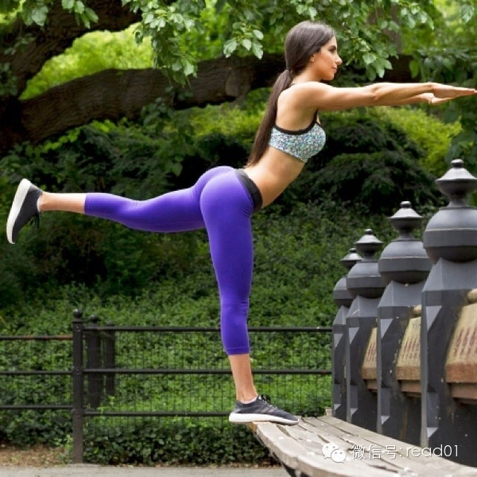

  

写过不少的减肥文章，但还是总能看到很多女性通过节食来减肥，昨天在知乎上看到@宁飞 写的文章，他通过自己的经历来解释这个问题，我同意他的观点，不管是节食还是健
身都是生活方式的一种自然反馈，当你不改变生活方式却梦想控制食欲和懒惰本能而减肥，那是徒劳的。

经过@宁飞 的同意，把这篇文章跟大家分享一下。

这个答案是回答问题：为什么健身减肥的人会拼命鄙视节食减肥的人？

里面说男人喜欢“牙签腿”，并拿B站的“镇站之腿”为例。

## 正文

作者：宁飞  
出处：点击『查看原文』

首先作为一个男人，我要说的是，谁说男人都喜欢纤细、瘦弱的美女？  
你以为男人都喜欢这样的腿吗？错，喜欢翘臀（臀翘大腿粗）的大有人在！

这样健美女性才是我所喜欢的，我从来不嫌她们腿粗，我只看她的臀有多么翘。而且据我所知，在经常运动的圈子里，健身的男人普遍也不喜欢不运动女性（经常运动的女性也不
喜欢不运动的男性）。

发完图说说我的经历。

本人是三十而立男，身高175cm，最高体重83KG。控制饮食和运动都干过，目前体重维持在68KG（早起称重，下午称重为70KG）。作为一个过来人，我来说说我
对节食减肥和运动塑身的认识。

先说结论，因为我自己也干过节食减肥，所以没办法鄙视人家节食减肥，但是现在真心觉得以前自己节食减肥非常傻叉。

### 节食减肥

本人就是一个从乡下进城的穷屌丝，大学毕业后多年未运动，偏好大鱼大肉重口味，娱乐就是我在家里上网。这种生活方式自然只能是体重不断飙升。但是我从来不认为减肥可以
成功，我不相信任何减肥药，它们的副作用我都清楚。那时候我一直认为减肥和戒烟一样不靠谱（虽然我不吸烟）。

直到去年听到我一位高中女同学生完孩子后，体重从120斤减到两位数。不得不说，活生生的案例刺激到我了，身边现实的案例比什么都有说服力。我那女同学的方法就是不吃
主食（米饭）。这对我来说完全没有问题，虽然毕业好些年了依然一事无成，但是我的耐性和耐力算是练出来了。于是我开始节食减肥。

我不是盲目的人，我很清楚一味地克制不吃，很容易就放弃，所以我制定一个技能满足口腹之欲又能减肥的三餐方案。说起来并不复杂，也就是落实三餐递减，“早上吃得像皇帝
,中午吃得像平民,晚上吃得像乞丐”，想吃肉喝汤早餐或午餐吃，严格控制晚餐。朋友聚会我都尽量推动中午进行，聚会上依然大吃大喝，但是晚饭就只吃一点水果，平衡回来
。周末自己做饭也一样，午餐大吃，晚餐只吃一点水果。

那时候我在一家公司上班，公司有食堂，午餐免费，但是免费的午餐口味怎么样，我就只能呵呵了。简单地讲，吃了一个月食堂，出去吃了一次筒骨粉，当时真觉得美味呀。难吃
食堂饭也成为我减肥的助力。每天午餐我都吃的和那些减肥的女同事一样少，这样到下午四、五点的时候真的是饥肠辘辘，但是晚餐依然不敢多吃。

这样坚持了大半年，也成功减肥10公斤。我应该高兴吗？现在我只觉得当时我那样做很傻逼。

**回头看看我节食减肥的经历，我只能这样说，如果不是今年6月份开始跑步了，我肯定是弄坏了身体并且体重还会更猛烈地反弹回去。 **  
期间身体有两次报警但是我没听明白。

一次是从椅子上站起来，膝盖咔一下，疼了半个月，一次是站起来，扩一下胸，后背的骨头咔一下疼了一个多星期。那时我的身体就像一个上锈的机械，稍微一动就会散架。我没
去医院做过检查，但是我推测这应该是骨质疏松症了。

另一个警告可能就是身体性功能的退化。节食减肥以来，作为一个刚过而立之年的男人，我已经感觉有点力不从心了。每天上班回家都疲惫不堪，精力差，自然也勃起硬度差，痿
的又快（这也是后来促使我跑步的原因之一）。现在想想，节食后我的身体状态比我没减肥之前还差。

还有一些我没注意到，我前同事告诉我，我当时的气色极差。

**而且，现在跑步之后，看来很多书之后，我怀疑我当时减掉可能更多的是瘦体重，也即是说我消耗了我为数不多的肌肉。**

在减肥10公斤后，碰巧体重秤坏了，所以我也不经常称重了，晚餐也没那么克制了，很快体重反弹了3公斤。按着正常的情节发展，估计到现在我的体重估计就不止83kg了
。

### 下面说说运动减肥

今年6月份我小感冒一次，深觉得身体各方面都不行了（床上也不行了），所以这次下决心跑步。如前所说，本人一直不缺耐性和耐力。在知乎上吸取新手经验之后，我就下载一
个跑步APP跟着上面训练计划来了。具体学习与进步我就不说了。现在说说跑步以来的收获。

跑步的时候我的体重大概是74公斤，然后以平均每月减重2公斤的速度减到68kg，进入现在的平台期。

当然减重并不是最大收获，事实上现在我跑步也根本不是为了减肥，相反现在我**减脂，我健身，我做力量训练，都是为了跑得更快。**

跑步后我的睡眠质量大大改善了。以前我的眼睛只要迷上就N多梦，现在基本不做梦一觉到天亮。

跑步后我还发现我的慢性肠炎大大改善了。以前我大便一直很急，一直都很稀，只要一受凉或吃凉东西就可能拉肚子。而广州地铁里没有卫生间，而对以前的我来说，半路闹肚子
真不是个小概率事件，你不是每次都能憋到公司的************。跑步以来，至今我没在遭遇这种恶心的事。

跑步后我感觉我的性功能应该年轻了2-5岁。节食的时候我很少晨勃，现在即使当晚跑了15K，夜里起来下厕所依然会发现我的二弟昂首挺胸、不肯定低头。不过虽然性功能
虽然年轻不少，但是却发现自己的性欲真的是大大降低了。以前一周做爱1-2次，现在两周不做，即使跑休两天，精力旺盛也没啥想法（家有奶娃也诸事不便）。

（补充：最新发现夜跑15K、或晚上做一小时徒手深蹲、箭步蹲之类的力量练习，洗完澡还有精力和老婆做一次，凌晨起床小便，小弟照旧晨勃。）

跑步后发现我每一天都觉得精力旺盛，基本没有以前上一天班下班后疲惫不堪，一点都不想动的感觉。昨天穿上跑鞋，出去办事，走路时感觉身轻如燕，像能飞起来一般，这种身
体记忆只有25岁前才有，已经多年无此感觉了。

跑步后才发现我以前的身体有多差，比如上周我感觉我的肌肉耐力和力量不行，自然而然地重视起力量训练，结果发现自己居然一个标准俯卧撑都做不了。这周开始在痛下决心做
力量练习。但是我以前身体就不差吗？比现在差多了，但是过着那种不健康的生活时，你感觉不到身体差，或者说身体不会告诉你，你该运动了。以前，我的身体只会告诉我，能
坐着就不要站着，能躺着就不要坐着，能不出门就不出门。

### 饮食习惯

跑步后我的饮食习惯有了天大的变化。如前所说，我是一个从乡下进城的屌丝。我这个群体有一个共同习惯就是无肉不欢，偏好重口味（小时候哪有肉吃）。去年夏天，我们中学
时的哥们聚会排了一张经典照片——一溜排开的将军肚。我这种饮食习惯，即使经历了十二指肠溃疡的噩梦经历也未能改变，但是跑步之后，我自然而然地改变了。

现在我的饮食非常清淡，基本上可以不放油不加盐就不放油不加盐，能清蒸就不红焖。以前我从来想象不到有一天，只要菜里油大一点我竟然就腻歪。附本人现在一日三餐吃法如
下。

**早餐**：起床一杯蜂蜜柠檬水通肠，然后一碗米饭+一碗玉米芯粥+少量坚果+半盘水果拼盘（2-4种水果）+一个煮鸡蛋+下饭菜（青椒、豇豆、花菜、黑木耳等搭配瘦肉丝或鸡腿肉）+凉拌黄瓜或菜瓜等。

**午餐**：带饭（米饭+蔬菜、瘦肉或鸡肉等）或随便吃出去吃一个快餐

**晚餐**：杂粮粥一碗+蒸玉米半个（或蒸南瓜）+少许干果+一个香蕉（或其它水果）+蔬菜类

大家应该都有听说烟酒有多么难戒，但对于跑步的群体来说，戒烟戒酒似乎并不比我转换饮食口味更难。我自然而然、不知不觉地就偏向清淡的饮食。和本地跑友交流，很多人跑
步之后也都自然而然地把烟酒戒断了，过程居然一点都不难受，完全是身体排斥烟酒（你能想象一个大烟枪跑步以后居然闻道烟味就腻歪吗？）。

以前我晚饭一顿不吃肉就像要我命一样，现在我对吃肉根本没有任何念想，之所以吃一些瘦肉或鸡肉也完全是为了补充蛋白质。我认识两个跑友，曾经也是无肉不欢，现在都改吃
素了，用他们的话说，是缘分到了。我虽然不吃素，但是我感觉我十顿八顿不吃一点肉也没问题。

我现在看到食物，第一反应根本不是色香味之类，而是营养组成、热量卡路里、是否深加工、怎样做才能最大保持营养等之类，味道根本不在考虑范围。上个月我姐从老家过来就
完全吃不下我家的饭，原因是我家的饭菜味道太呵呵了。

为什么跑步能这么自然而深刻地改变人的饮食习惯？我个人的体会是跑步之后你才能感受到身体意志的存在，不跑步你怎么大鱼大肉、怎么抽烟喝酒都行，你也感觉不到有什么不
好，但是跑步之后，你的身体会明确地告诉你不行！你吃什么，对身体好不好，在跑步的时候你都能清晰地感觉到。吃不消化的食物或不好的食物，你跑不动，你非常难受，比如
，上周日陪客喝中午一两白酒，结果计划拉个小LSD只能作废，晚上做力量练习，胃总是在作怪。

不运动，你可能也会觉得不应该吃太油腻的东西，但是你的意志对抗不了你的本能，但是跑步之后，你的身体本能会告诉你不要这样吃。跑者能轻易地减掉烟酒也是这个原因。

跑步对我的改造自然而深刻，更详细地我就不说了。最后评价一下题主“为什么健身减肥的人会拼命鄙视节食减肥的人？”的问题。我认为**节食减肥也好，健身减肥也好，基
本上都是徒劳的，你对抗不了你的本能，你总会有停下的那一天，然后就是体重开始更猛烈的反弹之时。**经常做某一运动（在你眼中枯燥或是受虐的运动），只能是出于喜欢
，比如我现在跑步完全是因为爱好跑步，不跑脚痒。我注意饮食，我做力量训练，我减脂肪，所有这样都是为了跑步。当你抱着这种态度跑步时，你会发现健康或者说减脂，就会
成为一个顺手而来的副产品。

**最后给一个跑步人生的体会：**  
“肥胖是你不健康生活方式的一种反应，健美的身材是你健康生活方式的一种反应，没转变你的生活方式却梦想能食欲和懒惰本能而减肥，不管你减了多少，最终都只是徒劳。”

## 100天行动读者反馈

@Ping

一直默默地关注你的文章有一年多了。 每一篇文章都受益匪浅。虽然一直没有反馈，但确实有在努力实施一百天计划。现在在美国上大二了，每学期课业压力很大，虽然从年初
开始坚持背过100天SAT词汇，但很多专业性较强的文章还是有点看不下去（我觉得单词背很容易但是一定要定期复习）

所以目前正在施行第二个一百天计划，就是把原来背过的再回顾一遍，加强记忆。当然有很大一部分单词已经掌握了就可以加快速度，也许不到一百天就可以完成这个计划啦。（
目前是每天25个词汇复习，已经第27天了） 上周开始每天下午放学后就到学校附近的湖边慢跑半小时，刚好可以迎接日落。看完日落后，国内已是白天，然后边回家边用S
kype和爸妈通电话，这段时间已经变成一天中我最快乐的时光。

另外补充下：很喜欢今天分享的这篇文章附带图片上的一句话：“Reading give us someplace to go when we have to
stay where we are” 最后真的谢谢你的文章，鼓励我们慢慢告别慵懒。

（这两天秋假，哈哈终于可以闲下来给老师写一小段反馈啦。平常作业真的很多，美国人半小时能搞定的quiz，也许我得先花一小时复习课本。感觉还是得多学习下时间管理
。嗯，今天先写到这啦下次有新的进步再回馈）

@云

开学就开始坚持每天看英文小说，对自己的要求是每天看一页，原以为会比较轻松，原来，就算是看一页也不一定很轻松，有很多生词要查，不懂，已经坚持10来天，我希望我
能继续坚持下去！

  

阅读原文

阅读

__ 举报

[阅读原文](http://mp.weixin.qq.com/s?__biz=MjM5NjA3OTM0MA==&mid=202048049&idx=1&sn
=ca6e6f9b35ad007637a9524876d71cfc&scene=0#rd)

