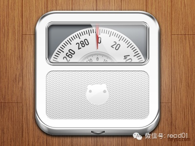

去年体重下降20多斤之后，到现在体重基本稳定保持下来，减肥也就是大幅度改变原有的生活习惯，在这个过程要反复的尝试和学习，然后慢慢的坚持下去。  

在豆瓣看到的，分享一下。

  
文 by Judith willes 原载于《食物圣经》，豆瓣跑组编辑。  
图 by David Im

  

**1.普遍认可的超重的定义是什么？**

  
你的身高基础上“可接受的体重”标准非常宽泛。在这个范围内，按照临床标准衡量，你不会超重或者体重过低。大部分专家测定可接受的体重标准依据的是身体质量指数（BM
I）。  
  
你的BMI根据以下公式很容易算出来：BMI=体重(kg)/身高(m)²²。结果可以这样解释：  
20以下=体重不足  
20~25=可接受的体重范围  
25~30=临床标准的超重  
30~40=临床标准的肥胖  
40以上=病态肥胖  
  
  
判定标准二：腰围。因为与髋部、臀部、和大腿部分的肥胖比起来，腰部（中心脂肪分布）肥胖更可能和健康问题（特别是冠心病和非胰岛素导致的糖尿病）联系。  
  
男性>94厘米，女性>80厘米，应避免再增加体重；如果男性>101厘米，女性>87厘米，则需要减肥。  
  
  
**2.饮食不过量，我为什么还会超重？**  
  
人们通常认为超重的人很贪嘴，但是大部分情况并非如此。由于大部分人的生活方式都缺乏运动，因此需要的热量并不多，即使超过所需的能量一点点也会导致体重缓慢稳定的增
长。  
比如，健康部（美国）声称，一个女性平均每天需要1940大卡热量就可以维持合理的体重。即使每天只多进食100卡（约1个香蕉或者1大块巧克力饼干），那么每年的体
重就会增长4.7公斤（其它因素也会导致同样结果）随着年龄增长，我们的新陈代谢水平也开始缓慢下降（见问题5），结果也会使30岁以上的人体重增长。  
  
  
**3.超重会不会是过量饮食以外的原因——比如遗传？**  
  
“这是我的基因决定的”——这是医生常听到的“借口”，多年来人们对此还带着些许怀疑。现在，更多的研究表明，发胖的倾向无疑和遗传有关。对孪生子的广泛研究表明，人
体的脂肪分布至少有60%的遗传因素（意味着大部分人会终生保持他们的基本体型和“脂肪分布”）。同时，在保持体重平衡行为中，我们的基因控制其他因素似乎是可能的，
比如我们的身体对运动的反映。英国一位权威的肥胖研究专家说，大约25%的肥胖症可能是由于“微小的基因缺陷”引起的。  
  
然而，这并不意味着不可能保持合理的体重，即使你比大多数人在保持形体方面有更多的麻烦。它意味着，保持你自身的热量平衡——更多的运动，较少的热量——直到你达到可
接受的体重（和体态）。这在其他正常看来可能会困难一些。  
不久的将来，重组你的“错误”基因也许是可能的，因些保持苗条也不再是难题。加利福尼亚的科学家们已经分享出燃烧多余热量的基因（UCP2），而不是任其转化为脂肪。
关于荷尔蒙利普丁（hormone leptin）——肥胖小鼠身上有缺陷的基因产生的物质——的研究正在进行。  
  
最后应当指出的是，许多并没有遗传性肥胖倾向的人也很容易发胖，正是因为他们没有正确地保持能量的平衡（见问题2）  
  
**4.我的新陈代谢水平是否过低？**  
  
许多超重的人认为：他们的问题在于新陈代谢水平过低——即他们比苗条的人消耗热量的速度慢。事实上恰好相反。决定能量新陈代谢水平最重要的因素是你的体重——你的身体
越重，意味着它有更多的工作要做，新陈代谢率也越快，需要的热量也越多。这就是为什么一个体重101公斤的女子比一个体重57公斤的女子吃得多的原因，那是为了保持其
体重。一旦这个101公斤体重开始下降，她的新陈代谢水平就会缓慢地降下来；而如果她的体重下降到57公斤，那么她的新陈代谢水平（在其他因素相同的情况下）就会和那
位总是保持57公斤的女子类似。  
然而，一小部分人的甲状腺的确不活跃，从而影响到新陈代谢水平。通过验血可以诊断出这种问题。  
  
  
**5.正如人会变老，是不是增重也是自然现象？**  
  
一旦到了30岁左右，我们的新陈代谢水平的确会开始逐年缓慢下降。据估计，30岁以后，每5年，我们每日需要的热量要减少50卡，才能保证我们以往的体重。这意味着你
在60岁的时候，如果你每日摄入的热量和30岁时相比没有减少300卡，那么你就会慢慢发胖（60岁以后，身体的脂肪比例通常会自然地再次慢慢下降）。  
  
新陈代谢水平下降的部分原因在于，随着年龄的增长，我们会损失瘦肉组织质量（肌肉）。与脂肪和其他身体组织相比，肌肉的新陈代谢水平更活跃。另外一个原因是：随着年龄
的增长，我们在活动中消耗的能量往往会减少。另外随着衰老的进行，也会自然下降。  
  
要想阻止或者尽可能减少新陈代谢水平的下降，唯一的方法是增加运动量，包括保持肌肉质量的增强运动。这是可行的计划——但是很少有人做到。  
  
只要你坚持健康的饮食并保持健康（尽管大量新的研究表明，限制热量的摄入是长寿的关键），在成年后的初期增生几公斤并不会造成危害。总试图保持年轻时非常苗条的体型也
许是不现实的目标。  
  
**6.我很胖——而且我乐意这样胖。为什么我还要改变呢？**  
  
近些年来，女权主义和政治性矫正运动劝说肥胖的人们不必向社会压力低头，而去减肥。许多超重的人顺利通过健康测试， 认为没有理由去改变自己。  
然而，大量证据清楚的表明，BMI过高（特别是30岁以后）是造成健康不佳、疾病和早亡的主要原因。超重的人在年轻时这些风险并不明显，当然，也总有很多肥胖的人能够
健康幸福地享有较长的寿命。  
  
**7.要减肥，什么是最佳饮食？**  
  
最佳的减肥食谱应当是看上去完全不像减肥食谱——你能够每天三餐享用各种食品，并加上小吃。该食谱应当是健康的，包含所有主要营养成分、纤维素等等。适合的大概方针是
，男性每日热量为1500至1750卡，女性为1250至1500卡。过重或者活动量过大的人可能会吃得超过这个范围，同时还能让体重下降，特别是运动增加的话。  
  
**8.怎样才能快速减肥？**  
  
所有近期的研究都得出了相同的结论——要想持久减肥，没有捷径可走。有三个原因。  
1）为了能够持续节食，你需要摄入足够的热量，以避免产生饥饿感，或者避免对你能够吃的食物感到厌倦和过分的限制。保持这样的热量水平，你也许不会很快减去体重，但是
证据表明，从长远来看，那些能够让自己摄入足够热量的人可以取得更满意的效果。  
2）为了在减肥期间你能够摄入足够的营养，你应当吃足够的食物，这样做意味着你不会在很短的时间内减去体重。  
3）大量研究表明，与逐渐减肥的人相比，那些迅速减去体重的人更有可能重新发胖，或者变成“溜溜球”（体重忽上忽下的）型的减肥者。还有一些研究表明，快速减肥的人更
容易有沮丧感，大脑活动也更迟钝。  
  
**9.是否要计算热量，还是不吃脂肪？**  
  
事实上，这是一回事。为了减去体重，你必须是热量保持“不足”，即消耗的热量要比在食物中摄入的量多。通过精确计算过热量的饮食你可以去掉那些高热量食物，如蛋糕、油
酥皮、甜点、肥肉、蛋黄酱、糖、酒精等等。减少低热量的食物没有多大意义，如水果和蔬菜。  
这是因为：第一，这些食物不会令你剩余过多热量。第二，它们是你身体需要的健康食品。去掉淀粉类的碳水化合物也是没有意义的，比如面包、土豆、意粉和米饭，因为它们同
样是健康食品，尽管出于计算热量的需要，你可能会略微减少它们的食用量。要沿用低脂肪饮食方案，你只要避免食用高脂肪食品即可，如蛋糕、油酥点心和肥肉。  
  
**10.是不是某种特定的饮食会更有效，比如高蛋白饮食，或者赫氏系统（食物组合）？  
**  
随后的时间里，你将会看到几种最受欢迎的节食方法的评价。  
  
简而言之，不管是高蛋白食谱还是食物组合都需要使热量不足才能发挥作用。对于这两种食物疗法的典型食物分析表明，它们总体上所含的热量非常低——在某些情况下，甚至达
到了危险的水平。高蛋白饮食本身就具有风险性（你还记得那个在海上漂了很多天的少年pi同学吧？），低量的碳水化合物也增大其风险；另外，没有科学证据支持食物组合的
理念。对于大多数人来讲，这些食物并不被推荐使用。  
  
**11.节食期间怎样克服饥饿感？**  
  
我们常常错误地把习惯误认为饥饿。事实上，如果时钟告诉我们应当吃饭，即真正的饥饿感来临前，我们往往已经吃了东西了。如果你的情况不是那样，那么，通过以下方针进行
明智的减肥，饥饿感不会成为问题。  
  
略微降低热量会有助于防止饥饿感，多食用一些含低血糖指数的食物的饮食也有同样效果。关于这些食物的更多信息在后面的（四周保持体重计划中）。它们基本上由一些碳水化
合物食品组成，容易使人具有“饱腹感，因为与其他碳水化合物比食品比起来，它们分解为血糖的速度较低，因此会比高血糖指数食品更能使人耐饿。后者包括油酥皮点心、豆类
、燕麦、柑橘类水果和天然酸奶。每一餐还应当包含一点脂肪和某些蛋白质，这两者在降低食物吸收速度方面与低血糖指数食品有相似的作用。富含天然纤维的饮食也有助于抑制
饥饿感。  
  
妇女在经期前通常饥饿感更强，这是自然现象。因此，在这个时期妇女应该吃得略多（健康食品），必要的话，遵循保持体重的饮食，而不是瘦身饮食。  
  
  
**12.怎样才能抵御某些特殊食物的诱惑，比如巧克力？**  
  
你的健康饮食可以包含任何少量的食品，因此你不必完全放弃你喜欢的食物。可以在餐后吃含糖食品。比如，在吃过健康的低脂肪主菜后来一小块巧克力或者一份巧克力奶油冻甜
点是不错的选择，即使你在执行瘦身饮食计划。  
  
重要的是，执行瘦身减肥计划时，不要不吃饭，总是处于不进食状态或者过于限制热量的摄入。这些都会导致低血糖并使人渴望吃甜食或者高碳水化合物食品，比如巧克力或者饼
干，它们会使血糖迅速上升。产生这种渴望时，不应当通过进食甜食得到满足，虽然身体分泌更多的胰岛素配合血糖的升高，但是结果会造成更严重的低血糖——人们会更加想吃
甜食。  
  
为了摆脱这种渴望—满足—渴望的“溜溜球”状态，正确的方法是，定时少量进餐，食物应当是健康的低血糖指数食品。（见问题11）这样会使血糖水平保持平稳，抑制进食渴
望。还要确保每餐包含少量蛋白质。  
  
  
**13.有没有特殊食物帮助我们燃烧脂肪？**  
  
关于所谓的“脂肪燃烧”食物的书籍到处可见，据说这些食物能够释放出各种酶，以促使脂肪燃烧。也有大量书籍讨论了一些“奇迹”食品，据说在消化它们时消耗的热量比它们
提供的热量还要多。然而，令人泄气的是，经过科学验证，没有一项理论站得住脚。  
  
  
**14.有没有不用节食就能减肥的简便方法？**  
  
除非通过手术（比如皮下脂肪切除术，把软化的脂肪吸出体外），目前对此问题的答案是“没有”。然而，你收到许多信息却不是这样说的。  
  
令你降低食欲的处方药有助于减肥，但是大部分医生只把它作为最后的措施，并且在服用时有严格的指导措施（同时你仍然需要节食）。在美国，一种被称为“orlistat
”的新型药片已经生产出来（正等待美国食品及药物管理局的批准*），能够把饮食中摄入的脂肪总量的30%排出体外，不被身体吸收。据说此药没有重大安全问题，只是某些
副作用可能会令人感觉不快，而且维生素的吸收会受到一定影响。  
  
  *注：这篇文章写出时药片还没有通过美国食品药品管理局（FDA）的审批，但随后通过了审批。不过一些科普媒体也提供了相应的看法，如：科学松鼠会的「一些减肥药有损坏肝脏的风险」。还望各位明鉴。  
  
  
**15.怎样在外出吃饭的同时还能减肥？**  
  
你在午餐和外出就餐时所吃得很多食物并不是最关键的问题。最重要的是，如果你的工作或者繁忙的社交生活需要你不断外出吃饭时，你应当采取的最佳态度。如果你只需偶尔外
出吃饭，要想明智的进餐，将这一天其他的饮食减少一些就可以了，然后可以尽情的享用美餐。  
  
**16.我非常想吃我喜欢的食物，怎样坚持减肥食谱？**  
  
以下篇幅中介绍的再训练计划将会帮助你适应健康的口味。高脂肪的开胃食品通常也是高盐食品——如奶酪、饼干、油炸土豆片、可口的小吃和馅饼。你大概需要两周的时间才能
使你的味蕾不再喜欢高盐食品。高糖食品也往往含有较多的热量和脂肪——而同样，你需要花费数周才能使你感觉它们太甜了。  
  
如果你最喜欢的食品不是那些高盐高糖的食品，那么，几乎可以肯定地说，它们已经构成了你的健康苗条食谱的一部分。如果“再训练计划”不适合你，那么另一个方法就是，每
天在你的食谱中加入一些你喜欢的食品，让自己摄入一定量的“奖赏”性热量，可以把这类食品应用在你喜欢的任何食谱中。这样就不会引起暴馀暴食。见问题12.  
  
  
**17.新型的无热量脂肪食品会不会是个好主意？**  
  
原文中提到的是一种叫作Olestra（奥利斯特拉油）的一种不被水解且不被吸收的脂肪。因为这种物质还存有一定的争议，大家自行搜索辨别吧。  
  
**18.为什么节食一段时间后体重下降的速度会减慢？**  
  
就短期减肥来讲，这是因为在节食最初的一两周内，你损失的只是几斤重的液体，而不是脂肪。这个阶段过后，你才开始减掉脂肪。  
  
对于长期的减肥者来说，主要原因在于当你的体重下降时，你的新陈代谢的水平也因你逐渐减少的体积而逐渐降低。正如我们在问题4里解释的那样，你超重的时候需要吃的比普
通人多，以维持你的重量。例如，一个体重101公斤的妇女每天需要摄入2500卡热量，而不是“正常”情况下的1940卡。她需要做的是，每天将摄入的热量减至175
0卡，即减少750卡，这样每周将会减掉0.68公斤。然而，她的体重降到63公斤时，分量已经与平均体重差不多，她每天摄入的1750热量只比正常的摄入量（194
0卡）少一点。为了继续有良好的减肥效果，每天摄入1250卡比较合适。这样每天摄入的热量比正常情况下少690卡，每周将会减去超过0.68公斤的重量。  
  
为了能够在任何饮食期间都能够稳定持续的减肥，你需要在饮食中逐渐减少热量的摄入。从实际效果来看，当你接近目标体重时体重减轻的慢一些是好事，你可以通过增加一点运
动量来增强效果。  
  
其他导致减肥速度慢的因素有：你已经达到了合理的体重（你可能把减肥的目标体重定的过低，请参考BMI），或者你又开始摄入较多的热量—仔细检查你的饮食。另外，体重
的确会因为各种原因而产生每日或者每周波动，包括荷尔蒙和体液水平等等。大多数妇女在经期前的一个星期根本不减重，反而会使体重增加，而这些体重在经期开始后几天内就
会消失。  
  
  
**19.我该多长时间称一次体重？**  
  
如同在18题中看到的那样，每日体重都会有波动（有时是每周），因此，我们不建议每日称体重。因为结果并不真实。对于男性来讲，每周称一次体重就够了（甚至都太多了）
。对于有月经期的女性，每月称一次体重也许更加明智，在经期结束后马上进行。  
  
  
**20.为什么减肥以后保持苗条身姿如此困难？**  
  
的确，与一次性减肥比起来，长期减肥常常更加困难。研究表明，很多减肥成功的人后来又胖了起来。然而，这样的结果是由社会、生活方式和心理等多种因素造成的，而不是像
很多人认为的，是通过节食而人为地降低新陈代谢水平造成的。  
  
来自于邓恩临床营养中心（Dunn Clinical Nutrition
Center）——英国一个权威的肥胖症研究中心——的研究清楚地显示，那些曾经肥胖然后瘦下来的人，与其他从未胖过的同样体重（瘦）的人具有相似的新陈代谢水平。  
  
然而，瘦人的基础代谢水平——比如在第4和第8个问题中提到的——通常比胖人的低。也就是说，一旦你瘦下来，你就不会再像肥胖时吃的那样多。那些能够做到长期减肥的人
们通常能明智地坚持健康饮食，已逐渐减去体重。另外还包括行为调整和运动。他们在达到目标体重后还继续坚持健康饮食并定期运动。  
  

  

**记录片作业**

@尹流氓好色又专一  

谢谢推荐，今天回到wifi环境看了《浮生一日》。
电影展示了20100724这天世界各地凡人们平凡真实的一天，影片通过简单的三个问题串联起来，“你的口袋里有什么？”“你爱什么？”“你害怕什么？”
因为太真实所以结尾女孩的话越触动我心。 我自己觉得不太好回答：“一支唇膏一块德芙”；"泛爱，最爱自己"；“害怕所有可怕的人事，害怕死亡，害怕朋友消失，害怕爱
人怒吼，最怕此生虚度”。人的一生太TM短暂了。 一直觉得会活得跟别人不一样，但回首，循规蹈矩正儿八经平凡得真像二十几年没发生过什么似的，没有惊世动俗，亦无积
少成多，没有活出心底认为最真实的自己，且波澜不惊。 但，就像影片结尾用升起的孔明灯来预示希望，I'm just one I know，But I feel
strong you know。已经尝试去做想做的事，挑战自己对未知的恐惧，坚持做些认为对的事，早起，晨跑，阅读…把梦想放在心间，然后美好而朴素地存在。
云朵理应洁白，海涛应追赶沙滩。Enjoy Life，Be Yourself。  
  
  
@LADER  
刚看完人生七年，看到保罗的那一段，我忍不住哭了，他二十岁前对世界的看法都跟我很像，小时候不相信婚姻以及亲密关系，到后来对亲密关系和婚姻或者说家庭的渴望，其实
他和二十岁左右的休斯很像，有一种忧伤甚至自毁倾向，但他幼年时期的优柔寡断和对生命的无力感在同时帮助了他，他不像休斯对生命有一种决绝，激烈地对抗一切，拒绝一切
他认为不完美的东西，同时很幸运遇到了一个很好的妻子，我最近越来越觉得遇到一个好的爱人是一种莫大的幸运，同时我认为要竭力改正自己的自毁情节，改变对这个世界消极
的看法，我觉定在一周内参考这部片子也为自己拍一段视频，现在我二十岁，休学在家，我知道自己的理想和目标，我知道我将变得更好，这一年我的改变将令人吃惊，我想把它
就录下来将是一件很有趣的事情，同时我每个月都会在同一天问自己同样的问题。
参加了100天行动小组，只是一直都是打酱油的状态，可能接下来会坚持学英语吧，我发觉只要养成了一个好习惯就很容易按照同样的模式，养成另一个习惯。  
  

  

[阅读原文](http://mp.weixin.qq.com/s?__biz=MjM5NjA3OTM0MA==&mid=200041904&idx=1&sn
=b835806c2e926718caff06c013e82f4c&scene=1#rd)

