**图片教程来自欧洲最流行的健身类app @Runtastic**

**  
**

**简单**

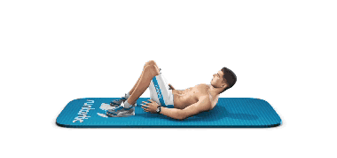

仰卧交替脚跟接触  

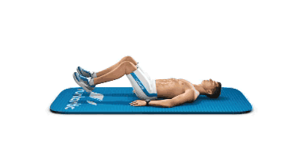

仰卧屈膝举腿

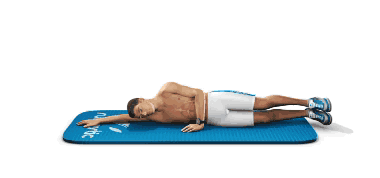

左侧卧举腿卷腹  

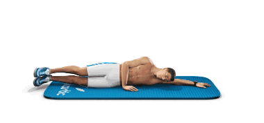

右侧卧举腿卷腹

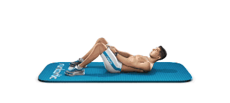

仰卧核心卷腹  

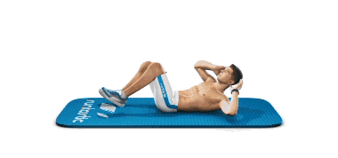

仰卧对角交替收膝  

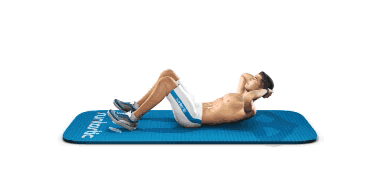

仰卧卷腹  

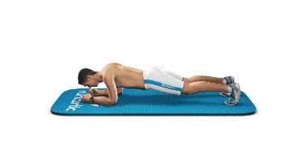

平板支撑动作

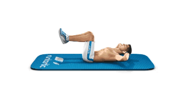

反向卷腹

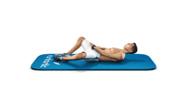

仰卧拉伸卷腹  

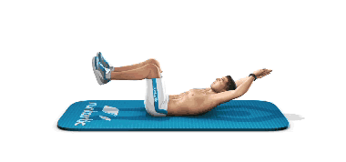

仰卧屈膝卷腹

  

**中等**

仰卧抬臀  

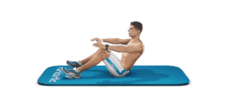

坐姿转体扭腰

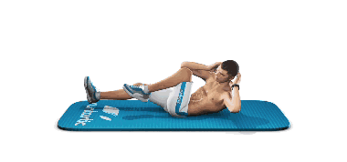

空中蹬车

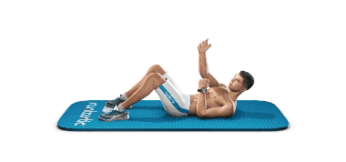

仰卧交替拉手卷腹

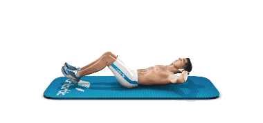

触膝卷体  

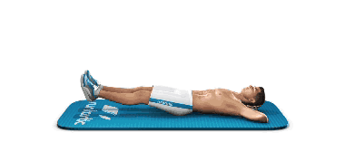

仰卧抬腿  

登山

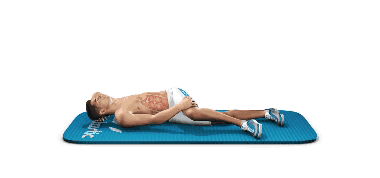

（左右互换）侧卧腹斜肌卷腹  

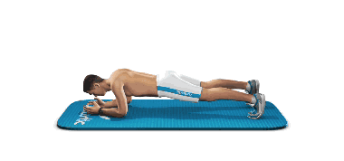

平板支撑抬腿  

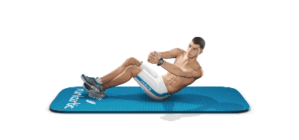

俄罗斯转体

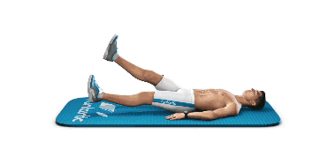

仰卧交替抬腿

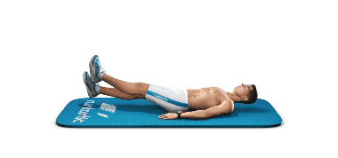

仰卧交替摆腿

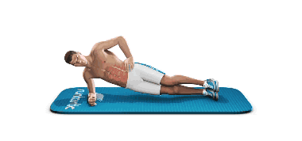

（左）侧平板支撑

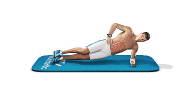

（右）侧平板支撑

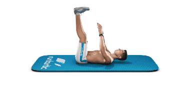

仰卧直腿卷腹触足卷腹  

仰卧屈膝卷腹

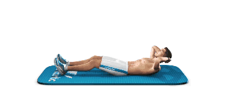

仰卧紧缩卷腹

  

**困难**

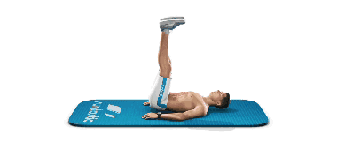

仰卧屈膝提髋  

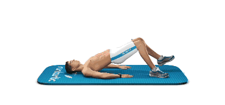

仰卧抬臀踢腿  

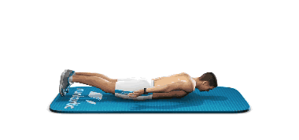

仰卧海豚游泳式

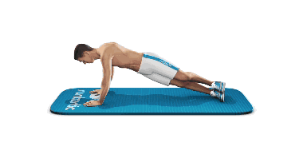

（左）仰卧屈膝举腿

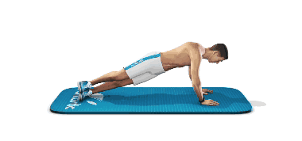

（右）仰卧屈膝举腿

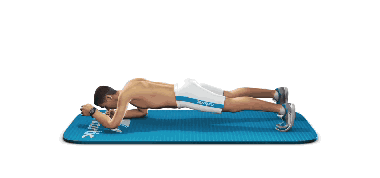

平板交替伸手抬腿  

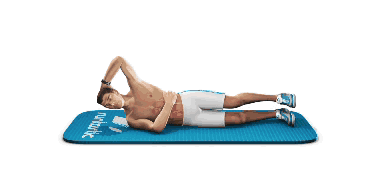

(左)侧屈体抬腿  

(右)侧屈体抬腿

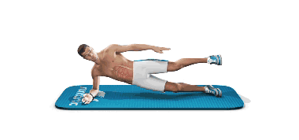

（左）侧支撑抬腿  

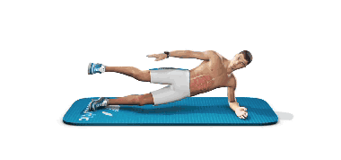

（右）侧支撑抬腿

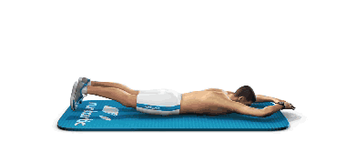

仰卧两头起

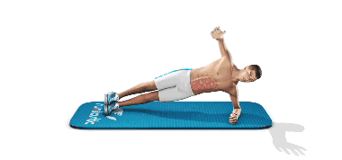

（左）侧屈体抬手  

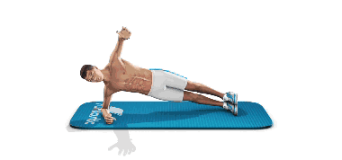

（右）侧屈体抬手

  

> 任何建议、想法、供稿

>

> 都可添加个人微信号：fanfanrunner

>

> \- - - - - - - - - - - - - - - - - - - - - - - - - - -  

>

> 欢迎关注更多健康联盟微信自媒体

>

>  

>

> 微信公众号runfreerunhappy

>

> 跑步心情：跑步减肥健身，励志正能量

>

>  

>

> 微信公众号keep-fit001

>

> 镁女罩我去战斗：女性健身，励志

  

**↓↓点击阅读原文 查看更多内容**

  

阅读原文 举报

[阅读原文](http://mp.weixin.qq.com/s?__biz=MjM5MzI0NTk2MA==&mid=201009217&idx=2&sn
=55bf095bf5b49496334026172d3a93b5&scene=0#rd)

