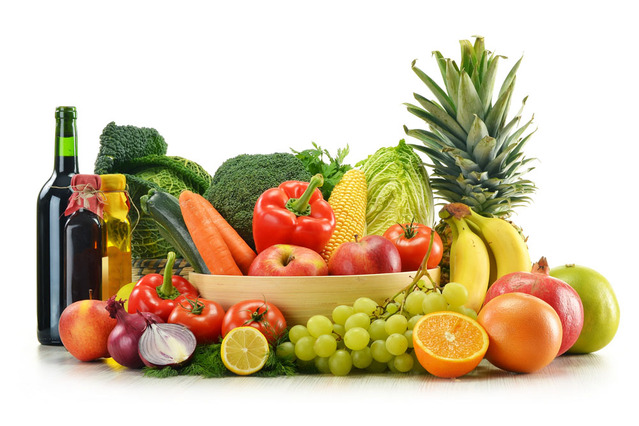

一直有人问在减脂和增肌过程中，应该怎么控制饮食，有篇文章讲的比较全面，基本上能知道适合吃哪些食物：

  

  

1\. 每天至少吃5份蔬菜和水果（一份等于一小碗）。

2\. 尽可能选择粗粮类食品，比如野稻米、燕麦等。

3\. 每天食用两份奶制品（低脂或脱脂）。对于50岁以上或0至19岁的人群，每天应再增加一份。

4\. 每天摄取一些健康油脂，如橄榄油、葵花子油、亚麻籽油等。这个习惯可以保证你每天摄取足量的基础脂肪酸和维生素E。这些油脂可以用于拌凉菜、烹调或与其他成分
混合使用于食物中。

5\. 每天食用至少一到两份肉类、禽类、鱼类、蛋类、粮食豆类或黄豆类食物以保证蛋白质的摄入量。很多奶制品也是很好的蛋白质来源。

6\. 限制食物中添加的糖和酒精的量。

7\. 每天喝至少1500毫升水。

8\. 每天服用复合维生素和微量元素补充剂。

  

**核心食物表**

  

我们称以下食物为核心食物，这类食物有很高的营养价值，并包含所有食物类别。这些食品能量较低，不会让脂肪堆积。它们应该成为你食谱里的主要成分。其他所有食品还可以
吃。但是一定要限制量。

  

  

**蔬菜：**新鲜的、罐装的（无佐料、脂肪、糖等其他添加剂）蔬菜；番茄酱。

蔬菜类不能和非核心类食物合并（比如油炸的蔬菜和豆类，油浸蔬菜、糖渍的蔬菜等都不是核心类食物）；蔬菜汁不属于核心食物  

  

**水果：**新鲜的、罐装的（非糖水类）水果

如果是罐装的必须是水或纯果汁（非糖水）浸泡的，浸泡汁水不可以食用；干果（杏干、桃干、香蕉干等）不算做核心食物；果汁不是核心食物  

  

**汤类：**新鲜的、冷冻的、罐装的（无佐料、脂肪、糖等其他添加剂）清汤

西式奶油浓汤和浓缩肉汤不算做核心食物

  

**脱脂奶制品和其他代乳品:**脱脂奶、脱脂奶酪、脱脂无糖酸奶；豆浆、豆腐和不含添加剂的豆类食品

由上述所有原料做成的有关食品包括奶昔和热巧克力等饮品必须是无糖低卡，可以一天食用一次  

  

**蛋类及其替代品:**全蛋、蛋白及其人造替代品

  

**主食（谷物）**:全麦类、杂粮类、稻谷类和薯类；淀粉质的豆类

  

**豆制品:**新鲜的、冷冻的以及其他任何形式青豆、黄豆、豆腐、豆浆

豆浆不加糖  

  

**鱼和其他海鲜类:**新鲜的、冷冻的以及其他任何形式

如果购买罐装选择非油浸的，非油炸的  

  

**家禽：鸡、鸭、鹅 :**新鲜的、冷冻的以及制成品

烹制前去掉一切可见的肥肉，不要食用皮

**  
**

**牛、羊、猪肉:**这一项只包括无脂肪的里脊等部位

选择瘦肉部分如果可能尽量去掉可看见的肥肉，如果购买肉馅尽量买肥肉含量最少的，所有的腌制类食品如香肠、熏肉、腊肉等都不属于核心食物

  

**烹调用油和调料:**不含反式脂肪酸的植物油，脱脂沙拉酱、任何形式的香料、调料

每天食物中应包括2茶匙棕榈油、橄榄油、葵花子油

  

**饮料:**无糖咖啡、清茶（无糖）、无糖软饮、苏打水（无糖）、水

含酒精饮料不属于核心食物

  

  

**100天行动读者反馈：**

  

@鱼•﹏•

感谢这个微信平台，今天是我坚持锻炼的第十天，也是考研倒计时的第84天，每天图书馆寝室操场三点一线，很幸福。现在每天跑步都养成了习惯，不跑步晚上会睡不着不舒服
。我觉得我能坚持下去，由三圈加到四圈，考研复习也要继续坚持，熬过去就好了。

  

@大颖

跑步第三天慢跑了八圈，感觉不错

  

\------------------------------------------------  \--------

我是warfalcon  ，这个微信（read01）的目标**是让你成为行动者而不是阅读者**，不定期分享一些五花八门的读书笔记和书评，每天更新。

  

想了解更多：可以在新浪微博、腾迅微博、豆瓣、知乎搜索 warfalcon 或访问  www.read.org.cn  www.write.org.cn

  

觉得文章对你有帮助，可以打赏一杯咖啡支持一下，支付宝帐户:  warfalcon@gmail.com  或点击查看原文

  

  

[阅读原文](http://m.alipay.com/personal/payment.htm?userId=2088002031865988&reason
=%E6%94%AF%E4%BB%98%E5%AE%9D%E5%BE%AE%E4%BF%A1%E6%94%B6%E6%AC%BE&weChat=true#w
echat_redirect)

