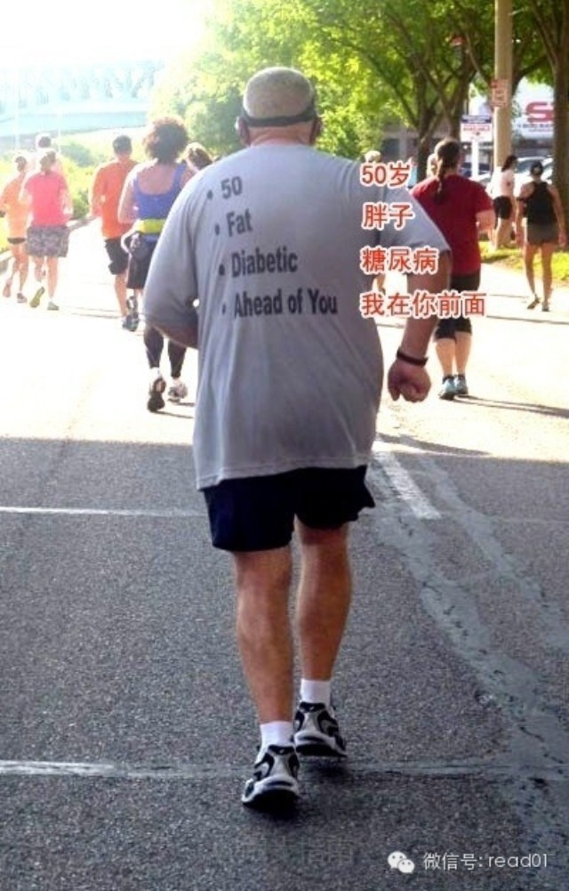

  

最近在读《马拉松训练宝典》，从中摘录一些内容给准备挑战马拉松的朋友们。跑马拉松最好是循序渐进，在平时形成习惯，你的第一次全马应该留出四个月的准备时间。

**一、挑战马拉松前的准备**

### 打好基础。

只要每周4次、坚持跑6个月左右、形成定期锻炼的习惯，你就能顺利完成全程或半程马拉松的训练科目。很多训练计划开头都是：每周至少4天，总共约40公里（全马）或约
24公里（半马）的跑量。假如你只是零星跑跑，并且必须彻底打乱周计划才能开始训练，那么想坚持下去将会很难。并且，这样下去最后肯定会因运动过度、过快而导致过劳性
损伤（overuse injuries），如髂胫束综合征或足底筋膜炎。不能持续训练也不要着急，你还是可以在不久的将来参加全马或半马比赛的——选个一年以后的日
子吧，然后朝着那天努力奋斗。

### 算好时间。

毫无疑问，全马和半马训练很耗时间。按最少的算：工作日，每天需要30分钟到1个小时；周末，则需要多达3个小时做长距离跑。这还不算冷身（cool down）、拉
伸和补充能量的额外时间，更不用说还要有时间和家人朋友讲一讲你的事迹：你克服种种困难做了不少事，而他们还在睡大觉。长距离跑和每周跑量峰值训练（peak）则需要
更多时间——比赛前3~6周每周要花10个多小时。所以，你要仔细查看16周的全马或10周的半马训练计划，再权衡自己的生活和工作安排，研究一下目前是否可行。要是
总感到匆忙、有压力，或因别的什么事情没做而感到愧疚，那你也不能好好地享受跑步。一定要事先计划好任何可能发生冲突的事情；看看哪些训练需要重新安排、哪些日常事项
需要调整。把幼托安排好再去长跑、轮到你开车就跟人换一下、如果有需要就跟公司请假晚到1个小时……这些事情都要提前安排好。这样，即使跑得越来越远、比赛迫在眉睫，
你也不会有额外的压力来琢磨怎么处理这些麻烦。

### 评估压力。

虽说跑步可以用来减压，可在有重大生活变化（如孩子出生或异地搬家）的情况下，想要备赛训练，特别是准备首场比赛，那可能会有点太吃力。有的人对此持欢迎态度，因为跑
步分散了他们的注意力，给他们原本混乱的生活带来了秩序；但有的人会觉得手足无措。训练到底是减少还是增加你的压力，只有你自己最清楚。

### 看医生。

最好在开始训练前进行一次全面体检，特别是如果你还在和伤痛作斗争，或有心脏病、糖尿病以及其他慢性病的家族史。年龄超过40岁或医生提出建议的跑者，还可以做个压力
测试。训练时，如果遇到胸痛、压力大、气短或其他异常感，要立即去看医生。

**二、 需要考虑的因素**

### 每周跑量。

你过去6周平均每周跑多少公里？别想着一开始就在跑量上有个飞跃。刚开始那几周的训练不应该在前6周基础上增加超过10%。

### 跑步日的安排。

理想的状态是一星期能有4~6天用来跑步。即便如此，每星期有3天来做全马或半马的相关训练也是可以的——只要你在其他几天做交叉训练以保持心血管健康。每星期至少要
预留一天完全用来休息，不做交叉训练也不慢跑，从而让身体完全恢复。这一天的休息可以让你的身体远离伤病，同时也让你能有时间照顾一下日常生活的方方面面，比如打扫卫
生、跑跑腿这些训练时没时间做的事情。

### 给其他活动留有余地。

马拉松的最佳训练方式就是跑步。但是，交叉训练以及力量训练也很重要，它们可以让你保持健康，也可以让你从心理上保持对训练的新鲜感。如果你想在日程安排中加入力量练
习或瑜伽、普拉提等课程，那么要选择一个跑量较低的训练方案，这样才有进行那些活动的余地。

**三、训练的基本原则**

### 慢慢起步，逐步展开。

比赛时要跑完那么长的距离，想想就令人胆怯，谁都会这样，甚至已经跑过比赛的人也会如此。幸好，你不必立刻就跑——也千万别这样尝试。人的身体需要时间来适应训练所带
来的变化，从而应付更多的跑量和更大的强度。肌肉和关节需要时间恢复，从而满足更多的训练要求。在此过程中，如果太冒进，你可能会把身体累垮了，达不到增强体质的目的
。教练们发现，避免受伤最好的方式是遵守10%原则（10 percent rule）：每周跑量的增加量及长距离跑长度的增加量不得超过上周的10%。这样既可以让
你远离伤痛，又可以让跑量的增加更可控。在开始训练之前，一想到要跑20公里你也许会害怕。但当训练逐步展开时，你已经在赛前一周跑过16公里，比赛时也只不过再多跑
5公里，这样一想就不会那么害怕了。请尽可能地遵守训练计划，避免受伤。若一定要额外增加训练量，那就安排在轻松日，而且一次增加不要超过1.6~3.2公里。

### 大部分时间要跑得轻松些。

80%左右的跑步训练应该以一个轻松的配速来跑，比比赛时目标配速慢38~56秒。在这个配速下，你应该感觉舒适，能边跑边聊天。如果用心率来衡量，应该达到最大心率
的65%~70%。要是跑得上气不接下气，那你的速度可太快了。跑得轻松些可以增强肌肉、提高耐力、燃烧脂肪以及增加血量，但最大的好处是让你既可以最大限度地练习跑
步，又不会受伤。训练6周左右之后，你会发现自己不用那么费劲却能跑出同样的配速和距离。然而，如果跑得过快，膝盖、小腿和脚就会感到疼痛。这是因为心脏和肺部能较快
地适应训练、得到强化，而肌肉、筋腱、骨骼则相对慢些。因此，你需要花些时间进行轻松配速跑，让肌肉骨骼系统得以变得更强，从而配合上心血管方面的进展。

### 高、低强度交替。

大部分训练项目都会交替安排高、低强度的练习。每一周，你会有一次高强度练习（如速度练习或长距离跑），接着是一天休息或一次轻松跑。同样，每过几周，你就需要减少跑
量，这样才有时间恢复。为什么要这样？因为在恢复阶段，身体会重建、修复受损的肌肉组织。通过这种重建过程，身体变得更强壮、更能抗疲劳，你也就能跑得更快、更远。如
果不迫使身体跑足够远的距离或达到足够快的速度，那么你永远没有能力跑得更远或更快而不疲倦。但如果身体负荷过大，或没有充分休息，你就会受伤。

### 每周进行长距离跑。

长距离跑是全马、半马训练的基础，它有助于增强耐力、建立长时间跑步的习惯，以及演练如何进食、饮水、穿戴、安排上厕所……这些都是需要在比赛之前解决的问题。同时，
在情绪和心理上，你也需要做好长时间跑步的准备——这些在比赛时也必须面对。新手应以轻松的配速进行长距离跑，全力做到跑完全程而且感觉良好。如果你是冲着创个人纪录
来的，那么可以试着做些变化。例如，“末段提速”长距离跑，它要求在最后的5~8公里内，可以按目标比赛配速跑上几公里。这种做法有助于挖掘极度疲劳下的身体潜能。每
周，在你时间最充裕、能够跑完全程的那天安排一场长距离跑，挑个不受妨碍或没什么急事的时候开始跑，而且要保证有足够时间补充能量、做拉伸、冰敷以及休息。

## 100天行动读者反馈

@火星冲

从去年10月长假我开始晚间快走，到现今年长假，除去天气因素，我快走的日子达到95%；同时还每周游一次泳，从只是蛙泳入门的水平，到蛙泳2000米，并且学会了自
游泳，蝶泳也到了入门级的水平。这些，使我感觉精力明显提升，记忆力好转，更加积极主动、心情舒畅。接下来的一年，我除了要坚持这些外，还选了一项不容易完成的任务－
－规律性阅读，我一定会完成它，加油！谢谢warfalcon！谢谢！

@朱飞燕

老师你好，100天行动是在这里写吗？今年关注你的，有种相见恨晚的感觉，一直想做个百天行动，都失败了。今天发现自己变白了，漂亮了。坚持贴面膜大半年了，一个星期
两次。真的很开心。

  

举报

[阅读原文](http://mp.weixin.qq.com/s?__biz=MjM5NjA3OTM0MA==&mid=201960403&idx=1&sn
=a6f113f93455fdb235eea3ff3962519c&scene=0#rd)

