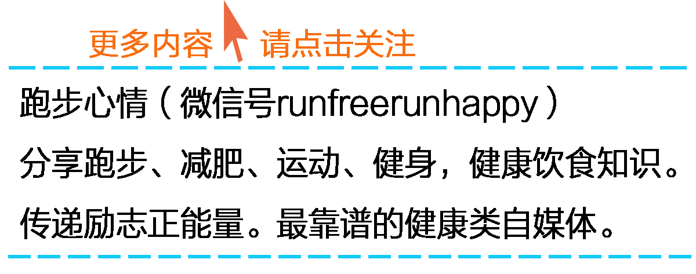

想要塑造美好形体的人们都想要更少的脂肪更多的肌肉，怎样做才能消耗自身囤积的多余脂肪？在美国知名女性健康网站Women’sHealth上有一篇文章《15
Easy Ways to Burn More Fat》，提出了15种简单的方法来加速身体的新陈代谢率、加速脂肪的燃烧。来一起看看这15种方法你了解多少吧！

  

**1、不要节食**  
所谓的健康饮食（diet）并不是说吃少一点，更不是不吃，而是吃更多营养密度高（nutrient-
dense）的食物，如绿色蔬菜类、全麦壳物、坚果类等，能提供身体一日所需的营养及能量，可以让你身体一直保持血糖稳定、饱足的状态。  
当你节食时，其实就等于你在限制身体的新陈代谢，当身体发出肌饿的信号时，你却不提供能量及营养给身体，身体自然就会减缓新陈代谢率，以保存身体现有的能量。  
当你节食的情况日益加重时，身体就会开始烧燃你的肌肉，借此产生能量，这只会让内脏脂肪（visceral fat）占据身体的比例越来越高。

  

**2、早点上床睡觉**  
睡的越少、压力越大、内分泌紊乱、内脏脂肪越多。

  

**3、补充足量的蛋白质**  
人体需要蛋白质来维持肌肉，而且也有助于饭后热量的燃烧。

  

**4、尽量食用有机食材**  
食材上残留的农药会干扰人体新陈代谢、脂肪分解的过程，造成燃脂更加的缓慢。

  

**5、站起来**  
若身体有四小时以上没有活动时，会使得体内一种酶（enzyme）停止运作。这种酶是用来控制身体脂肪及胆固醇（Cholesterol）新陈代谢的物质。所以为了能
不断让此类酶一直运作着，有助于脂肪的燃烧，请记得不时站起来活动一下。

  

6、喝凉水  
一天喝1.4升的凉水，促进新陈代谢的增加，有助于消耗50卡路里的热量。一年下来，每天50卡路里可以消耗5斤的脂肪。  
原理很简单，当人体喝进冷水之后，人体为了要中和冰水的温度，身体必须要产生热，也就会消耗掉热量。

  

**7、吃点辣**  
辣椒素（capsaicin）产生的热感，会刺激交感神经系统（sympathetic nervous
system），增加你的新陈代谢。吃一小勺切碎的辣椒（红或绿），可以在短时间内，增加23%的新陈代谢。

  

**8、起床吃早餐**  
吃早餐能让你的新陈代谢跳跃性的开始，大部份不吃餐的人，都有过胖的状况。研究指出，吃早餐的人，早餐摄取的热量占一天热量的22%~25%，四年平均下来，仅增加1
.7磅的重量。而不吃早餐的人，同样分量的早餐，仅占其一天热量的0~11%，增加将近3磅。也就是说，不吃早餐的人其实每天摄入的热量要高于吃早餐的人。

  

**9、喝咖啡或茶**  
咖啡因（Caffeine）是一种中枢神经系统的兴奋剂，适当的咖啡会提升5%~8%新陈代谢，燃烧约98~174卡路里的热量。日本研究，茶叶中的儿茶素（cate
chins）有助于提升新陈代谢，一杯茶可提升12%的新陈代谢。

  

**10、摄取纤维素**  
研究发现，进食一些纤维素有助于脂肪的燃烧，最多可增加到30%，而份量的话，一天约25克，总共约三份的水果和蔬菜（ 一份相当于你的拳头大小）。

**  
**

**11、摄取富含铁元素的食物**  
铁质能携带”氧气”，氧气是燃烧脂肪需要的原料。若你缺乏铁元素，会感到有气无力而且新陈代谢会变慢。而铁元素摄取的最佳来源食物，包括贝类、瘦肉、豆类、强化谷物（
fortified cereals）、菠菜等。

  

**12、多摄取维生素D**  
维生素D是维持肌肉健康的基本要件，鲑鱼、鲔鱼、强化牛奶（fortified milk）、谷物、鸡蛋等都包含维生素D。

  

**13、喝牛奶**  
缺钙是女性最常见的状况，会减缓新陈代谢。可以从脱脂牛奶（fat-free milk）或是低脂酸奶（low-fat
yogurt）中去摄取。而酸奶同时也能降低身体从食物中摄取脂肪的量。

  

**14、补充精氨酸**  
精氨酸（arginine）是氨基酸的一种，有助于减重，能够强化脂肪及葡萄糖的氧化。海鲜、坚果、种子、西瓜等都是不错的精氨酸来源。

  

**15、保持身体的水份**

身体的所有化学反应，包括新陈代谢，都仰赖水。如果哦你身体处于脱水现象，可能仅会燃烧2%的卡路里。研究指出，人一天至少要喝8至12杯水（每杯水大概250毫升，
最常见的瓶装矿泉水是500毫升）。  

  

译者佚名  

  

> 任何建议、想法、供稿

>

> 都可添加个人微信号：fanfanrunner

>

> \- - - - - - - - - - - - - - - - - - - - - - - - - - -  

>

> 欢迎关注更多健康联盟微信自媒体

>

>  

>

> 微信公众号runfreerunhappy

>

> 跑步心情：跑步减肥健身，励志正能量

>

>  

>

> 微信公众号keep-fit001

>

> 镁女罩我去战斗：女性健身，励志

  

**↓↓点击阅读原文 查看更多内容**

阅读原文 举报

[阅读原文](http://mp.weixin.qq.com/s?__biz=MjM5MzI0NTk2MA==&mid=201022222&idx=1&sn
=41a2d35fc96e6eea19cad0dcfdfadf24&scene=0#rd)

