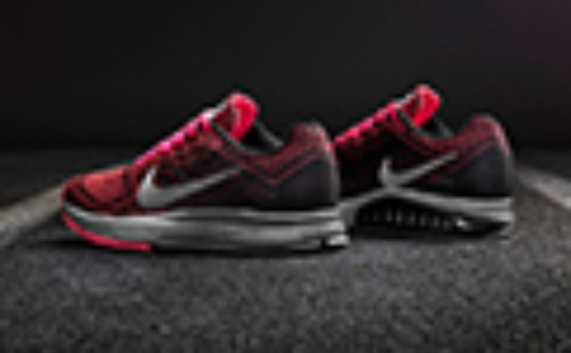

  

来自台湾运动笔记

  

工欲善其事，必先利其器，跑马装备也变得越来越丰富，新手需要好好选择。

  

推荐必带

跑鞋：除非光脚跑，不然请确认跑鞋已收进行李袋，或穿在脚上。跑马时请穿着平时惯穿的鞋子，当天穿新鞋是大忌，可能因为脚不适应，或鞋子不够松软而受伤不适。

  

比赛服：跑步背心、长/短袖上衣、短裤、紧身衣裤等，可依个人习惯与天候自由搭配，选择排汗透气、轻盈有弹性佳的款式，常见的聚酯纤维运动服，或各厂牌的运动机能服饰
都是不错的选择。棉质衣物吸湿，不透气，较不适合跑马使用。

  

运动表：帮助你注意配速、掌握节奏、也可以为自己做记录供日后跑马参考，有些表款还配有GPS，完赛后可以看到今天跑的路程地图、分段配速等，很酷。

  

能量补给：能量胶、能量棒、BCAA、盐锭、电解质、小点心...等补充能量的食物或营养品。选择好携带且已在赛前试过的食品，比赛当天尝鲜，可能会惨不忍睹。

  

饮品：赛前赛后都应该保持充足的水分，赛后饮品更是帮助恢复的好帮手，若是大热天跑马，也需要快速补充电解质，虽然比赛现场可能有准备，但还是自己多准备一份，万无一
失。

  

寄物袋／包：若有参加跑步社团，在比赛会场也许有团体专用的休息区，可用自己的背包。背包最好大一些，方便多带衣物与赛后纪念品；如能防水更好，当天可能下大雨；袋外
最好附上个人资料的名条，方便寻；袋内也别忘了备个卫生纸。

交通卡、零钱：比赛会场人多且杂，保险起见不要带太多证件与零钱较好，但参加活动总有个万一，还是酌情带一些比较好。

  

选择携带

轻便雨衣、手套：雨衣用处多，下雨遮蔽、赛前保暖、席地而坐都可以用；若比赛当天气温很低，可以准备专用的路跑手套或便宜的麻布手套。

  

防晒用品：夏季马拉松艳阳高照，在三、四个小时的烈日下运动，可能会晒伤，可以准备防晒乳液、袖套、太阳眼镜等。若要戴帽子，选择透气轻薄的款式，以免还没晒昏，就先
热昏啦。

  

简单医药：创可贴、药膏、喷剂、绷带、纱布……空间足够，不嫌麻烦，就带着吧。

  

赛后不可少

替换衣物与便鞋：跑完流汗，衣服若不马上更换，容易感冒，尤其刚经历了马拉松的长时间运动，人体抵抗力会较差，赛后干净衣物是一定要准备的；脚闷在鞋里跑了42公里，
带双凉拖鞋，让它透透气吧。

保暖衣物：不分春夏秋冬，跑完最好不要受风寒，可以视天气准备厚薄不同的外套与长裤，市售许多运动夹克和热身裤是个好选择，透气不吸汗，又有防风的效果。

  

恢复食品：跑完的15-30分钟内，是人体最饥渴、重建恢复的黄金时间，此时实时的补给，能快速启动修复机制。保久乳、饼干、巧克力、或任何方便携带，含丰富碳水化合
物与适量蛋白质的补给品都可以。

  

  

> 任何建议、想法、供稿

>

> 都可添加个人微信号：fanfanrunner

>

> \- - - - - - - - - - - - - - - - - - - - - - - - - - -  

>

> 欢迎关注更多健康联盟微信自媒体

>

>  

>

> 微信公众号runfreerunhappy

>

> 跑步心情：跑步减肥健身，励志正能量

>

>  

>

> 微信公众号keep-fit001

>

> 镁女罩我去战斗：女性健身，励志

  

**↓↓点击阅读原文 查看更多内容**

阅读原文

阅读

举报

[阅读原文](http://mp.weixin.qq.com/s?__biz=MjM5MzI0NTk2MA==&mid=201069115&idx=3&sn
=54a8ff7afb9a4b593691c52749f56aed&scene=0#rd)

