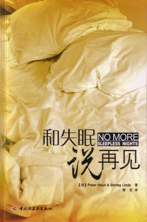

很多人反馈说喜欢【现在开始】这二篇文章，如果你觉得文章不错，就把文章细化成行动和计划，然后按100天行动的规划开始执行，别停止在阅读上。

  

今天分享的文章跟睡眠有关，通过这七条规则帮助你形成正确的态度和习惯，从而帮助你提高睡眠质量，这篇文章出自《和失眠说再见》，这本书和Powerful
Sleep 是我阅读过关于睡眠方面最好的二本书籍。

  

### **规则一：减少睡眠时间**

一定要记住，对于不同的人来讲，他们所需要的睡眠时间不同。一些人可能只需要睡3一4个小时，白天同样精神抖擞，而另一些人可能需要8一10个小时。回想你患有失眠症
之前的生活。在你感到精神恢复的情况下，你的睡眠时间有多长？或者回忆得更远一些。当你还是个小孩时，你需要的睡眠时间是否就比常人少还是多？如果确实回忆不起来．那
么你的睡眠时间可能跟常人一样，这样作为一个成人．你每晚应该需要7~8个小时的睡眠。

  

如果你的睡眠需要7个小时，但你每晚在床上待的时间却是9个小时，在这样的情况下会发生什么呢？你可能会想，这样的话，每天晚上的最后两个小时自己会失眠，但是情况其
实与你的想象相去甚远。几个星期以后，7个小时的睡眠就会分配到9个小时里，你就会在这9个小时里睡得很轻。在这9个小时中，你可能很难入睡，而且半夜容易醒来。更重
要的是，睡眠变得很轻，充满了第一阶段的睡眠而几乎没有深度的睡眠。就好像一定量的水被浇在了更大面积的表面上，没法完全地搜盖它。这种轻浅的睡眠很难帮助你恢复精力
，会让你早上起床后感到比以往累、没有精神。

  

自然，你会认为自己的睡眠时间不够充足，所以就会更加延长睡眠时间。这样一来就会造成更多的轻浅睡眠，半夜更多次醒来，第二天早上会感到更累。这样就形成了恶性循环。
给自己的睡眠时间越多，睡眠质量就越差，你就越容易患上失眠症。

  

如果你的失眠还伴有抑郁，那么缩短睡眠时间同时也有助于治疗你的抑郁。B.Pflug和R.Toelle两位德国医生发现，一整晚不睡觉能够帮助很多患有抑郁症的病人
。他们不会感到磕睡，反而会感到非常有活力。这些研究者首先让被试一个晚上不睡，在随后的两三个晚上让他们正常睡眠直到他们又出现抑郁的症状，然后再让他们一个晚上不
睡，如此反复。一些病人在抗抑郁剂起作用之前的几个星期使用这种方法．有些人则只用剥夺睡眠的方法来治疗抑郁症。

  

选择对你自己最有效的方法来缩短睡眠时间。

### **规则二：不要努力睡着**

想想你自己的睡眠。是否在看电视或者看书的时候想要保持清醒却总是打味睡，而之后到了上床睡觉的时候，又总是很清醒？是否晚上该睡觉的时候总是睡不着，而快到天亮起床
的时间又能睡得很好？对这些阿题的回答如果是肯定的，那么你的问题可能是你太努力地想让自己睡着。

  

怎样才能让自己不这么努力呢？我们都听过数绵羊的说法。现在，大多数人都已经不是牧羊人了，但是想想无聊的事情总是个好主意。你越是想着不需要肌肉运动的无聊的任务，
就越容易睡着。这就是我们为什么让很多努力想要睡着的病人做一些休闲的事情，比如看看书、看看电视或者听听轻音乐。原则就是你要把注意力集中在其他的宇情上，而不是努
力地让自己睡着，这样就能很自然地入睡了。最近的盖洛普民意调查显示，大概113的美国人都会用读书的方法让自己睡着。

  

一些“专家”建议人们保持思维空白。这种方法几乎从来就没有效果。你能控制自己的思维一小会儿，当接近入睡的状态时，你肯定会对它失去控制，然后又开始天马行空了。控
制任何东西，包括思维，都意味着将睡眠赶跑。所以，就任由思维天马行空吧！

  

如果你的思维固着于某件不高兴的事情或者造成困扰的事情怎么办呢？首先，不要试图去与之斗争、去抑制它，而是让它自由发展，自然消失。如果它一直萦绕在你的脑海挥之不
去，那么最好的方法就是起床，打开灯，把你关于这件事情的想法都记录下来，并且记录下第二天早上起来要做的事情。同样，如果你脑海里突然冒出来一个很棒的主意，你又一
直告诉自己不要忘记它，就请起床把它记下来，用这种方法把它驱逐出你的脑海。

  

但是不要忘记，无论你晚上做什么―看电视、看书、听音乐―早上都不能够睡过头。通常情况下早上该什么时候起床就什么时候起床。即使晚上看书看到第二天早上6点，而通常
起床的时间在6点半，那么也应该在6点半起床，否则可能会养成晚上通宵看书，而白天整天睡觉的恶习。

### **规则三：**不要害怕失眠

不要害怕失眠！千万不要因为失眠而感到神经紧张。第二天的工作和生活并不会像你在半夜三更时所担心的那样糟糕，你会正常地工作和生活。一旦你相信是否有一个好的睡眠并
不像自己担心的那么重要，那么就不会特别地努力使自己睡着，这样反而更容易入睡一些。

### **规则四：让习惯起作用**

大多数人在上床睡觉前会有一些固定的习惯，一些人比较夸张。他们可能看看新闻、换上睡衣、刷牙、把狗或猫等宠物放到外面、完成他们自己的祈祷。当他们做这些事情的时候
，觉得自己变得很轻松、很舒服。躺在床上，闭上眼睛，就是睡个好觉前的最后一个步骤。

  

动物也有睡前固定的习惯。当狗准备睡觉时，它们会在一个选定的地点用力嗅，然后圈起来，把其中的植物踩平看看有没有其他生物，最好就蜷在一起开始睡觉。

  

对于失眠症患者．通常情况相反．。这样的习惯多次让他们沮丧并越来越清醒，于是，当他们在进行这些习惯的活动时就会越来越紧张。他们看新闻之前可能状态都还不错，一旦
开始看新闻，就担心起睡眠来。到卫生问洗漱让他们越来越紧张和害怕，他们讨厌进入到卧室躺在床上，因为多次的经验告诉他们，可能这又是个让人沮丧的不眠之夜。很多失眠
者都承认：“我讨厌到床上去。讨厌夜晚的临近。床就是我的受难所。”

  

想让习惯起作用就要坚持下去，无论看起来是否有些奇怪。查尔斯**狄更斯在任何地方睡觉都会把床头挪到向北，床尾向南，因为他认为，这样地球的磁力才能够顺流过他的身
体。不管他的做法是否科学，但是为了睡一夜好觉，挪椰床又有什么呢？

  

另一个方面，如果你的习惯让你感到紧张，那么就改变“下。你可以晚饭后即刻刷牙，早上的时候祈祷，如果确实讨厌到床上，甚至可以在沙发上睡几个晚上。可以随时改变这些
习惯，让自己轻松下来。

  

### **规则五：给自己时间进入睡眠的状态**

  

我们的大脑并不是一个开关。如果你是个失眠症患者，你不可能在11点之前都很有精神地工作，然后到了11点巧分就进入睡眠。你需要慢慢地进入状态。做做自己喜欢的事情
，看看小说，看看电视，或者和伴侣、孩子聊聊天。快要上床睡觉之前千万不要纠缠于一个问题或者开始一场激烈的讨论。

有很多方法帮助你慢慢进入睡眠的状态。

  

**1、热水澡**

  

加利福尼亚一圣巴巴拉大学环境压力研究院的大卫**巴尼尔博士的研究证明了这一点。他发现，如果晚上人们泡一个热水澡能更容易入睡。

但是，在早上或者下午泡个热水澡对睡眠作用不大。水的温度必须很高―38.8℃一41℃，而且必须要泡2O一30分钟。有些人喜欢泡完澡马上睡觉．另一些则觉得泡澡1
一2个小时或者更长时间能够有效地帮助睡眠。有些人，特别是年龄比较大的人，如果在这么高温度的水中泡太久会感到眩晕。如果你会发生这样的问题或者有低血糖请询问医生
。

  

**2、爱心按摩**

  

另外一种让自己进入到睡眠状态的有效方法就是让一个自己喜爱并且也关心自己的人做按摩。当然也有一些可以自己给自己按摩的有效手法。一种自己做的面部按摩能够起到舒缓
精神的作用。闭上眼睛，双手轻轻地覆盖在脸上，用中指轻轻地、缓慢地打着圈按摩前额。稍稍将手下移，在眼部周围轻轻打圈按摩，然后是太阳穴的按摩，接着是颧骨、脸颊，
最后是脖子。

  

**3、做爱**

  

多少年以来做爱就被用于帮助睡眠。对大多数人来说，性高潮能够帮助身体达到深度的放松。

  

在我们对很多病人的研究中发现，性就和安眠药一样，它的作用完全依靠于病人本身对它的感觉。如果性交以后你觉得被爱、被关怀而且平静，那么它就能够帮助你的睡眠。如果
性交只是一个任务，是你证明自己魅力的方式，或者你害怕自己无法满足伴侣或者受到他的拒绝，那么性可能是一个糟糕夜晚的前奏。

### **规则六：保持特定的时间**

形成了一个比较规则的日程表，按时工作，按时休息，按时上床睡觉，这些最后都使病人的睡眠趋于正常。我们的身体能够在规则的时间节奏下发挥最好的作用。当然，有人可以
过那种毫无规律、起伏很大的生活，但是如果这样的生活让你的睡眠出现障碍，就说明这样的生活方式不适合你。

### **规则七：小睡的实验**

“补充能量的小睡”在工作场所是可以实现的。我们现在已经知道，我们的身体在一天的工作中，会有一个特定的时间感到有点疲劳，而且美国职业安全和健康研究所的研究表明
，对于一些人来说，几分钟的小睡能够带来几个小时的警觉性和工作效率的提高。在很多工业领域，这意味着更为重要的安全。比如，联邦飞行管理局就起草了一份文件，同意飞
行员和副驾在长距离飞行的过程中可以轮换小憩。法国的一家核能源公司，则试行核车间操作人员须进行午睡的政策。另外一项研究表明，对于那些三班倒的工人，如果能够小睡
，那么他们的警觉性能够得到大幅度的提高。

  

很多书告诫人们白天千万不要睡觉，因为这样可能会剥夺我们晚上的睡眠。其实这并不完全正确。很多病人白天小睡后，晚上睡不好，但是另外一些却能够睡得更好。基本上没有
什么规律可遵循。可能是因为那些睡得更好的人，如果白天小睡后，就不会对晚上的睡眠过多地担心。少一些担心，就能够更容易入睡。无论原因是什么，自己试验一下，看看怎
样的方式最适合自己。

  

  

**100天行动读者反馈**

  

@Good. Rainbow

开始练瑜伽，第五天了，每天一小时，希望能坚持下去，养成习惯

  

@达米妮

坚持每隔一天出去跑步，目前已坚持一个月，感觉跑过步之后很舒服，每晚睡得更踏实了。然而10月以来北京空气质量越来越差，在没有阳光的天气跑步胸闷难受，看来是开展
其它室内运动的时候了

  

\------------------------------------------------  \--------

我是warfalcon  ，这个微信（read01）的目标**是让你成为行动者而不是阅读者**，不定期分享一些五花八门的读书笔记和书评，每天更新。

  

想了解更多：可以在新浪微博、腾迅微博、豆瓣、知乎搜索 warfalcon 或访问  www.read.org.cn  www.write.org.cn

  

觉得文章对你有帮助，可以打赏一杯咖啡支持一下，支付宝帐户:  warfalcon@gmail.com  或点击查看原文

  

  

  

  

[阅读原文](http://m.alipay.com/personal/payment.htm?userId=2088002031865988&reason
=%E6%94%AF%E4%BB%98%E5%AE%9D%E5%BE%AE%E4%BF%A1%E6%94%B6%E6%AC%BE&weChat=true#w
echat_redirect)

