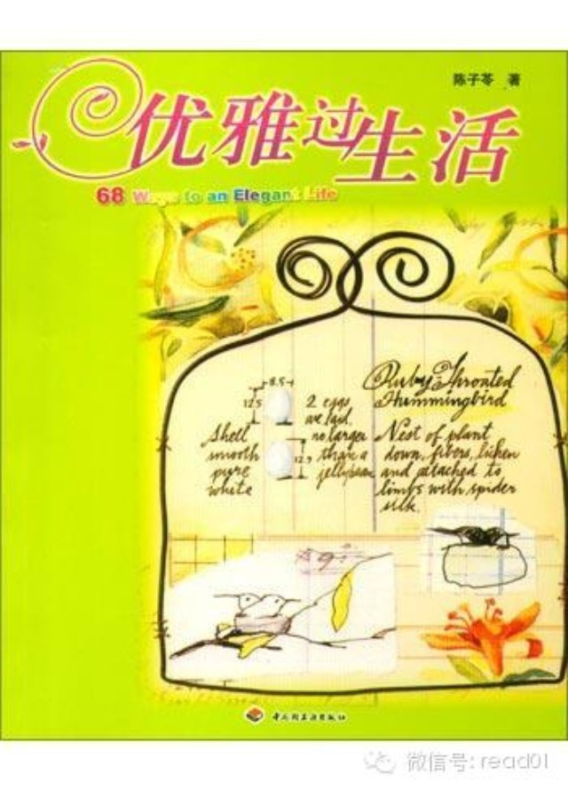

# 以前写几篇，推荐过几本适合女性阅读的书单[输入：20140313 、20140314、20140315]，今天跟一个新认识的朋友聊天的时候，又帮我补充了
一本，风格类似于《雅致生活》，在豆瓣看书评时，发现已经有人做了很仔细的笔记，这本书是2004年的，估计现在可能买不到了，有兴趣的读者可以去看看。  

《雅致生活》输入：  
[20140220] 《雅致生活》情趣小窍门  
[20140307]《雅致生活》-化平凡为神奇

* * *

作者： 靜  
出处：http://book.douban.com/review/3309461/

　　每个人会把自己的生活过成什么样子，跟自幼家教、环境、自我成长三个主要关键点有关。  
  
　　迅速做好家事固然重要，让自己及家人过着优雅精致的生活似乎才是更值得追求的生活。  
  
　　干净舒服的家是优雅生活中不可缺少的因素。  
  
  
  
  
　　——————————  
　　——————————  
　　 68条途径  
　　——————————  
　　——————————  

## 一、喜欢自己

  
**1、优雅余裕的生活**  
　　『余裕是个人在物质及精神上，充分达到满足的状态。』  
  
　　整齐清洁的外在环境  
　　白净美丽的个人仪容  
　　用自己喜欢的东西，被喜欢的东西环绕  
　　抓住难得的机会尝试新的事物  
　　自己买花、插花  
　　……  
  
  
**2、优雅革命**

　　『新优雅女性是指懂得过生活、有智慧、有礼貌、善解人意的女性。』  
  
　　真正的优雅余裕的人，是把自己平日辛苦挣来的钱和时间，做最妥当的享受与规划。绝不逾越自己的尺度，造成生活上不必要的负担，享受行为只会随着能力提升，慢慢往上
调整。想要用名牌就先让自己成为配之无愧的女人。  
  
　　例子：平时节俭自己洗头的优雅余裕女，为自己安排两个月一小乐（外出洗头），三个月一大乐（SPA）。  
  
  
**3、简单生活就是高雅**  
　　『生活的四大精神支柱：简单、快速、智慧、美丽，而巧思简约生活的方式，并乐于其中是追求上述精神的不二法门。』  
  
　　家里保持干净也是简单生活的目标，为了让窗户、厨房、浴室保持明亮，平时即使没有明显的污垢，也要勤加擦拭。  
　　保持让每个东西有一定的位置、一定的品质、一定的量。  
　　保持7成收纳空间是最好的。留三成的空间不仅使空气流通，容易打扫，还能增加物品的寿命。  
　　只要每星期整理一个抽屉、一个柜子，就可以知道原来家里有那么多浪费的空间。  
  
  
**4、77堂美的课程**  
  
　　要发现自己的美，需要想像最喜欢的自己开始，并且开始了解自己喜欢的事物。当身边都围绕你最喜欢的东西时，就会渐渐明白你要的样子是什么。当有一天本来有意识在做
的事变成无意识在做，表示你的style已经确定了。  
  
　　一天24小时中，找十分钟和自己说说话，不管是反省还是赞美。  
  
　　唯有埋首在工作时，你才会发现，原来遥不可及的目标，有一天突然近在眼前。  
  
　　工作的定义是在受局限的范围内做到最好，不要过于苛求。  
  
　　散发个性美的女性比化妆完美的女性更有魅力。不能单靠化妆来追求美丽，化妆只是衬托内心散发出来的美。随着岁数增加，个人散发的韵味也不同，化妆要掌握各个时期的
韵味。  
  
　　不适合自己的东西要舍弃，更重要的是赶快去找适合自己的。  
  
　　化妆与保养要带着“既然要做就…”的积极精神，而非“反正不管怎样做都…”的消极观念。  
  
　　买衣哲学：买一件就处分一件。穿衣哲学：合适、截长补短、契合自己。  
  
　　平时多利用片段时间完成家事和工作，周末大方留时间给自己发呆和休息。  
  
　　健康才是真正通往美丽的路。  
  
  
**5、现代优雅美女的十个条件**  
  
　　1）有人性的魅力、女人味、个性美、丰富的表情。  
　　一个人如果因为忧郁、压力表情呈现疲态，外型在怎么姣好也称不上漂亮。  
　　2）喜欢欣赏及使用美好的事物，常常接触美的事物可以提高一个人的气质和感性。  
　　3）有追求美的动力：有一个明确的动机或目标可以使人美丽。  
　　4）健康的身体、平衡的身体和美丽的肤色。  
　　多喝水、不熬夜、注意饮食以及适度的运动尤为重要。  
　　5）做菜高手  
　　6）了解自己的身体，不会糟蹋自己的身体，懂得爱惜自己的身体。  
　　7）喜欢吸收新知识  
　　8）有执着偏爱的宝物  
　　9）常看镜子检讨自己  
　　多看镜子中的自己不但可以产生自信，更可以观察到许多需要改进的地方。  
　　10）努力为自己下功夫  
　　美丽不是一蹴而就，必须很有耐心及恒心投资积极，栽培自己。  
  
**6、法国电影中的优雅十戒**  
  
　　1）绝对不穿模特儿或杂志上大肆广告的服装  
　　2）研究适合自己的衣服，并只穿适合自己的衣服  
　　3）当她好不容易找到合适自己的鞋和皮包，会不惜重复购买爱用它  
　　4）与其穿十件不适合的衣服，不如穿十次同一件适合自己的衣服  
　　5）与其买十件质感差的衣服，不如买一件质感好的衣服  
　　6）外出旅行轻便为主  
　　7）晚上外出时，一定要换衣服并重新化妆  
　　8）过去合适的衣服，未必现在穿也出色  
　　9）就算不够富裕，只要能睡在洗净烫好的床单就会感到幸福  
　　10）即使在一个人的时候，为了让自己开心，也会好好梳洗打扮  
  
  
**7、日常生活中的优雅学分**  
  
　　1）外出仪容  
　　当我们开始注意自己的仪容举止，并且在乎整洁带给自己及旁人的感受，一定能散发魅力，如沐春风。  
　　2）重视电话礼仪  
　　3）环保习惯  
　　优雅的人会为了减少垃圾，拒绝过度包装；会做好垃圾分类，做到随时随地、人前人后保持良好的环保习惯。  
　　从外出记得放进包包购物袋这个小习惯开始做起。  
　　4）礼尚往来，虽不需马上回礼，惦记心头，找适当时机回赠才不致失礼。  
  
　　人在赞美声中更美丽  
  
**8、办公室生活中的优雅学分（略)**   
  
**9、解读疲劳**  
　　1）90%的疲劳来自心理因素  
　　2）焦躁不安会消磨动力  
　　3）为工作烦恼比做工作本身还要令人感到疲累  
　　4）疲劳与耗去的心理并无直接关系反而与对事情本身的喜恶有很大关系  
　　5）讨厌去做的事，拖着会越讨厌去做  
　　6）无一贯性工作态度的人比较容易感到疲累  
　　7）良好的饮食和运动习惯可以克服疲劳  
  
**10、完全优待自己的角落**  
　　你需要一个完全放松的时刻，不仅有这样的时间，还要有这样的空间。家里除了心灵可以放松的角落，还有一处带来勇气的秘密基地。不管遇到多么令人气馁的事，坐上这张
椅子后就会变得勇气百倍。  
　　优雅地使用咖啡厅  
  
**11、提高睡眠品质**  
　　晚上十点到清晨两点是人体器官最佳休息时间。  
　　床单至少两星期洗一次，在晴天晒到有太阳的味道，记得在太阳下山前收回。  
　　务必使用床罩，看看床头柜上的灰尘，就可以知道床被上有好多看不见的灰尘。  
  
**12、完全放松的沐浴时光**   
　　沐浴前，点香油或蜡烛，放一片轻松的心灵音乐，喝一瓶矿泉水促进排汗。  
  
　　感冒时，用45度较热的水温泡到脚踝，约15分钟，泡到两脚颜色呈现红色即可。  
　　身体虚寒、末梢神经冰冷、肠胃不舒服、生理痛时，只要泡到膝盖处，时间约15分钟，着衣避免受凉。  
　　用脑过度无法入眠时，可以在洗脸盆中放略烫的水，手肘浸泡至额头出汗为止，如此可以使紧绷的脑部神经获得舒缓。  
  
  
**13、健康水美人**   
  
**14、举手投足皆优雅 **  
　　观察路人走路的姿势和表情，它让我警觉：此刻的我，是否表情呆滞？走路驼背…  
　　一个人眼睛要发亮有神，表情呈现生动活泼，需要靠健康的脸部肌肉，绝不是光涂保养品能实现的。  
　　改掉看电脑皱眉头的习惯  
　　时常提醒自己抬头挺胸  
　　只要嘴角上扬，看起来至少年轻十岁  
  
　　站姿：  
　　集中意识在鼻头，朝前方看齐。吸一口气挺胸缩腹，两手臂使力朝后，并将臂部靠拢，两脚并齐。  
  
　　坐姿：  
　　下巴自然水平，两手轻轻叠放，身体离开椅背，挺胸缩腹，双膝并拢，两腿一前一后斜放。  
  
　　走姿：  
　　抬头挺胸，好似有人在后面推着，以腰部的力道走路，手臂自然前后摆动。  
  
  
**15、嘴唇、牙齿和香水**  
　　嘴唇是女人最有魅力的地方。  
　　购买的牙刷头部不要太大，毛已经分叉的牙刷就没有效果。  
　　每年定期洗牙，检查是否有蛀牙、牙周病。  
　　在手臂的关节、手腕、耳朵后面等脉动的地方搽少量香水，夜晚抹点香水也不错。  
  
　　**16、看不见的体内环保**  
　　保持肠道通畅  
　　重视血液循环：不摄入太多动物性脂肪、不要喝酒过量、不要吃太咸、不要吃太甜、减少压力  
　　多摄取使血液清澈的食物：海藻、青鱼、梅子、莅果、根菜类、干香菇、橄榄油、玉米片  
  
**17、不吸烟（略）**  
  
**18、买一本爱不释手的记事本**  
　　挑一本让你爱不释手的记事本：吸引你的封面、随身携带方便、内页格式符合实际需要、公司和私事记在同一本上。  
　　内容：  
　　甲区：当日札记，对日期许，记录一些鼓励自己达到目标的话  
　　乙区：今日主要约会事项及需要联络事项  
　　丙区：今日该完成事项：在家该完成的、在公司该完成的、今日工作目标、打扫事项  
　　丁区：今日食谱及该买的东西清单  
　　戊区：所有可用时间的15分钟单位记事表，善用15分钟。  
  
**19、挂上请勿打扰的牌子**  
　　透过15分钟计划表，可以了解时间消磨的始末，找到解决对策。  
  
**20、两个月买一本相看的书**　　   
**21、储存娘家的味道 **  
  
**22、有梦最美**  
　　在不如意的时候，想一件事让自己感到幸福的事。  
  
  
  
  

## 二、幸福城堡

  
**23、家事是为了追求优雅的生活**  
　　主妇的工作与在外上班一样，有意义或无趣与否，全靠个人的应对态度。  
　　家事是一种艺术。让自己成为一位艺术家，不仅对内经营家的格调，对外也表现家的风格。懂得生活的家庭主妇，将平日的琐碎家事，打理得尽善尽美，远超乎平常人对主妇
的刻板印象。  
　　1）我煮汤，味道不但鲜美，兼顾健康，没有多余的油份。  
　　2）我煎的牛排会控制火候，切知道这块牛排的产地和部位。  
　　3）我在市场上有几家很熟的店，平常他们都会卖给我最好的。  
　　4）我家每天使用的碗盆都洗得亮晶晶的，像高级餐厅用的。  
　　5）我家的餐桌铺的桌巾是经过烫整特别挑选的，不是一般的塑胶。  
　　6）我常邀请三两好友来家里，尝尝自己最新研发的新菜色。  
　　7）每一餐餐桌及菜色的摆设，都经过我的用心巧思。  
　　8）我家的床单枕套至少两个星期换洗一次。  
　　9）我经常改变卧室气氛，定期更换及处分不适宜的东西。  
　　……  
  
　　**24、握有幸福城堡钥匙的女主人**   
　　预期说喜欢做家事，不如说很喜欢看到自己的家干净温馨，这个家，每天为回家的家人洗尘，让大家的疲惫获得完全的纾解，并让家人隔天出去时，有百分之两百面对外头挑
战的活力与勇气。  
  
　　**25、一天打扫一小时计划表**   
　　1）使用频率决定打扫频率：玄关、客餐厅、主卧室、卫浴、厨房都是每周两次；较少使用的房间每周一次。  
　　2）偷懒时用纸拖把与魔术毯子拂去灰尘最方便。  
　　3）两星期洗一次床单，洗衣量随季节与家庭人数增减次数。  
　　……  
  
　　找一些优雅的情节用品帮助愉快地打扫。  
  
　　**26、爱家的十个清洁习惯**   
　　1）顺手清洁  
　　把家事当作顺便做时，能降低做家事的负担  
　　2）计划好再动  
　　3）要与不要的东西分清楚  
　　只用常用的东西，只装饰喜欢的东西  
　　4）相关的东西才归在一起  
　　家中物品井然有序，东西比较容易找到  
　　5）以用的频率决定放的位置  
　　不常用的就把它放在不会干扰的地方，甚至把它处理掉  
　　6）前一晚做好隔天的准备  
　　7）一个月至少邀请朋友来家一次  
　　至少维持表面的整洁  
　　8）打扫的方向，有上而下，顺时针方向  
　　尽量两手一起做，避免消耗不必要的体力，巧用围裙的功能  
　　9）不要有等一下再收的坏习惯  
　　10）就寝前五分整理  
　　尽量把东西归回原位，让隔天早晨醒来能看到整齐的家。  
  
　　**27、决定家的指标区域**   
　　以下12点是家的最后防线：  
　　1）玄关为佳的门面，不管什么时候，地板、镜子、大门都要擦拭干净，鞋子排好。  
　　2）从玄关、经客餐厅到厨房，主卧房这一条动线上的地板要干净  
　　3）主动线上的家具不能有明显的灰尘  
　　4）洗脸台镜子不能有溅上去的水渍  
　　5）厨房水槽内不要囤积大量待洗的餐具  
　　6）厨房工作太忙、餐桌、书桌、化妆台及客厅桌上不能凌乱  
　　7）房间内床被要折好，没有乱放的衣物  
　　8）更衣室，衣橱内衣服要叠好  
　　9）不要囤积待洗及待烫的衣服  
　　10）冰箱内整齐，没有过期食品  
　　11）花瓶里的水要清澈，有落叶枯花要清理  
　　12）客卫的卫生纸要折角，洗脸台要保持干爽  
　　随时随地警惕自己遵守这12条防线，维持家里最起码的清洁，再也不难。  
　　用一些小东西奖励自己做好家事。  
  
　　**30、爱上厨房的方法**   
　　1）把厨房变成自己喜欢的样子  
　　检讨旧的厨具以及餐具，处理很久没有用或根本不喜欢用的，让厨房的空间变得比较清爽，并且锁定几样常用的厨具，慢慢成为自己喜欢的。  
　　2）培养优雅的做菜氛围  
　　提高自己做菜的层次，你是清新的、穿着可爱围裙的少妇。  
　　3）冰箱一定要好好待它  
　　整整齐齐地放着好多好吃好喝的东西，那种感觉多好。出去买菜之前一定要先打开冰箱确认还有什么，并且扬尘给治好一周清洁一次冰箱的好习惯。  
　　4）有智慧地买消耗品  
　　5）自己做食谱  
　　每次试完一道新菜，帮它取个名字，记录下简单的步骤，日积月累就成为你的个人食谱了。  
  
　　**31、优雅的家事教育**   
　　自己拿出来的东西要自己收好  
　　家的整洁是家中每一份子的责任  
　　列出可以帮忙的事项，除了做好个人事务，请他们认领共同家事部分  
　　整理出一个家人容易帮忙的环境相当重要  
　　让全家参与家事，必须有一个觉悟，就是不要去完美，不要设定苛刻的标准，家人有心分担就够了  
  
　　**32、事务性搭配创意性的家事做法**   
　　插花、摆设是一种艺术而非枯燥的例行工作  
　　整理厨房使物品摆在最有效的位置  
　　想出好吃又好看的便当菜单  
　　整理仓库，丢弃不用的洞子，让储存空间更宽敞  
  
　　**33、家里只摆符合品味的东西**   
　　家里的东西不要多，只摆符合品味的东西。  
　　1）家里只摆最喜欢的东西，不符合格调的东西，送人或处理，真的无法割舍，可以先收起来，等一段时间轮流装饰  
　　2）不冲动购物，买东西时必须三思：这件东西真的喜欢到非买不可吗？买回家后要摆在哪里，有最适合它的位置吗？  
　　3）购买家饰不宜昂贵，有自己的风格就好，随着收入怎家再慢慢收藏价格比较高的物品  
  
　　**34、五星级化妆间**   
　　看一个家的水准，就要看厨房的抹布和厕所  
　　1）彻底洗干净，并且通风拭干  
　　2）除去瓷砖间的黑霉，或用白色奇异笔涂上去  
　　3）洗脸台上不要放赘物，只要放一瓶造型大方的洗手液，最多放一盆绿色植物  
　　4）家人的洗漱用品要摆放整齐，勿碍观瞻  
　　5）洗脸盆内保持干爽整洁，镜子不要有溅上去的水渍  
　　6）卷筒纸折角  
　　7）浴室里不要悬挂太多颜色杂乱的毛巾，供人擦手的毛巾要让客人一目了然  
　　8）擦手毛精要保持清洁，定期更换  
　　9）放一点干燥花，点一盆精油  
  
　　**35、巧思打扫艺术**   
　　活用日常生活的小点子  
　　1）洗脸台是早晚刷牙洗脸时最容易弄脏的部分，将菜瓜布放和洗脸台很搭配的饰品里，每次洗漱完后随手用它来擦干净，方便又美观。  
　　2）经清洁剂分装在几个附有效喷头的随头罐，放在常用的地方，可以随时清洁。  
　　3）漂亮容器可以增加打扫气氛。  
　　……  
  
  
　　**36、增加效率的家事音乐**   
　　自己爱听、轻快且能让心情愉快的音乐适合做家事时听。  
  
　　**37、委外家事（略）**   
　　在不做家事的时候，思考提高生活品质。  
  
  
  

## 三、一期一会（略）

  
　　38-50  
  
  
  

## 四、彩虹生活

  
  
　　**51、基本和式餐具**   
  
　　一个地方有多少花店，要看这个地方的文化程度。  
  
　　日本料理其实没有想象中那么难，搭配自己喜爱的和式餐具，可以增添更多学习日本料理的乐趣。  
  
　　购买和式餐具的要领在于质感、触感及使用广泛度。拥有任何料理都适合的基本款更实用。一般来说，造型素雅、米色系陶瓷为居家和式餐具的主流。  
　　1）茶壶和茶杯  
　　专泡日本茶的叫“急须”，另一种类似紫砂壶，适合泡中国茶和红茶，叫做“茶器”。茶壶以出水佳，壶盖轻敲壶身，发出高亮音为上品。  
　　茶杯用于日常茶，容量较多的“汤饮”。  
　　2）在和式餐具中，有深度的餐具总称为钵。大钵可以突出单一主菜的华丽，中钵可以盛汤水较多的煮物。小钵可拥有各种不同花色。使用小钵盛料理使菜色看起来更好吃的
诀窍是将食物摆在钵的中间并且堆高。除了这些基本款还有小浅钵、大圆钵及椭圆钵，前者可以做个人的“取皿”、“酱料皿”，后两者可用来盛和风沙拉及新鲜水果。  
　　3）好看的饭碗让白饭看起来更好吃，一般而言，直径12公分的饭碗最适合东方人，选择粗糙质地（导热性弱）的饭碗比较妥当。  
　　4）汤碗，可用导热低的漆器汤碗。  
　　5）各种大小的白瓷皿。  
  
　　**52、必备西式餐具（略）**   
  
　　**53、基本和式餐具**   
  
　　一个地方有多少花店，要看这个地方的文化程度。  
  
　　日本料理其实没有想象中那么难，搭配自己喜爱的和式餐具，可以增添更多学习日本料理的乐趣。  
  
　　购买和式餐具的要领在于质感、触感及使用广泛度。拥有任何料理都适合的基本款更实用。一般来说，造型素雅、米色系陶瓷为居家和式餐具的主流。  
　　1）茶壶和茶杯  
　　专泡日本茶的叫“急须”，另一种类似紫砂壶，适合泡中国茶和红茶，叫做“茶器”。茶壶以出水佳，壶盖轻敲壶身，发出高亮音为上品。  
　　茶杯用于日常茶，容量较多的“汤饮”。  
　　2）在和式餐具中，有深度的餐具总称为钵。大钵可以突出单一主菜的华丽，中钵可以盛汤水较多的煮物。小钵可拥有各种不同花色。使用小钵盛料理使菜色看起来更好吃的
诀窍是将食物摆在钵的中间并且堆高。除了这些基本款还有小浅钵、大圆钵及椭圆钵，前者可以做个人的“取皿”、“酱料皿”，后两者可用来盛和风沙拉及新鲜水果。  
　　3）好看的饭碗让白饭看起来更好吃，一般而言，直径12公分的饭碗最适合东方人，选择粗糙质地（导热性弱）的饭碗比较妥当。  
　　4）汤碗，可用导热低的漆器汤碗。  
　　5）各种大小的白瓷皿。  
  
　　**54、必备西式餐具（略）**   
  
　　**55、剪花、送花**   
　　剪花可以延续话的绽放期，不同种类的话，剪花的方式也不尽相同。  
　　1）水中斜切法  
　　最基本的方法，在水中斜切后，浸在大量的水中，使其充分吃水。  
　　2）十字纵切法  
　　木枝的花，只有斜切不够，削去末端枝皮后，再纵切十字，放能使水充分浸透到花枝内部。  
　　3）折断法  
　　有些花不适合接触金属，如菊花，因此用手折断。  
　　4）滚水切法  
　　向日葵、波斯菊等野花，需要用滚烫的开水切枝。可以用新闻纸包住只露出花枝的末端，于热水浸渍10秒钟后，立即放入冷水，浸到热水部分建议将之剪切。  
  
　　买花的技巧：  
　　1）检查花瓣的完整度  
　　2）找花苞多一点的花枝，太小的花苞有时不会开，找已经开四成以上的花苞就对了。  
　　3）主意花枝上的叶子是否新鲜，太干、变黄或者浸泡在水内太久的花枝都不好。  
　　4)检查浸在水里的花茎末端，是否因为没有勤于修建，呈现浸烂的现象。  
　　5）检查卖场花瓶内的水，是否因为没有勤于换水，产生水质浑浊的现象。  
  
　　让花的生命更长久的方法：  
　　1）买的时候花枝不要简短，两天修一次花茎对生命的延续有帮助。  
　　2）买回来立即修剪吃水，避免碰水容易腐烂，浸在花瓶水内的叶子需要摘除  
　　3）不要将花瓶放在阳光直射以及容易干燥的冷暖气出风口。  
　　4）花瓶里的水要每天换，再加一点漂泊水或白醋，保持花瓶里的水清澈无臭。  
  
　　**56-61（略）**   
  
  
　　**62、让薄荷充满你的生活**   
  
　　薄荷茶能舒缓吃太多油腻食物引起的肠胃消化不良。  
　　冰薄荷水解渴又清凉，可以补充VC，还能抑制产妇的孕吐症状。  
　　薄荷水漱口可以抑制感冒，减轻喉咙痛及鼻塞。  
　　多余的薄荷水浇在盆栽植物中可以做植物的营养液，还可以驱虫。  
  
　　**63-68（略）**

## 100天行动读者反馈

* * *

  
@lizzy

  1. No news. 要知道，看新闻八卦是我以前每天早晚的必修课。看了你的100天行动，我决定戒除这个坏习惯，开始几天只允许自己浏览一下标题，后来干脆将主页换成百度，这样有效减少刺激。20多天后，我就对之免疫了。 2.关注微信朋友圈。 这个也同样的浪费时间，我曾试过将朋友圈关注关掉，还是忍不住去点开朋友的相册去看。现在是屏蔽掉一些喜欢发无聊信息的人，公众账号也只关注两个，并且固定早晚两个时间看。

  2. 每晚写日记。 跟公婆同住，生活习惯、生活态度难免有分歧，而这些又说不得。把每天的奇葩事都记录下来，一来我的烦恼有了宣泄的地方，二来这也不失为一种好的习惯。

4.早锻炼。  
之前一直习惯傍晚锻炼，发现没什么改观，最近几天早锻炼感觉一天都精神饱满。

5.随时随地看书。

也是得益于您的文章分享，我现在在用kindle看免费书，烧饭间歇、陪孩子写作业时都可以看会书。我们镇不久前刚弄好了图书室，距离我家几步之遥，我在做完家务（我
是一名主妇，暂时没上班），就随时过去翻翻书，阅览室通常我一个人，感觉很棒。

5.工作。  
晚上，孩子睡了，开始弄我的淘宝小店，已经初具雏形。这个完成后还打算学PS.

  1. 英语学习。

很喜欢英语，所以想继续学习。最近在看TED, 但是对于目前的我来说，没有字幕，很难听懂，在挣扎中，要先精熟一篇，再看下一篇。总之，感谢您的分享，受益颇多。

  

举报

[阅读原文](http://mp.weixin.qq.com/s?__biz=MjM5NjA3OTM0MA==&mid=201909555&idx=1&sn
=2e291c6b77e6f356b34527cfe116e723&scene=0#rd)

