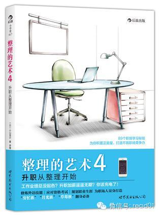

  
这个系列的书，从1到4，都分享过笔记，这本书属于实用技巧类的合集，里面的很多技巧，大都在以前的文章中分享过。输入：「整理的艺术」查看以前几本书笔记

删除一些重复或者不适合国内的技巧，大家看到觉得好的技巧就马上去实践。多实践多总结。

### Chapter1 工具整理术：为职场人量身打造的学习工具

　　01 利用“轻松耳朵学习法”提高学习效率 输入「有声书」  
　　02 利用录音笔将知识转化为声音 ： 把教科书中想要记住的部分读出来，再用录音笔录下来，利用空闲时间反复听，能大大节省复习时间  
　　03 别管懂不懂，先背下来再说  
　　04 用消噪耳机把公共场所变成书房  
　　05 通过模仿语调，学习老师的思维方式  
　　06 利用思维导图把握总体结构  
　　07 利用EverNote创建“个性化辞典”  
　　08 定期订阅专业杂志获得图表  
　　09 通过Facebook创建学习小组 （可以在豆瓣或微信上建议一个学习小组）  
　　10 在GoogleDocuments上共享学习笔记 （共享协作方便，可以换成印象笔记或OneNote）  
　　11 “教" 是最高效的学习方法  
　　12 利用专题网站汇总信息 （类似我Blog上的主题阅读）  

### Chapter2 时间整理术：化零为整，多线并进

　　学习整理术14 不要长时间连续学习: 每个人的精力是有限，并一定长时间学习效果就好  
　　学习整理术15 有效利用零散时间  
　　学习整理术16 在车站的长椅上学习（人多的就做下一趟，但这条在京上的地铁上无效）  
　　学习整理术17 利用“同时学习法”使学习时间翻倍 （运动、做家务时听有声书或录音）  
　　学习整理术19 睡觉时间超过7小时能提高记忆力  
　　学习整理术20 花钱上课，强迫自己学习  
　　学习整理术21 把考试当做“最后期限”  
　　学习整理术22 制定年度计划，进行“零存整取储蓄”（把目标细化到每天的习惯中去）  
　　学习整理术23 在习题集一角写上完成时间  
　　学习整理术24 利用清晨时间进行“输出型学习”（以参加考试的心态来做题）  
　　学习整理术25 利用长假时间集中进行“输出型学习”（用整段时间进行冲刺）  

### Chapter3 考试整理术：大胆取舍，把精力用在刀刃上

　　学习整理术27 看习题集从答案开始  
　　学习整理术28 已经答对的问题无需再做第二遍  
　　学习整理术29 所剩学习时间的一半用来做题  
　　学习整理术30 使用教材遵守onepocket原则（把文件集团放在一起地方，不要乱放）  
　　学习整理术31 从头到尾通读一遍教材  
　　学习整理术33 结合车站站名背诵知识 （地点法或宫殿记忆法）  
　　学习整理术34 尽可能忘掉已经记住的东西  
　　学习整理术35 对比各补习学校制定的标准答案  
　　学习整理术36 考试时先做拿手题  
　　学习整理术37 一旦决心参加考试马上报名  
　　学习整理术38 选择难度适合自己的考试  
　　学习整理术39 复习时间不够时大胆“押宝”  
　　学习整理术40 大胆取舍，把精力用在刀刃上（应用80比20法则）

### Chapter4习惯整理术：巧用妙招，让自己爱上学习

　　学习整理术41　不依赖毅力学习 （利用习惯，可以试试100天行动）  
　　学习整理术44 寻找学习伙伴，避免半途而废  
　　学习整理术45 在微博上汇报学习进展  
　　学习整理术46 用超级美味的甜品来奖励自己 （达到目标后奖励自己）  
　　学习整理术47 切断电源，把游戏机收起来  
　　学习整理术48 为五年后的自己命名 （给自己做一个5年计划）  
　　学习整理术49 学习最前沿的知识  
　　学习整理术50 战胜昨天的自己  
　　学习整理术51 可视化”学习法 （量化自我）  
　　学习整理术52 通过学习获得“顿悟体验” （多培养自己的心流体验）  

### Chapter5环境整理术：改善身体状况与周边环境

　　学习整理术55 晚上散步时练习听力  
　　学习整理术56 把咖啡厅当成书房  
　　学习整理术57 租自习室学习  
　　学习整理术58 利用集训集中精力学习  
　　学习整理术59 通过香味控制注意力  
　　学习整理术60 有助于提高学习效率的花草茶  
　　学习整理术61 饭吃八分饱，节食半天  
　　学习整理术62 调暗房间的灯光  
　　学习整理术63 在身边摆放黄色物品  
　　学习整理术64 从整理书桌开始  
　　学习整理术65 听听佛经，集中注意力  
　　学习整理术66 冬天把空调设定在20℃  
　　学习整理术67 利用腹式呼吸消除杂念  
　　学习整理术68 盘腿坐着学习  
　　学习整理术69 改善身体状况与周边环境

### Chapter6语言整理术：把握语言的规律与变化

　　学习整理术70 　阅读平装书使阅读量突破100万个单词 （sss阅读法）  
　　学习整理术71 只要掌握1,000个单词就能跟人用英语聊天  
　　学习整理术72 巧用软件背诵单词  
　　学习整理术73 每年花1,000小时练听力  
　　学习整理术74 从电视剧中学习鲜活的英语  
　　学习整理术75 英语会话的KTV——“影子练习” （模仿母语者同样的语气、语速）  
　　学习整理术76 把重要句型全背下来  
　　学习整理术77 借助iTunesU免费留学海外  
　　学习整理术78 利用Skype检验自己的英语会话能力  
　　学习整理术79 把握语言的规律与变化

### Chapter7职业整理术：学习是一种人生态度

　　学习整理术80 　职业生涯的蓝海战略  
　　学习整理术81 　学习会计知识，横向扩展职业  
　　学习整理术82 马上实践学过的知识  
　　学习整理术83 为职业生涯上一份双保险 （同时拥有两份职业）  
　　学习整理术84 如何通过学习拓展人脉 （读商学院或加入不同的学习圈子）  
　　学习整理术85 学习的投资回报率 （投资自己）  
　　学习整理术86 把工作变成“案例” （多做定期总结）  
　　学习整理术87 三人行必有我师焉 （给自己找到导师）  

## 100天赞美行动读者反馈

  

**@Mojo **   
  
老师，这个赞美其实是很有用的，喜悦是会传染的，你赞美别人，别人开心你自己也会开心，如今这个充满戾气的社会是需要更多的人去赞美去快乐。作为一名销售，我们这行都
很懂得赞美的魔力，俗话一句话让人笑一句话让人跳，有时一句你今天很美，你今天新头饰很好看，你今天穿着很漂亮，你今天很帅，会让人一天好心情，把快乐的种子播撒到你
周围，而你也收获了快乐和满足，当然对于我可能还有业绩  
  
  

**@赵晴 **   
  
  
老师好，这是我第一次发微信给您，关注您有一段时间了，谢谢您的分享。这次看到你分享的如何赞美这个话题，突然回忆起平常自己如何做的，有种恍然大悟的感觉。比如说，
如果有朋友问今天穿的衣服好不好看，个人回答如果就是简单的几个字:嗯，还行，挺好看的，不错。这样很容易被对方当做是敷衍，觉得不真心。我自己之前觉得这样不太好，
就小小的发展了一下我的答案方式，我一般的回答是:挺好看的，这个衣服显白，挺衬肤色，这个设计有点意思，扣子好漂亮。这样具体到某一个小细节上去，我发现这样真诚度
就会上升很多。即使你并不觉得那件衣服有多么好，这也是对别人需要肯定答复的一种好的阐述方式了吧。今天看了老师的微信，原来赞美的三步骤还可以进一步加深，以后还可
以添上对比，这样就更好了。谢谢老师

  

[阅读原文](http://mp.weixin.qq.com/s?__biz=MjM5NjA3OTM0MA==&mid=200772870&idx=1&sn
=2edad3915839eba683fc0cefb164e89b&scene=1#rd)

