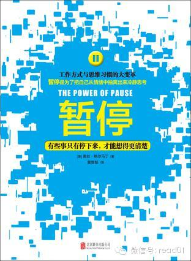

在20131216的文章【沟通技巧：开会时争论不休或沟通想吵架如何处理？】，推荐过这本书，可以用一句话来概括：**不管别人说了什么、做了什么或写了什么，都不
要马上回应。  **目标是让自己遇到意外或紧急状况时，不妨将自己的心智从行动中暂时抽离出来。

  

看起来很简单，但我做了一段时间的记录之后，发现有很时候做的都不够好没有暂停，而是直接回应，书中有每一章中都有一些技巧可以分享，虽然看起来很简单，但想真正掌握
可不容易，这是非常实用的沟通和情绪控制技巧。

  

分享一下脱水版的笔记，觉得不错，建议去看原书。

  

书中提到大概有70%到80%的语言沟通会被“忽略、误解或很快遗忘”。你心里可能会这么想：你说的和我听到的一样吗？我听到的和你的意思一样吗？你听懂我跟你说的意
思了吗？

  

在流通中要以“达成沟通目的”为最高指导原则。 话说完和讯息传送出去，而且确定对方接收到你要传达的讯息，也的确按照自己的原意去理解，沟通才算完成。以前IBM在
培养销售时，有一条规则是，在沟通中要用不同方式跟用户确认需求5遍以上，明确自己是真的理解用户的要求，而是认为自己已经了解。

  

书中分享一种非常实用的技巧，推测式提问。掌握这种技巧后，沟通技能能提高一大块：

  

**推测式提问**

**  
**

**小技巧：**

-鼓励别人多说一点，或是在可能引发误会的地方说得更精确一点。

-会让别人有机会告诉你，对他来说什么比较重要。

-是想确定自己不了解她真正的意思。

  

  

**常用的开头：**

“听起来，你的意思是......”

“如果我没听错，你的意思应该是......”

“看看我有没有听懂你的意思。你是担心......”

“先等一下，我想要把你到目前为止所说的意思大概讲一遍，如果哪里说的不对，麻烦立刻指正。”

  

  

**注意事项**

-要透露出一种信号：你是真的想要了解对方的观点，而不是想要打压别人、突显自己，也不是想要说服别人，或者证明自己没有听错。

-留意你说话的速度和语气，让别人能感受到那份愿意理解的诚意。

-对方需要发泄情绪、刚听到坏消息、觉得被人设计或者有其他人在场会让对方觉得尴尬的时候，乖乖当个听众，请不要使用推测式问句。

-永远都不要说给人一种评断和辩解感觉的话：“是你自己说......”或者“我明明听到你说......”

**  
**

  

**使用暂停的环境：**  

  

  1. 我别无选择  
即使在最艰困的环境下，那我们以为自己别无选择时，仍然可以选择。

  2. 这没道理呀！  
他怎么可以这样自问：有没有什么是我（对方）根本没有想到的？

  3. 我必须立刻采取行动，免得被别人抢先一步  
请你休息一下，出去走一走，不然干脆就明天再说。  
研究发现，大脑会在深层短波睡眠期间将新旧资讯加以分类，再进一步找出各种问题的解决方法。

  4. 真不敢相信又发生这种事情  
自问：过去有什么模式是我没有注意到的，或者因为不希望它发生，所以刻意忽略的？

  5. 我们意见不同  
自问：我确定对方明白我的意思吗？而我也明白对方的意思吗？

  6. 那不是我期待的  
自问：我（对方）有没有预设立场？有没有必要重新来过？

  7. 我晓得怎么回事就好了，别人怎么想，我没有兴趣知道  
自问：换个角度会不会不一样？

重点是：**要能听进别人的意见，不要过于武断和自以为是。**

**  
**

**  
**

  

  

**暂停的力量练习：**

书中在每一章后都提供了作业

  

**练习一：要主动选择，不要被动决定**

  

选择不同，结果也不同

1、当你选择回应

过早下结论；

赢了面子，失了里子；

辩解或指责；

以自我为中心；

自曝其短；

自问：他们怎么可以这么做？

想着：我知道我是对的。

2、当你选择暂停

只需要几秒钟；

我有预设立场吗？

有人误会我的意思吗？

发生了什么我漏看漏听的事？

真正发生了什么事？

我是否误解了什么事？

  

  

  

大部分怨气都来自于没有表达，或是被人误解的“期待”。

心里有什么“期待”，就会认定什么“事实”。

当事情和预期不符，或者和自己听信的不一样时，我们也会觉得意外。

暂停可以让自己重回空挡的状态。

  

  

**练习二：意识到自己与别人的心灵滤网**

别人说话时，我们的心灵同时也忙着过滤讯息，降低我们与他人沟通的专注力。

1、认定：我知道你要说什么（心里预设了立场）

2、回应自己的期待：你说的不是我期望听到的（心里作了回应）

3、解决：你说完了吧，我已经有答案了（心里开始不耐烦）

4、情绪化解读：你很不讨人喜欢（心里觉得不屑）

5、质疑：我听不懂你在说什么（心里觉得不舒服）

6、反对：我不同意你说的话（心里想要争论）

7、赞成：我同意，我也是这么想（心里说：我懂了，然后呢？）

8、计划：我还有别的事（心里想着下一件事）

9、处理更重要的事情：我现在无法专心思考（心不在焉）

10、胡思乱想：什么时候吃午饭？（心里觉得有压力）

心灵滤网显示，当你忙着诠释别人的意思时，很容易因为心里的对话而分心。

应当随时提醒自己，一旦心里的对话让自己分神，就赶快“回到沟通现场”。

如果别人误听了或漏听了你的话，你也不要在意。

当对方觉得你听错意思，直言你没有专心听讲，你也不要浪费时间去辩解。

  

  

**练习三：暂且先相信别人**

先相信，不要急于判断，再利用暂停的力量察觉别人行为背后的动机。

  

**练习四：不要把怨气存进怨气户头**

怨气户头里的怨气存到一定程度时，破坏力超乎想象。

  

**练习五：使用推测式问句作为风险管理工具**

**  
**

推测式问句最基本的方式就是简述别人的语意：用自己的话说出你了解的意思。让对方知道你听出什么，同时给他一个机会，针对你的理解加以确认或说明，即可建立双方的信任
关系。

使用推测式问句之前，一定要保有正确的心态，也就是好奇心；把回怀疑搁在一旁，同时不要预设立场。

  

  

**练习六：展现“保有好奇心，不要怒气攻心”的思维**

沟通的三个步骤：

一、暂停，换空档；

二、展现“保有好奇心，不要怒气攻心”的思维，不要预设立场，避免先入为主，不要急着反应；

三、使用推测式问句，让真正的问题浮上台面，然后找出更有效的解决方法。

  

  

**练习七：要懂得问：手头上的工作还应付得来吗？**

  

在今天，企业面临一项严峻的挑战：很少有人觉得自己可以选择，或是有权整理出事情的优先顺序，以便重新分配工作，或者暂时搁在一边。这会给员工带来职业倦怠。

  

每周快速进行“工作量检查”，让大家一起根据目前的情况，看看是否需要新增或者删除哪些计划，或是更改完成期限，等等。

  

每周员工会议的开场白：

1.手头上的工作还应付得来吗？

2.说明一下，现在进度如何？

3.无法完成的原因是什么？

  

  

**练习八：有没有什么我以为知道，其实根本不知道的事儿？**

  

虚心的表现：承认有些事情自己以为知道，其实根本不知道。

虚心的做法：

1.无论你的看法有多强的说服力，都先摆在一边。

2.承认自己不会知道所有可能的解决方法。

3.愿意接受别人的建议，主动找出行的解决方法。

4.展现改变的决心。

  

**练习九：事先意识到可能被误解：要求别人使用推测式问句**

  

领导者应该有前瞻性的思维，必须事先意识到可能被误解。要求别人使用推测式问句，帮你确认自己的意思确实传达出来。

  

**练习十：从怨气户头中“提款”**

对于存进户头的怨气有所警觉，利用效能方程式来调整心态和做法：

1、暂停，要明白自己确实可以选择事情的处理方式；

2、展现抱有好奇心，不要怒气攻心的思维：问问自己是否对别人的用意预设立场。

3、问问自己：有没有什么你以为知道，其实根本不知道的事情，哪些事情引爆了我或是他们的情绪？

  

**好奇心：**

  

**保有好奇心，不要怒气攻心**

1.克制冲动，不要急着回应（暂停）；

2.把自己从眼前的情绪中抽离出来（暂缓回应）；

3.保持好奇，把所有的想法和事实过滤一遍（暂缓判断）；

4.重新掌握情况并发挥自制力（切换到正确档位）；

5.做出更周全的选择（继续前进）。

保有好奇心才能进一步找出表象背后的真相。

  

  

  

**好奇心提示检查表**

1、把“我知道”看得比较重要，好奇的机会较低

我是否把事实视为真相？

我是否做了决定？

我的决定是否被经验牵着走？

我是否只顾着事情符合自己的预期？

我是否把自己对不对看得很重要？而且我是否通常都是对的？

我是否觉得自己说得很清楚？

2、把“想知道”看得比较重要，好奇的机会较高

我们是否承认事实可能不是全部的真相？

我们是否看出别的可能性？

我们是否保持开放的心胸，把别人的经验也纳入考虑？

我们是否有兴趣考虑预期外的事情？

我们是否把其他可能的选择看得很重要？

我们是否认为自己和别人随时有可能发生意见上的失误？

  

**纪录片作业：**

@尹流氓好色又专一  
谢谢推荐，今天回到wifi环境看了《浮生一日》。
电影展示了20100724这天世界各地凡人们平凡真实的一天，影片通过简单的三个问题串联起来，“你的口袋里有什么？”“你爱什么？”“你害怕什么？”
因为太真实所以结尾女孩的话越触动我心。 我自己觉得不太好回答：“一支唇膏一块德芙”；"泛爱，最爱自己"；“害怕所有可怕的人事，害怕死亡，害怕朋友消失，害怕爱
人怒吼，最怕此生虚度”。人的一生太TM短暂了。 一直觉得会活得跟别人不一样，但回首，循规蹈矩正儿八经平凡得真像二十几年没发生过什么似的，没有惊世动俗，亦无积
少成多，没有活出心底认为最真实的自己，且波澜不惊。 但，就像影片结尾用升起的孔明灯来预示希望，I'm just one I know，But I feel
strong you know。已经尝试去做想做的事，挑战自己对未知的恐惧，坚持做些认为对的事，早起，晨跑，阅读…把梦想放在心间，然后美好而朴素地存在。
云朵理应洁白，海涛应追赶沙滩。Enjoy Life，Be Yourself。  
  
  
@LADER  
刚看完人生七年，看到保罗的那一段，我忍不住哭了，他二十岁前对世界的看法都跟我很像，小时候不相信婚姻以及亲密关系，到后来对亲密关系和婚姻或者说家庭的渴望，其实
他和二十岁左右的休斯很像，有一种忧伤甚至自毁倾向，但他幼年时期的优柔寡断和对生命的无力感在同时帮助了他，他不像休斯对生命有一种决绝，激烈地对抗一切，拒绝一切
他认为不完美的东西，同时很幸运遇到了一个很好的妻子，我最近越来越觉得遇到一个好的爱人是一种莫大的幸运，同时我认为要竭力改正自己的自毁情节，改变对这个世界消极
的看法，我觉定在一周内参考这部片子也为自己拍一段视频，现在我二十岁，休学在家，我知道自己的理想和目标，我知道我将变得更好，这一年我的改变将令人吃惊，我想把它
就录下来将是一件很有趣的事情，同时我每个月都会在同一天问自己同样的问题。
参加了100天行动小组，只是一直都是打酱油的状态，可能接下来会坚持学英语吧，我发觉只要养成了一个好习惯就很容易按照同样的模式，养成另一个习惯。  

  

[阅读原文](http://mp.weixin.qq.com/s?__biz=MjM5NjA3OTM0MA==&mid=200052646&idx=1&sn
=23aad601b9eb07dbdbd2c7fe4559b891&scene=1#rd)

