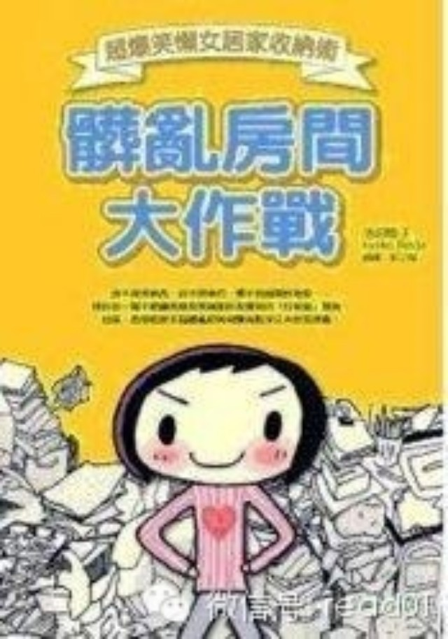
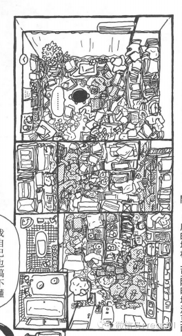
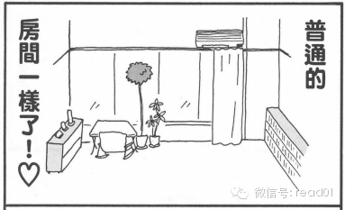

明天是休假的最后一天，最好别把这天安排的太满。可以用半天时间来做总结和计划，另外半天时间整理房间。

看过一本叫《脏乱房间大作战》的日本绘本，，作者：池田晓子，非常有意思的绘本，副标题是超爆笑懒女居家收纳术，真是非常的贴切，如果你的房间非常的乱，同时对整理术
有兴趣，可以看看这本漫画，学习房间收纳术。

看看如何从房间的这样：

  

变成这样

  

### step1 从基地开始动手

动手打扫前，先整理出一个空间做为起跑点

整理房间最重要的一个步骤，就是要减少屋内的杂物，立刻动手把不需要的东西丢掉。

### step2 进攻厨房

整理的要领，就是从不太需要花脑盘的地方，开始动手整理。

厨房的东西，最不需要慎重考虑，就可以决定要不要丢弃。  
必需品不会忘记，也就是用不到的或是不太重要的东西才会忘记。  
不再把会忘掉蝗东西收起来，只有绝对忘不掉的东西，才可以收到比较隐密的地方。  
容易忘的东西要放在经常可以看到或拿取的地方。  
所谓平常用不到就是根本不需要。不买或丢掉。

### Setp3 把每天必用之物收放在基地。

从生活必需品开始整理

对于不能确认以后是否用到的东西，可以采用全部丢掉大袋子的方法。  
常用的物品单独在固定的位置，偶尔用的东西都收到袋子里去。  
生活中就不必忙著找东西了。  
每次东西带回家之后，就应该随手加以整理。

买回来的东西，应该立刻收到在正确的地方才是王道。  
塑料袋或包装袋子立刻丢掉或回收。  
广告信件或宣传单立刻回收或处理。  
拿出手提袋的东西，全部归位。

### Step4 丢掉至今都未曾使用的东西

别可惜，只需留下常用或必用的物品。

### Step5 做一张房间简图

把空间做适当的间隔决定物品的摆放位置。

用7种超级清洁用具对抗顽垢。

1、最好的清洁用品是小苏打。用小苏打来清除油垢  
2、白醋清除水垢  
3、把旧毛巾剪成小块，用脏了就可以直接丢掉。  
4、用白色的去污海棉来对抗浴缸等水垢专用。  
5、除霉清洁剂可去除浴室磁砖缝隙的霉垢。  
6、去污橡皮擦。去除浴厕顽垢。  
7、椰果神奇去污剂。去除电器用品外侧、陶瓷器、玻璃与塑料器皿的污垢。

要经常打扫屋子，才能保持干净。 绝对禁止暂时性的处理方式  
除了这五步，改善的概念就是今日事、今日毕。

  * 每次把东西拿进屋里时就马上整理。

  * 每次用完就马上放回原位。

  * 每次弄脏就马上擦试。

整理房间最困难的东西就是“丢” 以后可能会用到–不，根本不会再用到。 丢掉放可惜了–当初根本就不应该买

## 100天行动读者反馈

@异域_MYC  
我争取从各个方面好好调节自己。对了，坚持英语提高计划已经三个多月啦，每天用班车上下班时间听podcast，看bbc新闻，背单词，每天能学两三个小时。这个十一
我集中看完了文法俱乐部的书，并且安排好了接下来要看的书^_^

@哲宁

100天挑战 第70天:早晨洗脸刷牙后，静坐、冥想20分钟，慢慢地变成了属于自己的习惯。这20分钟，可以用来安静的感受自己和周围的环境。谢谢老师。

  

举报

[阅读原文](http://mp.weixin.qq.com/s?__biz=MjM5NjA3OTM0MA==&mid=201973601&idx=1&sn
=b2eda2fc67809a15ce225d4be2d5dd10&scene=0#rd)

