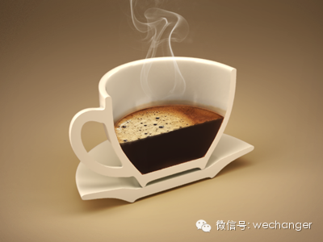

by 彭萦

  

很多人能长时间工作是靠喝咖啡。我常和朋友开玩笑说，我不喝咖啡，因为我体内自产咖啡因！

  

能每天工作12个小时的首要条件是你自己从内心底觉得这件事情值得你每天投入12个小时。所以，其实我说的不是每天工作12个小时，而是每天在自己喜欢的事情上投入1
2个小时。

  

我自己每天在我自己喜欢的事情上花费12个小时，这些我喜欢的事情就是我的三个一万小时倒计时——阅读写作、性格分析和创业。

  

我说的每天工作12个小时是纯工作时间，就是说开会走神、工作间隙刷微博刷网页上网购物、和同事聊天等等这些时间都不能算入纯工作时间。

  

当我每周工作纯时间是20小时的时候，我纳闷别人怎么能每周40小时；可是后来我每周工作40小时的时候，我就觉得每周工作20小时没什么大不了的，同时我又纳闷别人
怎么能每周工作80小时；再到后来，我每周工作80小时的时候，我就觉得每周40小时没什么大不了了，我又纳闷别人怎么能每周100个小时...

  

因为和我关系最亲近的那15个人，除了两三个人比我工作时间短以外，其他人和我工作时间都一样长，而且有不少人比我工作时间更长。如果和我关系最亲近的人都每天只工作
三四个小时，而我一个人每天工作12个小时，我肯定会开始怀疑，我为什么要这么卖力呢，我的生活怎么这么辛苦啊，我这样做是值得的吗？所以我那些同样每天都工作12个
小时身兼好几种身份同时在做好几个项目的朋友们给了我一个锚定效应——这让我觉得每天工作12个小时没什么大不了的。这种心态很重要。

  

有一次我和大卫说，我问了几个朋友，问他们我是不是幽默的人，他们都说我不是，好伤心啊，我要变成更幽默！大卫笑着说，这没有关系啊，我也不是一个幽默的人。你不可能
什么都占上。（You just can’t   have it all.）

  

MIT学生中流传着一句很有名的话——“分数、睡眠、社交生活，选其二。”这句话用在已经工作的人身上就是，工作、睡眠、社交生活，选其二。你不可能什么都占上。

  

幸好我是一个内向者。我喜欢独处。我不需要太多社交生活。实际上，太多的社交生活会过多地消耗我的能量，让我感到疲惫。以前在硅谷工作的时候我几乎每个星期都会去参加
斯坦福大学的活动。斯坦福有一个学生组织叫CEO，中国学生创业组织(Chinese Entrepreneurship Organization) ，他们每周都
会邀请国内的一些创业公司的高管来和学生分享创业的经验。因为每次参加的人数经常只有十多个，所以我能和那些很有经验的成功的创业者进行很有深度有价值的交谈。但从硅
谷回北京之后，我就几乎再没有参加过任何超过五人以上的聚会了。

  

有舍才有得。这不仅仅体现在工作、睡眠和社交生活的选择上。

  

每学一个新东西之前，我都会反复认真考虑，我愿意为此每天投入半个小时的时间吗？更重要的不是我是否愿意，而是我能吗？如果半个小时的承诺我都没法付出的话，我肯定没
法学习会这个新技能。如果我随便给自己一个承诺，说我要学什么，刚开始信誓旦旦的，之后又半途而废了，那么这样一定会打击我学新东西的信心，浪费自己的时间，也浪费别
人的时间。

  

我曾经问过凯文，如何选择学习什么新东西。凯文说，学习一个新的技能的关键是：它真的是你非常渴望的知识；再就是，你要有机会在之后反复利用它。

  

很多人学习一个新东西的时候只是因为别人都在学，所以如果自己不学的话就会有焦虑，感觉自己落在了队伍后面似的。有的人学一个新东西是为了得到一个新的证书。有证书收
集癖的人可真不少。可是证书拿到了就拿到了，再没有什么然后了。如果你不是真的渴望得到它，你不会在学习它的过程中感到激动和满足。而激动和满足是让你不断进入学习的
挑站区的关键。

  

在一家日式餐馆里，上菜之前服务员送来一碗黑白芝麻、一个磨碗和一支小木棒，让食客自己来磨芝麻。磨的过程中香气四散。磨好之后淋上酱汁，蘸着炸猪排吃，感觉特别好。
为什么这家餐馆没有在厨房里把芝麻磨好浇上酱汁直接端上来呢？我想，他们把这个简单的小任务留给食客，让食客自娱自乐，这种小小的参与感能带来趣味和感情。

  

参与感，这个词太重要了。

  

做自由职业者的最大好处就是我能觉得所有事情都是我自己的选择，都是在我的掌控之中。如果失去了这份参与感，我是很难每天如打了鸡血般地工作12个小时的。

  

做自由职业也意味着我需要在多线程任务之间不停切换，一会儿写作，一会儿创业，一会儿做性格分析的培训。

  

如果长时间做同一件事情，任何人都可能会觉得腻味疲乏，这是人的本性。

  

大卫经常要在不同城市之间奔波，每周工作70小时是家常便饭，但他还在工作之外参与了非盈利项目的志愿者工作。他和我说他一上飞机马上切换身份成了一个志愿者埋头想策
略发邮件写文档，飞机一落地就赶往客户那边投入到全职工作中。这样他能连续不间断的工作而不感到疲惫，因为不同身份的切换已经就是一种休息了。

  

即便只做一份工作只有一个身份，也可以在不同任务之间进行切换。我从一些高层管理者那了解到的其它两种不错的时间管理法有两种。一种是每周把所有工作任务分成五六个类
别，每一个类别在固定的一天内完成，比如周一和中层经理见面讨论，周二见客户，周三市场开拓等等。还有一种是间歇周，就是一周猛工作超过一百小时，然后下一周休息一周
看书见友旅行等等。

  

这些是从每周的时间安排来说。

  

从每天来说，我们每个人每天都会有几个效率时段。

  

我和几个朋友保持着邮件联系。他们一般都是晚上给我发邮件，邮件的最后一句经常都是“我眼皮都睁不开了”“我今天实在太累了，现在要去睡了”。但是，我有一个朋友总是
在大清早给我发邮件。我和他说，以后再别大清早给我发邮件啦！

  

因为对大部分人来说，大清早是自己的电池还满格的时候，也没有任何噪音的干扰，这段时间应该用来做更重要的更耗费脑力的事情。

  

有些人会早起然后花很多时间做一顿精美的早餐。我从来不这样做。对有的人来说，享受生活是最重要的事情，所以把宝贵的早晨时间花在做饭上是值得的。但是对我来说，做饭
是被归类在生活俗事这一类的。当我工作得有些疲惫了，我会用做饭或者洗衣服这样的琐碎事情来让我的脑袋放空。只有在那时候，做饭和洗衣服对我来说才是一种生活享受。

  

雅虎的CEO Marrisa Mayer能每天加班到凌晨，敢在办公桌底下睡觉，周末加班也没有问题。她说，我们为什么会感到精疲力竭，因为我们为了工作放弃了其它
我们心里很珍视的东西，所以我们感到愤怒。比如每周二和朋友聚会，比如儿子的足球比赛，比如和妻子一起渡过周六。只要这些东西得到了保护，你就不会感到疲惫。

  

很多人说如果努力工作就必须忽视家人和朋友，家庭和工作是很难平衡的。

  

虽然我现在没有家庭，不需要考虑如何才能平衡家庭和工作，但是我认识的很多人都做得很好。

  

Google Book的负责人因为太过忙碌时常一周都没有一个晚上是能在家里和夫人和孩子吃饭的。夫人有了埋怨。于是他和夫人商量好了一个对策——让秘书每周至少安
排一个晚上是只留给他和夫人共享晚餐的。

  

宝马MINI中国网络营销市场经理王博每天早上六点起床，先花半个小时看同行业的人的微信圈的分享来了解行业内的新闻和知识。七点离开家到公司，先用四十分钟在跑步机
上快走边看书，然后用三十分钟做器械练习。九点后开始一天繁忙的工作。他有夫人也有一个女儿，他每周五天工作日里有四天中午安排给客户和同事，但他一定会拿出一个中午
来和自己的夫人单独享用一顿午餐。每天晚上回到家，他会至少把两小时的时间留给自己的女儿。他还是一个乐队的贝斯手，所以他晚上陪女儿的同时会弹弹琴，在制造欢乐的同
时也希望以此来培养自己女儿的审美能力。如果女儿不喜欢，他就会停下来。他做决定的时候都会把夫人和女儿考虑进去，比如他现在在组建一个乐队，想让夫人参与演唱，实现
自己的理想同时也希望能影响自己的女儿。

  

每天要想能工作12小时，其实最最重要的还是热爱自己的工作。如果你不热爱你的工作，那么你要想的不是如何能每天在工作上投入12个小时，而是如何找到自己真正热爱的
工作。

  

by 彭萦

封面图 Coffee by Tania Saenko

  

想和我们一起每天改变一点点吗？关注改变自己或搜wechanger     查看过去的文章可以回复关键词【目录】【系列】【精选】

想知道我们的会员特权是什么，以及如何成为会员，可以回复会员

  

[阅读原文](http://mp.weixin.qq.com/s?__biz=MjM5NDg2NjA4MQ==&mid=200026164&idx=2&sn
=b04995771df46def7667a4dc82ccd21e&scene=1#rd)

