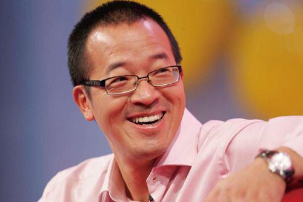

讲话总要有个主题，因为今天在座的都是优秀的人，所以我的主题是“一个优秀的人的标志和特点”。大家把我讲的这个内容跟你自己去对照一下，看看我们怎么样才能使自己成
长得更快。因为你们毕竟都还很年轻，当然我们这儿也有年龄稍微大一点儿的。但是，我相信一个人的成长，即使到了80岁，只要你还活着，依然是可以继续下去的。

  

> **简七读财  
****（**微信号：**jane7ducai****）**  

  

我相信获得优秀代表的称号不是你们的目的，它只是你人生道路上的一个小小的点、一个小小的荣誉。在这个荣誉之上，我们还要使我们的生命、使我们的工作、使我们的学识不
断地长进。

  

当然，首先我想说的是人无完人。我一直在向优秀的人靠近，我这辈子一直在追随优秀的人的脚步。从进入北大开始，我的很多同学就成为了我学习的榜样。到我大学毕业以后，
很多北大的老师也成为了我学习的榜样，否则我不会从一个给五十人的课堂上课，只剩下三个学生的人，而最后成为北大的优秀老师。创立新东方以后，我不断地向新东方的各种
人学习，不管年轻的、年老的，对我来说没有区别，惟一的区别就是他们身上有没有值得我学习的东西。我可以从这个人身上学这个东西，从那个人身上学那个东西。现在我在中
国和世界更大的范围内跟很多着名的企业家、政治家、思想家打交道的时候，跟很多成功人士打交道的时候，我从他们身上看到一些优秀的东西。

  

你不可能看到你身边的人完美到你发现他身上一点儿缺点都没有，如果在我身边工作，你会发现我身上有很多缺点，而且有些缺点还挺顽固的。优秀是挺难的一件事情，但是，我
们可以总结一些要素，看看在我们的生命中优秀的人是怎么样的。

  

**我总结了一下，一个优秀的人的标志和特点大概有八条：**

  

**  **** 第一条，一个优秀的人对生命会无比热爱。**  

会很高兴地每天等待着太阳出来，没有太阳的时候，也会很高兴地等待着下雨天的到来，在月亮阴晴圆缺的时候，总是等待着月夜那一刻的美丽……这些都是对生命热爱的标志。
一个对生命热爱的人首先是爱自己，要有自信，当然不是狂妄。第二还要兼顾到别人，喜欢交朋友，一个对生命热爱的人喜欢交朋友，一个天天闷在家里的人、心理阴暗的人是不
太敢去交朋友的，因为他既不相信别人，也不相信自己。当然，对大自然的热爱也是对生命热爱的一个重要组成部分。这就是我原来讲课的时候反复强调的“三热爱”--爱自己
、爱他人、爱自然。“三热爱”是优秀的第一个标志，我们在座的人都可以检讨一下自己，不管生命中遇到多少艰难困苦，你依然对生命保持着热情吗?不管被多少人打击，不管
你被多少人欺骗，你依然对生命保持着热情吗?实际上，这是一个特别重要的优秀的标志。  

  

我有一句话，前两天我跟员工也讲过，叫做成熟是什么?也就是说一个人真正的成熟和有悟性或者说智慧是什么?它是能够坦然地承受生命中所出现的一切苦难、困苦、挫折、失
败，并把这些东西当作自己生命成长的必由之路。当然，这有点儿像孟子所说的“天将降大任于斯人也，必先苦其心志，劳其筋骨”这样的一个概念。你要真心地接受，对生命不
再有任何抱怨，这是一件很难做到的事情。当你对生命中出现的任何东西不再有任何抱怨，能够坦然接受，并且想办法把事情往好的方向去引导的时候，你就已经具有了优秀的人
的第一种标志。其实，这第一条就已经非常难以做到了。  

  

**  **** 第二条，有一份喜欢并且愿意专注投入的工作。**

在座的各位为什么能获得“优秀管理者”的称号或者是“优秀员工”、“优秀教师”的称号呢?因为你们对工作的专注，因为你们对这份工作的热爱。当然，对新东方的事业本身
很喜欢，这是一个特别重要的标志。我们听过无数的名人讲过，叫做“工作着就是幸福的”。一个人有斗志，喜欢去挑战自己做更难的工作，挑战更重要、更能锻炼自己的岗位，
其实这是一个让生命充实的标志。为什么现在的官二代或者富二代、有钱人家的子女，一般来说都没有对生命真正的幸福的感受，因为他们缺乏我们身上这种对工作感到一种幸福
的那种深刻的感悟。有一份你真正喜欢的工作，愿意把它深入下去，把它做得尽善尽美，同时用这份工作来获取一份收入，是再好不过的事情。  

  

我觉得我生命中两种幸福是有的：第一是我有那么一段时间非常专注于读书，读书使我的生命无比充实，到今天为止我也在读书;第二是工作，从小到大我几乎没有一天不工作的
，小时候干农活我是一把好手，到大学教书我成为教书中最专注的人，我专注做新东方近二十年，一直做到今天，这就是工作。尽管工作有的时候会很累，但是没有工作会更加难
受。所以，大家不要小看工作的份量，并且一定要认真地去想，这辈子我到底干什么工作最合适。  

  

**  **** 第三条，对于得失并不是很在乎。**

得失是什么概念呢?得到当然是无所谓，你得到的东西你当然会开心，不管是钱、是名誉、是地位，还是女朋友或者男朋友，还是“优秀代表”的称号，得到比较容易接受，但失
去有的时候就不一定能够坦然地接受。比如说，明年评奖的时候，领导觉得应该考虑到其他人的感受，评了另外一个人，虽然你工作比他还要优秀，但是要你让出来，你是不是就
会很难受。  

  

如果就这样一个小小的事情你就会很难受，那何况更大的事情呢。?人有时候会失去很多东西，如果说一个人对得失，特别是对于失去特别在乎，生命就会走弯路。我们可以看到
很多企业家已经有了几十亿、上百亿的资产，最后还要搞金融欺诈，搞数据欺骗，想要股价高一点儿，这就是得失之心太重。所以，我常常说新东方的财务人员最好做。为什么呢
?我跟他们说的一句话就是朱镕基说的四个字：不做假账。永远不允许有假数据，不允许有假账，这样大家都开心，也会觉得很安全。所以，不要因为背后有利益，不要因为背后
有地位和名声，就把得失看得太重。得到是人生的赏赐，失去就坦然面对。

  

如果得失之心太重，就会非常麻烦，想要掌权，想要地位，想要金钱。有的时候鱼与熊掌不可兼得，像一些政府官员那么有权力，能调动那么多的资源，但还要贪污，因为有了权
，他还想要钱，结果这个权力又变成了贪污的最佳资源。人生任何一个岗位上，就是要饭的人都会有得失之心，所以大家一定要记住对于得失不要很在乎，这是第三条。

  

**    第四条，做任何事情一定要关注到别人的感受，一定要考虑到别人的利益。**  

任何人不管说话还是做事情，不关注别人感受的，肯定到最后自己活动的空间会越来越窄。为什么?因为你老伤别人，别人就会防着你，别人就会想办法挤兑你，直到把你给挤兑
走为止。  

  

在新东方被辞退的人一般只有两种人：第一种人是确实工作能力不够或者工作态度不好;第二种人是尽管工作能力很强，但是却被周围的人给挤兑走了。虽然你工作能力强，但是
周围没有一个人说你好，你再强也没有办法。为什么?因为这个机构的文化氛围被你破坏掉了，结果只能把你给挤兑走。所以说，有能力的人并不一定必然都是能有好结果的人，
就是因为这个原因。因此，对于我们来说，要关注他人的感受，从语言上到行为上都是一个特别重要的东西。  

  

当然，人不可能十全十美，陈向东有被我伤害的时候，周成刚有被我伤害的时候，沙云龙、汪海涛、李国富全有被我伤害的时候，这些都是新东方总裁办公会的人员，有的时候被
我伤害到难受得不得了，恨不得回去以后拿把锤子来砸我。但是，我还是尽力地努力做到对周围的人尽可能让他们有一个好的感受。我可以坚持原则，但是我坚持原则用两种方法
表达出来：一种是用严厉的、不留情面的方式，我也可以用另外一种方式表达出来，就是用友好的语言来表达我对这个原则的坚持和不可动摇性。牛根生说过一句话，我觉得他说
得特别好，叫做“做的事情再好，你的心再好，但是你的嘴巴不好，就是你这个人不好”。因为说出去的话就像泼出去的水，你把人给伤了，人家会记你一辈子。如果我骂你是头
猪，你能不记我一辈子吗?  

  

我们很多领导、管理者一不小心就会说你“这个傻什么什么”之类的，我觉得这看上去好像你跟他很亲密，但实际上你在跟他说话的时候，是带有侮辱性的。这意味着什么呢?人
格和尊严是我们每一个人，尤其是新东方人必须记住的。我们可以有岗位上的不同，我作为新东方的董事长比你的岗位要高许多职级，但是当我们面对面的时候，你是人，我也是
人，我们两个是平等的。所以，要以对人的态度来对待你身边所有的人，不要看到领导就溜须拍马，就低三下四;看到自己的下属，也完全没有必要颐指气使、狐假虎威，完全没
有必要。当我们自己摆正了心态，把所有人都当作是一个平等的人来看的时候，你就为中国的和谐社会做了一件大事。为什么?因为中国社会之所以出现那么多问题，原因之一就
是因为岗位的不同导致了人格的不平等。我们很多主管在这方面做得远远不够，我常常收到告状信，说主管不尊重人，拉帮结派，谁给他钱、请他吃饭，他就给谁排课等，像这样
的情况在新东方并不在少数。  

  

**  **** 第五条，努力地追求成就感和荣誉感。大家请记住，这个追求要符合前面那四条，否则就会变成不择手段。  
**

每个人都要有成就感和荣誉感，一个没有成就感和荣誉感的人，是不可能创造新的成就的，也不可能去创造财富。所以，人要有上进之心，这个上进之心当然就是追求成就感和荣
誉感。为什么?成就感和荣誉感的基本特点就是别人承认你了，像大家现在获得了这个优秀代表的称号，说明新东方承认你，你到这儿来是有荣誉感的。  

  

刚才大家在那儿照相的时候是有荣誉感的，到这儿来跟集团领导们一起吃饭是有荣誉感的，下午去台上领奖是有荣誉感的。大家来肯定不是冲着背后那点儿奖金来的，大部分人领
回奖金就请自己的团队吃饭了，很少有人拿了奖金就放到自己的钱包里。你请大家吃饭，大家很开心，觉得分享了共同的荣誉。实际上，你也不会在乎那点儿钱，但是你会在乎这
份荣誉感。  

  

假如说你获得了这个奖励，结果又给你拿掉了，你会难受至少两个月，会觉得很不是滋味。这背后是什么呢?是成就感和荣誉感。所以，每个人都要追求成就感和荣誉感。但是，
不要把自己的成就感和荣誉感变成贪欲，如果把自己的成就感和荣誉感变成了贪欲，就会出问题。比如我对我的孩子的教导也是这样的，我说要追求上进，但是不允许因为没有得
到那个名次，最后自己难过、沮丧，而要下一次继续努力。得第一名当然很好，第二、第三名也挺好，第四、第五名也不错，哪怕排名在中间也挺好，但只要有一种感觉，就是说
我下次要比这个名次再高一点点，假设说我这次是第15名，下次我能不能到第13名或者12名，我觉得这就是追求上进，就是让自己变得越来越好。这个特别重要。  

  

我是一个追求成就感和荣誉感大于追求财富和社会地位的人。到今天为止，我看重的不是新东方给我带来多少钱，也不是新东方给我带来了多少社会地位，我看重的是我因为做事
情的这种成就，新东方每年为两百五十万名学生服务，新东方三万名员工中的大部分还是比较开心地在这儿工作，因此获得一份稳定收入，能够养家糊口，这是我觉得开心的事情
，这就是荣誉感。当然，这种荣誉感包括比如新东方去美国上市，我根本就不在乎上市后我能拿多少钱，但是我却很在乎新东方代表中国的教育在世界上的这样一个形象，这就是
成就感和荣誉感。所以，大家一定要记住，对于这种东西的追求，要大于对金钱本身的追求。  

  

**  **** 第六条，始终不要忘记每天都要坚持不断地学习和成长。**  

我们在座的都是优秀代表，我做一个统计，各位优秀代表们，你们一年读书有超过二十本的请举手。你看，连5%都不到，请把手放下。5%都不到，非常遗憾。新东方是教育培
训机构，你们代表什么?我们在教育培训机构工作，面对的是要不断长进的人，不管是老师还是员工，读书是我们长进最重要的一个途径。当然读书不是惟一的途径，我们要读万
卷书，我们要行万里路，我们要阅人无数，我们要名师指路，我们要个人领悟，这五大要素没一个要素可以少。但是，我们第一个要素都没有完成，别说读万卷书了，一年读二十
本书难吗?相当于一个月读一本半，怎么会难呢?你在路上的时候，你坐火车、坐飞机来回的路上，一本书就读完了。你们在路上干什么呢?逛商店买包，却不买书，网上一淘就
是假的LV之类的东西，几百块钱买回来，觉得挺开心。为什么不买书呢?现在网上很多电子书，可以随时读的。再问大家另外一个问题，网易上的世界名牌大学的公开课已经放
了三年了，请问我们这儿有多少人去听过网易上面的公开课，哪怕只有一门课，请举手。这个要稍微好一点儿。  

  

哈佛大学的幸福课、公正课，耶鲁大学讲的死亡课等，你们为什么不去听呢?还有上面的文学赏析课、宗教课，都可以听。如果我有时间听，你们肯定也有时间听。你们为什么不
听?有的说听不懂英语，现在中文翻译全在上面，听不懂英文，可以看中文。为什么不去学呢?还有，我们有些人看到周围的人获得了荣誉，看到别人拿到了比自己更高的奖金，
因此产生妒嫉和抱怨的心理。有没有想到周围的每一个人都值得你去学习，每一个人的身上都有某种优点。?阅人无数，阅就是阅周围的同事，了解周围的同事的每一种感觉、感
受，通过自己的观察来学习他们身上的优点，避开他们身上的缺点。你看见一个不被欢迎的人，马上就要去想这个人为什么不被欢迎?最主要的问题是什么?如果这个人被人欢迎
，最主要的优点是什么?你要去想，不断地学习。  

  

既然大家都已经是获奖代表了，我给大家提一个要求，拿你们的钱先买二十本书。我让总裁办公会的成员来开书单好了，我开五本，陈向东开五本，周成刚开五本，沙云龙开五本
，我们把二十本书的名单合起来，发到大家的邮箱里，你们今年至少读二十本书。明年来的时候，我问读了二十本书吗?希望大家都举手。  

  

要认真学习，我现在读书大概一年是五十本左右，所以我对你们提的要求已经很低了。我肯定比你们忙，对不对?所以，大家要读书。像沙云龙老师我估计他一年读书大概应该是
一百本左右，陈向东老师也应该是至少五十本以上，因为他讲座的时候，常常会把书中的语言用照相机拍下来，给我们讲。新东方总裁办公会的成员都还不错，还有新东方的校长
们，我做过调研，让读超过二十本书的举手，结果50%以上的人举手。  

  

**  **** 第七条，真诚、坦率、阳光的性格。**  

就是说人家跟你打交道，一眼就能把你看透，当然不是说把你的隐私看透，而是跟你打交道，你绝对不会害人，一定要让人有这样的感觉。如果你一打交道，发现这个人不知道他
心里在想什么，也不知道他最后用什么方式给你“下手”，这样的人你还敢跟他打交道吗?肯定不敢。刚才在照相的时候，阳光之下我回头看，看到大家那么美丽的笑脸，我就觉
得这就是新东方要的东西。  

  

新东方的高层管理干部会议刚刚结束，我对人力资源部提了一个要求，就是设计出一套考评方案，这个考评方案就是对一个人的个性是不是具备激情、阳光、坦诚进行评测，未来
要把这套评测系统用于新东方的招聘工作。新东方的任何员工和老师如果这第一道关过不了，不管有多大的能耐，请记住了，让他走人。新东方那些带有阴暗心理的人，我们会让
他离开新东方。我们谁都不愿意跟一个多疑、阴暗、令人恐惧的人打交道，弄得大家互相防范，要不然就是背后互相说坏话，这个很麻烦。所以，对于我们来说，这种坦诚的、真
诚的、阳光的个性，是我们新东方最重要的员工文化。  

  

企业文化大家都知道，刚才大家已经朗诵了新东方的核心价值观，那是新东方做事的原则。大部分人应该都参加过三个月的讨论吧?在这个核心价值观中有一句话叫做“好学精进
”，结果你们讨论了三个月，连书都没读，这不就成为了口头禅吗?我最怕的是什么?新东方核心价值观，一问谁都能马上朗诵出来，但根本就不知道这里面的含义是什么，最后
变成了口头禅，这就是最麻烦的事情。  

  

**  **** 第八条，不管有多大的能耐，不管多么优秀，请千万不要把自己太当人看。**  

就是不管你面临什么情况，要有良好的不要把自己当人看的心态，不管你是校长也好，不管你是主管也好，不管你是优秀老师还是优秀员工也好，不管你是上课老师，把学生弄得
对你充满了崇拜也好，你基本上就是一个普通人。如果到今天我这个地步，我还能保留一种把自己当作是普通人看的心态的话，你们没有理由不保留一个普通人的心态。任何一个
把自己看作是一个人物的人，应该说他都不具备作为一个人的最基本的素质，这一条跟我上面所说的对得失不是很在乎其实是连在一起的。得失是指物上的，不把自己当人看是对
自己道德水准上的。一个不管有多少成就都不把自己太当人看的人，永远是被人喜欢的人。所以，你们想要被人喜欢，不管怎样，都不能把自己太当人看。  

  

我未必讲得全面，因为优秀的人还有很多其他的特征。但是，这八条中间，你只要做到其中的任意两条，你就是一个优秀的人。这些也是我对自己提出的要求，我希望自己一辈子
最后回头总结的时候，或者别人对我总结的时候，能够说俞敏洪还是一个不错的优秀的人，我觉得就挺好了。

  

让我们一起来共勉。我的讲话就到此为止。谢谢大家!  

  

来源：新浪博客

  

[阅读原文](http://mp.weixin.qq.com/s?__biz=MjM5MzA3MjI2NQ==&mid=200009956&idx=2&sn
=818ce43bb9491a6f8db753533e4fd836&scene=1#rd)

