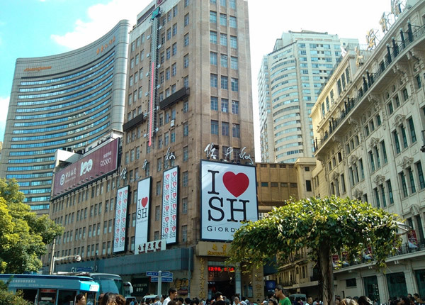

**简七导读：**  

曾看过一篇文章叫做《你无法“逃离”北上广》，里面的结论我很喜欢，用来回答知乎上这个问题也是恰如其分：

对于自己内心没有方向的人，去哪里都是逃离，而对于生命有方向的人，走向哪里都是追寻。所以苏轼被发配到那时的四线城市惠州，才会写下“试问岭南应不好？
却道：此心安处是吾乡。”

  

> **简七读财  
****（**微信号：**jane7ducai****）**  

**  
**

**最近知乎上有人提问：**

为什么现在的年轻人，大都愿意来北上广深打拼，即使过的异常艰苦，远离亲人，仍然义无反顾，在家踏实过日子难道不好吗，听说有些城市的年轻人基本都走光了，是不是这个
社会体制的原因使大家的价值观都扭曲了，才会形成一个恶性循环?

  

**知乎匿名网友的回答，已有一万多人赞同，不妨一读：**

在手机上看见这个问题，于是到电脑前来怒答，因为感触实在是太深了。我估计我会写很长。中间夹杂了很多个人感情，结论在最后。

答主男，2008年某三流西安民办大专毕业，怀揣了2000块钱，我买了一张火车票，来到上海。这里没有任何亲戚，朋友，甚至因为跷课，当时的学校暂扣了我的毕业证。
我到上海唯一的理由，是喜欢互联网。在这里，我合租在有9个人合租的一套房。小单间月租金650块钱。房间里只放得下一张床和一个笔记本电脑。

7月的太阳实在太热，求职问路基本靠12580。每周末去上海体育馆的招聘会，遇见突如其来的暴雨，浑身湿透根本不是个事，每天奔波而惶恐，我连毕业证都没有谁会要?

一个月之后我遇见了我工作的第一任主管，那天我求职时迷了路，步行走了一公里，找到面试公司的时候满头大汗。整个衣服湿透的，头发上的汗跟洗过了一样，中暑几乎站不稳
，他递了我一杯水，然后让我聊了聊对SNS的看法，估计是他可怜我的落魄，他给老总打电话说暂时不要我的毕业证，先看看我的工作表现。

我进入到一家非常优秀的国内优秀的互联网公司，虽然工资只有1800。但我丝毫不介意，第一次参加例会，身边有了一堆来自迅雷，阿里巴巴，腾讯，百度的同事，知道了产
品经理的这个职位，那人比我小两岁，是公司从盛大挖来的，他会用Axure，会用思维脑图，开会时能迅速提炼精髓，有着清晰的产品分析能力。分析互联网比我透彻的太多
，遇见了正规军的我第一次明白，天外有天，我那点以往炫耀的知识根本连入门都算不上。

早晨6点半起床，挤地铁，为了节约，基本中午不吃午饭。别人去吃饭的时候我就一个人上顶楼的天台，对着上海的高楼大厦发呆。租住的住所卫生间的浴室龙头需要9个人共用
，每天晚上做饭需要排队，上厕所的马桶只有一个，时间长就会被室友骂，电淋浴器的热水，别人用完了你就要等好久。每天到家写分析报告到夜里两点，困得不行就把闹钟设置
到早上六点，然后睡觉。四个小时睡眠对我来说足够。当当满300-150的的时候，买了一大堆互联网的书狂补，周末，参加各类的产品经理聚会，不敢说话，只坐在最后安
静的听。听他们分析，讲一堆我压根不明白的词，然后记在本子上，回家用百度查。

国庆长假，离家近的同事都回家，我一个人替全部门的同事加班，3倍工资的待遇让我用一个星期的时间买了第一部智能手机——魅族m8。

幸运的是我遇见了我一辈子的两个好哥们，公司里的一个PHP程序员和一个广告销售，我们三个人就像《中国合伙人》中的三个人那样一样形影不离，他们俩都是上海人。销售
在我眼里算半个富二代，但特别努力上劲，比我在上海见过的很多外地人都要努力，这哥们与人打交道的人，各方面想法都更真实，本地人也有底气，他帮助我在各种情况下度过
难关。经济，事业，感情......为了我们的项目，他甚至住在公司里过，程序员是个特别老实有点内向的男孩，执行力强很适合做程序员，总之，我们三个好的穿一条裤子
。

付出当然要有回报，2010年，团购刚刚兴起，我们开始负责公司里的团购导航，这是公司的一个很重点的项目。我们三个每天都像打了鸡血，那时候从没有考虑过是否和公司
给的待遇对等，我们都抱着创业的理想做。销售去北京出差，我俩聊产品从晚上8点打到12点，四个小时的长途，他会将访问客户第一手的资料给我，我迅速做产品要求，然后
提交程序员，程序员加班当晚就做产品迭代。有时候半夜两点我们会突然想到点子，然后我会打电话讨论，加班到夜里三点是太经常的事情，张江满满的路灯和空无一人的街道，
然后挡车送下属回家，再回家睡几个小时，接着赶到第二天公司上班。有时在夜里一点发现一个页面bug然后打电话给技术。他也会立即起来改正。

这是上海工作的人对工作的执着，绝大多数的人，只要是他份内的工作，你多晚打搅他都不会怪你，而且很负责。三个人的拼命很快有了回报，几年的时间，我变成这个项目的经
理，我有一个近十人的小团队，他俩也都是各自业务的骨干，

上海的生活节奏很快，你感觉自己有一天不努力就会落后，这让你有了动力拼命学习，她的配套设施很好，张江楼下的便利店有很多24小时服务，你能在加班到半夜三点饿了的
时候下楼钻进任意一间吃关东煮或者让店员用微波炉加热一个鸡块便当给你。

职位和收入上来之后，生活状态也变化了，周末可以去田子坊和女朋友逛街。从世博会看各国风光，去ChinaJoy找萌妹子拍照，去崇明岛抓小螃蟹，去阳澄湖吃大闸蟹，
去松江大学城喝咖啡，坐在小店里看日落。自由的自己带着女朋友干自己想干的事情，去想去的地方。我的工资可以轻易的买得起IPAD,IPHONE,网购的东西基本第二
天就到了，而且包邮。

我也遇见了很多我这辈子都佩服的人，他们是各个领域的专家。他们知识渊博，彬彬有礼，充满智慧，穿着时尚得体，说话恰到好处，做事井井有条。男男女女都好聪明，遇见他
们你就会觉得，我也要努力变成这样。

再后来，搞销售的哥们开始带着我见客户，吃饭聊天，教我克服自己的弱点与人交流。过于内向是我的弱点，有了他的帮助，内向的我敢在公司战略会议上发言，为团队争资源，
争利益。团队有一个正牌的复旦大学的中文系硕士和上师大的新闻学硕士。是的，作为他们的经理，我是西安一个三流野鸡民办大学差点没混上毕业证的大专生。

离开的时候。月薪10k。每年14个月工资，我知道这个工资在上海并不算高，但，其实，我觉得她对得起我自己的努力，至少我所在的公司，节假日3倍工资，晚上加班有额
外工资， 餐厅有免费的面包饼干方便面咖啡火腿肠，免费早餐。各种制度严格执行。

周围有同事收入比我高，但他们也确实比我强。学历，工作能力，为人处事。我输的心服口服。然后只要快速学习就好了。

上海是个神奇的城市，她不问你的出生，学历，不会鄙视你家庭条件，她只看你是否努力，真的。

……

2013年5月，母亲查处患肺癌，胸腔积液止不住，几乎丢了性命，我为了母亲离开上海，回到家乡，在这座并不算小的，我曾生活了20年的城市，我发至今无法适应。

家里的条件并不差，父母早年做生意，遭遇火灾，但我的生活还是并不拘谨的。作为独生子，家里父母自住一套房，05年给我买了一套房结婚用，去年公务员分房又买了一套出
租。加上早年购买的在外出租的几个商铺，当然，这些东西，每一分，都是父母这辈子的血汗钱。我在上海的拘谨，只是因为我始终有一个信念，就是不愿在毕业后花父母的钱，
事实上我做到。

家乡属于三线城市，经济上并不是落后太多。但回来后的我还是很不习惯，公共车基本不准时，服务人员没有服务意识，办酒店入住，我在等房卡，两个服务员在商量中午吃什么
。等办好了进到客房，才发现上个客人走了房间没有收拾。要知道这并不是小酒店。鹿港小镇忙的时候，吃一个菜要催三次以上，服务员一脸的不情愿，餐厅服务员的服务让我时
刻有种想要投诉的冲动，想起在上海的红辣椒，普通的川菜馆，服务员时刻观察你的举动，帮你脱掉大衣，帮你倒茶。这个城市里的每个人都在很认真的生活，于是，有些时候，
开始对家乡失望。

首先是没有合适的工作：

回到家乡后，我的职业工作并不好找，家乡因为物流和互联网落后，电商落后不是一点点。后来，母亲不顾我的反对，送礼托关系把我搞到了机关，事业单位。一年以后可以拿到
事业编制。上班，没完没了的上班，维护稳定。上班基本没事做，有食堂有宿舍，所有的东西都不用花钱。就是不让你回家。好几天回一次家，只能在家待一天。有时候感觉自己
像在养老院。你不需要太好的电脑知识，会重装windows设置打印机和路由器，在这里就是专家。会淘宝，简直就是大神。

其次，能力是个屁，人际关系和家族势力基本就是一切：

每天，机关服务大厅都有一些不满意的群众，有的吵架有的哭闹，我刚去的时候非常惊讶，但同事都习以为常。甚至好心的提醒我：不要管。管了就是你的事。

机关的小领导很势力，给我安排各种工作，在这种机关单位，你有能力，那你就多干活，没有能力你就混日子。反正月底大家拿的工资一样，一段时间后她知道我是某个领导的亲
戚，对我的态度完全变了，什么都不用我干，还立即给我评了先进，让我哭笑不得。

你必须承认，这就是小城市的工作现状，你努力上劲根本没用，因为，谁该受到重用和提拔就是领导说了算，人脉和后台就是一切。

于是，新来的非编制临岗合同工，拿着全机关最低的工资，干着没完没了的活。大部分拿到编制的，日复一日的工作就是游戏，吃饭，睡觉，聊天，上网。

再次：你的仕途完全是巴结和拍马屁，而周围的人都劝你说：这是太正常不过的事情。

新上任的机关领导，每天的工作就是斗地主，每天中午都和某上级下派领导聊天，然后帮领导洗碗献殷勤，三个月后，他迅速升成了主任......回家后我诧异的跟母亲提起
，母亲说很正常。反而认真的找我谈话，说我太死板，不懂得溜须拍马。我无法辩解，三观崩溃。

最后，所有人判断你是否成功的标准，就是公务员：

我有一个亲戚，托关系进了警察系统。35岁的他收入4000多元，开着20多万的车,，单位有食堂而且伙食很不错，却永远和一堆朋友去外边吃，用他的话说这就是人脉。
因为看上一套别墅但父母不给买就和父母吵架。经常问父母要钱，就是这样的一个人，母亲无比羡慕，认为他很优秀，他是公务员，出门有排场，有灰色收入，生活有保障，这一
切深深的伤害着我的心，我有时候特别想离开家。只是，我舍不得化疗后身体虚弱的妈妈。一方面她年轻时候一个人干着两份工作，白手起家到给我准备了两套房子若干间商铺，
把这辈子的一切都给了我，另一方面却又在试图更改我的价值观，告诉我要在机关时刻防着别人，要学会溜须拍马。她不许我做生意，不许我找私企的工作，只想让我进机关吃大
锅饭。

这真的不是我家的个例，是几乎这座小城所有人的价值观。任何的事情都要靠关系。

而且，这里有一群，是一大群三观基本一致的亲戚，茶余饭后的话题就是谁家条件好谁家孩子收入高谁家媳妇抽了婆婆一耳光。参加家庭聚会没完没了的教育你学会溜须领导，要
圆滑处事，要多懂点脑子不要那么善良，你不参加家庭聚会就是你不懂事你不合群。

除非你完全按照他们的意思办。

其实我知道，原本两个世界的人，他们看不懂我的内心的想法，他们没有经历。也许我也不懂他们的良苦用心。我回来的半年几乎没有跟父亲讲过话，因为他一直固执的觉得，那
么多人在北上广打拼，有几个人拼成功了?还是回家乡做个公务员吧。

他们要的就是你回家，有份铁饭碗的公务员工作，找一个能照顾你的善良姑娘，赶快结婚生个孩子，过他们眼中完美的生活。生活本来就该是平庸的。

如今的我就生活在这种种不如意中，在看似富足却有些苦楚不安的状态下生活，我知道，我永远不会为了升职而去拍领导马屁给领导洗碗，我无法成为自己原本最看不起的人，我
在机关单位永远没有前途。

  

我更知道我有一天会回上海的，哪怕会变成房奴按揭。我不在乎自己是否有房，因为我有理想。留在上海，让我的后代有更好的生活，已经是我此生最大的理想。

  

**回答你的问题：**

我也知道家乡安稳，衣食无忧，在家乡我不需要一分钱贷款，买辆好车拉着姑娘过平凡的生活。吃吃饭看看电影。每月1号的时候穿着大拖鞋到租客那里收租子。

我也知道北上广房价高也许要做一辈子房奴，买杯豆浆还要排队，坐地铁挤得像汉堡包，买辆车还要摇号，一个破车牌8万块。

那年幼稚的为了省钱不吃早饭的自己付出的代价就是如今每年体检都要观察随时准备切除的胆囊上的息肉。

你以为我不解亲情，为了一点钱放弃家乡到4000公里以外的城市拼的昏天黑地，看不到父母日益的年迈，就是为了回来过年聚会的时候喝着咖啡笑着告诉你我收入比你高?

你还说我虚荣我自私我价值扭曲?

我知道，再也遇不见那个陪我住650一个月的房子，给我做饭学削土豆皮弄伤手指，我发烧时整夜跪在地下给我换毛巾的女孩子了。

我再也遇不见为了一个页面的用户体验几个哥们争得面红耳赤约好下班吃火锅边笑边骂对方傻逼的铁哥们了。

再也没有在办公室被经理骂的狗血淋头然后回到家努力改一个用户体验报告到半夜2点半的自己了。

那些放弃了家乡富足生活去一线城市打拼的，都是有理想有希望的孩子，他们才是这个国家各个领域改变的希望。

大城市奋斗的孩子和那些小城市养尊处优的孩子，到底是谁才是价值扭曲的?

[阅读原文](http://mp.weixin.qq.com/s?__biz=MjM5MzA3MjI2NQ==&mid=200009956&idx=1&sn
=caae742b13d7ddde78750ac578ea048a&scene=1#rd)

