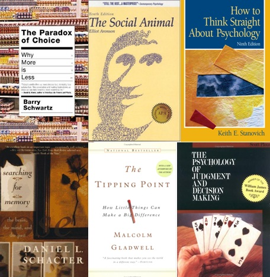

前段时间有一次提到了刘未鹏的《暗时间》，今天打算重翻，刚翻开序言，就觉得很有必要分享。不是有很多朋友想要找一个心理学的书单么，看看这篇文章，拿小本本把文中提
到的书名记下来就行了。  

  

话说最近正在看《社会心理学》，我发现很多学科的教科书都是很好的入门读物啊，下次和大家分享我的读书笔记和心得，今天先接受一下刘大神的洗礼吧。

  

**为什么人人都该学点心理学**

作者：刘未鹏

  

提到心理学，很多人脑海中的第一印象就是“心理问题”、“心理咨询”、“弗洛伊德”，“抑郁症”、“读心术”这些字眼，总觉得关心心理学的都是一些心理阴暗或有问题的
家伙，这是对现代心理学典型的误解（参见How to Think Straight About Psychology，中译名《与“众”不同的心理学》），
实际上心理学早就从弗洛伊德那一套走出来，结合现代科学技术手段（如FMRI）和研究方法（如受控随机实验），跨学科研究人脑思维的特点以及和现实生活的关系。  
  
其中最硕果累累的交叉领域就是经济学和心理学的联姻，催生出了一大批优秀的研究者和著作，如Richard
Thaler的Nudge，研究如何针对人们思维的固有弊端来创造性地制定一些经济策略，从而为大众的健康、经济和幸福谋福利：如著名的Save More
Tomorrow（中译名《明天存储更多》）就成功的促使了大量没有存储习惯的美国人开始存储更多；如Barry Schwartz的Paradox of
Choice – Why More is
Less用大量生动有趣的研究案例说明了很多时候选择少反而让人感觉舒服得多。再如研究创意点子之所以流行之本质原因的Made to
Stick，其中剖析出的原因，学过一些社会心理学（The Social Animal，中译名《社会性动物》）和大脑记忆原理（Searching For
Memory，中译名《找寻逝去的自我》）的人应该一眼就看出其中的端倪，书中更是开篇就赤裸裸地引用心理学实验。就连这些年在畅销书市场大红大紫的Malcolm
Gladwell的几本流行全球、傲居榜首的著作（The Tipping
Point，Blink，Outliers）其实也是在用大量活生生的案例佐证一些早就不新鲜的心理学原理。  
  
心理学与日常生活息息相关的另一方面就是日常判断与决策（生活中需要进行判断与决策的地方远远多于我们的想象）（Psychology of Judgment
and Decision Making，中译名《决策与判断》）。

    
波普尔曾经说过：人生不过是解决问题（All Life is problem-solving）。而判断与决策又是其中最常见的一类问题解决。尽管生活中似乎面临重
大决策的时候并不多，但另一方面我们时时刻刻都在进行最重大的决策：决定自己的时间和金钱到底投入到什么地方去。比如：你能想象有人宁可天天花时间剪报纸上的优惠券，
却对于房价的1%的优惠无动于衷吗？（《别做正常的傻瓜》、Predictably Irrational，中译名《怪诞行为学》）再比如：你知道为什么当手头股票的
股价不可抑止地滑向深渊时我们却一边揪着头发，一边愣是不肯撤出吗？（是的，我们适应远古时代的心理机制根本不适应金融市场。）为什么我们会在小摊和超市前为几块钱的
交易踌躇半天，却在生活中的重大决策面前浑浑噩噩人云亦云呢？糟糕的判断与决策令我们的生活变得糟糕，然而这还不是最关键的，最关键的是我们很难学会质疑自己的判断，
而总是能“找到”其他为自己辩护的理由（Mistakes were Made, but not by Me），中译名《错不在我》）。  
  
现在是一个信息泛滥的时代，这导致我们经常面临另一个问题：如何在海洋中有效筛选有价值的信息，以及避免错误的信息左右我们的大脑（critical
thinking） 关于以上提到的几点我在豆瓣上有一个豆列（“学会思考”），希望有一天我能够积累出足够多的认识对这个主题展开一些详细介绍。  
  
人类的大脑和思维是目前已知最为复杂的系统，对这个系统的研究是一件极其迷人的事情，即便对于像我们这样的芸芸众生来说，即便不去做研究，学习一些这方面的科普知识，
对于学会正确地思考也有极大的益处。  
  
大脑是我们最重要的工具，要正确利用这个工具，唯一的途径就是去了解它，尤其是了解它的弱点。与很多人的直觉相反，我们的思维有着各种各样的缺陷和陷阱（cognit
ive bias），我 们解决日常问题的思维方式也并不总是最优的（bounded
rationality），我们感觉正确的事情有很多是错的，我们习以为常的天经地义的行为也未必就是合乎效益最大化原则的。这里摘抄一段我在豆列上的导言：  
  
我们的思维有很多很多的弱点，我一向认为，正确的思维方式，是一切高效学习的基础。比如参见如下2个例子，错误的思维方式得到的结论有大得多的可能性是谬误。  
  
人总喜欢沿袭以往习得的经验，并通过类比来进行外推。我第一次在一个地铁终点站坐地铁的时候，看着从远方开来的地铁，我心生疑惑——“这车每节车厢都这么长，待会怎么
调头呢（我心里说没看到铁轨终点有一个大大的供调头的 U 形弯啊）？”，当车开始开的时候我终于意识到原来车是可以往两头方向开的。  

  
人喜欢从关联当中寻找因果，有一次我和老婆去银行取款，到了 ATM 室的自动门口，我开玩笑地拿着手头的饭卡去刷了一下，然后门居然开了。我顿时来了劲，立即得出一
个结论：这个刷卡装置不安全，至少不是能够专门识别银联的卡的。我甚至飞快地泛化出了一个更具一般性的理论来解释这个现象：即可能所有带有磁性的卡都可以用来开门。老
婆看我得意洋洋，就泼过来一盘冷水：不一定是你的卡刷开的啊，你不刷卡试试看。我不信，说怎么可能呢，心想我刷卡，门就开了，还有比这更明显的因果关系嘛。但出乎我意
料的是，我走出门，这次没刷卡，门也开了——原来是感应门——原先这个ATM 室的确是刷卡门，但后来改成了感应门，刷卡的那个装置只不过没拆掉残留在那里而已。  
总的来说  
  
人类的思维充满着各种各样的捷径，每一条捷径都是一把双刃剑。一方面，它降低了大脑的认知复杂性（笼统的看一个问题要比细致的分析简单得多），有助于迅速做出绝大部分
时候都正确的判断；但另一方面，它也常常导致人们把大部分情况下成立的法则当成了放之四海而皆准的。可以说，有多少捷径，就有多少条谬误。  

  
人类的情绪也在很大程度上影响着人的思考。比如，如果你憎恶一个人，你往往就会反对他的所有立场，反之亦成立。  

  
人类大脑经过长时间的进化，先天就具备一些特定的“思维定势”，以使得人类能够在面对进化过程中经常出现的适应性问题时能够不假思索的做出迅速的反应。然而，在现代社
会，很多这类思维定势已经不适应了。（Mean
Genes，中译名《本能》;Influence，中译名《影响力》;Sway，中译名《摇摆》，Evolutionary
Psychology，中译名《进化心理学》）  

  

人类不可避免的受着各种各样的偏见的影响，这些偏见有些是有一定适应价值的“思维定势”（如事后聪明式偏见），而有些则是大脑的认知机制的“缺陷”。  

  
以上，构成了人类思维中的种种谬误。而学会思考，就是学会认识到这些谬误。  
  
对于人类思维的种种谬误之处，在西方有一门历史悠久的学科，叫做批判性思维（critical thinking）（Asking the Right Questi
ons，中译名《学会提问》），早在古希腊时代，亚里士多德就已经对人类语言中的各种各样的谬误有了一定的认识（譬如，“我们无法讨论不存在的东西，所以所有的事物都
是真实的”），并对辩论之中存在的各种各样的谬误进行了归类。  
  
这个豆列中的书，有一些是介绍人类思维工作的机制的，认识这些机制是正确思考的大前提；有许多是关于人类推理（Reasoning）过程中存在着形形色色的谬误（No
nsense，Crimes Against Logic），唯有认识到这些谬误，才能避免它们，唯有避免了思维的谬误，才能进行正确的思考。  

  

如果你没拿小本本记笔记，没关系，点击阅读原文，查看作者列的豆列。

  

如果觉得此文打开了你的兴趣可以去看看作者的《暗时间》，或者去找他的博客吧。

  

ps,昨天的《听歌》貌似反响不错，谢谢大家不嫌弃。晚安。

  

==如果喜欢本文，请分享到朋友圈☺==

  

  * 我的微博：不止读书魏小河   我的豆瓣：魏小河

  

  * 欢迎在微信中搜索“不止读书（buzhidushu)”以订阅。

  

[阅读原文](http://book.douban.com/doulist/127649/#wechat_redirect)

