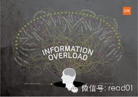

如何应对信息过载？

这是很早以前在知乎上写的答案，有会员提问就重新发一遍。

在这上面花了不少时间和精力去思考：  
碎片阅读或信息过载，很大问题都在于你的目标是否明确。

如果你的目标不明确，花些时间好好思考一下你的目标是什么。

### 1、只关注特定几个方面

有自己的长期目标，每隔几年增加一个新的短期关注方向

就象彼得**德鲁克提供的方法：

> 每三年或四年，我就会选择另外的主题。这些主题非常丰富，包括统计学、中世纪历史、日本美术、经济学等。只学三年，虽然不能彻底掌握这个领域，但是足以了解这个领
域究竟是什么。六十多年间，我就这样每隔三年或四年改变主题，坚持学习。

### 2、减少选择

  

http://www.read.org.cn/html/1386-reduce-the-choice-to-let-you-save-time.html

点击「查看原文」阅读

### 3、不看或少看新闻

时间管理之新闻阅读 输入「20130327」查看

### 4、少上网，多阅读

控制上网时间，坚持每天阅读。

  1. 怎样安排时间读书？ 输入「20130423」查看

  2. 阅读专业书籍应该怎样做读书笔记？ 输入「20131024」查看

  3. 你做读书笔记吗？如果做的话，是写摘要，还是写评论，或是其他别的什么形式？ 「20131024」查看

形成自己的阅读方法，培养看完书做笔记写书评的习惯。  
培养自己的快速阅读能力，一般的畅销书可以在2-3个小时左右看完一本。  
特别是针对一个方向进行主题阅读，每年进行3次以上。  
到目前为我觉得收获最大、质量最高的来源还是读书，然后多做笔记

### 5、定期评估信息获取渠道，不断反思你所接受的信息源质量如何，是否应该放弃

定期反思一下，自己获取信息的渠道所带所的回报，然后取消最低的，加强在最高的投入，同时不断尝试新的获取方式。

尽可能精确记录自己的时间花销，定期总结，取消或减少收益比较低的部分。比如在网络少用QQ聊天、泡论坛、精减RSS定阅，减少微博、微信类时间。目前在知乎、豆瓣、
TED视频上收益高一点，坚持控制时间。

象阅读、行业培训和跟专家成为朋友，多聊天，这几种方式收益最高。

### 6、利用六步骤来处理信息

六个步骤把资料转换成知识 输入「20130622」查看

### 7、针对自己感兴趣的方面形成系统知识体系，然后定期整理，这才是自己的知识

### 8、加入或建立圈子

应该想办法想办法建立或加入一个与你目标相同或相近的圈子，然后不断提升这个圈子的质量。当你有一个质量很高的圈子，会对你有很大的帮助。
比如知乎、豆瓣、微博、Blog上的专家和行业人士。  
通过这个圈子来过滤大量的无关信息，反过来精华或比较重要的信息经常会从多个渠道中反复出现。

### 9、提高分析能力

刻意提高分析、搜索、阅读能力，擅长大量信息中快速寻找自己需要的信息，并把核心要点提练出来。

(1)提高分析能力

最简单的说法就是多做

复杂的一点的说法就是利用知识管理，形成价值观，然后在不断验证和改进去熟悉规则

1）、首先要具备基本的背景知识  
不管你想分析什么东西，首先要具备最基本的背景知识，

2）、清楚这个行业的规则  
做完基础工作之后，就可以构架这个行业的知识框架，进一步了解这个行业的特点，来源，历史和现状和既定的行业规则。

了解几种主流的观点，有机会多跟业内人士聊天，知道一些行业内幕而不是走马观花，对这个行业或某方面有充分的了解，明白规则所在，不管是官方说法还是潜规则，当你清楚
了这个规则所在，才能进一步深入下去。

不管你读了多少书，收集了多少资料，记住所有的事件都是对规则的某方面展示，牛人牛在哪，牛在熟悉规则，可以顺势而行。更牛的人，可以引导和改变规则。

我知道这段话就是在放屁，能清晰规则不知道要付出多大的精力和时间，总是说说容易做起来难。

行业规则是在不断打破和变化的，但这个规则不管如何变化都会有迹可寻的，

3）、培养自主思考能力，形成自己的观点  
在深入对这个行业的认知之后，有自己的自主思考能力，不轻易相信任何一种观点，用自己的思维方式去判断，在这个基础上形成自己的观点。

然后用自己的观点对行业的现状进行分析和判断，不断对比出差异性，不断验证和改进，然后进一步了解行业规则。

### 10、分享

多分享一些高质量的知识，并利用这些分享形成影响力和结识更多的人脉和专家。

多分享笔记，比如我建一个分享思维导图笔记的Blog，已经分享了150本左右的笔记。在另一个Blog上60、70本跟学习相关的笔记。  
通过在Blog、豆瓣、知乎和微博上分享，认识了N多的牛人和专家。

### 11、培养自主思考能力，形成自己的观点

在深入对某方面认知之后，有自己的自主思考能力，不轻易相信任何一种观点，用自己的思维方式去判断，在这个基础上形成自己的观点。

### 12、放松心情，别给自己太大压力

总有一些事情是你不知道的，没有必要总是给自己太大压力。通过我上面总结的心得，基本上不会存在信息焦虑了，就是有少数信息你不知道也无所谓，这些技巧基本能保证花最
少的精力获取最多的信息。

当你有自己的目标，形成自己的知识体系，有自己的观点，可以通过批判性思维来吸收和分辩资讯，有自己的专家人脉和不断改进的信息获得渠道，这就已经足够了。

## 女性书单推荐反馈

@琼宝

《雅致生活》这本书真的不好买呢，无奈在淘宝买的复印版，今晚看了大半，真的非常不错。虽然有些晚，还是要谢谢老师分享。

@vespa12

书单，非常不错，打算根据情况买来看，其中最想的雅致生活，实在没搜到，能给分享下哪能买到吗？
推荐女人明白要趁早和三观易碎，哲学系研究生的女人励志，相较与书单中作者都非国人，这两本就非常接地气，用官话说就是有中国特色。
多吐槽一句，让您男儿心写女性书单，难为你了

warfalcon：  
女人明白要趁早和三观易碎 这二本没看过，其它几本，都是以前读过的，虽然是专门写给女性的，但很多建议男人看了一样有用。

@鼻孔心型的猫

女性书籍我非常推荐李欣频的 创意，灵修，旅

  

## 100天行动读者反馈

Justin  
【100天活动经验分享】一个月前终于开始了早睡早起的100天活动，之所以说“终于”，那是因为我关注这活动已经好几个月了，却没有狠下心执行可能拖延症病入膏肓吧
。 但是这早睡早起的意志力比赛坚持得断断续续，所以我最近开始增加了个很不错的条件，也就是每坚持一天，也就是符合早睡和早起这2个条件，我就可以拿生活费的20元
存起来买自己想买的东西，自从这之后，效果好了很多，看来解决问题的根源在于动力啊！

  

[阅读原文](http://mp.weixin.qq.com/s?__biz=MjM5NjA3OTM0MA==&mid=200247252&idx=1&sn
=edf420ab4b41dc426bded3302b671149&scene=1#rd)

