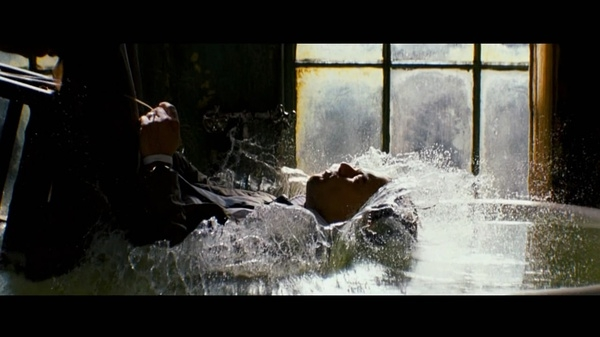

有读者问怎么快速入睡，最关键的步骤是形成稳定的生物钟。

  

  

以前分享过一种方法叫 **布钦疗法**效果不错：

  
到现在为止，已经有超过30个研究比较了布钦疗法和其他行为疗法。所有的研究都证明，布钦疗法一般都好于其他的疗法，或者和其他疗法的效果一样。如果你认为自己有条件
性失眠症，那么布钦疗法是个很好的选择。但是，这个疗法需要毅力，而且需要时间来改变你对床和卧室的感觉。有一些人能够自己做到．但是大多数病人还是需要一位行为治疗
师来帮助他们度过最艰难的时期。  
  
下面是布钦疗法的步骤：  
1．只有当你感到昨常困的时候才上床。  
2．床只能用来睡觉，不能看书、看电视或者吃东西。  
3．如果你不能入睡，请起床到另一个房间去，待到十分想睡觉的时候，再返回床上。如果还不能入睡，请再次起来。这样做的目的是要将床跟困和入睡联系起来，而不足沮丧和
无法睡看。  
4．重复步骤3，如果需要，整晚重复。  
5．调好闹钟，每天早上准时起床，无论晚上睡得怎样，睡了多久。这样能够帮助舟体形成一个良好、有规律的睡眠一清醒节奏。  
6．白天不要小睡。

  

  

还有一种方法叫：**瑜伽休息术**，详细一点百度百科里有

  

躺好闭上眼睛，注意呼吸，均匀、缓慢。感受吸进去的那一口气在体内涌动，深吸一口气，感受这口气到了自己的大脑，然后慢慢这口气向下沉，达到你的脚跟，你的手指，然后
往回走，小腿，大腿，腹部，胸部，喉咙，同理，小臂，大臂，咽喉。这口气把所有的浊气都带走，慢慢吐出来。  
这个时候，身体也热起来了，人很自然的就有了倦意。很容易入睡，入睡快且质量高。

  

**还有一种非常搞笑但很实用的方法：**

阅读一本你很讨厌的书籍，比如线性代数、哲学，当年跟我一起住的一个哥们，向我借本哲学书，每晚睡前翻几页，五分钟之内入睡。

前段时间看到改进版，手机下个网易公开课，找门枯燥的课程，小一点音量，设定自动关闭时间，躺在在床上闭上眼睛，经常听不到一课就能入睡。有人是直接听BBC、VOA
，调小音量就能入睡

  

  

经常听到的答案有：

  * 泡脚

  * 喝牛奶

  * 热水澡

  * 下午别喝咖啡

  * 喝1小杯红酒（酒量大的无效）

  * 带眼罩

  * 有另一半的性生活

  * 没有的自行解决

  * 脑力劳动者可以进行适当的运动，但别过量

  * 听轻音乐、白噪音、催眠音乐

  * 补充褪黑素，比如传说中的脑白金（别笑，这东西确实有部分人有效）

  

大家还有什么稀奇古怪或实用的方法分享一下？

  

马上11点了，如果你还没睡，马上去睡吧

  

\------------------------------------------------  \--------

我是warfalcon  ，这个微信（read01）的目标**是让你成为行动者而不是阅读者**，不定期分享一些五花八门的读书笔记和书评，每天更新。

  

想了解更多：可以在新浪微博、腾迅微博、豆瓣、知乎搜索 warfalcon 或访问  www.read.org.cn  www.write.org.cn

觉得文章对你有帮助，可以打赏一杯咖啡支持一下，支付宝帐户:  warfalcon@gmail.com  或点击查看原文

  

如果你是新读者可以输入M查看最近的信息，或按日期查看，希望你能加入#100天行动# ，输入0729查看全文。

  

如果觉得我的文章不错，欢迎转发到朋友圈，让你的朋友一起受益。

  

  

[阅读原文](http://m.alipay.com/personal/payment.htm?userId=2088002031865988&reason
=%E6%94%AF%E4%BB%98%E5%AE%9D%E5%BE%AE%E4%BF%A1%E6%94%B6%E6%AC%BE&weChat=true#w
echat_redirect)

