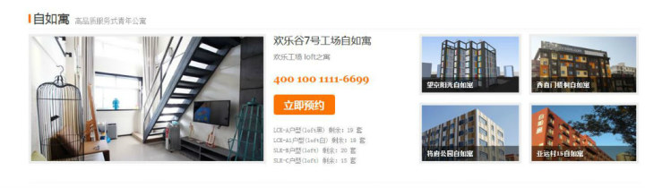
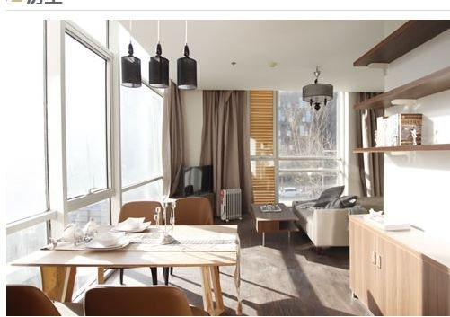
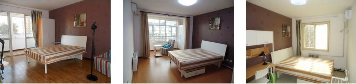
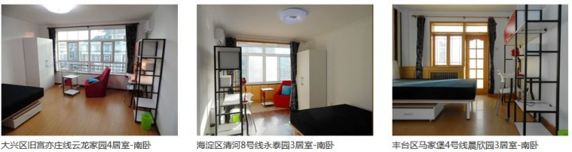

  

前几天在人人网上看到了一篇写教人怎样租房的文章，作为一只离职的小中介，看到了上面很多东西写的很多东西都错误，有一些误人子弟的感觉，所以特地写一篇来教教大家如
何在北京租房子，当然其中说的更多的还是关于房子的知识、注意事项以及如何不被中介坑。在其他地方租房子的童鞋也可以看看，而由于地域的差异，很多其他地方也不同，说
的也不一定对，欢迎大家指证。

**大家应该了解一下房子的类型：**

**在京城，住房类型大概分为这几种：**

**1****、地下室：**每个小区都有地下室，并且大都出租，自己去小区转转就能找到，因为房东大都会在地下室前面立个牌子写上出租。价位不等，租客鱼龙混杂，洗刷间男女共用。如果不是十分的困难不建议住，尤其是女生。不同小区价位不等，环境也有很大差别，冬天住还可以，夏天就十分热。还要注意冬天的时候有的没有暖气。对于大多数初到北京的北漂，大都住过，我住过，那种感觉怎么说呢，如果一个人住会有很孤独压抑的感觉，后来租了一个有窗户的，略微有光，还好一点。

**2****、平房：**我把一、二层的放到一起来写吧，同区的价位也就比地下室贵个一到两百（不同地区不同），但是好歹在地上，环境也稍微好一些。

**3****、群租房、床位：**群租房就是很多人一起租，本质也属于合租房，但是由于跟合租差别还是很大，所以跟合租房分开说。群租房分两种，一种是打了很多隔断的，这种一般是小中介代理的。一种是做成宿舍那种的床位，人很多，一般也是中介代理。

**第一种：打了很多隔断**，注意是很多，多到什么程度呢？之前遇见过一个做这个的中介，一个一百多平的三居打了十几个隔断间（当然也不是所有的都是这样）。住的人也各种各样吧，也要注意防范。价位跟平房差不多，优势是有些群租房在略为高档的小区，环境略优于平房，尤其在住房的周边配套设施上（交通、银行、超市、学校等）。缺点是隔断墙一般隔音很差，并且在大风天千万不要开窗，因为见过没关窗，隔断墙全被风吹倒的。

**第二种床位：**跟宿舍差不多，不打隔断，（此外很多来北京穷游的也会租住）。这种房子比较好的一点是包水、电、网、暖、和燃气 ，有的也会给你提供被子什么的。可以月付，平时也会有人给打扫卫生什么的。比较适合初来北京身上没怎么有钱，不在意群租的人，但是要注意安全性。之前我在美景东方住过一家，感觉尚可吧，做做饭洗衣服洗澡什么的要比地下室好。如果只是找个睡觉的地方，可以考虑。

**4****、合租房：**

指没有打过隔断或者只在客厅打过一间隔断的房子。这种房子还是比较推荐大家来住的，因为确实人少并且住着也舒服。并且价位也不贵，适合收入尚可的学生和白领。后面会着
重介绍。

在北京的童鞋推荐1、链家的自如友家，环境以及家电服务都不错，小两口适合住，就是比较贵。不介意早上多坐地铁的话可以往外环住一点，价钱也便宜一些，东三环和东四环
之间的推荐松榆里那一块的房子。

2、几个认识的人一起租一个多居室的。

3、中天置地的隔断房，这个你住完后一般会扣你一些押金，但是确实比自如友家便宜几百块钱。

**5****、代理房：**

中介公司代理的，其实可以归结到上述的3、4中，但是也有整间房子整租的情况，比如我爱我家。

此外注意，代理房是不需要付中介费的。只需要交押金和房租。

链家的自如友家会多交一个服务费，之前看有记者没有弄明白就抨击这个的，这个其实是网费、保险、保洁费和修理费（东西坏了不需要你花钱）什么的。

**6****、普通住房：**

**户型包括：**

**一居室**（包括开间和标准一居室）。开间就是客厅和卧室在一起，即一室0厅一厨一卫。标准一居室就是一室一厅一厨一卫。室指卧室，厅指客厅，厨指厨房，卫指卫生间。

**两居室，三居室同上。四居五居比较少有**（不包括隔断），一般是豪宅会有，比如说山水文园、观湖国际等。

三居室以上要注意有的三居室是两卫，即在主卧室多出一个卫生间，有的没有。

**7****、商住两用住房：**

一般公司需要注册的，又不需要在底商的，会要租这种房子。童鞋们一般不用考虑这类住房，或者应该避开一些商住两用的，为什么？同环境同户型价位比一般住房要贵一到两千
，而且水电要比普通的住房要贵，。但是这类的装修都还不错，比较有代表性的是林达海渔广场。

有需要办公而租住这类房子的要注意要问这房子之前是否被注册过，如果注册过的话可以先去销一下。

**8****、写字楼，底商：**

写字楼是办公、这大家都知道。底商就是指那些底层的一楼商铺。这类房子报价通常是说几块钱，比如说3块钱，这里指的是3块钱/平/天。

**9****、别墅：**来租吧来租吧来租吧来租吧~

**找房的步骤：**

**几个啰嗦**

**1****、找房的周期：**

至少提前一周，看房两次到三次，每次至少两套。

理想状态是半个月吧，但是记住这时间只是个参考，如果立刻遇到自己满意的房子要马上交订金，尤其是在3-4月和6-8月，因为这是租房高峰期，尤其是好房子，大家都在
抢（因为房东一般都是多家中介报盘，客户比较多）。有时候只要耽搁半天好房子马上就没了~~~在租房高峰尤其常见。

此外有一个叫做租房低峰，大概就是指年前一个月左右。租房是其实没有低峰的，年前一个月客户少一点是确实但是绝对不是淡出鸟那种，因为精明的人都会在那个时候出来先看
看房。

不要以为在临近过年大家都在退房房子很好租还会降价，北京的房价不曾降过的亲~你要是不傻绝对不要在过年的时候退房，因为回来之后马上就是返京高峰，知道前后的房子价
格差多少吗？年后的第一个月两到三居室房价一般都会小涨100~500多。

**2****、我知道大家都想租便宜的，租金低的，位置好的，朝向户型优越，家具家电全齐，性价比高的房子~~~别想了，那种房子一般不存在。**

豪宅除外，一般同个区域同个小区相同户型同等装修的房子差价不会超过200块钱~大家都不是傻子，能租到跟自己要求符合百分之七十的就差不多了，百分之百的很难找到，
除非你找房的周期很长。

有时你会听到某人现在租的房租很便宜的，但人家一般那是租住了好多年的房子，北京房价涨的很快，现在确实很变态。

外环的房子要比内环的便宜的很多，京南的房子要比京北的房子便宜。所以沿着地铁找还是比较合适的。

**3****、中介费问题。**

北京的房子中介费大都是客户出的，但是也有业主出的情况，让中介帮你争取，在中介带你看房子的时候，中介一般都会跟你说业主不出，所以在中介说出这话之前，你要透漏给
他你不想出的意思，这样可以诱导中介回去跟业主提这件事。否则一般中介都不会提。

**4、**在网上看房，有时看好的打电话问却被说是房子没了。

有两个原因，一是你看的是钓鱼贴，中介用来钓客户的。二是这房子确实是被租了，中介还没来得及下架。第一个原因多一点。

**5、跟中介看房子，除非是年后一个月的那段时间，尽量第一次不要定，尤其不要交钱。**

**一、选定区域：**

**1****、确定自己所要租房的范围（找小区）。**

**选小区：**

**两种方法，****1****找中介，****2****自己百度地图**

第一找工作地点近的小区。

第二是工作地点的一两到两站公交左右范围内的小区。

第三如果工作地点距离地铁近的话，沿着地铁站找。当然如果在北京的话个人还是建议第三条，虽然路上费点时间，但是省钱。

**2****、了解价位：**

**1****问中介，**不想去店里面的话可以在网络上留言，比如58、赶集等。

**2****在网络上查，**在北京的推荐链家在线，很权威，不过有些地区你要在此基础上减一到两百，百分之七八十还是很靠谱的**。**

**选择哪个网站查询：**

链家在线的原因：虽然有点做广告的嫌疑，但是这个确实很牛逼，链家花大价钱请IBM做的。

链家在线的数据与其经纪人用的内网se系统是对接的，se系统则全是当前公司全部房源
的内部报价。相比其他的网站。比如58或者赶集安居客更准确——因为经纪人只会把好的房子往那些网站发，而不会发差的房子。此外现在这个网站上有很多房
评，也有一些借鉴价值。

除了豪宅（上万的月租前后可谈价位空间大都在一到两千浮动）外，房子前后差价不会多于200。并且上面的房源百分之90多都是真的——个别可能业主通过其他中介租出去
了没有销。所以看房价还是很靠谱的，尤其是买房。

**二、查询房源：**

**1****、找房子的途径**

1、公司如果给提供是最好不过了，遇到这种公司你就嫁了吧~

2、如果人脉够宽广，最好是找熟人介绍，这种一般还是比较靠谱的，还能免去中介费神马的，最方便，并且租金还便宜。

3、找中介。

4、网络上慢慢翻业主自己发的贴~~~~~~~~~~~

5、街边小广告，这是一种找房的方法，就是比较费时间，并且有些也不靠谱。

6、有些小区的物业也会做做，但是大部分还是做卖的房子的，比如御景园，但是费用照样收的。不建议。

另外在北京找房，尤其是整租的，百分之八九十还是要跟中介打交道的。

**2****、网络找房源：**

网站上大部分都是中介发的房子，所以挑个顺眼的公司顺眼的经纪人就行。

有一些有区别的是大一些的中介公司比如链家、丽姿行等房源是内部共享的，新老经纪人的差距就是讲价的能力，房源优势是一样的。

而有一些小公司他们的经纪人会藏房源，建议找个老经纪人，但是如果你涉世未深，也更容易被忽悠，摆脱不掉。

网上发的房源超过半个月的就不要给他打电话了。

**3****、选择网站**：

链家在线（链家独有的），58同城，赶集，安居客，搜房网这些是租赁经纪人常用的网络端口，房源多且新。

新浪、焦点网、搜狐，这些是买房的人必看的几个，租赁房源不如前几个。

**4****、推荐几个网站（不代表官方排名）：**

链家在线，58同城（北京租房还是用的比较多的），安居客，搜房网，赶集网（貌似北京用的人不是很多，因为我曾经用着老是不上户）。

**5****、插入一些题外话：**

此外我要普及一个知识，就是很多人想在网上找房子，不通过中介，直接找到发帖子的业主。嗯，怎么说呢，在一些小地方有可能，在北上广，就不要想了。只要你打过电话，肯
定是中介~

为什么捏？因为经纪人都会从各大网站买发房子的端口，几千块钱一个月~没有例外的网站~这也是网站的一大收入来源~买了端口后一天几十条房源刷新几百几千次，在北京你
再乘以几万经纪人~并且在北京有房子的谁会有那么多时间天天发帖跟中介们百团大战？所以在北京大多数房源还是在中介手里面的~

关于为什么找中介：

1、你可以验证业主身份，有保障。

有的人就是房子快到期了，网上一挂，拿了你的房租直接走人的。此外有时业主也会担心你的身份问题。

2、合同，难免不全，如果出现问题，比如说犯罪、房屋损坏等赔偿问题如何来算呢？

没有居间方，这种纠纷根本扯不清（其实有了居间方有时候也扯不清，哈哈~但是居间方的合同还是很正规，有法律效益的）

3、还有如果找的话，那就尽量找大一点的，正规一点的公司，目前北京最大最正规的是链家地产，占北京市场份额的一半。其他的是麦田、我爱我家等等。

**6****、什么样的房子是好房子？**

1、精装修，家具家电全齐

2、朝向：即主卧室窗户的朝向，南北通透或者东南向、西南向、南向

3、主要建筑类型按照舒适度和人的密度排名：

板楼：简单说就是分单元的长条楼，人均密度比较低，一般是6层（例如十里河周庄家园），不带电梯。当然也有带电梯的高板（小高层，参考十里河山水文园）。板楼的南北通
透户型比较多。

塔楼：人均密度比较高吧，其他的也都还可以。（参考御景园）

板塔结合：一般是出现在小区四个角上的楼型（例如十里河美景东方拐角的四个楼）。

4、集中供暖

在这里插一下物业费、采暖费和水电燃气费的知识：

_采暖_：在北京房子主要分为集中供暖和自采暖两种，自采暖就是指烧燃气的。

集中供暖费用一般是由业主出，价格是30元/平/季度，但是极个别小区业主不包，比如说十里河那边的周庄嘉园，物业取暖费业主统统不包。

自采暖的费用要客户自己掏，因为走的是燃气，代表小区十里河的建工家园，弘善家园。自采暖一个季度大概要花2000左右吧。所以这个要提前问清楚。

_水电燃气_：客户掏钱付，价格全北京也是统一的，但是有一点要注意，就是在租房时有一件事情叫做物业交割，那时一定要看看水电燃气表的读数，写进合同。

_物业费_：一般是业主出，不同小区物业费不同。极其个别比如说周庄家园是客户出~~所以也要问清楚。

_停车位_：客户自己出。一般房子不包括停车位，需要去物业租。有车位的房子一般要加钱。

5、不把边：一般是相对于板楼来说的，就是不靠楼的最边上的意思，听说冬天会有一些问题，不过我觉得还好吧。

6、地铁房：其实我觉得步行在十分钟左右的房子都可以算。

7、不临街：在小区中间的房子，不吵。

8、人车分流：一般高档小区才会这样，一般租房不需要考虑这个。代表十里河的山水文园。

9、1000米内没有六类嫌恶设施（这个很重要）：

飞机场（1000米）、加油站50米、高压电站（15米，这个说明一下，主要是要看看窗外是否有，孕妇要远离这样的房子，有辐射）、垃圾处理场（500米）、工厂（2
00米）、墓地/殡仪馆

**三、联系中介：**

**1****、首先给各个中介公司按照好感度排下号：**

链家地产（北京最大的中介公司）、丽姿行（专做高端豪宅的，普通住宅业务不涉及，有想租豪宅的可以去）、麦田房产、中原、21世纪（一般是加盟店，其实人员素质也是参
差不齐，一般也不要找）、顺驰……我爱我家。

我爱我家还是比较没好感的，因为同事出现过被枪单还被威胁的，这仇真记一辈子啊made。

前三家还是不错的，虽然是竞争对手但是觉得麦田和丽姿行还是不错的。但是链家和丽姿行中介费不打折（只有小部分情况下会略有小折扣。），其他的中介公司折扣就比较大，
做私单的也比较多，比如我爱我家。

**2****、关于跟中介打交道几个事项：**

1、中介电话都是24小时开机，随便什么时间打都行。

不建议在在网页上聊天，因为北京中介们大部分时间不会守着电脑的。建议电话联系。

2、尽可能完善的把你的需求告诉中介，北京的中介行业相对成熟，服务也还不错（当然收费也高），他会给你筛选，以促进成交。

3、一定要守时。经纪人倒是无所谓，其实关键是给房东留下好印象。大家都很忙，有些房东很在意时间问题。

4、如果选定了某个小区，一般看两~三次房再定。

因为一般中介带你看房子，会给你准备三套房一套最差，一套最好，一套居中的房子，这是中介最常用的ABC法则，一般看完第一次房子中介就会逼定，就是逼你交订金，一定
要挺住。

原因：第一次中介带你看房，其实也是在试探你的需求，所以如果开始对房子有什么需求，一定要跟经纪人说（当然不要当着业主的面说，因为会伤到业主。）

你第一次没定之后，他会根据你的需求信息再一次的筛选更优质的房源，而且有时候好房的房主不一定有时间。

另外中介第一次带你去看的房子一般都是有钥匙的房子，房源不一定优质，而第二次或者第三次则是更精心选的。

四、看房：

一般一次两三套就行了，具体参考前面好房子的特点，但是这几个特别注意：

1房主是否是本人。

2嫌恶设施。

3中介费谁出。

4水电燃气取暖费和物业费谁来出。

5家具家电是否齐全（床、空调、冰箱、洗衣机，缺什么跟房东说好了。）

6卫生间。

7朝向，房间的朝向指的是主卧的朝向。

8如果是塔楼，问问是否是管道层。

五、中介对于你看中的房子进行谈价

1、普及知识：其实一般的中介会在报价的时候藏价，但是也有一些是真的给你谈下来的。主导价格的因素主要有两个：经纪人能力和客户形象

2、这里给大家说一下如果做一个好客户：

在客户挑房子的时候其实业主也在挑客户。业主都是很爱惜自己的房子的。特别注意以下几点：

1进房之前要穿鞋套，中介会为您准备的。

2如果业主在，热情的跟业主打声招呼，离开后问好，给业主留下好印象。

3跟业主简单交流时注意把以下几点“透露给业主”：工作稳定，住的人少，爱干净，爱惜房子等

4进门后如果业主在，不要说房子破旧不好，乱挑毛病来自己压价。不要跟业主起冲突。

5有什么不满或者要求等出门以后再说，把自己理想的价位跟经纪人说让他去谈

五、缴纳意向金或者订金：

**1****、关于意向金和订金：**

想说一个叫做意向金的，其他公司不知道，在链家这个意向金还是挺好用的（其他公司不太清楚），尤其是在租房高峰时。意向金不是订金，没有法律效益，可以收回，中介拿这
个意向金有四个作用：

1，拿着这个钱去跟业主谈价（对，一般的房子是可以谈价格的，浮动大概在200~300左右。浮动的原因大概有两个：1因为中介会藏一些价格。2中介没有藏价而是后期
跟业主谈判砍下来的。），意向金代表你的诚意，如果中介砍价成功那么中介就会将意向金交给业主变成订金，就拥有法律效益，业主违约归还订金加违约金，你违约会没收订金
。

2，禁止同公司的人竞争，先交意向金或者订金的人可以先谈房子。

3、把控客户。

4还有一个小小的擦边作用就是利用2中所说的禁止竞争占房子，在高峰期时自己还不确定是否租这个房子时候用。

**注：如果房子不满意不要随便交钱，还有这些个金其实也没有一定规定要交多少，通常中介会说一个月房租，但其实****500****—****1000****的都可以，当然如果对房子真的有意向那建议交齐。还有要对经纪人说非常重要的一点：我让你交你才交。**

**在链家这个交着还是比较安全的，在没有转变成订金之前可以拿的回来。如果那不会那你就威胁经纪人要投诉好了。在链家投诉十分十分十分的有效果。而其他公司就没什么用了。  
**

**但是小公司不要随便交钱，会扣压。**

**交意向金后会有一个单据，要收好。**

**六、**签约：

1、三方到场（中介公司代理房除外，避免吃差价），签约时长大概需要2-4个小时，合同期限一般是一年。

2、所需材料：

1客户需要带的材料：

1本人身份证原件，

2钱（中介费、房租和订金）。

2如果你是替朋友租房或者签合同，那么需要带上：

1你自己的身份证原件，

2你朋友的身份证原件或者复印件，

3你朋友手写的授权委托书（如果是打印的需要有签字和手印）

3业主需要的资料（客户最好仔细看一下）：

1业主身份证原件，

2房本，没有房本的需要购房合同

4如果签约人非房主本人：

1签约人身份证原件，

2房主的身份证原件或者复印件

3房主手写或者打印的委托书，

4房本,无房本的需要购房合同

 5如果房主为两个人，一位没有到场的话需要他的同意出租证明。

**起租期：**这个要注意，就是开始计算房租的日期，一般是签约的第二天。但是呢，如果你房子还没到期，可以协商把起租期定的晚一点。你就说给个搬家的时间，房东一般都会同意。一般可以争取到三天到一个周（所以周天看房，最好周一二晚上签合同，拿钥匙做物业交割然后白住一个周，哈哈），按照北京的房价，可以省下好几百。

**3****、付款方式：**押金+支付的月租金。押金和租金全部交给业主，押金在房子到期后返还。

一般分为：押一付一（即押一个月租金付一个月的租金），押一付三（也就是季付），押一付六（半年付），年付。当然个别情况还有押金交两个月的。

大多数情况都是季付，当然付款方式越好，越有利于中介砍价，押两个月的租金和半年付、年付都属于比较好的付款方式，这样一般的业主也都乐于把价格再低个100—200
。

**4****、一般中介费标准：**一般是一个月房租，不同公司会有不同，具体询问。

**5****、押金问题。**

代理房押金是交给中介的，如果不是代理房那么押金是交给业主的，注意区分，给业主的一般都会退，交给中介的不一定。可能会克扣。

**6****、续租缴费**：中介的代理房，看情况。跟业主签约的房子不需要再给中介缴纳中介费，中介费一次性付清。

7、**发票问题：**好多人提到发票问题，说不给开，倒不是想要偷税漏税或者很难开什么的，在这里给大家略为科普一下：

租房用到的发票有两个：服务费发票和房租发票。

服务费发票：即中介费发票，中介可以给你开服务费发票，时间一般是半个月到一个月的时间。

房租发票：中介不给提供。原因是无权提供。在北京在租房需要到当地街道办事处登记，是需要缴5%的税，所以大部分业主不想登记。

现在一般是客户拿着公司的证明文件（这个应该还分个人租房和企业用房，具体的文件问经纪人）自己到当地街道办事处开取，自己付税费。

负责的经纪人会代你去开取。所以这些问题都应该提前说明白，否则有些经纪人在收了钱后根本不鸟你，因为开这个发票也要一些时间。

**8****、优先购买权：**你住的房子如果要卖，现租客享有优先购买权。

**七、物业交割：**

仔细仔细再仔细

1、检查各种电器，看看是否能用，不能用的要换。

2、要把水电燃气的表数抄在合同上。

3、墙体，水管等地方。

4、业主的家具以及贵重物品等级，要细化到牌子型号。

——————哥哥哥哥哥哥————————

 如果合租的话，追求高品质的话，我觉得大家应该会听说自如友家和自如寓。所以给大家介绍一下，以及现在这两个自如业务所存在的问题。非广告。

**自如寓**

首先简短介绍下自如寓，链家代理的单身公寓，以整栋楼为单位，北京目前不多，只有几栋楼，其他的参考爱情公寓——确实是爱情公寓的现实版。

楼是链家从业主那里代理过来的，然后进行翻新装修配置家具家电。

有管家服务、各种娱乐设施等，家具家电全新全齐的现代装修风格。租金很贵，相当于你住宾馆的价钱，但是房子确实很好，装修不错，很抢手。

说一下几个问题：

1、首先是问一下水电费，看看是不是用的商业用水用电的，不然水电费很贵。

2、家具家电全新，装修全新。核算成本，所以很贵。

3、你的服务费里面包含物品维修费用（非人为）。虽然全新，但是入主之前也一定要检查，让管家把不好的家具家电换掉。

4、很多人抨击那个服务费问题。那个服务费你可以把它看成网费、保险、维修费、管家服务费、月度保洁费等。

————————————————哥哥哥哥哥哥————————————————

**关于链家的自如友家**

 租金比自如寓便宜。装修风格跟自如寓差不多，家具没自如寓齐全。

自如友家是链家代理的房子，进行了重新装修和重新配置家电，一般为合租形式，也可以整租。网址：http://www.ziroom.com/

 有四种风格，木棉、布丁、拿铁、原味（原味是原本装修的房子，未经过重新装修。）如下图，分别是布丁、木棉、拿铁。

——————分割————————

1、链家自如友家好不好？

答：虽然现在已经不做中介了，但是平心而论，还不错——相对于其他的合租房。家具家电什么的都还行，每个房间都有空调，家具家电齐全。装修风格很赞，干净卫生。

但是也不是所有的房子都是好的，也要认真的选择。尽量选择新2.0的装修的房子。还有认真看一下地板，虽然新房链家都重新给铺过，但是也要认真再认真。

还有一个比较重要的是你这个区域的管家。虽然是一个公司的，但是有的区域管家特别垃圾，人品特别次，实话实说。具体的就不说了，如果你觉得那个区域的管家人不咋的，那
就不要在那里租了，后续你有什么问题的话很气人。

当然大部分还是不错的。选管家比选房重要，因为自如友家房子装修都差不太多，区别就在于面积朝向小区。

自如现在才发展两年多，其实还存在这样和那样的问题，没问题那也是不可能的。不过我们自己的同事都会选择住在里面。

整体不错，过的去，家具家电全齐。价位1500~3000不等，可以月付。

2、关于自如的优势的注意问题：

1、装修、家电、家具一般都没什么问题，一般都是新的，但也有的不是，是原来房东的。但是这里要说一下自如友家出来两年多，开始装修等级开始时是1.0，后来升级为2
.0。1.0的装修家居比较垃圾，特别容易坏。现在大多数房子是2.0的，结实了很多，所以大家在租的时候尽量选2.0的装修。

2、WIFI，网费包含在服务费中，服务费一会解释。同装修，后来网也升级了，但是之前的网特别卡。住1.0的亲那个房子给不给升级那也还是要看管家。

3租客认证：一般是工作证或者学生证神马的，有10种可选其一，需要你有正经工作才行。有的区域你就算没工作他也会给你办。5岁小孩，60岁以上老人不可以住，每个房
间最住两个人。发现住的人多了可以投诉（因为涉及到水电燃气费用：按照人头算）

4、租客保险：在房子内发生意外伤害，可以获得赔偿。但是自如客们应该注意有这个保险。之前听说有人在房间摔伤获得赔偿了。

5、一客一锁：没什么用，转租后会换锁，但实际上一般不会换。

6、零押金、可月付：**半年付可以免押金，此外半年付或者年付在有些区域还有服务费上面的优惠。**月付的话服务费和租金均要上涨百分之十。对于应届毕业生貌似最近
又有一个海燕计划，但是租金也是有上浮的，建议能季付还是季付，一年可以省两三千。

7、3天不满意退款：不满意退了就行，这个是真的。曾经有人来北京旅游租了三天然后退了。。。当然退款过程还是比较繁琐的，一般半个月到一个月的时间吧。

8、100%真房源：自如网上的房子都是真的有的。

9、投诉全公示：没什么用，这个投诉吧，看管家，管家给力解决的就快。此外在链家投诉十分有效。

10、网上交租金、一房一价：同一个房子，根据房间不同价格不同。

11、月度保洁：一个月一次，时间不确定，打扫公共区域，房间内不打扫，因为曾经丢过东西，建议是在打扫的时候稍微监督一下，以防偷懒。说道公共区域，一般是谁先用就
归谁，尤其是放置物品。管家一般不会给你协调这个，这个还是要看你与自己的室友的协调。

12、400热线，及时维修：维修一般要10天左右，这个是平均时间，说三天是扯淡。只能不停地打电话，投诉神马的。因为一个大区比如说国贸大区就一个到两个维修团队
额，忙不过来。

13 管家服务：有事找管家，比如说代你办煤气电卡神马的，看你区的管家吧。当然管家并不是宣传上说的一对一。

3、说一下费用。

自如的费用我也是整了好久才缓过来。

没有中介费，但是有服务费——含网费、月度保洁费、修理费和保险。

水电燃气按照人头算。集中供暖的包暖气费。

无物业费。

第一次签约需要缴纳的费用=房租+服务费

月服务费=月租金的0.1倍，即年服务费为月租金的1.2倍。一次性缴纳一年。

如果中途退租，租期不满三个月退9个月的，超过三个月按月算，住了几个人收几个月。

还有这个服务费不是中介费。

服务费是怎么来的呢？

按照2000的单间计算，每个月的服务费是200，所以一年的服务费是2400.

这200其实算起来包括网费、保险、维修费（东西坏了不需要自己掏钱）、保洁费、管家服务等等。

 其中换租续租的费用我给忘了。到期换租和续租貌似有优惠，第二年续租租金可能会有上调。

4、一些问题：

自如友家和自如寓是不同的，说是给年轻人提供高品质的居住生活，但是层面是不同的。自如友家一般是面对月薪四五千到七八千的白领，自如寓则是八九千到一万的月薪的人群
吧。宣传中是很高大上的。但是个人觉得也有缺憾。

一、关于自如友家和自如寓之所以贵和有服务费的原因

_1_是因为链家把房子进行重新装修过，配置了新的家具家电，所以成本自然高。

_2_是此外自如寓和自如友家是链家上层从日本那边学过来的，给客户提供增值服务（虽然没多少）——因为现在北京除了自如业务，其他的后续全无。我觉得这应该也是以后
的一种发展方向，或者说是北上广高房价下衍生出的一种竞争手段。有的人注重服务和居住品质所以选择，有的人是想省钱不在意其他可以选择中天置地或者我爱我家或者小中介
的合租业务。不同人不同选择。

二、自如友家也打隔断，不过只打一间——把客厅隔出来变成一间。

三、优化间，也就是隔断间，1.0的装修隔音很差，2.0好很多，中间加了隔音棉。此外家具也是2.0的比1.0的要好。为了节约成本，家具也尽量选择简单使用的，经
不起大尺度的摧残。

其实感觉隔断间还不错，一般是原客厅，很敞亮。自如友家隔断一般是2改3，或者三改四，一居室有，但是不多见。

四、由于自如友家散落在京城各个小区，所以其房屋的质量也是参差不齐。有一些房子房东原本有装修、或者本身房子的质量好，那它住起来就舒服。这就是为什么有的人说它好
，有的人说它差。自如友家的房子用的装修，大都是中等左右的材料。原味风格的房子还是比较推荐的，因为装修品质一定比自如后装的要好。

五、关于身份认证。我13年下半年离职的时候链家已经开始禁止经纪人代开身份认证了。此外可以用那个400热线举报。

————————哥哥歌——————

 最后要点的说两句：

1、中介给你报的出价，中间永远有100~200的余地。

2、如果人品好，链家中介费有时也可以打折，具体看人。能争取的话一般可以挣到95甚至80（大房子）。对于非链家的中介，如果你实在不想出中介费，那就直接跟经纪人
说走私单好了。可以给你省一半甚至更多。

3、如果是塔楼房子的话注意管道层，很吵的。

4、北京房东也很看人的，礼貌一些永远没错。

祝在京城打拼的孩纸们都能找到自己称心如意的房子~~~

  

