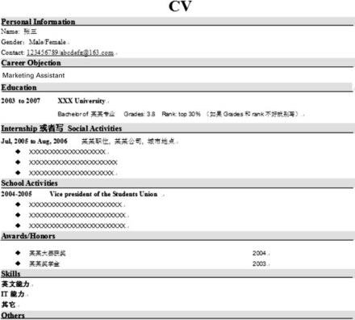
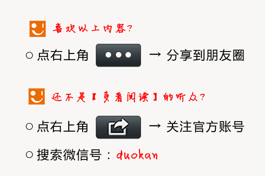

      找工作的时候，同时附上自己的中英文简历，这是对用人单位的基本尊重。我们这里只讨论模式和英文写法，不讨论简历内容。 

  

      简历又叫作CV，全称为 _Curriculum Vitae_，通常意义上跟_resume_是一个意思，相对应的一个单词叫_JD, Job Description_（职位描述）。  

  

**（1）先说外在的_format_**  
  

      找工作 尽量不要用PDF格式的简历，不容易识别和保存修改，一定要用Word，而且**最好用2003年的Word，因为考虑到有些公司的电脑打不开2007版本。**  
  

     Word文档的名字， 绝对不要只写简历，或者CV二字，这是让HR非常头痛的，他们每天都要收到成百上千封CV，如果你的标题都是这样，很不方便的。

  

    文档正确的标题名应该是这样的： 某某大学——姓名——应征职位。

  

    如果是已经工作的人，应该是 某某公司——职位名——姓名。  
  

    所以当HR把你的CV附件下载下来，你的Word文档名应该是××××大学——张三——应征市场助理，或者××××公司——销售经理——李四。   
  

**（2）打开word后，内在的格式**  
  

首先牢记两点：

  

1**对**应届生**来说，简历最好不要超过一页，绝对不要超过3页。  
  

2**最好不要用**表格式**的CV，一般HR都不太喜欢表格式的CV，而且表格因为留下的空间有限，所以也很难反映出求职者的基本情况。  
  

     因此，我们这里提供了简历最常见的格式，按照这个格式写，简历容易显得比较专业一些，如图所示： 

      需要注意一点，如果自己还编写了中文简历，一定要注意，中英文简历要求格式完全相同，简历的中英文内容最好能够一一对应。   
  

     按照上图，我们来分步骤详解每一步的英文该如何撰写：   
  

     A. CV标题，你首先要写上CV，或者_Resume_，最好用**小二号字体，加黑**  
  

     **B**. _Personal Information_（个人信息）  
  

    这个还可以写成 _Personal Profile_，不过都无所谓，需要注意的是开头字母都要大写，加黑加粗。

  

     我个人认为只要写三样就够了， _Name, Gender, Contact_，右边你可以放照片。_Name_的写法，学生和在职人士不同，在职人士最好直接写英文名，比如_Sam Liu, Richard Ding_，因为很多人在职场一般中文名大家都不知道，就直呼英文名。

  

     但是学生，最好写本名，张三写 _San Zhang_，注意开头字母都要大写。_Contact_要写上两个，手机+Email地址。

  

    有的人还会写上地址，这个倒是可有可无。右边空白的地方可以放上自己的照片，照片不要放生活照，必须放着正装的职业照。   
  

**    C **._ Career Objective_（职位意向）  
  

     写上你的求职职位， _Marketing Assistant_啦、_Sales Rep_啊等，按照招聘启事来，如果个人还没有确定_Career Objective_，这一栏可以去掉。

  

     **D**. _Educaiton_（教育背景）  
  

     最顶端要写日期，不用写月份，年份就够了，××××年to××××年足矣，空开几行，用黑体字写上自己的大学名称，开头字母都要大写。时间和学校名都要加粗，下面的时间和工作经历，社团经历等也都要加粗。   
  

      第二行写上自己的 **学位**和**专业名**  
  

专科写Diploma of某某专业  
  

本科写Bachelor of某某专业  
  

硕士写Master of某某专业  
  

博士写PhD of某某专业  
  

   **  专业和学位开头要大写**，of不用大写。

  

    后面写的Grades和Rank是指你的绩点和学校排名，如果大学成绩一塌糊涂的就不要写了。 

  

    写学历的时候要注意， **只要写到本科就可以了，不要把自己中学也写上！**

  

    把自己获得的学历按照由近到远排列，比如说，MBA、硕士、本科，按照这个顺序和上面的模板来写。   
  

**     E **._ Internship/Social Activities_（实习经历）  
  

     标题同样要加粗并且开头字母大写，值得拿出手的兼职也可以放在里面，在职人士当然就要写成Work Experience（工作经历）。这个写法比较讲究，我们要多说说。 

  

     a. 个人建议每个人首先做一份常规的简历，把自己在校经历或者工作经历全部都写好。写下来的话，简历长度在2、3页左右，然后投递具体的职位时，把跟工作相关的经历一条条复制过去，慢慢筛选，这样就可以成为一份1页左右的相配简历。

  

      通过这种做法，可以减少大量时间，根据自己的目标职位，如市场、销售、咨询、金融等，看到不同的简历，有针对性地对自己的经历进行删改。   
  

      所以就是先编好一份原生态的简历，包含自己所有的经历，然后上网查看招聘启事和JD，来做出不同的3、4份针对性简历。 

  

     b. 每个人都有不同的实习经历，那么就要按照从近到远的顺序来写，把最近完成的放在最上面，下面写的社团经历也是同理。  
  

     c. 然后看具体的每份经历，写时间段。  
需要注意的是：英文里面2003年12月份是不可以写2003.12的！  
  

     应该写Dec.2003或者Dec 2003，标点加不加都可以。要把月份放到前面，然后写年份。取所有月份的前三个字母作为月份的简写，Jan，Feb，Mar等。 

  

     d. 然后空开几格，先写职位名，再写公司名，再写地点。比如说，最近的一段实习经历，是在阿迪王火星分店做助理店长。那么就应该写：  
Assistant Store Manager, Adivon, Mars's Branch。  
  

     在下面可以列出若干条自己的工作职责和工作成绩， _Responsibilty and Achievement_。  
  

     这个也很重要，下面的社团经历是同理的，所以我只拿这一个来作为典型讲解。   
  

     Responsibility的内容放前面，12条，Achievement的内容放后面，12条。   
  

要注意：  
  

       第一，简历中绝对不可以出现句子，只能写短语。换言之，绝对不要写上主语，比如说_“I was responsible for……_”只能写“_Responsible for……_”。  
  

         第二，写现在自己正在做的工作，所有的动词都用一般现在时，写已经完成的实习或者社团，所有的动词都用过去时态，尽量避免一切进行时态和未来时态。  
  

        第三，所有职责，开头第一个单词开头字母都要大写！

  

       第四，为了格式美观，所有职责写好后，后面最好统一都不要加标点！  
  

        比如 现在在职，就写成_“2003 to present Assistant Store Manager, Adivon, Mars's Branch__”_。 （2003年，在阿迪王商店做经理助理。）  
  

         已经过去了的，就写_“2003 to 2005 Assistant Store Manager, Adivon, Mars's Branch”。_  
  

       好，我们来假设你的工作经历是 2003 to 2005 Assistant Store Manager, Adivon, Mars's Branch。 然后正式写工作内容，一般工作内容第一条，一定要写：

  

      Responsible for……总体的职责。   
  

     接着写两条具体的职责，比如说：  
  

_     Assited the Store Manager on sale promotion, team management and
inventory management      _（辅助商店经理促销、团队管理和库存管理）  
  

     _  In charge of ××××_事情（负责××××事情）  
  

       然后写成绩，比如:

  

_      300% promotion on revenue comparing to last year。 _  

  

      一般来说，最好在34条内解决一份工作的内容，否则就太长了。   
  

      至于有人还会写上自己学到的东西和感受，比如 _Learned how to deal with stress, great improvement on communication skill_（学会如何处理压力和沟通技巧的重大改进）等。

  

      没必要写这些，写上职责和成绩就可以，因为只有你做的事情和取得的成就才能说明你的素质，没必要把学到的东西在简历里面再废话地强调一句。 

  

       **需要注意的是**：实习经历并不是越多越好的，比如你想做marketing方面的工作，那么做培训老师或者人事的实习经历就没多大帮助，所以我觉得实习经历要有的放矢，而不是随便做什么都对所要找的工作有帮助，因为实习很大程度上决定了你的工作。

  

      自己在找实习的时候一定要慎重， **哪怕**是在市场部打杂或者销售部打杂，找工作时也比较容易找到市场或者销售的工作。  
  

     ** F.** School Activities（校园活动）  
  

     这个部分只针对应届生，工作一两年之后的简历，一定要把这部分删去，否则就显得人很不成熟——那个时候业绩为王，没人在乎你大学时代做了什么事。为了节省空间，一切的在校参赛经历、项目经历、社团活动、班干部等，都可以放在上面。 

  

     有些人拿得出手的学生活动有好几个。比如说：   
       2005 Best Five of CCTV English Speech Contest, National Finale（2005年中央电视台英语演讲比赛全国总决赛五佳）

  

     2006 to 2007 Vice President of Student Union, Engineering College（2006年至2007年工程学院的学生会副主席）   
  

     2007 to 2008 President of   Student Union（2007年至2008年，学生会主席）

  

     这些呢，首先，选择其中分量最重的，班长啊、文娱委员之类的，就不要放上去了，除非你真的没别的可写了。 

  

     然后，按照时间的先后排序，最近一期的放最上面。最后，每次写完一条后，都要在下面加上12条自己做了哪些事儿。   
  

比如说：  
  

2007 to 2008 President of Student Uinion  
  

你在下面可以写：  
  

a. Responsible for generalunion management, including personel administration,
financial control, and student activities organization and so
on.（负责学生会的总体职责，包括人员管理、财务控制和学生活动组织等。）

  

b. Recruit and build a strong team for student union, fulfil all obligations
and successfully organized several student
activities.（建立起学生会的一支优秀团队，完成学生会的义务并成功组织了多起学生活动。）  
  

**     G **. Awards and Certificate（证书和所获奖励）

这些成绩对找工作都很有帮助，也是按照年份先后顺序来写，最好嘛，还是把自己得过的奖项和证书都放上去，尤其是奖学金和自己专业有关的证书。  
  

       **H**. Skill（其他能力）  
  

    一般的skill就分成语言能力和IT能力两类。一般写个Fluent，然后附上自己的四六级或者托福雅思成绩即可。IT，就写Proficient on Powerpoint, EXCEL, WORD等。大学没事时多学点这类软件用法还是非常有帮助的，尤其是Powerpoint和Excel的用法，很多人工作了都还在学习这个。 

      

       ** I**. Others（其他）  
  

      如果还有空隙，可以写写自己的兴趣爱好，但是你不能写和求职冲突的爱好，求职市场销售，你写最爱好一个人独自旅行可不行，不过这个others可以省略掉，所有简历中，最重要的还是实习经历。   
  

         **J**. Self Evaluation（自我评价）  
  

        个人不太推荐应届生简历加上这么一项自我评价，这个可以不写，写多了是吹牛皮，写少了占地方。其实你能做什么事，爱做什么事，从你的工作经历还有实习经历就能看出来。 

  

      而且一般像这种self evaluation或者career highlights都是工作5年以上的人写的，比如说成功的项目啦，多少年的资深经验啦，在哪个领域内的独到心得啦等等，一般应届生，没有写的必要。相反的，在校期间，找到一份好点的有针对型的实习非常重要，最重要！   
  

**（3）怎样发邮件给HR**  
  

     ** A**. 一定要把英文CV和中文CV放一个Word文档里面，绝对不要放两个不同的文档！  
  

     **B**. 要把简历内容复制到邮件中，再搞个附件。

  

     **C**. 有些搞设计和艺术的同学，要在邮件附上portfolio（个人作品展示），绝对不要上传到网上，给人家一个链接，这样显的态度太傲慢，除非是你作品获奖在知名网站上展出，有那个底气了。

  

       **正确的做法是**，把自己的portfolio编写成PDF或者Word，附件放到邮件里面，文件名写：某某某的portfolio，一定要给自己的文档写名字，绝对不要写什么CV、简历、portfolio这种。

  

     同时，最好把自己的作品放到网上，在邮件里加上一条链接，因为portfolio过大，可能超过10M，所以一般要把它和自己的简历分开，用两个文件做附件。   
  

       **D.** 邮件名要用正式格式。  
  

      用这样的邮件名最保险：应聘某某职位+某某大学姓名+电话。   
  

总结  
  

      以上就是最实用的英文邮件格式写法，我们再总结复习下：   
  

（1）尽量不要超过三页，最好一页；  
  

（2）不要用表格格式的CV；  
  

（3）文档标题一定不可简单写CV或者简历二字；  
  

（4）中英文简历一定要格式

个文档里面；  
  

（5）简历内容应该包括Personal Information, Education, Work Experience, School
Activity等几项，每一项都有严格的格式要求；  
  

（6）简历句末绝对不要加任何标点，只能使用短语性文字，不可使用句子。

  

**——以上内容摘自《把你的英语用起来！》**  

** **

[阅读原文](http://www.duokan.com/%e6%8a%8a%e4%bd%a0%e7%9a%84%e8%8b%b1%e8%af%ad%e7%
94%a8%e8%b5%b7%e6%9d%a5%ef%bc%81/b/41278#wechat_redirect)

