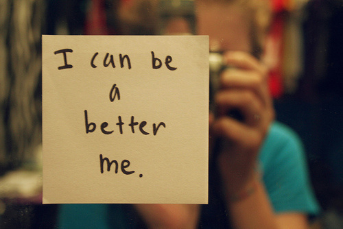

20多岁，你迷茫又着急。你想要房子你想要汽车，你想要旅行你想要享受生活。

你那么年轻却窥觑整个世界，你那么浮躁却想要看透生活。

  

你不断催促自己赶快成长，却沉不下心来安静的读一篇文章；你一次次吹响前进的号角，却总是倒在离出发不远的地方。

成长，真有你想象的那样迫切？

—转自雅虎《另一种活法》

  

> **简七读财  
****（**微信号：**jane7ducai****）  
**原创有态度，简单好理解！

  

来源：这一步

  

**  ****  ****一、别急，千万别急**

上周在南京出差，深夜拖着疲惫
去跟朋友见面，畅谈至凌晨两点。回到酒店已近三点，同屋的同事竟还未睡，点根烟，对着65层下的旧都夜景发呆。他非健谈之人，光头，一副艺术家模样，气质
有天然的冷漠，之前交往无非公事，更无多话。不知道怎么提到了当今青年人的心态和选择，竟就聊起来，再也收不住。  

  

他18岁出来闯荡，没念过大学，今年38岁，是一本著名杂志的设计总监。如果这是一个老套的励志故事，我可能再无兴趣听下去。但他说，我不知道你们这代人是
怎么想的，我反感几零后几零后的区分和标签，我跟很多自己的同龄人聊不来。人是靠价值相互认同的，而不是年龄。现在你们这代人看上去都挺急，房子、车子、
票子，但就是你们同龄人，也不全是这么想的吧？我点头。

  

他继续道，其实，每一代人都有自己的苦闷，真的，都是这么过来的。两年前我才有了自己的房子，今年 儿子两岁了。我觉得一切挺好。25岁时我在一家体制内单位工作，已
有七八年工作经验，呆不下去了，要走。领导请我喝酒。他一口闷了一杯酒，跟我说，你还年轻，别想那么多，别着急，做该做的事。就这一句话，我受用至今。

  

我年轻时爱玩、浮躁，总有各种诱惑扑过来。我就记着老领导这句话，其他都不想，就做自己的
事，一晃眼就到现在了。他继续道，你要说奋斗什么的，我从来没有，就是一步步来。房子、车子这些东西，说真的，只要你不傻不笨，踏实做该做的事，到时间都
会有的，不可能没有。别去想它。别去管别人怎么做，相信自己的判断。守得住，慢慢来。

  

他说，守得住，慢慢来。

  

一个月前，我刚来，抱回家十几本往期杂志。匆匆翻完，绝望的陷进沙发里，给老师发短信：文章何时能写过四大主笔啊？差距不是一丁半点。他回，别急，你年轻。我说，我都
24岁了，还看不到一点希望。他回，才24岁。我们最年轻的也30出头了，别急。

才24岁。他连说两次，别急。

  

李笑来在《把时间当作朋友》里写，我们总是对短期收益期望过高，却对长期收益期望过低。

他指英语，也说人生。

说来说去，还是急。

  

****  ********  **********二、“出名要趁早”，害了多少人**

有 人说，你想成为什么样的人，就到那个人身边去。并不是每个人都有这样的幸运，但这句话或不只关乎职业生涯，也关乎生活智慧。人们容易放大眼前的痛苦或成
就，跟年长却开明的前辈交流，他们一望便知你正经历怎样的阶段，现在绊倒你的，不过是一颗螺丝钉；你愁肠百转看不穿的，或许是他们也曾有过的迷茫。

  

在18岁-23岁那段时间，我很没出息的爱翻阅名人履历。每知晓一个佩服、羡慕嫉妒恨的人，便去搜寻他的经历——几岁硕士毕业？何时修完的博士？多大年龄开始在职业领
域崭露头角？何时达到今日的成就？

  

年龄，年龄，年龄，那是一种对时间的焦虑。张爱玲一句“出名要趁早”，害了不知多少人。我反感成功学，因为显而易见，不是每个人努力都能成功，但我确信自己
是幸运儿中的一个。我野心勃勃、精力充沛；我狂妄自大，对自己在外形和才华上的优势得意洋洋；我思考一切严肃的话题，阅读跟这个世界奥秘有关的书籍，向着
古往今来浩瀚的文明致敬；我期待人们在出版物上阅读我的文字，在媒体上谈论我的名字；我向往声名、金钱、漂亮姑娘的长发，我反复阅读许知远《那些忧伤的年
轻人》，为另一个同样骄傲的灵魂而心潮澎湃。

  

可我才20岁。

  

所有的名人书籍、讲座都告诉我，一个人要知道自己想要什么，才能做成事情。时至今日，无数同龄人的文章、微博里，在大受追捧的出版物里，还充斥着类似观点，甚至已成为
带有反成功学意味、带有天然“正确性”的话语，大受“有独立思考能力”的思想青年认同。

  

但是，你问一个刚刚告别机械枯燥的高中生活，对世界和生活的认识刚起步的年轻人，他想要什么？他想要优异的成绩、同学间的声望、漂亮的女朋友，他还想要毕业后找到令人
称羡的工作，尽快赚钱、成名、成功。

  

有人会问，这有问题吗？诚然，这也是“我想要什么”，但却只是模式化的流水生产线，试图把所有年轻人都打磨成一样的面孔。“想要什么”不应只关乎俗世的职业、功名，它
应该切合更深层次的命题、人本身的挣扎和探索，即——我是谁？

  

你是谁？想拿遍大学里所有的奖学金，想过上物质丰裕的生活，想获得一个高薪的职位，想在北京四环内拥有一套自己的房子……Noooo……你是谁？

  

为什么那个愿意在一切可能的物体上涂涂画画的家伙，去做了一名公司职员，只因大家都说，自由画家的生活没有稳定保障？

  

为什么那个立志“铁肩担道义，妙手著文章”的姑娘，进入了国企，只因父母苦口婆心的劝，记者收入不如国企高？

  

你是谁？我是说，剥离掉一切外界赋予你的定位和枷锁，隔离开所有父母长辈试图左右你、干涉你的声音，忘掉全部大众传媒、明星名流以及出版物曾经输出给你的价值判断，你
又是谁？你躯壳之内那个砰砰乱跳、嗡嗡作响的他、她、它，是谁？

  

世事多舛，你来何干？

20岁出头的年纪，不知道自己想要什么，不仅不是灾难，反而可能是一件幸事。

  

但你一定朦胧知道自己是谁，对什么事感兴趣吧？如果连这都不知道，就真的是灾难了。

  

知道对什么事感兴趣，就一点点做起来吧。无论多少声音试图扭转你，说你热爱、着迷的这件事情，没钱途、没前途、没发展、没出息，都请悠悠的对他（她）说：Fuck
off，this is my own life.

  

不为什么，因为热爱。千金难买热爱。

我曾把几年来写过的一些文章发给丹青老师看。他很高兴，回信说，文辞再沉静一些就更好了，但就这么慢慢写起来吧。他没有说，你要在笔头功夫上多努力，他日成为著名的记
者、作家。我懂他的意思：你喜欢这件事，就慢慢做吧。

去哪里，不重要。

  

****  ******  ********三、为什么要让人生“画地为牢”**

朋友问我，以后想做一个出色的记者吗？我说，不知道。他诧异，你不是混传媒圈吗？我亦诧异，为什么要在20岁出头的年纪给自己的人生下一个定义呢？定义即枷
锁，即画地为牢。难道这个年纪，不应该是尽一切可能伸展自己的触角，去触摸不同的、多元的事物，感知并观察丰富、蕴藏无限可能性的世界么？

  

下了定义，即关上了可能性的大门。你怎知日后不会遇到更令自己好奇、亢奋的事情？你才20多岁，20多岁，20多岁。我为什么不能去做职业旅行家？为什么不能去做NG
O？为什么不能在码了几年字后，突然迷上了摄影？为什么不？

  

阅读名人传记，好处是能藉由他者在人生关键时刻的抉择，参照自己的生活；而负面效果却可能更致命——“从小立志做一名……”。

  

若你回头梳理自己的人生履历，花些心思，会看到一条似乎清晰的轨迹和路线，进而“恍然大悟”：我正是循着这样的路一步步走来的，原来我从一开始就是想要成为
这样的人啊。如果你写过申请学校的PS，可能有类似体验。但，这或许是欺骗性极强的“假象”——回望过去履历难免会总结、归类，拎出一条主线来并不困难。
很可能，你从一开始并不是想成为这样的人，甚至并不知道自己要走怎样的路，只是迷迷糊糊的，循着兴趣走过来了。

  

是的，是兴趣，而不是规划——“从小立志做一名……”。

  

若日后我莫名其妙成了一名电游玩家，我在个人传记里也可以深情回顾“我从小就立志做一名职业电子游戏玩家”，因为我4岁开始玩电子游戏，至今仍不辍，算得上发烧友。

  

莫忘了，冯唐年轻时是个诗人、文艺青年，后来修了妇科博士，再后来做了咨询公司，现在又做了实业。

  

莫忘了，老罗直到27岁之前，还认为自己终生跟“老师”和“英语”这两个词绝缘。

我一直对“规划”二字持有戒备，所谓职业规划、人生规划，忽悠者众。

  

人生是靠感知的，如何规划呢？职业生涯是靠机遇和摸索的，如何设计呢？而规划如何成功，更是无稽之谈。丹青老师28岁登上去美国的飞机时，如何规划自己此生要成为对公
共领域发言的学者名流呢？他只是喜欢画画，就画，一笔笔的画；秦晖老师15岁下乡插队时，认为自己这辈子就待农村了，如何“立志成为中国思想界的标杆”呢？他只是喜欢
阅读，就读，一本本的读。

  

如果我四五十岁时有机会受邀到年轻人中去开个讲座，一定要叫做“我的人生无规划”；如果我混得灰头土脸，在世俗意义上是个无人问津的卢瑟呢？那我就跟自己的孙子吹吹牛
逼讲讲“无规划之人生”中好玩儿的故事呗。

  

******  ************  ********四、谁也无权告诉你该怎么活   **

如果你时常参加中国大陆的思想人文类沙龙，哦不，或就是普遍的名人讲座。在提问环节你几乎很难错过一个问题，“XX老师您好，请问您对当代年轻人有什么看法和建议？”

  

据一些讲演者众口一词抱怨，这几乎是最令他们反感、厌倦的问题。或许连提问者自己都很难意识到，这个愚蠢的问题潜藏着一个不易察觉的心理成因：请告诉我们如何才能像您
一样成功、出人头地。

  

不然呢？如某位学者所言，一个年轻人恳请一个老东西教自己如何面对新鲜世界。荒唐吗？丹青老师说，爱干嘛就去干嘛，关我什么事？你们好不容易生在一个可以自由选择的时
代，却还想让别人指导你该怎么活。

  

当真连自己喜欢做什么，该如何活都不知道么？想赢怕输罢了。该做些什么、走什么样的路，难道不是循着内心的声音一步步摸索、试错出来的吗？走岔了，就退回来；走得急，
就缓一些。时不时停下来想想，望一望，琢磨琢磨，再继续走。

  

怎么可能不摔跟头呢？怎么可能诸事顺利呢？怎么可能有条一马平川叫做“成功”的路供你走呢？不多试错几个怎知自己跟什么样的人处得来呢？同理，不多尝试一些怎知自己喜
欢什么不适合什么呢？

  

正如丹青老师给贾樟柯的书写序，“我们都得一步一步救自己，我靠的是一笔一笔地画画，贾樟柯靠的是一寸一寸的胶片。”

  

青年人的选择就如整个国家急功近利的写照，“先污染后治理”，先成功后成长，先找工作再找兴趣，先出人头地再寻找自我。某位职场中的朋友抱怨，自己在工作岗位上迷失了
困惑了。不知自己到底适合这份工作吗？

我问，你到底喜欢做什么？他嚅喏半天，说不上来。

有的明确表示，我不喜欢自己的工作。那么我该去报个拉丁舞班吗，去报个吉他班吗？

  

从事并非自己志趣的职业问题并不大，业余时间发展偏好就是了。但我后来才醒悟，比“不能从事自己喜欢做的事”灾难性一百倍的，是压根“不知道自己喜欢做什么”。

  

黄律曾有条状态写道，“现在想想中国父母从小到大灌输的要一直读读读抓紧把书读完最好读到博士然后去工作实在是害死人，这样看起来是沉得下去的表现，其实越
到后面就读得越浮躁。 美国人这儿gap一年那儿gap一年，反倒更容易找到属于自己的生活。生活本来就是个沉淀的过程，急匆匆地往学位阶梯上爬干什么！”

  

这让我想起听来的一个故事。一个澳大利亚人，大学毕业后在半岛电视台做了三年记者，游历了欧洲，后跑去念了一个哲学一个经济学的硕士学位，又到非洲做了两年
义工，等他跟我一个师姐成为名叫“人权”的硕士项目同学时，已经33岁了。我不解，他读完硕士为什么不继续读博士呢？“他在生活中发现一个新的兴趣点才跑
来念一两年书，但这些兴趣的程度都没到博士那么深入，而博士研究的方向很可能是一生的志业”，师姐道。那他毕业后都35岁了，做什么呢？“他似乎还没确定”。

  

这似乎是一个不靠谱的反面典型。正如一些老同学对我的印象。
他们一边说，羡慕你丰富多彩的生活，听完我近期打算又同情的啧啧叹道，那你留学回来都多大了？27岁.还读PHD吗？不知道。那你何时结婚？谁知道
呢，30岁？也说不定念书的时候就闪婚了。你也太不靠谱了吧，我都副科了……那你留学回来能找一个多牛逼的工作？我说，出国未必是为了找到更好的工
作，目前想从事的职业不出国留学也能做的。啊？那出国意义何在？

  

个人阅历、视野和自我完善。看看更大的世界，在自己身上发现更多的可能性。

这话我终究没说出口。

  

******  ************  ********五、你要的是快乐还是“成为大人物”**

有没有想过，自己这辈子终究只是个平庸的小人物，所有的梦想都没能实现？这是网络流传很广的一篇帖子。

  

我在南墙群里问大家。马老师说，不会的，说实话大家都是了不起的人，按照自己节奏一步步来，不会差的。

  

亦有友人问我。如果你终究只是个平庸的人，那些牛逼的梦想都没实现，世界也没改变丝毫，会快乐吗？

  

我问，温饱不愁吗？他说，那肯定，没这么惨啦。只是说，蛮普通的，可能只是一枚平平的记者编辑，在单位无甚出彩之处，月薪最高也就一万上下，交房供，养儿育女，开辆普
通车。不痛苦，但也没什么光彩，的生活。

  

家里空间是否足够让我挂幕布开投影仪踢实况？可以。

还喜欢足球，喜欢阅读，喜欢年轻时喜欢的一切东西？是的。

时而三五好友，烤串啤酒，把酒言欢；时而周六周日，球场相见？是的。

  

快乐。

他看着我的眼睛。快乐。我点点头。

  

不久前去东北旅行，路途感触最深的莫过于导游、乘务员、售货员的差别。你会轻易的发现，性格将人与人彻底区别开来。

  

我们遇到过热情健谈、跟大家打成一片的导游，也遇到过黑着脸像客人欠她钱一样，没问两句就不耐烦的导游；遇到过如一切常见的公务人员般恶狠狠的乘务员，也遇到过穿着制
服坐车厢里跟乘客扯淡逗乐的乘务员。

  

如果你是一名普通的导游、乘务员，你会如何对待你的客人？考虑到这是日后再也不会打交道的“一锤子买卖”，何况也很少有人真正有闲心去投诉你恶劣的服务态度。

  

考虑到，你完美的服务态度很可能无法给你带来任何实质性的好处，除了客人的一声感谢，一张笑脸。所在单位无法注意到你的“优良表现”，你表现好不会被升迁，表现差也很
难被辞退——在中国，那个对客人态度恶劣屡遭投诉的可能反而讨领导喜欢，比你升迁更快。你懂的。

  

总而言之，你的服务态度无法对你的现实生活带来任何可见的好处，你此生都会是一名普通的导游、乘务员、售货员。你会如何做？

  

是的，或许你终生都只是一个平庸的人，但态度依然会带来生活质量的云泥之别。你热爱生活和工作，真诚的感知、理解、善待他人，或许未曾给你的生活带来任何有
形的回报和改观，却软化了你与内心、世界的边界。你不断接收到来自他者的正面回馈（感谢、笑脸、善意），再不断释放出正面能量，形成良性循环。

  

我很长一段时间都会记得那个导游、那名乘务员、那名售货员的热情、爽朗和笑脸。想起来都是暖意。

  

他们或许此生都是导游、乘务员、售货员，也很难有何升迁，但从他们的工作态度里，我读出了真正的快乐。

  

做一件喜欢的事难道不是做这件事最好的回报吗？正如写作是写作的回报，画画是画画的酬劳。

  

******  ************  ********六、成长一个时辰一个时辰熬出来的**

我曾经很喜欢一个朋友的签名档，“成为更好的人”。

这句不疾不徐却又溢满坚定的话，曾无数次给我力量。

  

如今，我却感觉这句话充斥着“更高、更快、更强”的进步论腔调，在铺天盖地的励志话语中，我偏偏爱上了“毁志”。我更喜欢用“感知”这个词。或许我们并不能创造生活、
规划人生，或许，体味、经历、感知、理解，这才是成长的密匙？

  

成为更好的人？如果今天陪母亲坐在太阳下聊了一下午天，漫无目的的，童年、成长、家庭琐事，有没有成为更好的人？如果今天没有读维特根斯坦的传记，没有跟近韩寒最新的
博客，没有刷新微博，只是给自己做了一顿可口的饭菜，躺在恋人的臂弯里发呆，算不算荒废生命？

  

这 一代中国年轻人可能面临着某种吊诡的自我矛盾，一方面，我们是前所未有早衰的一代，“十八岁开始苍老”，二十岁开始怀旧，尽管仍在青春，“你爱谈天我爱
笑”的时光竟成了一代人的集体乡愁；另一方面，我们拼命的想要向前奔跑，想要稳定、无虑的生活，想要拥抱住某种确定感，焦虑着，想要立即像三四十岁的人那
样，车房不缺，事业成功。

  

你，你，你，

真的享受年轻吗？为何你一边怀旧一边还在努力奔跑？

你，你，你，

真的热爱冒险和漂泊吗？为什么将理想纳给稳定和房产证做投名状？

你，你，你，

真的珍惜可能性吗？为何我看到你宁肯早衰也要拥抱“生活的终结”？

  

生活更美好的可能性，难道不在于这缓缓经历的一步步、默默感知的一天天，而在于未来的宏大勾画？

  

结婚的，添子的，升副科级的，做小经理的，博士毕业的，买房买车的，走得好快。我曾经焦虑过，后来发现，那不是我的节奏。我是慢吞吞的一头牛。如果方向错了，就会兜大
圈子，如果方向对了，就不怕慢。

  

一步步，一寸寸，一点点，一天天，慢慢来。

  

我不知道自己最终要去哪，还在一边晃悠一边张望，走一步停一下，摸摸这个碰碰那个，试图去感知、观察、理解这个世界。新鲜好奇着呢。但我确定，我只会走自己想走的林荫
道；我确定，我会像哈维尔说的那样，遵从自己的内心，活在真实里。

  

2011年可能是有生以来最不顺利的一年，屡遭挫败，计划搁浅。回头望望它，再踮起脚尖往2012年瞅一瞅，我还是想慢吞吞的说，我们都要死很久，活那么急干嘛，慢慢
来。

  

所有的成长和伟大，“如同中药和老火汤，都是一个时辰一个时辰熬出来的。”

  

    人生不怕走得慢，就怕走错路

刚来美国时，总听到中国人说美国懒散，可以举出很多例子来。美国人每年一定会外出度假，至少也要到海滨，在沙滩上躺躺。

  

中国人想干事，干起来确实夜以继日。吃起苦来，也是举世无双，我常听到美国人说，中餐馆的人，工作真辛苦，一周上六天班，开餐馆的人甚至一天上七天班。美国餐馆，把一
天的班分成午班与晚班两个班，一般服务员只上五个半天班。

可是，你真得与那些开餐馆的去聊一聊，他们都会告诉你，钱一但赚够，就再也不开餐馆了。

  

因为累，而生厌，生厌的东西，一是不能长久，二是不能有创新，成为一流。所以，中餐在美国是几乎快餐的代名词，而不是高档的标志。

  

美国人看来懒散，又会享乐，可是美国还是超强，而中国人劳劳碌碌，可中国还是个发展中国家，奥妙就在与此。

  

而且，国人虽然走的快，却常常走错路。美国人走的慢，却常常走对路。

  

走得快时，如果犯错误，损失就大了。五十年代，大炼钢铁之际，每家都把铁锅砸了去炼钢铁，其中有一年，钢铁产量几乎赶英超美了，可是，这样竭泽而鱼似的炼钢，后继乏力
，后来灾难接踵而至。

  

慢得好处是，有足够时间评估结果，有错误就停下来。
中国现在的经济高速增长，举国欢庆，可是，这不是没有隐忧，对环境的破坏也是惊人。环境污染有影响到人的健康，使医疗支出成倍增长，这侵蚀着人们生活品质。

  

中国人，盖房子很快，可是，不注重维修保养，一幢房子，住了二十几年就破旧不堪，要推倒重来了。美国人对自己的房子，每年都花精力维修，有些五十年的房子，还象新的一
样。

  

苦干不如巧干，巧干都有计划，都擅长利用现有资源，而不是每次都市简单的另起炉灶。

贵在持之以恒。中国人知道这个道理，可是，在实践中做不到。

  

中国的学生，有些小学开始学中学内容，中学开始学大学内容，有些大学还有少年班，这些人的学习真是够快的。可是，为什么在诺贝尔的排行榜上，他们却迟迟无名？

  

关键就是，很多人跑得快，可是，却常常该变方向，没有恒心。很多大学生，一走出校门就不在学习了。而美国提倡的是终身学习。

  

再看经济学家。中国学生数学比美国学生强，而得诺贝尔奖的美国经济学家却比中国多得多，考虑到现代经济学用到很高深的数学知识，这匪夷所思。

  

可是，进一步的观察，发现这也是情理之中。美国的一些科学家，包含经济学家，却有很强的竞业精神。一辈子从事一个领域的研究，衣带渐宽终不悔。最后，月中折桂，并非偶
然。

  

在技术领域，中国人用经营餐馆的方式来经营软件，很多程序员累得都想转行。很多经验的积累就白费了。殊为可惜。

  

所以，我想说，人生，只要方向对头，就不怕走的慢。慢一点，也许成功回来的晚一点，但更能保证成功的品质；慢一点，也许不会那么早到达终点，但亦不会因太累或太急躁而
半途而废。你说呢？

  

**  ****  **最好的成长，就是过好当下每一刻

威廉**奥斯乐是一位名医，他越来越多地接触到因烦恼和忧虑而生病的人，他们总因为过于烦恼以前和忧虑未来，长期闷闷不乐，毁坏了健康。为了更
彻底的医疗好这些人的病，他给他们开了一个简单却有效的方子：“每一个刹那都是唯一”，意思是说：我们活在今天，就只要做好今天的事就好了，无须担忧明天
或后天的事；我们活在此刻，就要好好珍惜此刻的时光，每一个刹那都是唯一的，不复返的。

  

他说：“无限珍惜此刻和今天，还有什么事情值得我们去担心呢？每天只要活到就寝的时间就够了，往往不知抗拒烦恼的人总是英年早逝。”的确如此，每天都处于忧虑中，身体
就像一根绳子般，拉来拉去，迟早会拉断。

……

  

过一天算一天，更多关注眼下的时光和日子，当我们把日子分成一小段一小段，所有的事都会变得容易的多。如果我们只活在每一个片刻，就没有时间后悔，没有时间担忧，而只
专注在眼前。聪明的人一次只咀嚼生命的一小片段，因为这样才不会被噎到。

  

每一个当下都是独一无二的，它不是过去的延续，也不是一个接着一个线性的未来。时间是由无数个“当下”串联在一起的，每一瞬间、每一个当下都将是永恒。

  

所以，当我们吃的时候，要全然地吃，不管在吃什么：当我们玩乐的时候，要全然地玩乐，不管在玩什么；当我们爱上对方的时候，要全然地去爱，不计较过去，不算计未来，全
然地投入。

  

就像《飘》的女主角郝思嘉一样，在烦恼的时刻总是对自己说，“现在我不要想这些，等明天再说，毕竟，明天又是新的一天。”昨天已过，明天尚未到来，想那么多干嘛，过好
此刻才最真实，否则，此刻即将消失的时光，要上哪里找去？

  

我有个小亲戚，在读小学的时候，他的外祖母过世了。外祖母生前最疼爱他，小家伙无法排除自己的忧伤，每天茶不思饭不想，也没有心思学习，整
天沉浸在痛苦之中。周围的人都说他是个懂感情的好孩子，他的父母却很着急，因为，一天两天的伤悲是正常，一周两周的伤悲也可以理解，但大半年都过去了，他
还时时哭泣，不肯好好吃饭和学习，严重影响了他的成长。

  

爸爸妈妈不知道如何安慰他。正好一次我来到他们家，看到此情形，决定要和小男孩聊聊天。

“你为什么这么伤心呢？”我问他。

“因为外祖母永远不会回来了。”他回答。

“那你还知道什么永远不会回来了吗？”我问。

“嗯――不知道。还有什么永远不会回来呢?”他答不上来，反问着。

  

“所有时间里的事物，过去了就永远不会回来了。就像你的昨天过去，它就永远变成昨天，以后我们也无法再回到昨天弥补什么了；就像爸爸以前也和你一样小，如果在他这么小
的童年时不愉快的玩耍，不牢牢打好学习基础，就再也无法回去重新来一回了；就像今天的太阳即将落下去，如果我们错过了今天的太阳，就再也找不回原来的了。”

  

他真是一个聪明的孩子，以后，每天放学回家，在家里的庭院里面看着太阳一寸一寸地沉到地平线以下，就知道一天真的过完了，虽然明天还会有新的太阳，但永远不会有今天的
太阳，他懂得不再为过去的事情而沉溺，而是好好学习和生活，把握住现在的每一个瞬间。

  

每一天、每一小时、每一分钟都是特殊时刻，每一个刹那都是唯一的。因为，过去了就无法再回头。

  

人生，当下都是真，缘去即成幻。所以，我愿与所有的读者朋友共勉：

眼前的每一刻，都要认真地活；每一件事，都要认真地做；每一个人，都要认
真地对待，因为“缘去即成幻”，别让自己徒留“为时已晚”的遗恨。逝者不可追，来者犹可待，最珍贵、最需要珍惜的即是当下---
生命的意义就是由这每一个唯一的刹那构成。

[阅读原文](http://mp.weixin.qq.com/s?__biz=MjM5MzA3MjI2NQ==&mid=200009281&idx=1&sn
=d798bd9a73ec033ef49295ac6e34600f&scene=1#rd)

