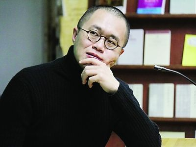

这一篇是2006年梁文道在深圳图书馆的演讲，题目是《我的灵魂我的书》。文中提出了很多问题，比如什么叫做阅读？为什么要阅读？要读什么书？阅读的意义？

  

你有答案吗？看看梁文道的回答。

  

\--------

  

一个人的书房，一个人看什么书，一个人拥有哪些书，其实就是一个人的全部，就是这个人，所以我常常很好奇。我不知道平常大家看什么样的杂志，但我会常常看很多香港的流
行杂志，像一些周刊、八卦杂志、娱乐杂志我都很爱看。这些杂志里面通常每一期都会有一些固定栏目，介绍一些名人、家居。例如，介绍一些出自名师设计、特别雅致、特别好
的那种房子，这些介绍中的房子内部，永远是干干净净、非常漂亮；家具也非常昂贵，意大利、德国名师设计；如果是名人的家，照片上的这些名人都是很骄傲地坐在沙发上，并
且呵呵地笑。

  
书如果在空间上面体现出一个人的灵魂，他的兴趣、他的嗜好、他要隐藏的东西都在里面。那么对他来讲这些书有没有时间纵深的角度呢？我觉得这也是一个很值得探讨的话题。

  

所谓时间纵深的角度，可以这样来理解——不知道大家有没有这个习惯，买了一本书回来可能会签名，签名的旁边还会有日期，我相信有些人会有这样的习惯。有的人甚至会连什
么时候看了这本书也记下来。甚至有人更特殊，这本书可能买回来的时候签了名，写了购买的日期，后来看书的时候又写了日期，而且可能一下子看不完，可能过几个月拿出来又
看，于是又记下日期。这本书就变成了一本日记，历年来你读它的轨迹都留在上面。如果你不是刻意这样做的话，你也可能会夹一些书签、证件、名片一大堆东西塞进去，塞进去
之后，这些东西都是你生命中某个过程的记录，都保留在这书里面。书不只是表达、承载一个内容的载具，书本身也有历史，有被阅读的历史、有被翻开的历史、有被购买的历史
、有被转卖的历史，你会在每一本书看到历史的记录，你什么时候看过它？你什么时候翻开它？特别是图书馆的书更是如此。

  
我以前在大学里有一个非常坏的习惯，完全不值得学习，尤其当我在深圳图书馆讲这个事情的时候。什么习惯？就是我喜欢在图书馆的书上面划线做笔记（很抱歉），为什么要干
这样的事呢？当时有同学问我：“梁文道，你怎么这么做呢？”我当时很自豪：“哼！你懂什么？我要指示重点给人看，我是为了其他的读者好。”我在书上面写了“眉批”，第
二个读者看了以后就会知道这本书好不好，值不值得看。

  
其实很多人都知道我刚刚说的那些道理，一个人的书房、每一本书里面有什么记号，都会展示你的生命历程和这些书的关系。如果是这样的话，我们能不能想象到有人会伪装？—
—绝对可能！

  

怎么样伪装呢？大家有没有看到有些人家里面放一整套很漂亮的百科全书，百科全书基本上是没有人会看的人——除了像王云五先生，他是立志把大英百科全书看完的——基本上
没有其他人看百科全书的。有些人专门买这些书放在家里面，也不看，就是为了炫耀，但是这种炫耀通常被人认为是很没有品味的。

  

香港的富豪想用书来炫耀的想法是没有的，所以没有这个问题。很多地方的富豪想过得要有品位、有文化，就用书来炫耀，成为笑柄。比如说莎士比亚全集、鲁迅全集等等，你买
来后肯定是不看的。因此英国这么一家公司提供特种服务。什么服务？就是几个小伙子专门负责替人买书和整理书架，好显示出主人卓越的品位，他们会看出你是什么样的人。比
如说看到你的眼神有一点忧郁、有一点神秘，于是他会专门帮你买一些占星术的书籍，找一些中古、有神秘异教思想的思想家（通常都是被火刑架上烧死的那种）的著作来装扮你
的家。

  

但是这还不够，书绝对不能凑一套，比如别人买莎士比亚，你也可以买，但是买莎士比亚一整套就很笨。这家公司很会买，怎么买？不买一整套，就买八本。这八本里面另外有三
本是重复的。这个重复是怎么回事呢？因为有几本的区别在于版本不同，然后在不同的版本里面有几位专家帮你在上面划线，表示你看过，还模仿出一些好似不经意的褶口。仿佛
有些人夏天喜欢穿麻西装——麻西装烫得很直、很漂亮不好看，烫得有点皱，太皱又不行，怎么办？——出门之前，烫一下，烫完之后洒点水、捏一捏，这样穿起来更潇洒。书也
是这样，故意褶一褶，然后又不经意地塞进一两张伦敦高文花园歌剧音乐会的门票，这表示你买这本书、或者看这本书的时候你正在看歌剧。你想想看，假如你拥有这样一个书房
，然后你请一个朋友上门来——假设是位异性朋友，你就和她说：“您慢慢坐，我去弄杯咖啡。”然后一弄就弄很久，弄个20分钟。你出来的时候，发现她正在翻你的书，一脸
叹服的表情。你就微微一笑——呵呵，这就得手了。接下来就是另外一个章节的故事了。

  
再说回这些书，它的历史本身是那么有趣，记录了人生命的轨迹，这个时候我们逐渐接近了一个更加核心的问题——在阅读的那一刹那，我的生命如何受到影响？如何被改变？如
何和它发生关系的呢？到底什么叫做阅读呢？

  

其实所谓的阅读我可以借用法国思想家布朗基的话：所谓的阅读，就是让人得到自由，让作品得到自由。为什么？我们每个人读书的时候几乎都有这样的经历，你会发现，有些书
是读不懂的，很难接近、很难进入。我觉得这是真正意义上、严格意义上的阅读。如果一个人一辈子只看他看得懂的书，那表示他其实没看过书。

  

为什么呢？

  

你想想看，我们从小学习认字的时候，看第一本书的时候都是困难的，我们都是一步一步爬过来的。为什么十几岁之后，我们突然之间就不需要困难了，就只看一些我能看得懂的
东西。看一些你能看懂的东西，等于是重温一遍你已经知道的东西，这种做法很傻的。

  

我奉劝各位要带着审慎的眼光去看坊间很多的畅销书，特别是那些非虚构的、非文学性的畅销书。比如说最近有一本书很红，我曾经写过一篇书评去讲这本书，那本书就是《世界
是平的》，大家知道这本书对不对？是《纽约时报》很红、很有名的专栏作家弗里德曼写的，这本书是最典型的、非虚构的畅销书，它具备了最成功的畅销书的特点。第一它会用
一个耸动的标题、理论或概念，比如“世界是平的”。“世界是圆的”大家都知道，但是他说“世界是平的”，世界为什么是平的呢？他说因为今天的全球化已经把全世界放在平
面上面，中国、印度、美国本来是那么遥远的国度，但是现在这三个地方在某些行业上面是能够竞争的。一个软体工程师在美国干得好好的，但是他现在的工作随便被转移到印度
和中国去，这就是所谓世界是平的。

  

这个概念坦白讲，其实我们大家都知道，我们天天看新闻、看报纸，都知道全球化。这只是全球化其中的一个面相，很简单的道理。但是这个作者懂得用很好的名字把它写出来，
就是《世界是平的》，让你吓一跳。你觉得你在看一个很新鲜的东西。看完之后，你觉得他很有道理，说得很对，他说得那么新鲜的东西我竟然觉得很有道理，而且我都看得懂，
这个时候你就很愉快。为什么？因为你知道你学到一些你不知道的东西，但为什么你看得懂呢？其实他说的事情你早就知道了，他换一种说法说，于是你以为你过去不知道。你那
么容易地、轻快地就看到一些你以为你过去不知道的事情，所以你特别骄傲、而且自豪——哼，我也是聪明人！内心深处、潜意识里面觉得自己是明智的、精明的、优秀的、熟练
的读者。

  

所以我们总结一下，畅销书的规律有三个：第一个规律就是把你已经知道的事情用你不知道的说法说一遍；第二个规律就是把刚刚的说法重复一遍，再举一些例子；第三个规律是
再重复一遍进行总结，就成功了——这就是畅销书。

  
因此，对我来说这不是真正严格意义上的阅读，真正严格意义上的阅读总是困难的。困难在于我们会发现一本作品无论是虚构还是非虚构的，还是哲学的理论经典——比如康德的
《纯粹理性批判》，或者是伟大的文学著作《追忆似水年华》。我们在阅读这些作品的时候，希望把它们组织成有机的东西，读出一个意义来，读出一个我能理解、掌握的世界。

  

但是你发现这个作品在抗拒你的这种欲望和要求，整个阅读的过程其实是个角力，你想把一个东西套上去，让它成为可理解的、给它一种框架、一个格式、一种格局，但是它一直
在抗拒。你刚刚修建一个城堡，有完整建筑的结构，墙角那一面又开始生出了蔓藤，然后慢慢地攻掠了城墙
——阅读总是应该这样。在这个时候你就发现，阅读无非是让我们发现了我们自己的顽强意志以及作品本身的不可征服。

  

作品是自由的，在于在阅读过程中你发现它不能被驯服；你也是自由的，因为你充分地意识到自己的意志、自己灵魂的存在。你读完一本很困难的书，你不能说自己都懂了，但是
你的深度被拓展了，仿佛经过了一场漫长的斗争，这样的斗争就像做了一种很剧烈的体育运动——精神上的体育操练，使得你这个人被转化了。

  
希腊罗马时期的哲学家很强调阅读。他们用了一个词，就是“操练”。大家有空的时候，可以看一下《柏拉图对话录》，甚至是被认为很系统的著作 ——亚里士多德的著作《尼
各马可伦理学》等等。你会发现这些作品表面似乎很系统，但是实际上不是。它甚至有很多内在的矛盾，就是因为作者在书写的过程中，已经有隐含的对话者，不断和读者对话。

  

所谓精心的阅读就是你和这部作品进行对话，在对话的过程中你不能征服它，它不能征服你，然后你和这个作品共同达到一个高度，然后你慢慢被改变——书总会改变人。

  

书会让人变化，会不会变得更好呢？我非常的有疑问。前几个月我在报纸上看到墨西哥有一个城市，这个城市的警察过去是出了名的“混帐”，聚赌、喝酒、不干事，贪污汇款等
等，不象话。当地的政府就要改革警察，怎么改革？就搞了一个警察阅读计划，指定了一批书。每个警察都要领几本书回去，要好好看书。墨西哥讲西班牙文，当然是看一些西班
牙文学的典，比如《唐吉柯德》等。

  

据报纸说，当地的政府表示这个计划非常成功。这些警察原来都是大老粗，但看了一年的书之后，都变得气质高雅，而且执行公务的时候不偏不倚，非常优秀。比如说一个交警，
过去在路上拦你车的时候就直接说：“把证件拿出来。”现在就会这样说：“这位先生，打扰您一下，我知道你赶时间，但是您能给我看一看你的证件吗？”——读书之后就会有
这样的效果。因此我们常常鼓励人读书，因为我们相信读书会让一个人变好。古语有云：腹有诗书气自华。虽然我非常怀疑，因为我们看过更多的人是越读书越坏。但是读书的确
会转化人，可以让你变得更加邪恶，也说不定会让你变得更善良，所以不一定。一些作品在思想上、灵性上的深度使得读书变得很危险，因为它让一个读书人可能比一个不读书的
人更邪恶。因此我们尝试把阅读驯服为一种很简单的东西。

  
鼓励大家读书还有个原因就是希望读书让大家更有文化、人变得更好、社会更和谐，但是我觉得这个不一定会发生，这种愿望往往会落空的，因此我很讨厌开书单。在香港我有一
些写书评的朋友每年都被媒体要求：开书单吧，暑假了，给学生一点好建议。

  

我觉得书单是不能开的。为什么？因为我们相信所有真正的好书、严肃的书、都能起到改变人的作用。一份书单其实是在规划你成长的目标，你的人生变化的方向，所以它也是人
生的计划。你想想，我们凭什么就将一份人生的计划、人生的进程，给一些我不认识的读者？我觉得那是不负责的。我凭什么告诉一些年轻人你应该怎么做人？你应该变成什么样
的人？我能介绍一些我喜欢的书，但是我一定会强调我喜欢的书绝对不是每个人都适合。我人生的方向、我的规划绝对不可能适用于所有的人，那是不可能的。

  
所以列一些书单出去推广是很霸道的行为，我是反对开书单的。另外还有一点，也是大家平时很容易有的俗见，就是认为读书应该读一些引人向上的书、励志的书籍。例如推荐看
一些名人的传记，看看这些人怎么奋发向上、努力向前，最后成为一代伟人等等——我很反对年轻人看太多这种书。

  

为什么？

  

我发现一个人读励志的书籍多了都会变成傻子，就是立志立过头了。无论遇到任何困难、任何问题，他就想到要勇往直前、排除万难、不怕牺牲。他没有考虑到，是不是自己错了
，是不是一开始自己的决定就有些问题。他不管，反正他从头到尾就是立志，志气高昂。一个志气太过高昂、太过自信、人生观非常正面的人其实都有一点傻，他会变得对世界的
看法很单向、单调，对人生的看法也很单一，就是只从正面看问题。他从来不知道世界的复杂，人生的阴暗。所以我认为一个人在年轻的时候，有机会就要看一些“邪恶”的书。

  

我心目中最伟大的邪恶作品就有几本。《金瓶梅》也有这种效果，但是《金瓶梅》还不够邪恶。大家有没有听过法国的萨德侯爵，今天我们讲性虐待的“SM”，那个“S”就是
来自他，因为他是个性虐待大王。他写的书充满着各种不堪入目的情节：人吃人、吃排泄物、轮奸、虐杀，种种你能想象到的最黑暗、可怕的东西他的书里全部都有了，所以他被
判精神病，后来死在监狱里。但是20世纪中期之后，有很多世界级的思想家都非常关注这个人，有很多著名的导演拍他的电影，有人研究他的作品。

  

这个萨德侯爵写书的年代就是法国大革命时期，法国大革命是个什么样的年代？就是全社会都很讲理性，大家知道当时最激进的革命派讲理性讲到什么地步么？他们认为月份的划
分应该是十进制的，即十天是一个礼拜，因为七天作为一个礼拜显得不够理性、不科学，十天才是科学的。他们认为世界的一切都应该是理性的。那么就在这样一个力求理性的年
代里面，法国大革命血流成河，人间能够想到的残酷和暴力都在这个最理性的时代同时发生了。这个时代有伏尔泰、卢梭这些伟大思想家的强调理性的作品流传，但是同时也有萨
德侯爵写的那么可怕的书出来，这表明什么呢？理性是有它的黑暗面的，崇高的理想背后往往就是无尽的血和肉组成的深渊——欲望的深渊。

  

所以，你如果读完启蒙思想家的作品再去看萨德侯爵，你将看到启蒙的黑暗面。如同站在一个悬崖边上，旁边是光芒灿烂的日出，但是退一步就是万丈深渊，深不见底，而且充满
着诱惑。有时候我们看到一些深不见底的东西会很害怕，但是你又很想知道下面到底有什么？你觉得它在把你拉下去，那是罪恶的。

  
如果一个人很早的时候就意识到人性里面的阴暗、邪恶，知道自己控制不了那种欲望、那种动力，你就会明白人生很不简单、很复杂，世界很可怕、有很多意外、很多我们不能控
制的东西。然后你有可能变成性格比较平和的人，至少你不会再犯傻。所以阅读是一种精神操练，阅读能够改变我们自己，读书不是让人变坏，而是让我们对人性有一个纵深的理
解。

  

因此，我们应该主动去读困难的东西；我们应该不计较、不避讳一些所谓可怕的书；我们不要去认为精神操练就是让人变好的东西，这不一定。精神操练只是让我们有所变化，让
你成为另外一种人，每个人一生的阅读过程都是应该不断变化的。有人说读书防老，我觉得说得很对。读书真的可以养老。什么意思呢？老人最可怕的就是他没有什么机会改变自
己，变化自己。如果一个人上了年纪依然很开放、而且是以严肃的态度去阅读、容纳一个作品，挑战自己、改变自己、扭曲自己的话，他就还有变化的可能。每天睡眠之前的最后
一刻，是一本书在陪伴我，今天的最后一刻和我对话的就是这本书，它在不断地改变我，直到临睡前我都在被改变。于是第二天早上起来的时候，我是一个新的人，和昨天不一样
，就因为昨天晚上的阅读。

  
有一个很有名的意大利作家，患了癌症，很痛苦。在临死前，他要求护士念书给他听，直到他咽气。他抱着这样的想法：我可能会死、会咽气，但是在这一刻我仍然不放弃。所以
我们大家请开放自己，让阅读、读书去改变自己，让自己变成另外一种人。我们随时随地都还有这种可能：尽管我们未必会变成更好的人，但是改变本身就已是人生的目标。我暂
时先说到这，谢谢！

  

==如果喜欢本文，请分享到朋友圈☺==

  

  * 喜欢不止读书，请点击“阅读原文”，打赏小河一杯咖啡吧~  

  

  * 微博：不止读书魏小河   豆瓣：魏小河

  

  * 欢迎在微信中搜索“不止读书（buzhidushu)”以订阅。

  

[阅读原文](http://m.alipay.com/personal/payment.htm?userId=2088202394597788&reason
=支持不止读书&weChat=true#wechat_redirect)

