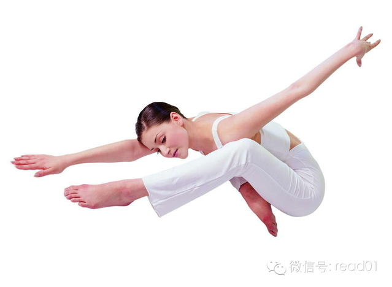

#

今天在知乎上看到@张一弘 的文章，在征得他同意之后跟大家进行分享，他的总结都是非常实用的Tips，我的微信和Blog上分享过很多类似的内容，在文章最后增加了
一个扩展阅读，可以进行扩展阅读。

**作者：张一弘**

出处：http://www.zhihu.com/question/21790919?group_id=198743664

由于前年做了一年项目加了一年班，所以我很认真的想过楼主的问题。

三个方面：身体、心理、时间。

## 身体

身体上锻炼其实不要想着去健身房或者一定要路上狂奔才叫锻炼。锻炼是个可以零碎时间去做的事情。适当的体力活动对保持体能、身体仪态、清醒头脑甚至脸色皮肤都会有好处
（短时高频运动）。而且可以预防各种慢性疾病和慢性损伤（体态矫正、拉伸、人体工程学）。动就比不动要好。

以下推荐几个我觉得再怎么忙都有时间可以做的锻炼资源：

  1. 推荐读一下业界良心高科老师在知乎上各种关于健身的内容，尤其是体态矫正（http://www.zhihu.com/people/gao-ke-69/answers?order_by=vote_num  ），比如关于颈椎矫正的动作我天天都做。没关注的请关注并从头点赞：）

  2. 多贝上体态纠正的公开课。（http://www.duobei.com/course/7321484242;JSESSIONID=e2faf016-6a4e-41ba-9256-eb24d27eb184  ）

  3. 《拉伸》（http://book.douban.com/subject/5068077/  ）这本书里介绍了很多拉伸动作，甚至有针对办公室的动作（设计师还有专门的动作，贴心到泪流满面）。

  4. 《囚徒健身》（http://book.douban.com/subject/25717097/  ） 最近刚看的，按照他后面的健身计划一周六天每天锻炼「六艺」中的一样只需要6~7分钟，而且循序渐进，适合各种人群。知乎上陈柏龄介绍过，内容同豆瓣他写的评论，就不再重复了。

  5. 电脑前正确的坐姿（http://v.youku.com/v_show/id_XMjU5ODc2NTky.html  ）。人体工程学，其中的要点《拉伸》也提到过。

  6. 7-Minute Workout (High Intensity Training)（https://itunes.apple.com/us/app/7-minute-workout-high-intensity/id675459297?mt=8&ign-mpt;=uo%3D2）  7分钟高强度运动的app。动作有视频，可选年龄体重性别训练强度，还可以挑选手上有哪些器材。动作都包括原地高抬腿、爆竹跳、平板支撑等等。

  7. 10 minute trainer（http://www.beachbody.com/product/fitness_programs/10_minute_trainer_deluxe.do）, Beach Body旗下著名教练豪顿蜀黍（P90X的那个）的10分钟健身教程，由于是收费内容就不提供下载了。这里需要的一些健身器材。

  8. 家庭胸肌和家庭腹肌训练，优酷上都有。自己搜下吧。

  9. 巴士刷牙法（http://www.guokr.com/article/342649/  ）不要忘了牙齿健康哟~

上面提到的这些内容单项耗时不超过15分钟，一天抽些零碎时间选一些加一起锻炼个半小时除非项目极度紧张，就算天天加班也是能做到的。如果真的很累，也应该做些拉伸动
作，本来就有放松的作用。（力量训练有一定风险，注意姿势准确、适度和循序渐进，有人教最好了~）。

### 定时休息

这里其实还牵扯到定时休息，具体操作后面讲。但是注意在休息的时候离开一下电脑桌，到窗口旁边远眺一下可以放松眼球，保护视力也很重要。我通常是一边做颈椎动作一边远
眺。再补充一点，夜间加班注意降低屏幕的亮度和对比度放松眼球，效果显著。也有人改色温的，不过对设计不行（屏幕偏色），而且我觉得会让人昏睡，因人而异吧。改色温的
方法在这里：http://www.iplaysoft.com/flux.html

### 饮食

说完健身还有要注意饮食上的问题。不知道题主是不是一个人住，如果一个人住的话注意少在餐厅里吃（更不说垃圾食品了），少吃快捷食品（方便面之类）的。

由于加班问题，作息就很难保障了，所以也会带来饮食不规律的问题。我的建议是少食多餐（3小时左右，看你睡眠情况了，但是不要有夜宵）饮食从梯度上来说是前2~3顿的
热量比重可以高一点，因为大多数的热量还是消耗在下午的。同时如果还想要控制体重或者减肥的话，少摄入碳水化合物和糖类食品。

还是由于加班，做饭也是个问题，弄得丰盛一个人不仅吃不掉而且太费时间，如果做的简单又容易营养单一。我非常建议经常拌蔬菜色拉，好做好买而且营养均衡，我自己一个人
经常买超市现成的。蛋白质和脂肪就主要靠肉类，肉类也可以买些超市里的成品。另外，自己煮个鸡蛋，冲豆浆，喝牛奶都是很方便的补充蛋白质和脂肪的方式。

很多人误解或者不重视零食、应该经常备一个水果和一小把坚果作为零食，在工作忙的时候能支持脑力活动也起到休息放松的作用。

这是要跟自己口味作斗争的事，不是适宜每个人。私以为饮食这件事情，在便宜、美味、便捷、健康上，极难同时满足。作为一个经常加班的人，应当优先考虑便捷和健康。

若非医嘱切记远离一切保健食品也切勿听信什么养生小百科食物相生相克等等。关于吃的总体标准我在另外一个问题里回答过（http://www.zhihu.com/q
uestion/21813099/answer/19401716）。

## 心理

「健全なる“魂”は、健全なる精神と、健全なる肉体に宿る。」（健全的灵魂寄宿在健全的精神与健全的肉体之中，出自动画《Soul Eater》） 。有健身习惯的人
都会发现，锻炼十分有助于培养一个人积极的心态，原因有很多，比如基础代谢变好，促进内啡肽分泌，克服锻炼上的困难能增强自信心等等。所以保持上面提到的内容本身就直
接有助于处理心理健康。

要特别提的一点是冥想。禅宗、瑜伽和积极心理学都很提倡这点。还是前面那句话，不是说要打坐才叫冥想，重要的是抽时间（10分钟到20分钟就行了）排除杂念。极度推荐
在做拉伸的时候顺便把冥想就给冥了。我以前公司附近有个地方很适合夜跑，基本也无交通危险，我会在跑步的同时做冥想，那一刻老子天人合一。

  * 怎样开始冥想（http://www.mifengtd.cn/articles/how-to-get-started-with-meditation.html）。

  * 哈弗大学公开课：幸福课。运动与冥想（http://v.163.com/movie/2006/1/2/I/M6HV755O6_M6I43F92I.html  ）等不加班的时候把这些全看了呗。

  * 斯坦福大学健康图书馆：维持健康的要点（http://v.163.com/movie/2010/12/4/Q/M6UVR31IR_M6V03QQ4Q.html）

这里还是牵涉到定时休息，我下一节真的会写的！

另外，我的建议是不要在因加班产生劳累的情况下做出判断、比如对猜疑同事或上司定性、质疑公司准备跳槽。因疲劳的状态下判断力、情绪都是有失水准的，所以判断极有可能
错误（外向投射、自我服务偏见等等）。即便你精力恢复了以后也可能会对以上人或事产生难以磨灭的负面刻板影响。但如果一味委屈自己也不排解，会造成更严重的认知障碍或
者心理疾病。所以我认为做的应该是发泄。发泄方法千千万万（包括冥想和运动），但千万别找别找同事或者上司抱怨，一是负面能量会相互影响，二是理由同上，不是说别人一
定没问题，但你当下的判断还是不可取。

## 时间

长期加班对一个人效率影响也在于不健康的时间观念，一旦加班成习惯，你就会把下班时间默认为上班时间，早晨和下午就开始拖了。也正因为这样，个人休息时间会和工作时间
混为一谈，陷入一种「我好像真的没时间」一样的错觉，造成心理负担。所以一定要把上班时间和下班时间隔离开来，把周末和工作日隔离开来，这是转回健康时间观念的第一步
。工作是工作，休息是休息，拿休息时间工作可不是理所应当的。

  * 绝对不要在公司里，尤其是工位上吃晚餐。下班时间到后立即出公司解决吃饭问题。切断工作空间的连续性。

  * 下班的时间点给手机设个闹铃（有实体闹钟更好了）。切断工作时间的连续性。

  * 如果打算周末要加班，那周五晚上一定要加班，尽可能多做。一想到周末要加班，周五就特别容易懈怠，这是自我惩罚性质的做法以产生对周末加班的厌恶，而且说不定你两天的加班就成了一天了。

  * 周末如果要加班，不要睡懒觉，跟平常一样时间到公司。同样是惩罚性质，一样也有助于效率提高，所谓吃个中午饭再来加班的想法，那没给到下午两三点是不会开工的。

  * 不要在家加班。

上面几点不算太难坚持的事，如果觉得有难度可以先从简单的地方做起，但效果提升是很显著的。

接下来终于要说怎么在工作中定时休息了。说起定时休息，最出名的应该就是番茄工作法了（http://baike.baidu.com/link?url=OJb-E
3TqqEDrh0dw8O5QtAuBKHHb1VkemlR7KTUkl33t3q96Z4lCjSWCAwTeJoBE1V3U51eK8M5WG3M9pgk
Oi_）  不过我觉得番茄的频率有点高，反而不容易坚持。建议像课程表那样安排一下自己工作休息的时间（每45分钟左右休息10分钟），也可以两者结合着来。

问题在于……怎么坚持对吧？

闹钟容易吵到他人，也无法阻止做high了的你。现在隆重推荐fadetop（http://www.fadetop.com/，windows环境，mac下不知道
有没有类似软件）这个软件。从官网上可以看到，它可以定时出现一个遮住你整个显示器的画面。由于持续时间和透明度都可以调，我建议各位直接把透明度调到100%（完全
遮住）并持续至少5分钟。自从用了这个软件，彻底治好了黏住座位的屁股，因为那5分钟里我啥也做不了。

后面提一些低学习成本，高收益，甚至被动的效率提高技能（Windows环境），尤其适合睡眠都捉襟见肘的各位（内容有些杂乱，见谅）：

  * 公司允许的情况下，用2个显示器，其中一个至少21寸（1680X1050），并将系统和软件分区的硬盘换为SSD（一般64GB~128GB即可），内存至少4G。大约花费1500RMB左右。资金有限的情况下优先考虑增加显示器。

  * 购买一个带大拇指有前进和后退按键的鼠标（多为游戏鼠标），至少50RMB，建议花费100RMB+。无论在浏览网页还是文件夹管理中，都可以减少鼠标活动，同时好的鼠标更符合人体工程学以及更高的dpi（移动速度），可以预防腕管综合症。挑选鼠标建议量一下手长（手腕到中指指尖），我个人推荐18.5cm以下的可以选Coolmaster的魔蛋或黑灵侠，以及国产鼠标。以上的直接入罗技（MX518及以上）。最好有机会到实体店握握。买个好鼠标用3~4年不是问题，值得投资。

  * 推荐阅读这个问题：如何优雅的使用Windows？ （http://www.zhihu.com/question/20491886）  中第前二位的回答，尤其是zecy的。最重要掌握Everything（极速本地搜索）、Listary（搜索+文件管理器增强）、Ditto（剪贴板增强），Clover（Chrome标签式管理文件浏览器）。另外个人再推荐picpick（http://www.picpick.org/en/  ，截图增强软件）。这几个软件的好处是基本不用学（平均学习成本低于5分钟），也不改变你原来对Windows的使用习惯，但对工作有极大帮助，基础功能免费而且适应任何职业。

  * 了解一下白噪音原理，主要为了占用你听觉的感官，那就不会因为声音分心，更容易集中精神。一些白噪音的相关资源（http://www.appinn.com/tag/%E7%99%BD%E5%99%AA%E9%9F%B3/  ） 。我个人最喜欢  http://www.calm.com/  ，这个冥想的时候也可以用。

  * Google搜索通配符（  http://wenku.baidu.com/view/1d896b0a763231126edb114c.html  ），不用全部记住，记住常用的，个人常用site和filetype。

  * 建议现在安装ManicTime（  http://www.itopdog.cn/business-software/project-management-software/manictime.html  ）来看一下自己工作时候都花在哪儿了，以及自己什么时候更有精力。加班主要记录数据就行了，等得空了再分析。

  * 使用带自动备份+版本管理的软件，保证你自创文件不会错改或丢失，最大程度减少重复劳动。可以参考一下我的这个回答：请问如何建立一个简洁易用的小型办公数据库？（  http://www.zhihu.com/question/21735703/answer/19176901  ）

  * 使用存档狂人（  http://pan.baidu.com/share/link?shareid=1686292551&uk;=46249  ）自动定时Ctrl+S，防止电脑宕机造成不可逆损失。当然建议配合上面的版本管理一起用。

  * 想一想工作中有哪些是重复性劳动？找一个程序员朋友看看他能不能帮你写一些批处理程序（batch）把你从这些劳动中解救出来？此条尤其适合妹子。退一步讲，如果找不到，也可以以批处理为关键词找找有没有现成的软件可以解决你的问题。

暂时就想到上面这些，后面有更新会补充。

## 总结

最后再推荐长期关注业界良心 warfalcon（战隼）老师（
http://www.zhihu.com/people/warfalcon/answers?order_by=vote_num
），特别推荐订阅微信（read01），每天都可以吸收一点关于GTD、健康、TM的小Tips.可以在休息的时候看看换换脑子。

我提供的方法都是为了保持健康而服务的小Tips，没想到会得到那么多的赞同。但是，若想要在身体、心理和时间上的得到真正的健康是需要花费更多精力并有计划的学习的
。其实，最重要的还是要解决长期病态加班的问题，这就不在这里讨论了。

最后，愿诸君在加班之后还能身体健康，做个好梦。

晚安。

## 扩展阅读：

刚才花时间补充了一下微信（read01）上以前分享过跟这篇文章相关的资源，，在微信（read01）上输入【】中的8位数字可以查看相应文章，实际上还包括大量的
时间管理和注意力文面的文章没有补充，可以去Blog上[www.read.org.cn] 相关栏目中进行阅读。

### 颈椎

  * 【20140120】 颈椎胸椎恢复方案-完爆版

  * 【20140107】 颈椎病常识普及

  * 【20140105】 如何缓解颈椎的慢性疼痛？

  * 【20140217】《麦肯基疗法》防治颈腰痛

  * 程序员的常见健康问题 [http://www.read.org.cn/html/1926-cheng-xu-yuan-de-chang-jian-jian-kang-wen-ti.html]

### 拉抻：

  * 【20130516】 《拉伸:最好的运动》

  * 【20130517】 《拉伸:最好的运动》-2

  * 【20131019】 《拉伸：最好的运动》适合在办公室里做的5个动作

### 健身及腹肌：

  * 【20130828】 跳不了insanity怎么办？  【20130814】跳不了insanity怎么办？

  * 【20130707】 女生健身篇  【20130706】 腹部运动女生版

  * 【20130705】 让我们每天做10分钟运动吧！

### App推荐

  * 【20131209】 运动App推荐  

  * 【20131214】 dana**wang的运动100天计划总结（2）手机app篇

  * 【20140219】 想减肥吗?从每天多走2000步开始  【20131029】 App分享和推荐（1）

### 饮食

  * 【20131011】 基本健康饮食指南

  * 【20131005】 关于减肥食品的真相

  * 【20130910】 瘦人怎样科学的增重

### 休息

  * 【20130904】 学会有效的休息

  * 【20130709】《番茄工作法》读书笔记

  * 【20130709】《番茄工作法》读书笔记

### 呼吸及精力管理

  * 【20130613】《硅谷最受欢迎的情商课》-（1）正念禅修

  * 【20131203】 白领怎么做才能每天都精力充沛，像少年一样？  http://www.read.org.cn/html/2067-zhi-hu-wen-da-zheng-li-shi-jian-guan-li-4-bai-ling-zen-zuo-cai-neng-mei-tian-du-jing-li-chong-pei-xiang-shao-nian-yi-yang.html  
*【20130720】 25种让你精力充沛的方法

  * 《精力管理》读书笔记-1  http://www.read.org.cn/html/1181-energy-management-note-1.html

  * 《精力管理》读书笔记-2  http://www.read.org.cn/html/1183-energy-management-note-2.html

### 软件

  * 善用科技--通过软件来提升你的效率 Blog：http://www.read.org.cn/html/2178-shan-yong-ke-ji-tong-guo-ruan-jian-lai-ti-sheng-ni-de-xiao-lv.html

### 其它

  * 【20130905】 怎样处理工作过多引起的焦虑症和压力

  

[阅读原文](http://mp.weixin.qq.com/mp/appmsg/show?__biz=MjM5NjA3OTM0MA==&appmsgid=
200160982&itemidx=1&sign=7d67ed931a61561942707c0f8bc20435&scene=1#wechat_redir
ect)

