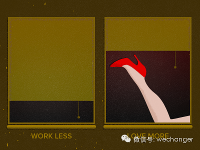

**#每周多来点感悟#**

  

朋友问，中式约会和美式dating的区别到底是什么？
我想了想说，dating是约会的精益创业版本——在充满不确定性和高风险的情况下，为杜绝不必要的资源浪费，致力于不断推出最小可用产品，快速更迭，不断优化。  

  

好吧，这是一个很互联网式的笑话... 把以前写过的一篇关于美国dating文化的文章贴出来~  

  

今晚和Alan本来是严肃的探讨网站的事情，结果后大半晚上话题绕了大半圈扯到dating。

  

美国人那个date和中国人说的约会根本就不是一码事。每次一和美国人打开Ex档案的时候，就得不停的反复确定，这词的定义是什么，那词的定义是什么，再来说数字问题
。

  

当一个中国人被问到“你和他怎么样啊？”答案一般有两种状态，不是“好上了”，就是在通往“好上了”的路上——约会中。中国人约会起来简单且严肃，就三阶段，暧昧-
恋爱- 分手/结婚。其实根本没有什么date不date的。大部分情况下，暧昧和恋爱有很明晰的分界线，就是“你做我女朋友吧”
或者“我喜欢你”。当然，这几年的年轻人啊，那可真是江河日下啊，不以结婚为目的的耍流氓的很多啊。

  

而美国人从最初的产生好感到“在一起”简直是长途跋涉，翻山越岭，过草地，上雪山，最后才完成那两万五千里，顺利在幸福结局会师，热泪盈眶，彩旗飞舞。

  

当我第一次听一个美国人说“I am seeing her right now, but she is not my girlfriend”的时候，我颇感困惑
。他们已经约会很多次了，相互表达过对彼此的喜爱，经常在公开场合牵手共同亮相，看起来也非常亲密，这还不算男女朋友？后来才渐渐知道，对美国人来说，两个人从初识到
正式确定“你是我的女友，我是你的男友”中间的那个约会过程有着复杂且微妙的关关卡卡，从meeting，picking up, hitting on,
然后have a crush, be attracted to, 再have feelings，再seeing或dating，接着exclusively
dating，最后才给彼此打上girlfriend, boyfriend的标签。  

  

即便问美国人，不同的人对这些词都会有不同的定义和理解。很多时候，它们的确也是可以互换的。特别是近几年，这些词的意思也有了很多新的含义。但对大部分“不敢轻易许
下承诺，对感情关系异常谨慎”的美国人来说，约会这个词是在表述两个人之间模棱两可的关系状态。那是漫长的，试探性的，不断进阶的，缓慢升温的一个过程。比品个酒还复
杂。

  

而且从date到男女朋友这个标签的确定之间根本没有什么明晰的界线。他们之间不会问“Could you be my girlfriend?”   喜欢、dat
e、上床、男女朋友，这几个词根本没有一个明确的顺序也没有什么相关性。可以先date再喜欢，可以先喜欢再date可以只上床，可以先date再上床，可以先上床再
date再喜欢再男女朋友。而且就是喜欢了，date了，上床了，也不见得就是男女朋友了。

  

这就导致美剧和电影里总有人在问，Where are we? Where are we? Where are we?
因为大部分时候就是恋爱双方也根本搞不清他们到底到了哪一步了，双方是否同步。Alan还提到，有时候双方正干柴烈火着呢，忽然停下来，一方问，Are we a
thing??

可是什么是a thing呢？booty call是a thing, date是 a thing, girlfriend是 a thing,
soulmate也是a thing啊。所以根本问了还是没问一样。

  

怎么样算是date这个我也一直都是晕头转向的。大部分情况而言，简单直接的美国人只要付账了，那就算是date了。我问过几个美国人，他们都从来没有请任何一个女人
吃过饭，最多只是买杯咖啡，送个礼物。吃饭必自付自的。在中国，除了某个别奇怪的城市（画外音：上海..）或者很多人的聚会，分开付账实在是太奇怪了。可在美国，一旦
男人拿着账单本说，我来付钱，这就是一个非常明晰的信号了。所以来了美国之后，对方一说他来付钱，我总是不敢随便答应。虽然对美国人来说，date根本也没有什么大不
了了。可是也有例外的，有的美国人他也付账，只是绅士而已，或者表示对朋友的亲近。这就又带来很多困扰。

  

怎么样算是exclusive dating了这个更是头疼的问题。大部分美国人是在内心设定一个线的，比如上床了，就不再同时date其他人了，或者是感觉到和对方
有connection了，就专一了。可就是Sex and the City里的Carrie在和Mr
Big约会几次上床几次之后还发现他同时在date别的女人勃然大怒... 这又是非常含糊不清的，根本没有一个明晰的线。

  

所以美国人从来不说"I have been in this relationship for a month" 都是说“I have been dating
her for a month.” 他们根本没有什么确定关系正式恋爱纪念日这一说的。

  

中国人一谈恋爱总是过于严肃认真，“你要对我负责！”
简直是大山一样横亘在幸福之路上，必须定下心来，小心翼翼，咬紧牙关，才敢越过这道槛。这导致很多感情还没来得及继续路漫漫，就有人停止求索了。

  

美国人date起来模糊漫长，虽然没有明晰的界定给痴男怨女带来了很多困惑，也催生了一季又一季的美剧，但是却也轻松，进也可，退也可，不能相伴一生也就一笑了之。也
许就在那模模糊糊中，“This is the one”的坚定就此萌生了呢。也蛮美的。

  

并不是所有的恋爱都要以结婚为目的。那也并不是耍流氓。

  

by 彭萦

封面图 by Rick Murphy

  

**#每周多来点感悟#**

**  
**

**今天你做了什么改变**

  

轻轻的菲

你们好！  

自从上次在改变自己平台上发表了新年誓愿-新西兰之后，很多人加我微信。说实话，我当初并没有想要公布微信账号的打算，没想到文章被发表了。在最初的惊讶之后，我在当
天收到了150多条好友请求。陆陆续续，收到了200左右好友申请。出于好奇，我加了所有加我好友的人。（彭萦：还有人告诉我在我们改变自己微信里发布了新年誓愿后没
有人搭理。嗯...所以大家应该思考一下为什么都是发新年誓愿，菲就有那么多人去联系她去帮助她，而你就没有呢，思考一下。）

这是一件非常奇妙的事情，有些人加我只是为了和我说一句“我支持你”，“我羡慕你”。

有些人问我如何学习日语，如何学习画画，如何学习烹饪，怎样学英语，每天为什么会有那么多时间看书。

有些人和我说自己也有去新西兰的计划，问我进展到哪一步，想要互相分享信息。更有甚者已然把我当成了新西兰打工留学的专家，问我申请都有哪些条件，问我如何申请。

有些人处于对我的好奇想要和我做朋友。

还有人怀疑我的新年誓愿是给改变自己写的软文。

在一个星期之内，我接触了形形色色的朋友，各种各样的问题，我措手不及，却也觉得时间很有意思的事情。

我发现在加我的200多个好友中，其中来自广州，福建，浙江，湖北这些地方的朋友比较多，总体来说北方的朋友要少于南方的，而南方的朋友又集中在上述的几个地方。至于
西北地区和西南地区的则寥寥无几。不知道这时不时也正是改变自己微信号的粉丝大概人群地理分布。（彭萦：不是这样，改变自己里的粉丝从地域上看是北京、广州、上海最多
，其实这和微信用户的分布是基本相当的。）

但是让我觉得最值得的事情是：我从这200位朋友的身上学会了我一直都知道但是从未应用过的一个道理，也是之前改变自己反复讲过的：**如何和他人搭讪。**

在加我的200位朋友中，有将近一半的人加了我之后就没有任何联系，剩下的二分之一和我有简短的聊天，之后也没有联系，再剩下的二分之一和我进行了比较深入的交流，有
时候遇到问题会向我咨询。而极个别的几个人，会经常和我有互动，相互交流也比较频繁，可以说是从素未谋面发展到普通朋友了。

这让我想起了彭萦之前文章里降到搭讪的三要素：

1）解决他人的一个问题/满足他人的一个需求。

2）搭讪钱做足功课

3）能和对方在同一个水平线上。（综合条件等）我对第三点体会最深。

（看如何搭讪的文章，请回复日期  130922 《为什么你交际圈子小或者找不到男女友？因为你不搭讪！》）

有些人在和我第一次搭讪的时候，一上来就以很消极的语气问我，我英语水平特别差，制定的计划总是完成不了，我应该怎么办？我总是雄心勃勃但却一直再拖，我该怎么办？我
觉得自己这样很不好，但是我就是不能下决心改变，我该怎么办？

我想，凡是我们愿意去搭讪的人，都应该是我们自己钦佩或者欣赏的人，与他们搭讪，首先不能再感情和心理上让对方觉得自己是个“负担”，情绪消极，而应该让对方觉得轻松
、愉快，最起码要和对方保持在同等的“心理水平状态”，这样才更容易成功，也更容易得到对方的回应。其次在保持进一步的关系的时候，解决他人的需求就显得尤为重要。不
断的提出需求和满足需求的过程会让双方产生和互动，增加线下交流的机会，从而变成生活中的朋友。

感谢这次奇妙的经历，加深了我对“搭讪”这个话题的了解，让我能够从被搭讪者的角度去揣摩被搭讪者的心理，从而更好的搭讪。

有了这次体会，我在改变自己放出的“大家的新年愿望（上）”中挑选了两个比较欣赏的朋友，做好功课去搭讪，都成功了，现在也是时不时会经常联系的朋友。

当然，通过这次经历，我也实现了那篇文章末尾的小小愿望，就是希望自己也可以像你们一样，去帮助更多的人。在这些加我的朋友中，但凡有向我询问问题，在我能力范围力所
能及的事情，我都全力以赴帮助他们出主意，换角度思考。

但是更重要的是我明白了，任何理论，都不能只停留在云端，一定要事必躬亲，亲自实践，才能为我所用。帮助自己更好的成长。

再次感谢改变自己这个平台，感谢彭萦 & 张辉 ！

深夜感慨一下哈~

  

**求帮忙**

  

彭萦想养一只美短，刚出生一两个月的哦，如果谁家有卖的话求发来报价和图片哦，或者你朋友有养美短，求推荐求扩散~ 谢啦

  

想和我们一起每天改变一点点吗？关注改变自己或搜wechanger     查看过去的文章可以回复关键词【目录】【系列】【精选】

想知道我们的会员特权是什么，以及如何成为会员，可以回复会员

  

[阅读原文](http://mp.weixin.qq.com/s?__biz=MjM5NDg2NjA4MQ==&mid=200009022&idx=1&sn
=8eb60154739a56c154a75d7a7d2f735c&scene=1#rd)

