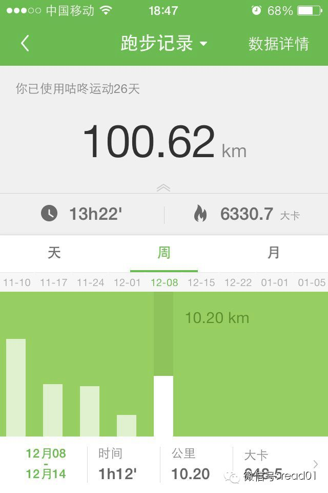
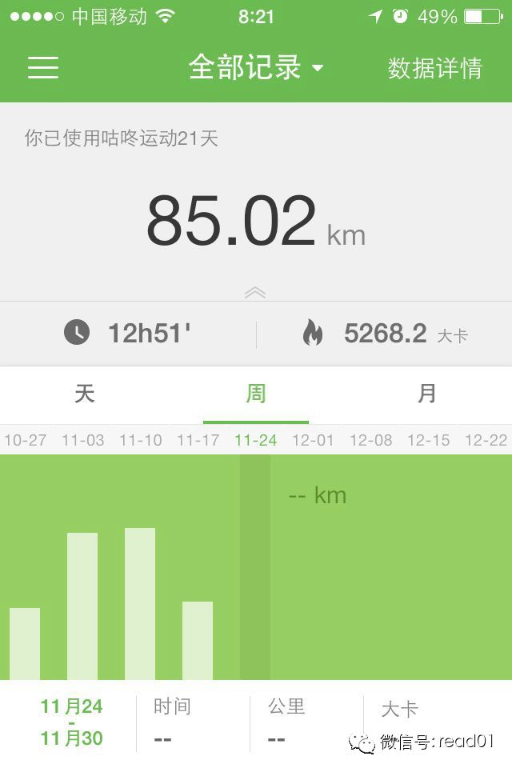
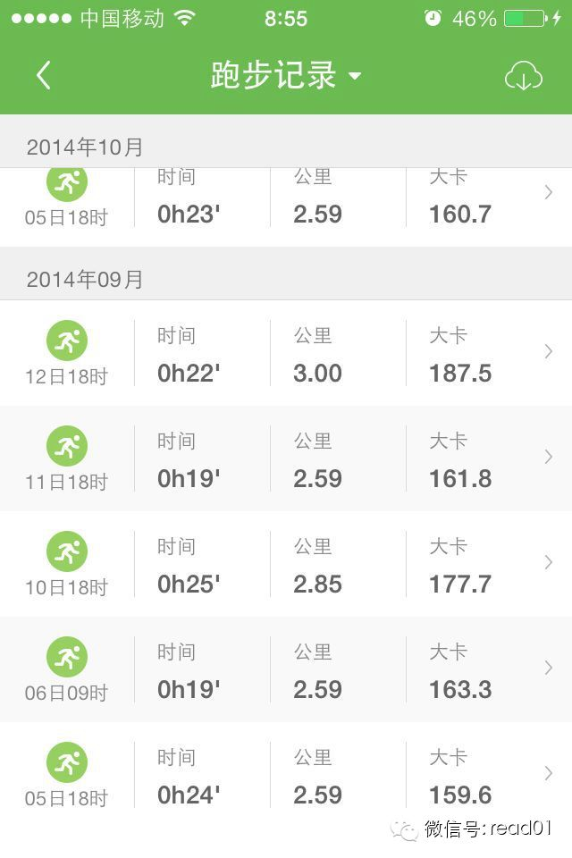
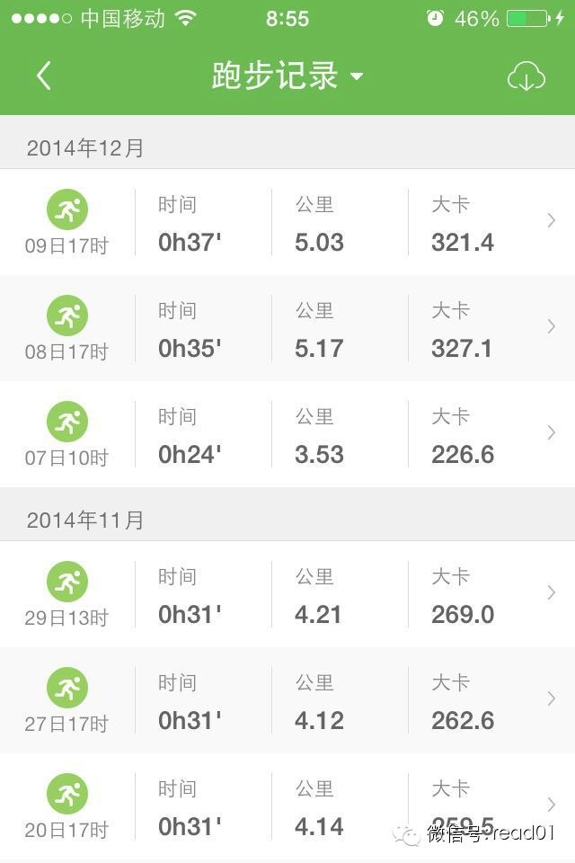

  

分享一篇长文，是说婚姻的，写的非常不错，值得大家花些时间去好好看看。
这篇文章的出处应该是在天涯，火了之后，作者出版了一本书叫《婚前算清楚，婚后过明白》，把这本书放到待读，以后有时间找来读读，做下笔记。

昨天文章说的投票，有不少读者没有找到，是在文章最下面的【阅读原文】，点击就可以，一个人只能投一次，感谢大家的帮忙。

**扩展阅读：**

大家可以输入：离婚、结婚、爱情、婚姻（一个一次关键字） ，看看以前分享这类的文章， 重点推荐 【一个专审离婚案子法官的杂感】
写得很有实用性，建议大家也花时间找来看看，跟这篇文章可以做为互补。

## 正文

作者：海伦helen2009

我们为什么结婚呢，是因为相爱？因为到了结婚的年纪？因为各个方面看着很合？因为家庭压力？还是因为意外怀孕？因为寂寞要找个伴儿依靠着？

我的朋友熟人不少，这些情况结婚的都有。有个女朋友离婚后对我说，不是对前夫灰心，是对婚姻本身灰心了。我问为什么，她说因为生活跟她本来想象中的婚姻不一样，而且觉
得，想象中的婚姻，无论跟哪个男人，都无法创造出来。我又问：那你跟你前夫说过你理想的婚姻吗？

她说刚说个开头，就被他笑了，以后没办法再说。我继续问：你理想中的婚姻，到底是什么样子的？

她沉默了一会儿：就是，两个人……好好地过呗。

我还是继续问她。最后她说：房子要有几个房间，两个人能有个独立的空间，可以各干各的事情，周末要有点两个人的活动，到郊外去玩，对男人的要求是他能分担一些家务，注
意卫生，愿意参加大扫除。

她的要求一点儿都不过分，可是，她的前夫不愿意配合她，他喜欢睡懒觉看电视玩游戏，不喜欢去郊外，认为家务是女人的事，跟他没关系。

他们就为了这些琐事，吵了两年，终于分手。开始也并不是不相爱，她前夫给她买首饰，买新衣服从不吝啬，她出来聚会他从来都管接管送，而她吃着一口好东西也记得要给他带
回去，每个月都记得给她公婆电话问候。

他们之间没有钱的问题，就是她想要的，他给不了，她给他的，他也觉得没什么，因为他一样也付出了，也对她好了，她对他的好难道不是应该的吗？

她跟我说完了之后，说：我从来没跟别人说过理想的婚姻什么的，我觉得这事不能强求，强求也没意思。

可是，如果你的理想，只是你心里一个美好的个人秘密，那你怎么能让另一半对你有彻底的了解，他不了解你的需要，接受你的需要，你们如何能拥有一个美好的共同生活？

我们不是为了一句“我爱你”而结婚的，我们结婚，是因为我们想要跟另一个人在一起生活，一起创造生活，一起享受幸福。

**结婚前，我们先问问对方，你理想的婚姻，是什么样子，这很有必要。**

你需要什么，我需要什么，我们了解对方的需要之后，对婚姻的想象，会渐渐落到实处。

现代人的婚姻，不是三餐一宿那么简单，工作后回到家，我们需要舒适，安全，温暖的小世界，而不是挑剔，推脱，邋遢，懒散，这些东西，毁掉婚姻之余，还会毁掉你对婚姻的
信心。

所以，再强调一次：我们是为了要跟另一个人在一起生活结婚的，我们要一起创造生活，享受幸福，一起成为孩子的父母，一起健康，快乐，坚强地走完这漫长的人生。

我们都已经承认，或者是被迫承认，现实才是最重要的，做人总是要屈服于现实的，理想这个东西，只是年少轻狂，理想跟现实之间，总是会有差距，我们不敢说，通过努力，其
实理想可以实现，理想可以变成现实。

因为我们害怕，害怕在残酷的现实面前，理想主义只是个轻飘飘的笑话。

因为我们害怕，害怕一次次努力之后得到的还是失败，还是会离理想越来越远。

可是，你有没有想过，婚姻是我们最不能放弃的一个理想，因为它即将伴随你一生，对于我们，一生可能只有一次，一生也就是永远。

### 第一个问题：你和另一半有什么不同

我们为了学业苦恼，为了工作苦恼，为了打扮苦恼，为了在A地工作，还是在B地工作的利益得失算计个没完，我们买一件衣服都要从质地到价钱琢磨个遍，可是，爱一个人，跟
一个人在一起，我们却常常很快地做了决定。

我们拿这样的话开导自己：这是感情的事，感情不能斤斤计较，要有爱，条件差不多就行了，以后他会变好的，房子里没有的东西，婚后可以买，他心里没有的东西，婚后可以培
养。

这就成为了你放弃理想的第一步。

我们不想去面对差异，我们为爱献身的举动就是全盘去接受差异，觉得这就是为了爱，觉得这是婚姻中应该作出的牺牲。

其实根本就不是。

**差异，是我们之所以成为自己，而不是别人的原因。你的另一半不是不够好，他只是和你不一样。**

遗憾的是，我们一旦开始谈恋爱，就会把两个人看成一个人。“将你心，换我心，始知相忆深”
这样的美丽的诗句，通常来自于这样的事实：你在苦苦思念，想他想得掉眼泪，他在呼呼大睡，同时还咯吱咯吱地磨着牙，流着口水……你们的心能交换吗？能交换就好了。

我们的心，不是一个 U 盘，里面记录的东西，不能那么容易就被谁读取，即使是你的爱人，也不行。

不要否认理想的存在，理想就是我们想要拥有的生活，干吗要羞于承认？

与其等到日后反复地怄气，纠结，不如提前就告诉他：我想要这个，这个还有这个，我不喜欢那个和那个，我最讨厌的是那个，我坚决不能接受则是另一个。

（为了方便称呼，我把这里提到的女人都取一个花的名字吧，其实人人都是花朵。）

我的朋友山茶，她的丈夫最讨厌她每天跟他提：某某同事今天穿了什么，戴了什么，某某同事最近用什么化妆品，某某同学聚会的时候添置了个什么。

第一他完全不懂那些品牌，第二他觉得她太爱虚荣，琐碎，第三他自尊受伤害，他觉得她的意思是说：怎么我们什么都买不起，我们怎么那么穷？

而他那种厌恶的神色刺激了她，她还是要说，越烦她越说。直到最后吵起来。

实际上，山茶的心思很简单，她希望他能明白，这些东西，是她们的丈夫送的礼物——她其实想要个礼物，当然，出于虚荣心，她也想要一些好东西，于是她就把这两样混在一起
——她想要她的丈夫给她买很多好东西，最好是她喜欢的，一些大牌的东西。

她希望他能关注她说话，能对她的话有兴趣，能接着她的话问一句：哦，那个什么什么，有那么好吗？你喜欢吗，那我买给你呀？

山茶说：哪怕他不买，就只是说一句也好啊，起码也让我高兴高兴……

这是一个女人经常犯的错误，我们总觉得，他应该明白，这么简单这么顺理成章的事，他怎么就不明白。

可是男人就是不明白，他必须要等你告诉他：我是女人，女人都喜欢礼物，送点礼物给我我会很开心，送什么的话你可以看这本杂志的奢侈品目录，上面有地址和价钱，注意：在
香港买可以便宜很多。

是不是很可笑？可这就是现实，男人跟女人之间接收信息的不对称已经被夸张到了你住火星我住金星——那地球是什么，难道是野生动物园吗？

结婚之前，和你的结婚对象一起描述一下彼此的理想婚姻，是件很好的事，可以让你提前发现很多隐藏着的差异，可以提前去想想怎么解决。

### 第二个问题：你们的理想婚姻有多大的差距

假设你们已经很顺利地告诉了对方，自己理想中的婚姻是什么样子的，假设你们没有说着说着就吵了起来，也没有鄙视对方的小理想。假设你们把自己的理想，都说得很明确，细
到了将来要生几个孩子，孩子房间要有几个窗户之类的。

可以百分百确定的是，你和他脑子里的理想婚姻是两回事，即使你们相似度超高，画面都是一样的，那么也会有3D和平面的区别。

别哭，也别失望，别生气，这里再一次提醒，你们是两个完全不同的人。两个人即使描述同一件事，都说得不一样，何况是你们关于理想的课堂作文了。

别说谈人生谈理想没有用。 谈谈理想，至少会提前让你看到，你的婚姻生活会在那些地方容易出岔子。

我的同学桃花，连我们这些朋友都知道她最大的愿望就是多走几个地方，趁着年轻，旅游旅游。她也很确定地告诉了她老公，结婚后每年都要出去玩。

她老公不是没有答应，答应得很好。基本上桃花说的，所有关于结婚之后的事情，他都答应得很好，她如果问他的想法，他就说：都听你的。

很甜蜜吧，你也听到过另一半这么说过，是吗？事实上呢？

事实上，这是一种敷衍，这是一种现实还没到来之前，不做任何考虑和承诺的敷衍。旅游需要钱，需要时间，还需要心情，这些东西他都不去想，因为那不是他的问题，他只想先
让她高兴高兴，不想仔细考虑这个问题。

婚后桃花一次也没出去旅行，不是钱不够，是他不想去，他直接告诉她：我没心思，我工作很累，我很忙，周末我要加班。

他们为了这件事吵过很多次，等到最后，他的真实想法来了：我父母在家那么苦，我还好意思出去玩？

桃花就说：那我们带着他们出去玩，可以不？

他们年纪大了，不如给钱。

可是我们没少给钱啊？

总之这个问题没解决，桃花唯一的小理想，在婚后破灭了。她不止一次想到过离婚。她渐渐也明白了她老公的理想婚姻：最好就是妻子听从他的安排，不要有什么额外的花费，把
钱都节省下来，给父母。他很公平，双方父母都给。

可是，这绝对不是桃花想要的生活。婚姻不是赚钱，省钱，省下来交给父母那么简单，她想要的生活，比这个精彩。

婚前关于理想的谈话，他是不是也敷衍过你呢？他是不是不耐烦地说：想这么多干什么？那么多事情，你能都想明白吗？算了算了，都听你的吧，老婆的一切我都服从。

很多男人会因为女人的情绪化，不敢说出自己的真实想法，还有，他有很多想法，自己也觉得过分，可是婚后他一定会这么想这么做，因为那些观念在他的心里，已经根深蒂固。

桃花老公的想法，如果能描述出来应该是这样的：我们要赚钱，我最近十年的主要目标就是赚钱，赚钱的目的是为了孝顺父母，孝顺就是多多地给钱，双方的父母都是。还有，我
们要存钱，将来有了孩子要花很多钱，万一我们生病也是要钱。享受生活这跟我没有关系，享受生活浪费钱，你们女人爱挥霍，别拉上我。

他也没有错，从外表上来看，他是个朴实，高大，很体贴的男人，确实很听桃花的话，可以为她戒烟，每天都洗碗，他出身苦了一点，所以对钱看得很重，这也很正常。

问题是，他们俩的理想，不但相差太远，而且是不能兼容。他从来不赞美她的新衣服，他从来不买花给她，他一听到旅游就脸色很难看。

所以，你真的需要知道，他的理想是什么，你不要乱发脾气把他的想法吓回去，如果你真想跟他结婚，你有必要先检查一下，你们的理想差距有多大？大到了什么程度？

你们对幸福的理解，如果不一致，至少不要互相破坏。如果对他来说，存下所有的钱才是幸福，那么，你去看山看水的幸福，就不复存在，同样，如果你出去旅游，实现自己的理
想，对他来说，你的“浪费”想起来都让他心痛。

然后你们需要互相问问了，你能做出多大牺牲？

桃花的问题其实很简单，她老公只要牺牲一点钱，一点时间就可以了，她除了出差，什么地方都没走过，他们夫妻俩收入不低，不差那点钱，她老公也没有那么忙，连个周末都抽
不出来。

但是他觉得这个是原则，原则就不能迁就，迁就了你一次你还会有第二次的，那这样下去就存不下钱了。

可怕吗？她婚前真的不知道他是这么想的，她真的以为他会完全听她的。

他们陷入婚姻的另一种局面，僵持，僵持就是关系在继续，两个人在继续着对家庭的各种义务，只是与幸福无关。

这对她老公来说还没什么，他习惯这种简单沉闷的日子，桃花的说法是：这样下去，我不是死了，就是疯了。

你可以说桃花的理想过高，责备她干嘛不降低要求，你也可以同情她，为什么遇见了这样的人。你还可以同情桃花的老公，他看不见妻子的笑脸，自己只怕也很难开心。

理想的差距，随时存在，更多的矛盾，是因为这些差距引起的，遗憾的是，我们即使我们婚前了解到了，这个人跟我们有多么不同，还是心存幻想，他会改变吧？结婚会改变他吧
？我多付出一些，也许他就会变得更好吧？

……

另一对夫妻的故事就常见了，文竹遇到的是婆媳关系。她的理想婚姻当然不包括跟婆婆一起住，但是因为丈夫的坚持，她退让了，结果婆媳不能相处，离婚了。

他们对理想婚姻的说法很一致：供房子，供车，将来养孩子，怎么都是个家，我们都有工作，怎么会过不好呢？没有什么特别要求，两个人都很实在，不讲究小情调小气氛什么的
，都希望好好过日子，趁着这几年年轻把事业做好些。

按道理说，这么一致的目标，结婚后应该能组成一个美好的小家庭，幸福先不说，起码很安稳。

他们没考虑第三个人，只是一句“一起住”，不能抹杀婆婆在生活中的作用。他们从饮食习惯到每天的作息，从消费习惯到娱乐活动，甚至性生活，都失去了自由。

这些，也是婚前你想不到的，看不到的。我们对理想的描述，过于模糊，我们总觉得人生，不可能有那么清晰的设定，我们看到有车有房父母双亡，那是一句笑话。

这句笑话很粗暴，很势利眼，可是这样的描述很明确。如果我们对理想的描述，能压缩成一句口号或者标语，也许比它更加粗暴，更加势利。

婆婆也不是坏人，离婚了文竹也这么说，她只是觉得她都是为了儿女好。

文竹说自己是被琐事磨碎了信心，本来是想好好对待老人的，婆婆也很伤心，觉得离婚了全是自己的错，当初就不应该跟儿子一起过。儿子则对文竹说：是我没本事让你过好，以
后你找个更好的吧。

还有什么比这更悲哀，我们都是好人，我们甚至也理解对方的难处，可是，我们就是不能在一起生活，尤其是不能生活在一段婚姻关系中。

### 第三个问题：如何去描述你的理想婚姻

总结一下吧，我们知道了，在婚前应该谈谈你的理想婚姻，在谈论理想婚姻的时候，应该了解彼此的差距，这些不同，会直接影响我们去修改，调整自己的婚姻理想，毕竟，两个
人才能结婚，将来的游戏规则，最好是同时兼顾两个人的理想。

是不是说，我的理想，我一定要得到，即使牺牲了眼前这个人也再所不惜，这样才是幸福？还是说，为了他，我可以被牺牲掉，忽略不计，看到他开心高兴，我就幸福？

偏激从来就不是幸福，那种冲动和狂热，会抹杀你的理性，会伤人伤己。真爱你的人，他一定舍不得你放弃美好的设想；而不爱你的人，就算你把他的理想当成自己的理想，丧失
了自我，人家也不见得领情。

前提我们是真的爱，真的有诚意去面对以后的生活。我想你不会跟洗头发的师傅说起你的理想婚姻，你可能跟朋友说过，可能跟父母说过，但是你最应该跟他去说，跟那个真爱你
的人，你也确定爱着他的人，你未来孩子的父亲，你的终生伴侣，跟他说说关于你们的理想婚姻。

很多跟帖的JM说了，沟通很重要。跟很多事情一样，我们知道很重要，可是要做到，真的很难。

我们会觉得，情侣讨论问题很傻，把婚姻当成一件事来讨论，尤其显得傻，婚前就把婚后的各种鸡毛蒜皮先拿到桌面上，还当成一件事去讨论，那简直是……

可是，我们很认真敷面膜，我们孜孜不倦地谈八卦，我们看起电视剧一看就是一个钟头，我们吃饭闲聊逛街做头发，一样花掉大把时间，一样花掉精力。

我们宁可做这些，也不想在婚前讨论婚姻问题，不愿意跟另一半一起，提前去面对那些可预见的烦恼和差异，提前去想解决的办法。

那只是因为，我们害怕矛盾，我们害怕发现问题，我们害怕会跟此前一样发生失去控制的争吵，我们心里有时候明明知道他是怎么样的人，还指望着婚后可以看到他改变，我们期
望结婚就让生活走上正轨，最好一下就走到我们的理想婚姻轨道上去。

这是真的不可能。很多的婚姻，只是让我们付出了代价，才能了解和看穿一个人，才能明白我们真正想要的东西。一定要等到所有幻想都破灭，所有矛盾都爆发，我们才知道，原
来当时的决定是个错误。或许很美丽，你们爱过，吃喝玩乐都很投合，可是你们没有一起考虑过任何问题，对任何具体的事情意见都不一致。错误就是错误，爱情没有错，但是在
爱情的名义下，勉强着自己坚持无望的关系，就是错了。

来说说你对婚姻的理想是什么，越详细越好，事实上，等你遇到了你准备与之结婚的人，你的理想会一步步地跟现实接近，直到融为一体。

这时你会用几句话一带而过，就象开头写的那个朋友：就是两个人一起好好过呀。

不是那么简单，你要详细一点，你描述婚姻理想的过程，其实也是你了解自己真正需要的过程，这绝不是一两句话就能说清楚的。

很多人，并不了解自己，也不擅长去描述一件事，弄清楚自己的想法，那么你需要给自己一点时间，要告诉自己，这是你应该做的事，比美容，减肥，都重要的事。

当然我们可以糊里糊涂地结婚，我们也可以把全部的理想都放在男人身上，也许我们遇见一个好男人，就真的可以幸福地走完这一生。可是，街上那么多男人，哪一个会走过来，
把你的理想双手奉上？即使真的有这样的人，把爱你做为他的最高理想，那么他自己的理想，又该谁来补偿？

所以，你还是坐下来，倒杯茶，先跟自己好好聊聊吧，听听你心里的声音，关于婚姻的理想，其实从未远离。

### 理想婚姻的基础：你准备得到和付出什么样的爱。

我想，婚姻之爱，首先就要互相独立，并且尊重对方的独立，同时可以坦然地敞开自己的心灵，此后才是交流，理解，信任，怜惜，包容，安慰……

爱不是粗暴的破坏，以“我都是为你好”的名义，闯进对方的世界，横冲直撞，再因为对方的反抗，委屈得眼泪涟涟。

如向日葵女士，她继承了她妈妈的传统，喜欢支配一切，喜欢不问对方提前做决定，她的另一半一向以沉默来接受，有一天忽然爆发，因为她总是在他想休息的时候，家长里短说
个没完，他平时选择耳朵自动过滤，睡过去就当听不见，她却又一次次不厌其烦地把他摇醒，她觉得这才是夫妻之间文明的，有效的沟通。她被男人的爆发搞得不知所措，接着她
就开始以十倍的力量反击，历数自己为他做得一切。“难道跟你说句话都不行了吗？”，她大哭起来，充满了失败感。

还有蔷薇女士，她的男朋友非常有进取心，他每天花大量时间在工作和学习上，她稍有娱乐和放松的建议，都会被他鄙视，他同时还要求她去考驾照，考资格培训，上外语班，他
有危机感，觉得人生一定要蒸蒸日上才是正确的。蔷薇考完资格考试之后，得了强迫症，她总害怕自己忘记生活里还有什么安排，她很害怕电话忽然响起，他在那边大叫：你上课
去了没有啊，别浪费学费呀！

我们相爱，我们因此走进婚姻，可是，我们始终是独立的两个人，谁也不能代替谁生活。我们在父母那一辈人身上继承下来的一个弱点就是：因为爱，就把自己和孩子混为一谈，
我们不自觉地扮演了父母和孩子的角色。我爱你，我为你做了很多，所以你就要听我的。我爱你，我是对的，所以你就要顺从我。

我爱你，你反抗我，就是伤害我，就是不爱我。

这样的心态，是毁掉幸福的前兆。无论是自己的不独立，还是强迫对方放弃独立，都会让婚姻之路变得荆棘密布，你会很迷惑，很受伤，很气愤，因为你一切都是为了爱，却不知
真正的爱，是共同地成长，成熟，而非以你的要求，去安排一切。

向日葵女士的婚姻还在继续，她学会的是：不要在临睡觉前打扰他，那时他脾气很坏，她改为在饭桌上开讲坛，她的日常感受，总要有个听众，不管他是听了还没听。她经常跟我
们说：我家某某，就是这么闷，不爱说话。

她不知道，某某先生在大学是最佳辩手，跟同学聚会，他总是说笑话逗大家笑的那个人。

他把话语权让给她，甘心扮演一个沉默的人，来换取和平。他其实不喜欢这样的交流，可是她从来没想过别的方式。等到他有话想说的时候，她总是打断他，总是扯到别的地方去
。

婚前他觉得她这样很活泼可爱，是女孩子的天真，婚后他烦透了，认命了，接受婚姻就是件乏味的事。

向日葵女士跟很多女人一样，不了解，也不愿意接受男人本来是什么人，她一向情愿打造的是“向日葵的丈夫”，她把他丢进一个模子里，用力一压，不一样的地方统统去掉。

蔷薇女士离开了她的男朋友，她非常相信他完全是对的，他的人生也会因为这非凡的努力而更加完美，只是她满足于一份安稳的工作，想跟别的女人一样，谈场可以逛街吃饭看电
影的恋爱。她的前男友非常不解，他气愤地说：这么没出息以后怎么办啊。不能说他不爱她，他到最后还是关心她的前途，他是一个惟恐自己“不够好”的人，所以就要求自己的
另一半也要跟自己一样，变得越来越好才行，否则，这爱就没有了着落，这人生就没有价值。

你看，我们是互相独立的两个人，这不是很简单的一件事吗？可是，为什么最先让我们困惑的，首先就是这个呢？

因为我们知道，婚姻是之后我们两个人，要互相依靠着走完剩余的生命，所以我们把爱变成了规则，去束缚对方，我们破坏了他的独立，自己也变得脆弱，依赖。不独立的爱是绳
索，捆住了两个人，背靠背沉沦下去，忘记了原本的方向。

经常我们在描述婚姻理想的时候，不自觉地会写成：我想要的……那么，不如先想想：我所能给的。

在给予和获得的过程中，我们真切地感受到幸福的滋味。

你可以开始写了：我想要得到什么样的爱，我需要一个人怎么样来爱我，有那些事情他做了我会格外高兴，而哪些事情，他做了我就会很生气，甚至一提到我就会翻脸。

同样，我能给予对方什么，我会以什么样的方式去爱一个人，眼前的这个人，他在我的爱中是快乐的吗？他其实不喜欢那些事情，但是因为我一直在忍受？

清楚地写下你的“需求”和“给予”，并在心里随时提醒着自己，你就为自己的婚姻理想，打下了一个地基，再美丽的建筑，没有地基，也会在瞬间崩溃。

### 理想婚姻的结构：不同态度和观念，可以共存

共存不是抹杀，我们要牢牢记住这一点。家庭生活，不是东风压倒西风，就是西风压倒东风，这样的规则适合封建社会，一大家子人成天在一起，把权力争夺当成工作和生活重心
。而我们生活在现代社会，工作才是我们的重心，如果婚姻里我们也要强势，也要不停地争取对自己有利的一面，让对方不停地让步直到放弃，你会发现，这场婚姻无法造就一个
快乐的人，你跟他原本的快乐，也会被消耗干净。

共存需要底限，你们必须要知道，有什么事情，是哪怕只做一次也不会得到原谅。你不能压抑自己的不满，你不能拿忍让换取安宁，否则的话你的底限就成了一条门槛，谁都可以
跨过。风信子是位温柔贤淑的妻子，她的丈夫有个很坏的习惯，经常喝醉，言行放肆，渐渐朋友聚会不想带他，大家不愿意看见一个好好的人撒起酒疯来满口胡言乱语，缠住某个
人闹起来就没完，更可怕的是他还要开车，怎么劝都不行，最后只好是风信子从家里赶过来，带着他回家去。

风信子滴酒不沾，她一闻别人身上的酒味就恶心，但是她每次深夜里去接丈夫回家都毫无怨言，包括给他收拾呕吐物。“谁会喜欢这么做，可是，我们是夫妻，我不帮他谁管他呀
，再说，他第二天酒醒了，就会变得很好。”她丈夫会因为愧疚加倍温柔地回报她。

渐渐这成为一种模式：我讨厌你喝醉——我偏要喝醉，因为你会原谅我——酒醒后会对我更好，弥补了打破底限的不满，风信子觉得自己有个美满的婚姻，直到她在某个凌晨接到
电话，她丈夫酒后驾车，受了重伤。

她是个溺爱的母亲，一直放纵他，在他面前她没有底限，连起码的原则都没有，我们总以为这就是真爱。同样的还有家庭暴力里的女人，一次次挨打一次次回头，原因就是男人只
有在那时才会低声下气，才会给她足够的尊严，所以她可以带着青肿的伤痕回到原来的生活里，坚持到下一次挨打。

没有了原则和是非观的爱，固然会让人觉得甜蜜，可是放纵的结果会是越来越糟。

睡莲小姐爱指使男朋友，她把完全听她的使唤当成爱，一旦他反抗她就哭闹：你不爱我了。她交往时间最长的男朋友，从洗内衣裤到做PPT文件，都为她一手包办，有次男朋友
开会她无聊了发短信，仅仅是因为她的短信没有及时回复，她就开始闹个没完。男朋友哄她，哄不好，做点家务，她还在闹，角落里她换下来的内衣和袜子，男朋友终于崩溃，“
我把你惯坏了！”

他跟睡莲分手之后生活得很愉快，他说他根本讨厌洗内衣，更讨厌的是她把这当成是完全他应该为她做的，爱我，就应该宠着我，爱我，你就不应该说我是对还是错。要不然，就
不是爱我。

睡莲小姐坚持把这条当成择偶标准，她认定了爱她就要做她的奴仆，在生活中，她也不是一个好相处的人，从来不知道别人的想法跟她有什么关系。自我和自私，其实只有一线之
隔。区别就是，自我的人很注意不去伤害别人的领地，而自私的人为了自己的利益，完全不顾别人的感受。

婚姻中的自私是可怕的，因为你只专注于自己的需求，而忽视了另一半，你把对方视为一个为了爱你可以牺牲全部原则的人，于是你可以横行霸道，为所欲为，没有了底限，这样
的关系早晚会出问题。

在各自的底限之上，我们会发觉相处其实是件很美好的事情，我们可以宽容，爱护对方的小毛病小缺点，我们会发现自己很慷慨，原来为了爱，我们可以付出更多。

郁金香女士婚后发现，她跟丈夫的作息实在南辕北辙，她习惯早起，男人习惯熬夜，他们为此争吵过，甚至萌发过离婚的念头。最后她另买了一张床，她可以在自己的卧室里早睡
早起，做个勤劳的百灵鸟，丈夫也可以在灵感来了的时候通宵工作，不会被人三催四请地要求去睡。同时，她也会在一些早晨，跑到他的卧室里吻她的丈夫，叫他起床吃早点，她
丈夫也会在一些晚上陪着她，等她睡了再出去工作。

“我开始就是非要改变他不可，熬夜多不健康啊，我们过健康的生活有什么错，可是这样不行，他一定要等到夜里了，安静了，写程序才顺利，他习惯这么做了。那我分床算了，
分床也不是分居，至少我能好好睡觉，他也能自由了。”郁金香女士发现，丈夫在程序员同事里很受羡慕，因为被老婆强迫着去睡觉的男人，实在不少。

“他自己会知道好坏的，现在他每周末还给我做早饭呢。再说我也有缺点啊，我爱买香水，多贵都敢下手，他从来都没说过我，还帮我收集。”郁金香女士过得很开心，她不会因
为分了床变成怨妇，生活习惯可以调整，只要我们决定了在一起生活，只要我们决定，把幸福当成唯一的目标。

**观念不一致的话，我们可以约定一个一致的态度，比如说**

1、好好听对方说话，不打断，不批评；

2、听完之后，先认真想一想，再说自己的想法；

3、不用讽刺，轻蔑，不耐烦，挖苦……的语气对待另一半；

4、即使是自己完全不赞同的事，也不要马上就强硬地拒绝；

5、如果两个人的原则上有了冲突，需要讨论一下怎么办才是最好的；

6、不敷衍，不逃避问题，不用“是是是，好好好”来蒙混；

7、不要一下就上升到“你不爱我”“我要分手”的地步；

要记住己所不欲，勿施与人，想对方用温和，客观，坦白的态度对待你，你首先就要这样去对待对方。

**当然，你又会说：**

他是教不好的。

他成长环境就有问题，改不了了。

他又不是小孩子，自己应该知道该怎么做。

我勉强他也没意思，我自己也需要关怀。

夫妻吗，不是老师教学生，我觉得别扭极了……

好的，那么你就在借口中越走越远，你会跟另一半养成一种最常见的，以吵架，流泪，闹离婚为主的沟通方式，你们会把另一半当成自己的发泄对象，把坏情绪统统发泄出去，之
后再和好，仍然能过下去，甚至和好的那几天比以往还要好。

渐渐你以为，这就是夫妻生活的常态，就是这么火暴，冲突不断，任何具体问题都是以双方都妥协，双方都不满意为结果。

渐渐地，你有了一个破烂而且无法修补的人生。你的孩子，会在这样一种环境中长大，他/她的潜意识也会以为，婚姻关系就是这样的。

我们花费在家庭里的精力和时间，真的比工作少得多，我们会花很多时间想着怎么搞定客户，但是对另一半，我们却没有给他很多选择。

**我们也会这样对男人说：**

我就是这样的，你接受我就是接受我的全部。

我发脾气那是因为我给你看到我最真实的一面。

不许你不听我的，不管我是对是错。

我和你家人哪个重要，你必须以我为重。

你再敢跟我吵架，我就跟你分手。

……

女人在恋爱关系里，不自觉地成为弱者，因为世界早已把我们的性别设定成比较弱的一方，所以我们靠索取，靠不停要求对方，来让自己变得比较强势，这样的矛盾经常把男人搞
得晕头晕脑，本来他们就不擅长捕捉微妙的情绪变化，女人的出尔反尔和善变，会让最聪明的男人也头痛。

你的态度会决定你们关系的成败，这句话一点也不夸张。

夹竹桃自嘲地说，一辈子遇见的，永远都是长不大的男人。她的两任男友都是一个类型：家庭很健康，性格散漫，爱动好玩，被好妈妈伺候大的乖儿子。

她不是没有试着去改变他们，可是往往她一开口，对方就会撒娇：别烦我，乖，让我再玩一会儿。她马上就会心软，如果强硬了，对方就会生气，不理她，出走，冷战，最后还是
她回头去哄他们。

她最后明白，优柔寡断的态度，只会让这种关系恶化，夹竹桃觉得，自己也是个需要别人关心的女人，这样无休止地付出，包容，实在太累了。

### 理想婚姻的建设：情绪管理和时间管理

稍微留意一下，你会发现身边有很多人都这么形容自己：我呀就是脾气急，说话比较直，我没有坏心眼，你千万别介意啊……他们用这样的话来掩饰自己的性格缺陷，那就是偏激
，固执，冲动，自我中心，从来不为别人着想。一句话说出来，效果是双向的。举个例子，你看了别人的身材，纯粹是说出真心感受：怎么这么胖？对你，只是一句无所谓的评价
，对别人，很可能就是伤害。

这个例子太温和了，我们应该把它放到另一个情境中，如果你的男朋友这么形容你，而且你已经为了博得他的赞美减肥了一周，饿得眼冒金星，那你是否会因为他的真性情和有话
实说就原谅他？

必须承认，情绪上来了真的很难控制，而长期压抑自己的情绪，又会让你变得更加抑郁，暴躁，焦虑。成长过程中，很多人会观察到自己父母人前人后不同的两面，他们对外人温
和，容让，彬彬有礼，但是回家对自己的伴侣和孩子，则是大声呵斥，讽刺，刻薄，毫不留情.因为家庭让他们感觉到安全，他们有必要把在外面受到的压抑，发泄在自己最亲近
的人身上，反正关起门怎么都是一家人。有多少人，就是在这种环境下长大，成长之后，又不由自主地把自己变成了跟父母一样的人。

亲密关系会有这样的问题，我们因为对方的亲近，信赖，所以无话不说，所以愿意把真实的自己暴露出来，这本身没有错，但是，如果你说的话，做的事，很多是有攻击性，伤害
性的，那么做了你的朋友，男朋友，女朋友，就等于被提出了很高的要求：做一个无所不能的包容者。

这是个很过分的要求，你等于是在说：因为你爱我，所以你什么都要忍受，所以你要为我付出，所以你不可以反击我，否则你就是不爱我。

这样的逻辑，是不是很荒谬，很霸道？可是，这是大部分人的逻辑，大部分的人，把爱当成了一种武器，用来束缚和惩罚对方。

为什么我们要为结婚做准备，因为结婚跟单身最大的区别，是你要跟另一个人一起生活，你们要先有个良好的沟通模式，有很好的默契，生活才会很顺利。如果说，恋爱本身就是
荷尔蒙冲动，谈不到太多的克制和管理，那么，婚姻生活，即将陪伴大多数人下半生的婚姻生活，绝对需要你精心地管理和安排。

#### 1、了解自己，在临界点恢复理智。

经常你会这样来反思自己的吵架：本来没什么的，结果脾气一上来就失控了……还不是他激的，说什么不好偏偏说这个，别惹我，惹了我就要你好看……想想也是在赌气……真后
悔……

但是，这样的情况还在继续，为各种细节，各种小事，甚至一句话，还是会引起争吵。伤害越累积越多，甚至让你忘了当时为什么相爱的。

争吵本身没有错误，其实这些点滴，是你们在了解对方，试探对方底限的一个过程，每个人都会在与人相处中，不自觉地去争取那个有利的位置，争取控制权，这也无可厚非。而
且，每段亲密的关系，共同生活，也都是两个人不断磨合，妥协的结果。只是这样的妥协，最好不要变成心怀委屈，甚至怨恨。

那些自认脾气不好的人，有必要在心里设置一个闹钟，在你就快爆发的时候，提醒你要减低温度，恢复冷静。这个提醒可以是这样：

我已经是成年人了，要控制自己的情绪，真吵起来了，又是两败俱伤，我不要这样做。

深呼吸，转移话题，起身去倒杯水给自己，都会帮助你从一个情绪失控的状况里解救出来，避免接下来的互相指责，伤害，破坏你们的亲密。

有些人会说，我就图他会宠我，会包容我的任性，不讲道理，事实上，这样的人，在你讲道理的时候，他也会不当一回事，因为你让他习惯了不能在乎你的情绪化行为，他习惯了
你的喜怒无常，那么你就很难让他真的明白，你是对什么事情非常认真，那些事是你的原则，不容侵犯。

#### 2、别放过那些争吵点

好了，我们成功地回避开了那次争吵，之后我们再也不提了。等到婚后三年，我们又遇到同样的问题，发现还要为同样的问题争论，而且，对方的态度丝毫都没有改变，反而还因
为这么长时间不提，变得更加强硬。这是不是一件令人崩溃的事？

避开自己情绪发作的临界点，并不是避开问题，事实上，那些很可能会引起争吵的问题，是你们建立起良好沟通模式的关键。为什么会要争吵？因为你们意见不合，彼此都觉得对
方不可理喻。这点小问题，往往会代表你跟他之间最大的差异性，而好的沟通，就是要了解双方的差异性，在这个基础上，求取共生。

对于可能会让我们争吵的问题，最好有个比较客观的态度，为什么我们说男性思维比较粗线条，因为他们会把很多小细节忽略掉，他不认为这是问题，这种态度经常会激怒女性，
女性的情绪爆发，男人就会觉得无理取闹。为求安静，他敷衍着蒙混过去，下一次仍然会有同样的问题。

康乃馨女士的男朋友算是大家说的那种凤凰男，出身农村，学业优秀，事业有成，他的家人也都过得不错，不需要他过多接济。康乃馨对他最头痛的就是，他是个不修边幅的人，
认识她之前他一共只有两双袜子，一直穿到有洞，袜底磨破，才会扔掉换新的。由于工作原因他需要穿着整齐，但是西装的后领，经常油光光地。康乃馨没有洁癖，可是他的这些
习惯，让她几次抓狂。

“我吵啊，他不听啊，说我臭讲究，再逼急了就说你看不起农村人，那分手算了。我就说他狗急跳墙。他说我多管闲事。”康乃馨举出好几位农村出身的同事做例子，人家还不是
收拾得整洁得体。但是不能说服他。

康乃馨反复地跟他讨论了很多次这个问题，从争吵，到玩笑，到长篇大论地说教，总之她就是不肯放弃，最后男朋友发现，如果他不在卫生问题上做些努力，生活永无宁日。

聚会时康乃馨终于高高兴兴地带着男朋友出席了，他衣服领子，袖口，都雪白。“我也付出代价啦，看看，我要少穿几次高跟鞋，尤其是跟着他出来玩。”这是一个互相妥协的例
子，不是完美的结局，但男女问题，大多以妥协收场。

面对差异，你有两种结果可以选择，一是坚持到底，寻求一个妥协但改变现状的结局；二是眼不见为净，当这种差异不存在，同时，把这种忽略，当成默许。这两种，都还不失为
好的处理。

最可怕的是，一次次为同样的事，进行同样的争吵，连吵架的说词都没有变化。最后又是女的哭，男的走。重复N多次之后，大家都疲倦得要死，不如分手了事。

我们如果不能改变结局，不能改变对方，那至少可以改变自己的态度吧？你的情绪很宝贵，会直接影响你的内分泌，身体健康，为什么要反复在同一个地方摔倒折磨自己呢？如果
说第一次爆发，争吵，还情有可原，那么同样的问题，第二次，就不应该再用争吵的办法解决了，对吗？

#### 3、两个人的小世界更需要规则

相处一段时间后，你可以把你的心得记录下来，比如，他最不喜欢的是什么事情，你以后如何处理相关的事，同样，你最讨厌的是什么，他是否知道，他如何处理，再比如，如果
遇到双方家庭的事情，你们怎么讨论，那些问题是敏感问题……

等你写下这篇日记，你会发现，你们两人小世界的基本法规，已经诞生了。

古人说，修身，齐家，治国，平天下，那么无论什么高深的道理，都是从你个人，你身边的人，从这里开始的。

对方的底限会成为情绪管理的闹钟，提醒着我们，不要去刺痛对方，不要让对方因为情绪的原因，忘记了理智。

这里想提一点最基本的：不要互相伤害，这应该是两个相爱的人最基本的规则。

可惜，我们在恋爱时，肆无忌惮地伤害着对方，也伤害自己，我们还经常把这当成是恋爱的常态，以为冲突，流泪，相打相骂，这些激烈极端的行为，才是爱得深切，爱得结实。
往往到了最后，爱已经被磨得暗淡无光，再也找不回最初的欢喜，心动。这时的失落，只能让两个人消极地接受：我们老了，闹不动了，什么爱情啊，已经是亲情了，婚姻就是爱
情的坟墓，我们已经进坟墓了。

其实，你根本不必如此。爱情本来就是欢天喜地，本来我们可以高高兴兴地享受一段健康的爱情，当然，是在规则之内。

紫罗兰女士跟她丈夫之间的规则很详细，包括有：不背叛，不动手，不说谎，分担家务，定期出去玩，每周要有谈心的时间……等等。这张纸是她在交往中就跟另一半一起定下的
，在婚礼上，伴娘伴郎们做见证，两个人按了指印。

现在她的女儿已经5岁了，紫罗兰准备等她长大，把这张纸送给她作为成年礼物。每个妈妈都是这样想，如果一开始，女儿走的就是一条笔直阳光的路，那该多好。紫罗兰还想告
诉她，承诺做出来很容易，信守才是最难的。紫罗兰在婚后，曾经面对过一个男人的追求，他的事业，收入，各个方面都强于她的丈夫，而且他是她的高中同学，初恋。她考虑了
一整天，才拒绝了他。

“到了最后，我想我丈夫会怎么说，他会说：既然他更好，能让你过得更好，你就去吧，不用管我。可是，我会过得更好吗，离开了他，我想我过不好。”紫罗兰以自己的决定为
荣，她证明了自己的爱，很坚定，这个小世界，没有被外来的诱惑破坏掉。

#### 4、消极情绪的最终出口

等你学会一次次把怒气召回，一次次告诫自己不要被愤怒和悲伤左右，失去了理性判断，这时你会很不舒服，焦虑不安，因为你的消极情绪无处可去。

这里提供几个被各种书籍，杂志推荐过的办法，供你发泄自己的消极情绪：

1）运动。比如跳操，跑步，跆拳道，在运动的同时，要想象着你的不愉快站在对面，等着被你一下下击倒在地，等你流了一身大汗，冲个热水淋浴，甩着湿头发走出健身房，你
已经是个可以微笑着看世界的人；

2）做家务。消极情绪会让人有自虐冲动，你不妨做一次灰姑娘把多日没擦的玻璃擦一擦，或者把乱七八糟的衣橱收拾一遍，你的坏心情会跟那些已经没用了的杂物一起被扫出你
的家，干净清爽的家居环境，会让你开心起来；

3）听音乐，自言自语。把房间的门关起来，听听节奏强的音乐，你不是有强烈的吵架的欲望吗，可以开始了，等你对着墙壁把自己压抑着的话统统都倒出来，你感觉会好很多。
心理学爱好者还可以考虑把这些话录音，供自己日后分析，看看自己有什么精神障碍；

4）郊游。爬山看海，你会觉得在大自然面前，一切烦恼无足道；

5）换个发型，新的造型意味着你有新的可能性去面对自己，如果很糟糕也不要在意，你可以换个漂亮的短发；

我们最好是用积极，健康的方式去解决问题，哪怕是发泄自己的消极情绪。千万不要用自暴自弃，吸烟喝酒，暴食，跟别人上床，自残，疯狂购物等行为去毁坏自己，这些发泄会
让你事后追悔莫及。

要知道，我们做这些事，不仅仅是为了不伤害别人，首先是为了自己，我们要做一个能够掌控自己的人，为的是可以牢牢地掌握属于我们的健康，快乐，和睦的人际关系。

很多人的心里藏着委屈，总觉得我是为了别人才如何，才让步，才压抑自己的要求。那么这些委屈，有多少是真的？还是只是你的过分要求没有得到满足，才只好放弃？

管理你的情绪，为了自己才这么做，然后才是你最亲密的人。不要把你的爱人，家人当成出气筒，不要依仗着他们的爱，你就可以随意地把消极情绪发泄到他们身上。

还有多少人在以“性格不合”的原因考虑分手，还有多少人在说：我们只是太骄傲，太倔强，还有多少人，在打着爱你所以就要折磨你的旗号，伤害着自己最爱的人？

管好你的情绪吧，一个冷静，清醒的人才能面对问题和解决问题。你的粗鲁，任性，很可能已经伤害了另一半而不自知。等到他内心的委屈爆发出来，那时一切都来不及了。

## 100天行动读者反馈

@璐哥从不回头看爆炸

11月25日

已经背单词90天。短期的目标是，背单词打卡满100天，慢跑满100公里，平均一天4公里左右。此外发起了一个微信小组，群里都是有自己的小目标并且想要坚持的人，
都在跟我一起努力实现自己的短期或者长期梦想。

  

  

  

  

**12月5日**

** **

**12月10日**

从一开始的2.9公里到3.5公里到4.0公里再到5公里，速度和耐力都在提升，此外今年明显不再那么怕冷。这让我相信完成一些事情是可能的，只要懂得时间的力量。

 

阅读原文

阅读

__ 举报

[阅读原文](http://mp.weixin.qq.com/s?__biz=MjM5NjA3OTM0MA==&mid=203233321&idx=1&sn
=0ba5e4f0d76d7455d43a2282dd54b569&scene=1#rd)

