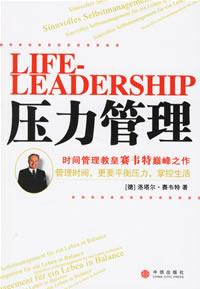

  

文章出自《压力管理》，含金量很高，如果你全部领会并能做到，那时间管理方面差不多不用再去学什么东西了.

  

大家可以仔细考虑一下这7项建议，建议你去看一这本书，希望能对你有所帮助

  

1． 阐述你的生活构想。

  

阐述个人的理想或生活目标，有助于你明确生活的意义与方向。

  

2． 注意：“少”才是真理。

  

生活中真正的时间问题，只有在我们同时扮演过多的角色时才会产生。如果一个人打算做的事情过多，把一切工作都列入自己的计划，那么他必然会失去自身的灵活性，最后变得
像其他人一样感到压力重要。

  

3． 注意在时间的利用方面保持平衡。

  

只有在“思想/文化、家庭/交际、工作/成就、身体/健康”四个既涉及工作又涉及私人生活的领域之间保持时间利用上的平衡，你才能获得开启成功之门的钥匙。

  

4，留出给各个目标责任制排序的时间。

  

主动地定期安排一些时间，来给自己的各项目标排排先后顺序。就算别人反对，你也要坚持这样去做。

  

5． 始终把精力集中在重要的事情上。

  

只有始终把精力集中在生活中最重要的事情上。你才有可能完成自己的计划，实现生活的平衡与成功。

  

6． 避免危急状况的发生。

  

面对危急状况，我们往往只能被动地做出反应；相反，面对重要的事情，我们却能主动采取措施。不要屈服于紧迫性强加在我们身上的苛刻条件，你应该把关注的焦点放在自身目
标的重要性上。

  

7． 以清楚、自信的态度对待时间。

  

所谓平衡生活或是对生活的掌控，其实就意味着要清醒地、负责任地、同时平衡在利用“时间”这一宝贵、稀缺的财富。

今天，将是你在以后的人生中，以全新的时间意识面对的第一天！

  

\------------------------------------------------  \--------

我是warfalcon  ，这个微信（read01）的目标**是让你成为行动者而不是阅读者**，不定期分享一些五花八门的读书笔记和书评，每天更新。

想了解更多：可以在新浪微博、腾迅微博、豆瓣、知乎搜索 warfalcon 或访问  www.read.org.cn  www.write.org.cn

如果你觉得文章对你有帮助，欢迎对我进行小额赞助，支付宝帐户:  warfalcon@gmail.com  或点击查看原文

如果你是新读者可以输入M查看最近的信息，或按日期查看，希望你能加入#100天行动# ，输入0729查看全文。

如果觉得我的微信不错，欢迎用各种方法分享这个微信号，让更多的人受益。

  

  

[阅读原文](http://m.alipay.com/personal/payment.htm?userId=2088002031865988&reason
=%E6%94%AF%E4%BB%98%E5%AE%9D%E5%BE%AE%E4%BF%A1%E6%94%B6%E6%AC%BE&weChat=true#w
echat_redirect)

