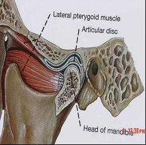
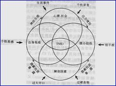
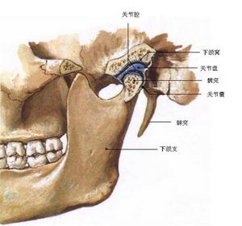
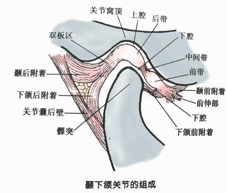
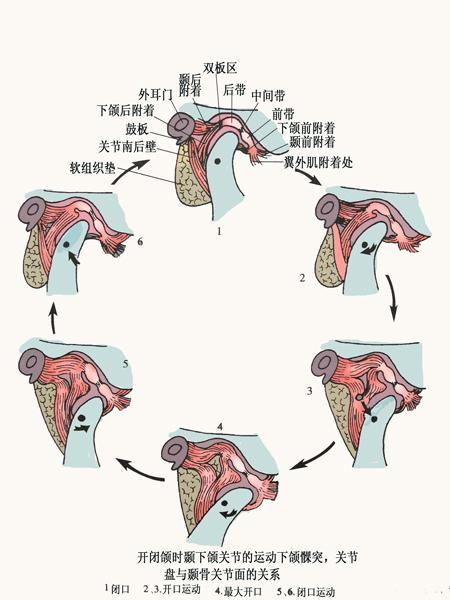
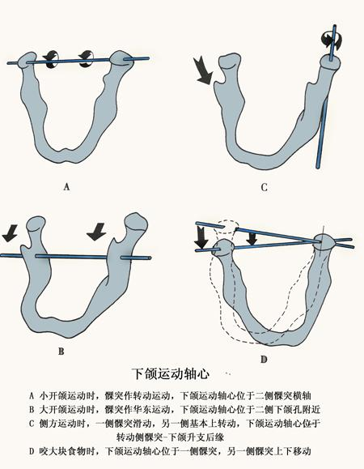

颞下颌关节紊乱病(temporomandibular disorders,
TMD)是口腔颌面外科的常见疾病之一，在颞下颌关节病中，此病最常见。它并非单一疾病，是一类病因尚未完全清楚而又有相同或相似临床症状的一组疾病的总称。

**颞下颌关节紊乱**

目前病因学说很多，但尚未完全阐明。  
  
多数学者和临床试验研究认为是多种因素共同作用所致，可能的因素有：

**颞下颌关节紊乱病**

1.精神因素

2.咬颌因素：如合干扰，牙尖早接触，严重锁合，深覆颌，多数后牙缺失，第三磨牙错位，过度磨耗导致垂直距离过低等。有时一旦消除这些因素，症状可缓解或消失。  
  
3.免疫因素：关节软骨的主要成分如胶原蛋白多糖和软骨细胞都具有抗原性，正常情况下有基质包裹，为封闭抗原，不被免疫系统识别。如果外伤等因素使这些抗原暴露于免疫
系统则会引起自身免疫。  
  
4.关节负担过重：适度的负载对关节的正常结构、功能和生理改建是必须的。  
  
过度咀嚼---超出生理限度---关节损伤或退行性变  
  
长期单侧咀嚼---非咀嚼侧关节腔内压力增高---持续微小损伤  
  
5.解剖因素：髁突小、关节过活动度过大易发生脱位等。  
  
6.其他因素：寒冷、颌骨发育异常、不良姿势、免疫因素等。

  

**一、治疗目的  
  
**松弛肌肉痉挛，降低神经兴奋性，调节免疫功能，改善局部血液循环，达到解痉、镇痛、促进损伤韧带的修复。

**二、防治原则  
  
**1.以保守治疗为主，以对症治疗和消除致病因素的综合治疗。如理疗，热敷，镇痛，消炎为主，配合调颌，关节腔冲洗，封闭等。  
  
2.治疗关节局部症状的同时应改进全身状况和病人的精神状态，配合心理治疗。  
  
3.应对病人进行医疗知识教育，宣传（健康处方）。  
  
4.遵循一个合理的，合乎逻辑的治疗程序。  
  
5.治疗程序应先用可逆性保守治疗。如服药，理疗，封闭，颌板等。然后用不可逆的保守治疗如调颌，正畸等。最后用关节镜外科或行各种手术治疗，但应根据其具体情况决定
治疗方案。

**三、治疗措施  
  
**1.去除可能的病因  
  
2.消除不利心理因素，适当应用镇静药  
  
3.避免用力张口  
  
4.纠正不良咀嚼习惯、不良姿势  
  
5.冬季注意面部保暖  
  
6.存在牙合紊乱者应口腔专科治疗  
  
7.封闭疗法：用2％普鲁卡因或利多卡因2-4m1注射翼外肌或咀嚼肌压痛点，每日1次，并口服地西泮(安定)2.5mg bid。  
  
8.镇痛：关节腔内注射激素类药物如醋酸氢可的松、醋酸确炎舒A等。疼痛剧烈者可服芬必得0.3g tid。  
  
9.理疗：超短波或氦氖激光照射。  
  

10.保守治疗无效，经进一步检查发现有关节结构病变者，须作手术治疗。

  

  
  

颞下颌关节由下颌关节凹（颞骨岩部）、髁状突（下颌骨）、关节盘和关节囊所组成，邻近有韧带附着。

  
  

关节盘是一块卵圆形的纤维骨板，介于关节凹与髁状突之间，将关节腔分隔为上腔和下腔两部分，四周与关节囊相连。关节盘坚韧，在两关节面之间有缓冲作用并使关节能适应下
颌多方向运动。关节囊为一韧性的结缔组织囊，包绕在颞下颌关节的周围。

  
  

**张口不适、受限、疼痛、有弹响（就是猛地大张口时耳朵里听到“咔”地一声），都是颞下颌关节紊乱的表现。颞下颌关节受咬合关系的影响非常明显，特别是后牙（即磨牙）的咬合。很多人都是因为咬合关系不正常引起的：比如牙齿拥挤、长出智齿后整个咬合关系变化等，这时可以通过拔除智齿、正畸，使用【牙合】垫、调整咬合关系来治疗。  
  
也有一些是因为精神因素导致，热敷、减少大张口运动、缓解紧张即能自愈，因此也有学者认为这种疾病部分是自限性的，最好用保守治疗。只有发生器质性改变，出现关节强直
（几乎不能运动，张口受限严重），如颞下颌关节的关节盘出现纤维病变等变化时才需手术治疗。**

  
  

  
  

  
  

关节盘在运动过程中，相关解剖结构的位置变化比较复杂，如图（看不懂没关系，知道红色的关节盘的各个部分一错位就容易出问题就行了）

  
  

颞下颌关节是左右联动的关节，运动形式多样，主要有开闭口、前伸和侧方运动三种基本形式。这些运动都是通过咀嚼肌群、韧带、关节之间互相协调的动作而产生的，所以咀嚼
肌的炎症也能影响运动。如图：

  
  

注：图注中B里的“华东”应为“滑动”

  
  

**大张口的时候关节盘的运动和一般的咀嚼运动不同，不是转动而是滑动，“掉下巴”就是滑动过大，脱出了关节腔后缘，自己无法复位。**如果你觉得不舒服，可以尽量避免大张口。上颌智齿一般会向颊侧倾斜，对咬合关系的影响不大。但由于难以清洁，下面又没有对牙合牙，建议尽早拔除。最好还是去口腔颌面外科看一下关节，对症治疗 

  

